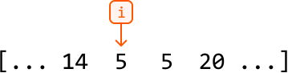
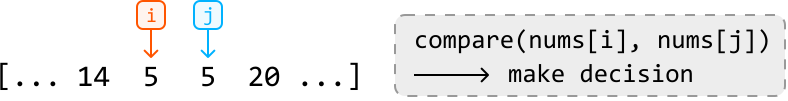
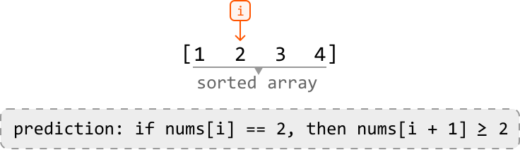
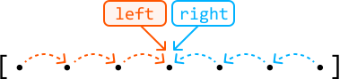
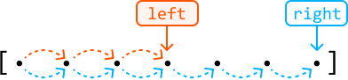
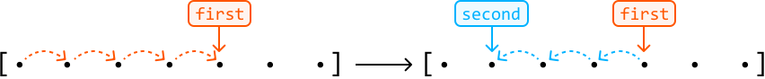
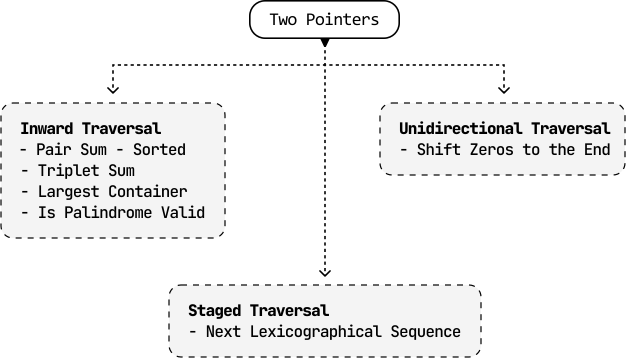

# Introduction to Two Pointers

## Intuition

As the name implies, a two-pointer pattern refers to an algorithm that utilizes two pointers. But what is a pointer? It's a variable that represents an index or position within a data structure, like an array or linked list. Many algorithms just use a single pointer to attain or keep track of a single element:



Introducing a second pointer opens a new world of possibilities. Most importantly, we can now make **comparisons**. With pointers at two different positions, we can compare the elements at those positions and make decisions based on the comparison:



In many cases, such comparisons are made using two nested for-loops, which takes O(n^2) time, where `n` denotes the length of the data structure. In the code snippet below, `i` and `j` are two pointers used to compare every two elements of an array:

```python
for i in range(n):
    for j in range(i + 1, n):
        compare(nums[i], nums[j])

```

```javascript
for (let i = 0; i < n; i++) {
  for (let j = i + 1; j < n; j++) {
    compare(nums[i], nums[j])
  }
}

```

```java
for (int i = 0; i < n; i++) {
    for (int j = i + 1; j < n; j++) {
        compare(nums[i], nums[j])
    }
}

```

```cpp
for (int i = 0; i < n; i++) {
    for (int j = i + 1; j < n; j++) {
        compare(nums[i], nums[j])
    }
}

```

Often, this approach does not take advantage of **predictable dynamics** that might exist in a data structure. An example of a data structure with predictable dynamics is a sorted array: when we move a pointer in a sorted array, we can predict whether the value being moved to is greater or smaller. For example, moving a pointer to the right in an ascending array guarantees we're moving to a value greater than or equal to the current one:



As you can see, data structures with predictable dynamics let us move pointers in a logical way. Taking advantage of this predictability can lead to improved time and space complexity, which we will illustrate with real interview problems in this chapter.

## Two-pointer Strategies

Two-pointer algorithms usually take only O(n) time by eliminating the need for nested for-loops. There are three main strategies for using two pointers.

**Inward traversal**

This approach has pointers starting at opposite ends of the data structure and moving inward toward each other:



The pointers move toward the center, adjusting their positions based on comparisons, until a certain condition is met, or they meet/cross each other. This is ideal for problems where we need to compare elements from different ends of a data structure.

**Unidirectional traversal**

In this approach, both pointers start at the same end of the data structure (usually the beginning) and move in the same direction:

 



These pointers generally serve two different but supplementary purposes. A common application of this is when we want one pointer to find information (usually the right pointer) and another to keep track of information (usually the left pointer).

**Staged traversal**

In this approach, we traverse with one pointer, and when it lands on an element that meets a certain condition, we traverse with the second pointer:



Similar to unidirectional traversal, both pointers serve different purposes. Here, the first pointer is used to search for something, and once found, a second pointer finds additional information concerning the value at the first pointer.

We discuss all of these techniques in detail throughout the problems in this chapter.

## When To Use Two Pointers?

A two-pointer algorithm usually requires a linear data structure, such as an array or linked list. Otherwise, an indication that a problem can be solved using the two-pointer algorithm, is when the input follows a predictable dynamic, such as a **sorted array**.

Predictable dynamics can take many forms. Take, for instance, a palindromic string. Its symmetrical pattern allows us to logically move two pointers toward the center. As you work through the problems in this chapter, you'll learn to recognize these predictable dynamics more easily.

Another potential indicator that a problem can be solved using two pointers is if the problem asks for a **pair of values** or a result that can be generated from two values.

## Real-world Example

**Garbage collection algorithms**: In memory compaction – which is a key part of garbage collection – the goal is to free up contiguous memory space by eliminating gaps left by deallocated (aka dead) objects. A two-pointer technique helps achieve this efficiently: a 'scan' pointer traverses the heap to identify live objects, while a 'free' pointer keeps track of the next available space to where live objects should be relocated. As the 'scan' pointer moves, it skips over dead objects and shifts live objects to the position indicated by the 'free' pointer, compacting the memory by grouping all live objects together and freeing up continuous blocks of memory.

## Chapter Outline



The two-pointer pattern is very versatile and, consequently, quite broad. As such, we want to cover more specialized variants of this algorithm in separate chapters, such as *Fast and Slow Pointers* and *Sliding Windows*.