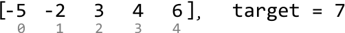
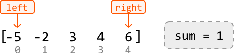
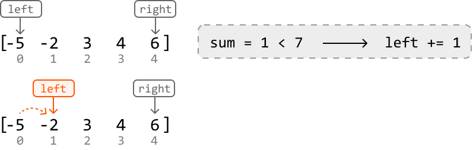
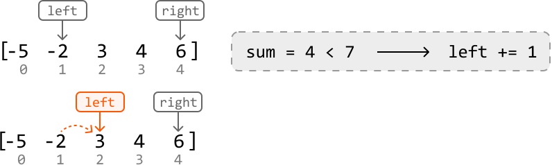
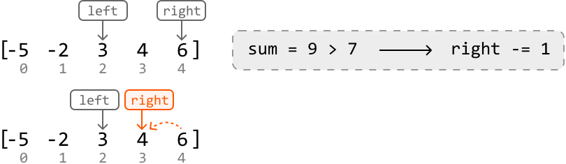
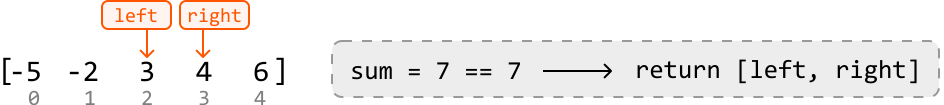

# Pair Sum - Sorted

Given an array of integers sorted in ascending order and a target value, return the **indexes of any pair of numbers** in the array that **sum to the target**. The order of the indexes in the result doesn't matter. If no pair is found, return an empty array.

#### Example 1:

```python
Input: nums = [-5, -2, 3, 4, 6], target = 7
Output: [2, 3]

```

Explanation: `nums[2] + nums[3] = 3 + 4 = 7`

#### Example 2:

```python
Input: nums = [1, 1, 1], target = 2
Output: [0, 1]

```

Explanation: other valid outputs could be `[1, 0]`, `[0, 2]`, `[2, 0]`, `[1, 2]` or `[2, 1]`.

## Intuition

The brute force solution to this problem involves checking all possible pairs. This is done using two nested loops: an outer loop that traverses the array for the first element of the pair, and an inner loop that traverses the rest of the array to find the second element. Below is the code snippet for this approach:

```python
from typing import List
  
def pair_sum_sorted_brute_force(nums: List[int], target: int) -> List[int]:
    n = len(nums)
    for i in range(n):
        for j in range(i + 1, n):
            if nums[i] + nums[j] == target:
                return [i, j]
    return []

```

```javascript
export function pair_sum_sorted_brute_force(nums, target) {
  for (let i = 0; i < nums.length; i++) {
    for (let j = i + 1; j < nums.length; j++) {
      if (nums[i] + nums[j] === target) {
        return [i, j]
      }
    }
  }
  return []
}

```

```java
import java.util.ArrayList;

public class Main {
    public ArrayList<Integer> pair_sum_sorted_brute_force(ArrayList<Integer> nums, int target) {
        int n = nums.size();
        for (int i = 0; i < n; i++) {
            for (int j = i + 1; j < n; j++) {
                if (nums.get(i) + nums.get(j) == target) {
                    ArrayList<Integer> result = new ArrayList<>();
                    result.add(i);
                    result.add(j);
                    return result;
                }
            }
        }
        return new ArrayList<>();
    }
}

```

This approach has a time complexity of O(n^2), where n denotes the length of the array. This approach does not take into account that the input array is sorted. Could we use this fact to come up with a more efficient solution?

A **two-pointer approach** is worth considering here because a sorted array allows us to move the pointers in a logical way. Let's see how this works in the example below:



---

A good place to start is by looking at the smallest and largest values: the first and last elements, respectively. The sum of these two values is 1.



Since 1 is less than the target, we need to **move one of our pointers** to find a new pair with a larger sum.

- Left pointer: The left pointer will always point to a value less than or equal to the value at the right pointer because the array is sorted. Incrementing it would result in a sum greater than or equal to the current sum of 1.

- Right pointer: Decrementing the right pointer would result in a sum that’s less than or equal to 1.

Therefore, we should increment the left pointer to find a larger sum:



---

Again, the sum of the values at those two pointers (4) is too small. So, let's increment the left pointer:



---

Now, the sum (9) is too large. So, we should decrement the right pointer to find a pair of values with a smaller sum:



---

Finally, we found two numbers that yield a sum equal to the target. Let’s return their indexes:



---

Above, we’ve demonstrated a two-pointer algorithm using inward traversal. Let’s summarize this logic. For any pair of values at `left` and `right`:

- If their sum is less than the target, increment `left`, aiming to increase the sum towards the target value.

- If their sum is greater than the target, decrement `right`, aiming to decrease the sum towards the target value.

- If their sum is equal to the target value, return `[left, right]`.

We can stop moving the `left` and `right` pointers when they meet, as this indicates no pair summing to the target was found.

## Implementation

```python
from typing import List
       
def pair_sum_sorted(nums: List[int], target: int) -> List[int]:
    left, right = 0, len(nums) - 1
    while left < right:
        sum = nums[left] + nums[right]
        # If the sum is smaller, increment the left pointer, aiming to increase the
        # sum towards the target value.
        if sum < target:
            left += 1
        # If the sum is larger, decrement the right pointer, aiming to decrease the
        # sum towards the target value.
        elif sum > target:
            right -= 1
        # If the target pair is found, return its indexes.
        else:
            return [left, right]
    return []

```

```javascript
export function pair_sum_sorted(nums, target) {
  let left = 0
  let right = nums.length - 1
  while (left < right) {
    const sum = nums[left] + nums[right]
    // If the sum is smaller, increment the left pointer, aiming to increase the
    // sum towards the target value.
    if (sum < target) {
      left += 1
    }
    // If the sum is larger, decrement the right pointer, aiming to decrease the
    // sum towards the target value.
    else if (sum > target) {
      right -= 1
    }
    // If the target pair is found, return its indexes.
    else {
      return [left, right]
    }
  }
  return []
}

```

```java
import java.util.ArrayList;

public class Main {
    public ArrayList<Integer> pair_sum_sorted(ArrayList<Integer> nums, int target) {
        int left = 0, right = nums.size() - 1;
        while (left < right) {
            int sum = nums.get(left) + nums.get(right);
            // If the sum is smaller, increment the left pointer, aiming to increase the
            // sum towards the target value.
            if (sum < target) {
                left++;
            }
            // If the sum is larger, decrement the right pointer, aiming to decrease the
            // sum towards the target value.
            else if (sum > target) {
                right--;
            }
            // If the target pair is found, return its indexes.
            else {
                ArrayList<Integer> result = new ArrayList<>();
                result.add(left);
                result.add(right);
                return result;
            }
        }
        return new ArrayList<>();
    }
}

```

### Complexity Analysis

**Time complexity:** The time complexity of pair_sum_sorted is O(n) because we perform approximately n iterations using the two-pointer technique in the worst case.

**Space complexity:** We only allocated a constant number of variables, so the space complexity is O(1).

### Test Cases

In addition to the examples already discussed, here are some other test cases you can use. These extra test cases cover different contexts to ensure the code works well across a range of inputs. Testing is important because it helps identify mistakes in your code, ensures the solution works for uncommon inputs, and brings attention to cases you might have overlooked.

| Input | Expected output | Description |
| --- | --- | --- |
| `nums = [] target = 0` | `[]` | Tests an empty array. |
| `nums = [1] target = 1` | `[]` | Tests an array with just one element. |
| `nums = [2, 3] target = 5` | `[0, 1]` | Tests a two-element array that contains a pair that sums to the target. |
| `nums = [2, 4] target = 5` | `[]` | Tests a two-element array that doesn’t contain a pair that sums to the target. |
| `nums = [2, 2, 3] target = 5` | `[0, 2]` or `[1, 2]` | Testing an array with duplicate values. |
| `nums = [-1, 2, 3] target = 2` | `[0, 2]` | Tests if the algorithm works with a negative number in the target pair. |
| `nums = [-3, -2, -1] target = -5` | `[0, 1]` | Tests if the algorithm works with both numbers of the target pair being negative. |

## Interview Tip

*Tip: Consider all information provided.*

When interviewers pose a problem, they sometimes provide only the minimum amount of information required for you to start solving it. Consequently, it’s crucial to thoroughly evaluate all that information to determine which details are essential for solving the problem efficiently. In this problem, the key to arriving at the optimal solution is recognizing that the input is sorted.