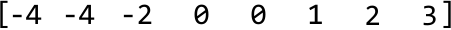
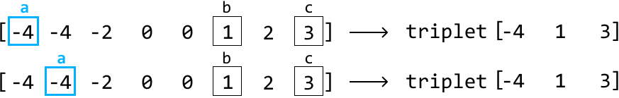
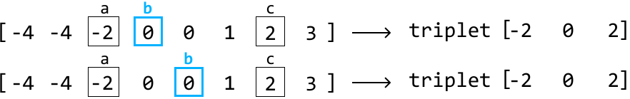

# Triplet Sum

Given an array of integers, return all triplets `[a, b, c]` such that `a + b + c = 0` . The solution must not contain duplicate triplets (e.g., `[1, 2, 3]` and `[2, 3, 1]` are considered duplicates). If no such triplets are found, return an empty array.

Each triplet can be arranged in any order, and the output can be returned in any order.

#### Example:

```python
Input: nums = [0, -1, 2, -3, 1]
Output: [[-3, 1, 2], [-1, 0, 1]]

```

## Intuition

A brute force solution involves checking every possible triplet in the array to see if they sum to zero. This can be done using three nested loops, iterating through each combination of three elements.

Duplicate triplets can be avoided by sorting each triplet, which ensures that identical triplets with different representations (e.g., `[1, 3, 2]` and `[3, 2, 1]`) are ordered consistently (e.g., `[1, 2, 3]`). Once sorted, we can add these triplets to a hash set. This way, if the same triplet is encountered again, the hash set will only keep one instance. Below is the code snippet for this approach:

```python
from typing import List
   
def triplet_sum_brute_force(nums: List[int]) -> List[List[int]]:
    n = len(nums)
    # Use a hash set to ensure we don't add duplicate triplets.
    triplets = set()
    # Iterate through the indexes of all triplets.
    for i in range(n):
        for j in range(i + 1, n):
            for k in range(j + 1, n):
                if nums[i] + nums[j] + nums[k] == 0:
                    # Sort the triplet before including it in the hash set.
                    triplet = tuple(sorted([nums[i], nums[j], nums[k]]))
                    triplets.add(triplet)
    return [list(triplet) for triplet in triplets]

```

```javascript
export function triplet_sum_brute_force(nums) {
  const n = nums.length
  // Use a hash set to ensure we don't add duplicate triplets.
  const triplets = new Set()
  // Iterate through the indexes of all triplets.
  for (let i = 0; i < n; i++) {
    for (let j = i + 1; j < n; j++) {
      for (let k = j + 1; k < n; k++) {
        if (nums[i] + nums[j] + nums[k] === 0) {
          // Sort the triplet before including it in the hash set.
          const triplet = [nums[i], nums[j], nums[k]].sort((a, b) => a - b)
          triplets.add(triplet.toString()) // Convert to string to store in the set
        }
      }
    }
  }
  // Convert the string representations back to arrays of numbers
  return Array.from(triplets).map((t) => t.split(',').map(Number))
}

```

```java
import java.util.ArrayList;
import java.util.HashSet;
import java.util.Collections;

public class Main {
    public ArrayList<ArrayList<Integer>> triplet_sum_brute_force(ArrayList<Integer> nums) {
        int n = nums.size();
        // Use a hash set to ensure we don't add duplicate triplets.
        HashSet<ArrayList<Integer>> triplets = new HashSet<>();
        // Iterate through the indexes of all triplets.
        for (int i = 0; i < n; i++) {
            for (int j = i + 1; j < n; j++) {
                for (int k = j + 1; k < n; k++) {
                    if (nums.get(i) + nums.get(j) + nums.get(k) == 0) {
                        // Sort the triplet before including it in the hash set.
                        ArrayList<Integer> triplet = new ArrayList<>();
                        triplet.add(nums.get(i));
                        triplet.add(nums.get(j));
                        triplet.add(nums.get(k));
                        Collections.sort(triplet);
                        triplets.add(triplet);
                    }
                }
            }
        }
        return new ArrayList<>(triplets);
    }
}

```

This solution is quite inefficient with a time complexity of O(n^3), where n denotes the length of the input array. How can we do better?

Let’s see if we can find at least one triplet that sums to 0. Notice that if we fix one of the numbers in a triplet, the problem can be reduced to finding the other two. This leads to the following observation:

> 
> 
> For any triplet [a, b, c], if we fix 'a', we can focus on finding a pair `[b, c]` that sums to '-a' `(a + b + c = 0 → b + c = -a)`.
> 
> 

Sound familiar? That's because the problem of finding a pair of numbers that sum to a target has already been addressed by *Pair Sum - Sorted*. However, we can only use that algorithm on a sorted array. So, the first thing we should do is **sort the input**. Consider the following example:

![Image represents a visual depiction of a sorting operation.  The image shows an unsorted array `[-1, 2, -2, 1, -1, 2]` e](./images/5bee36f4_image-01-02-1-A36R4A4P.svg)

Now, starting at the first element, -2 (i.e., 'a'), we'll use the `pair_sum_sorted` method on the rest of the array to find a pair whose sum equals 2 (i.e., '-a'):


As you can see, when we called pair_sum_sorted, we did not find a pair with a sum of 2. This indicates that there are no triplets starting with -2 that add up to 0.

---

So, let's increment our main pointer, `i`, and try again.


This time, we found one pair that resulted in a valid triplet.

If we continue this process for the rest of the array, we find that `[-1, -1, 2]` is the only triplet whose sum is 0.

---

There’s an important difference between the `pair_sum_sorted` implementation in *Pair Sum - Sorted* and the one in this problem: for this problem, we don’t stop when we find one pair, we keep going until all target pairs are found.

**Handling duplicate triplets**

Something we previously glossed over is how to avoid adding duplicate triplets. There are two cases in which this happens. Consider the example below:



\underline{\text{Case 1: duplicate ‘a’ values}}

The first instance where duplicates may occur is when seeking pairs for triplets that start with the same ‘a’ value:



Since pair_sum_sorted would look for pairs that sum ‘-a’ in both instances, we’d naturally end up with the same pairs and, hence, the same triplets.

To avoid picking the same 'a' value, we keep increasing `i` (where `num[i]` represents the value 'a') until it reaches a different number from the previous one. We do this before we start looking for pairs using the `pair_sum_sorted` method. This logic works because the array is sorted, meaning equal numbers are next to each other. The code snippet for checking duplicate 'a' values looks like this:

```python
# To prevent duplicate triplets, ensure 'a' is not a repeat of the previous element
# in the sorted array.
if i > 0 and nums[i] == nums[i - 1]:
    continue
... Find triplets ...

```

```javascript
// To prevent duplicate triplets, ensure 'a' is not a repeat of the previous element
// in the sorted array.
if (i > 0 && nums[i] === nums[i - 1]) {
    continue;
}
... Find triplets ...

```

```java
// To prevent duplicate triplets, ensure 'a' is not a repeat of the previous element
// in the sorted array.
if (i > 0 && nums[i] == nums[i - 1]) {
    continue;
}
... Find triplets ...

```

---

\underline{\text{Case 2: duplicate ‘b’ values}}

As for the second case, consider what happens during `pair_sum_sorted` when we encounter a similar issue. For a fixed target value (‘-a’), pairs that start with the same number ‘b’ will always be the same:



The remedy for this is the same as before: ensure the current ‘b’ value isn’t the same as the previous value.

It’s important to note that we don’t need to explicitly handle duplicate 'c' values. The adjustments made to avoid duplicate 'a' and 'b' values ensure each pair `[a, b]` is unique. Since 'c' is determined by the equation `c = -(a + b)`, each unique `[a, b]` pair will result in a unique 'c' value. Therefore, by just avoiding duplicates in 'a' and 'b', we automatically avoid duplicates in the `[a, b, c]` triplets.

**Optimization**

An interesting observation is that triplets that sum to 0 cannot be formed using positive numbers alone. Therefore, we can stop trying to find triplets once we reach a positive ‘a’ value since this implies that ‘b’ and ‘c’ would also be positive.

## Implementation

From the above intuition, we know we need to slightly modify the `pair_sum_sorted` function to avoid duplicate triplets. We also need to pass in a start value to indicate the beginning of the subarray on which we want to perform the pair-sum algorithm. Otherwise, the two-pointer logic remains nearly identical to that of *Pair Sum - Sorted*.

```python
from typing import List
  
def triplet_sum(nums: List[int]) -> List[List[int]]:
    triplets = []
    nums.sort()
    for i in range(len(nums)):
        # Optimization: triplets consisting of only positive numbers will never sum
        # to 0.
        if nums[i] > 0:
            break
        # To avoid duplicate triplets, skip 'a' if it's the same as the previous
        # number.
        if i > 0 and nums[i] == nums[i - 1]:
            continue
        # Find all pairs that sum to a target of '-a' ('-nums[i]').
        pairs = pair_sum_sorted_all_pairs(nums, i + 1, -nums[i])
        for pair in pairs:
            triplets.append([nums[i]] + pair)
    return triplets
  
def pair_sum_sorted_all_pairs(nums: List[int], start: int, target: int) -> List[int]:
    pairs = []
    left, right = start, len(nums) - 1
    while left < right:
        sum = nums[left] + nums[right]
        if sum == target:
            pairs.append([nums[left], nums[right]])
            left += 1 # To avoid duplicate '[b, c]' pairs, skip 'b' if it’s the same as the # previous number.
            while left < right and nums[left] == nums[left - 1]:
                left += 1
        elif sum < target:
            left += 1 
        else:
            right -= 1
    return pairs

```

```javascript
export function triplet_sum(nums) {
  const triplets = []
  nums.sort((a, b) => a - b)
  for (let i = 0; i < nums.length; i++) {
    // Optimization: triplets consisting of only positive numbers will never sum
    // to 0.
    if (nums[i] > 0) break
    // To avoid duplicate triplets, skip 'a' if it's the same as the previous
    // number.
    if (i > 0 && nums[i] === nums[i - 1]) continue
    // Find all pairs that sum to a target of '-a' ('-nums[i]').
    const pairs = pair_sum_sorted_all_pairs(nums, i + 1, -nums[i])
    for (const pair of pairs) {
      triplets.push([nums[i], ...pair])
    }
  }
  return triplets
}

function pair_sum_sorted_all_pairs(nums, start, target) {
  const pairs = []
  let left = start,
    right = nums.length - 1
  while (left < right) {
    const sum = nums[left] + nums[right]
    if (sum === target) {
      pairs.push([nums[left], nums[right]])
      left++
      // To avoid duplicate '[b, c]' pairs, skip 'b' if it’s the same as the
      // previous number.
      while (left < right && nums[left] === nums[left - 1]) {
        left++
      }
    } else if (sum < target) {
      left++
    } else {
      right--
    }
  }
  return pairs
}

```

```java
import java.util.ArrayList;
import java.util.Collections;

public class Main {
    public ArrayList<ArrayList<Integer>> triplet_sum(ArrayList<Integer> nums) {
        ArrayList<ArrayList<Integer>> triplets = new ArrayList<>();
        // Sort the input list.
        Collections.sort(nums);
        for (int i = 0; i < nums.size(); i++) {
            // Optimization: triplets consisting of only positive numbers will never sum
            // to 0.
            if (nums.get(i) > 0) {
                break;
            }
            // To avoid duplicate triplets, skip 'a' if it's the same as the previous
            // number.
            if (i > 0 && nums.get(i).equals(nums.get(i - 1))) {
                continue;
            }
            // Find all pairs that sum to a target of '-a' ('-nums[i]').
            ArrayList<ArrayList<Integer>> pairs = pair_sum_sorted_all_pairs(nums, i + 1, -nums.get(i));
            for (ArrayList<Integer> pair : pairs) {
                ArrayList<Integer> triplet = new ArrayList<>();
                triplet.add(nums.get(i));
                triplet.addAll(pair);
                triplets.add(triplet);
            }
        }
        return triplets;
    }

    public ArrayList<ArrayList<Integer>> pair_sum_sorted_all_pairs(ArrayList<Integer> nums, int start, int target) {
        ArrayList<ArrayList<Integer>> pairs = new ArrayList<>();
        int left = start;
        int right = nums.size() - 1;
        while (left < right) {
            int sum = nums.get(left) + nums.get(right);
            if (sum == target) {
                ArrayList<Integer> pair = new ArrayList<>();
                pair.add(nums.get(left));
                pair.add(nums.get(right));
                pairs.add(pair);
                left += 1;
                // To avoid duplicate '[b, c]' pairs, skip 'b' if it’s the same as the
                // previous number.
                while (left < right && nums.get(left).equals(nums.get(left - 1))) {
                    left += 1;
                }
            } else if (sum < target) {
                left += 1;
            } else {
                right -= 1;
            }
        }
        return pairs;
    }
}

```

### Complexity Analysis

**Time complexity:** The time complexity of `triplet_sum` is O(n^2). Here’s why:

- We first sort the array, which takes O(nlog(n)) time.

- Then, for each of the n elements in the array, we call `pair_sum_sorted_all_pairs` at most once, which runs in O(n) time.

Therefore, the overall time complexity is O(log(n))+O(n^2)=O(n^2).

**Space complexity:** The space complexity is O(n) due to the space taken up by Python’s sorting algorithm. It's important to note that this complexity does not include the output array triplets because we’re only concerned with the additional space used by the algorithm, not the space needed for the output itself.

If the interviewer asks what the space complexity would be if we included the output array, it would be O(n^2). This is because the `pair_sum_sorted_all_pairs` function, in the worst case, can add approximately n pairs to the output. Since this function is called approximately n times, the overall space complexity is O(n^2).

### Test Cases

In addition to the examples already covered in this explanation, below are some others to consider when testing your code.

| Input | Expected output | Description |
| --- | --- | --- |
| `nums = []` | `[]` | Tests an empty array. |
| `nums = [0]` | `[]` | Tests a single-element array. |
| `nums = [1, -1]` | `[]` | Tests a two-element array. |
| `nums = [0, 0, 0]` | `[0, 0, 0]` | Tests an array where all three of its values are the same. |
| `nums = [1, 0, 1]` | `[]` | Tests an array with no triplets that sum to 0. |
| `nums = [0, 0, 1, -1, 1, -1]` | `[-1, 0, 1]` | Tests an array with duplicate triplets. |