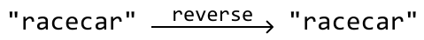
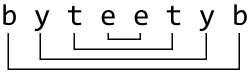
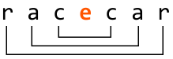
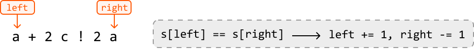
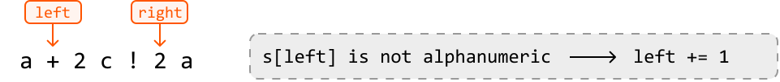
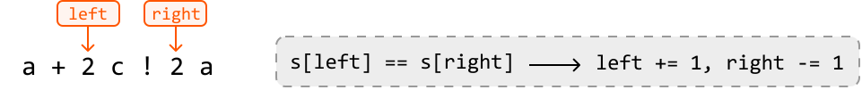
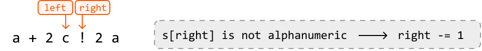
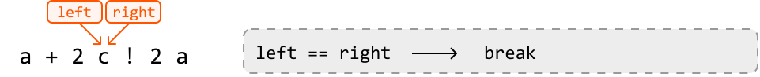
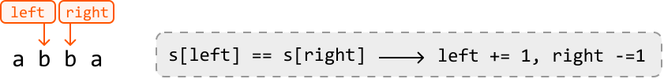
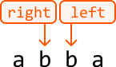

# Is Palindrome Valid

A palindrome is a sequence of characters that **reads the same forward and backward**.

Given a string, **determine if it's a palindrome** after removing all non-alphanumeric characters. A character is alphanumeric if it's either a letter or a number.

#### Example 1:

```python
Input: s = 'a dog! a panic in a pagoda.'
Output: True

```

#### Example 2:

```python
Input: s = 'abc123'
Output: False

```

#### Constraints:

- The string may include a combination of lowercase English letters, numbers, spaces, and punctuations.

## Intuition

**Identifying palindromes**

A string is a palindrome if it remains identical when read from left to right or right to left. In other words, if we reverse the string, it should still read the same, disregarding spaces and punctuation:



An important observation is that if a string is a palindrome, the first character would be the same as the last, the second character would be the same as the second-to-last, etc:



A palindrome of odd length is different because it has a middle character. In this case, the middle character can be ignored since it has no “mirror” character elsewhere in the string.



Palindromes provides an ideal scenario for using **two pointers** (`left` and `right`). By initially setting the pointers at the beginning and end of the string, we can compare the characters at these positions. Ignoring non-alphanumeric characters for the moment, the logic can be summarized as follows:

- If the alphanumeric characters at `left` and `right` are the same, move both pointers inward to process the next pair of characters.

- If not, the string is not a palindrome: return false.

If we successfully compare all character pairs without returning false, the string is a palindrome, and we should return true.

**Processing non-alphanumeric characters**

Now, let's explore how to find palindromes that include non-alphanumeric characters.

Since non-alphanumeric characters don’t affect whether a string is a palindrome, we should skip them. This can be achieved with the following approach, which ensures the left and right pointers are adjusted to focus only on alphanumeric characters:

- Increment `left` until the character it points to is alphanumeric.

- Decrement `right` until the character it points to is alphanumeric.

With this in mind, let’s check if the string below is a palindrome using all the information we know so far:











As shown above, when the left and right pointers meet, it signals our exit condition. When these pointers meet, we've reached the middle character of the palindrome, at which point we can exit the loop since the middle character doesn’t need to be evaluated. However, we need to keep in mind that exiting when `left` equals `right` won't always be sufficient as an exit condition. For example, if the number of alphanumeric characters is even, the pointers won’t meet. This can be observed below:





Therefore, we need to ensure we exit the loop when `left` equals `right`, or when `left` passes `right`. In other words, the algorithm continues while `left` is less than `right`:

```python
while left < right:

```

## Implementation

In Python, we can use the inbuilt `isalnum` method to check if a character is alphanumeric.

```python
def is_palindrome_valid(s: str) -> bool:
    left, right = 0, len(s) - 1
    while left < right:
        # Skip non-alphanumeric characters from the left.
        while left < right and not s[left].isalnum():
            left += 1
        # Skip non-alphanumeric characters from the right.
        while left < right and not s[right].isalnum():
            right -= 1
        # If the characters at the left and right pointers don’t match, the string is
        # not a palindrome.
        if s[left] != s[right]:
            return False
        left += 1
        right -= 1
    return True

```

```javascript
export function is_palindrome_valid(s) {
  let left = 0
  let right = s.length - 1
  while (left < right) {
    // Skip non-alphanumeric characters from the left.
    while (left < right && !isAlphanumeric(s[left])) {
      left++
    }
    // Skip non-alphanumeric characters from the right.
    while (left < right && !isAlphanumeric(s[right])) {
      right--
    }
    // If the characters at the left and right pointers don’t match, the string is
    // not a palindrome.
    if (s[left] !== s[right]) {
      return false
    }
    left++
    right--
  }
  return true
}

function isAlphanumeric(char) {
  return /^[a-z0-9]$/.test(char)
}

```

```java
public class Main {
    public Boolean is_palindrome_valid(String s) {
        int left = 0, right = s.length() - 1;
        while (left < right) {
            // Skip non-alphanumeric characters from the left.
            while (left < right && !Character.isLetterOrDigit(s.charAt(left))) {
                left++;
            }
            // Skip non-alphanumeric characters from the right.
            while (left < right && !Character.isLetterOrDigit(s.charAt(right))) {
                right--;
            }
            // If the characters at the left and right pointers don’t match, the string is
            // not a palindrome.
            if (Character.toLowerCase(s.charAt(left)) != Character.toLowerCase(s.charAt(right))) {
                return false;
            }
            left++;
            right--;
        }
        return true;
    }
}

```

### Complexity Analysis

**Time complexity:** The time complexity of `is_palindrome_valid` is O(n), where n denotes the length of the string. This is because we perform approximately n iterations using the two-pointer technique.

**Space complexity:** We only allocated a constant number of variables, so the space complexity is O(1).

### Test Cases

In addition to the examples discussed, below are more examples to consider when testing your code.

| Input | Expected output | Description |
| --- | --- | --- |
| `s = ""` | `True` | Tests an empty string. |
| `s = "a"` | `True` | Tests a single-character string. |
| `s = "aa"` | `True` | Tests a palindrome with two characters. |
| `s = "ab"` | `False` | Tests a non-palindrome with two characters. |
| `s = "!, (?)"` | `True` | Tests a string with no alphanumeric characters. |
| `s = "12.02.2021"` | `True` | Tests a palindrome with punctuation and numbers. |
| `s = "21.02.2021"` | `False` | Tests a non-palindrome with punctuation and numbers. |
| `s = "hello, world!"` | `False` | Tests a non-palindrome with punctuation. |

## Interview Tips

*Tip 1: Clarify problem constraints.*

It's common to not receive all the details of a problem from an interviewer. For example, you might only be asked to "check if a string is a palindrome." But before diving into a solution, it's important to clarify details with the interviewer, such as the presence of non-alphanumeric characters, their treatment, the role of numbers, the case sensitivity of letters, and other relevant details.

*Tip 2: Confirm before using significant in-built functions.*

This problem is made easier by using in-built functions such as `.isalnum` (or equivalent). Before using an in-built function that simplifies the implementation, ask the interviewer if it's okay to use it, or if they would prefer you implement it yourself.

The interviewer will most likely allow the use of an in-built function, or ask you to implement it as an exercise for later in the interview. If you use an in-built function, make sure you understand its time and space complexity.

Remember that interviewers are looking for team players, and this shows them you're considerate of their preferences and can adapt your approach based on the requirements.