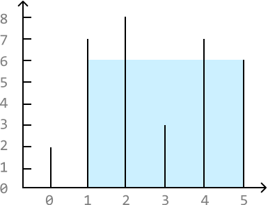
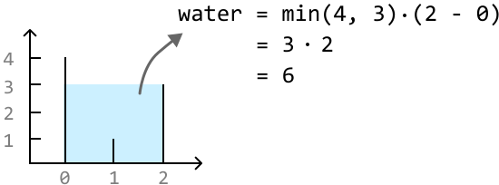
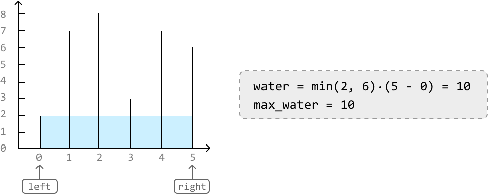
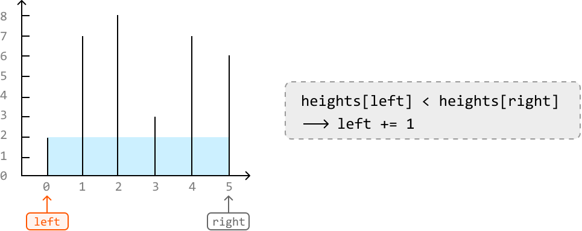
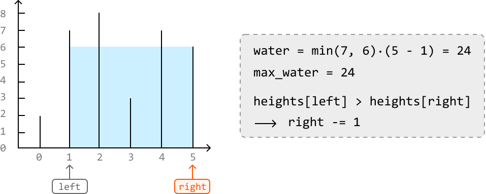
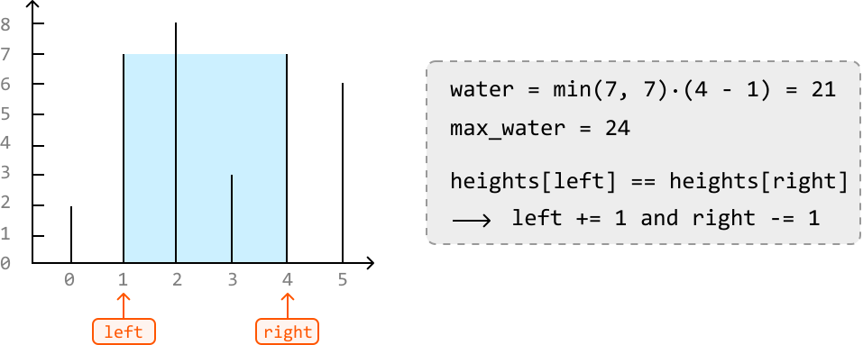
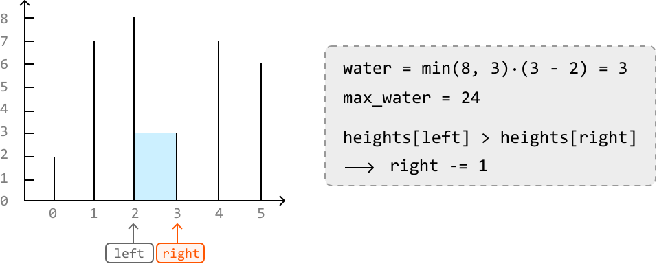
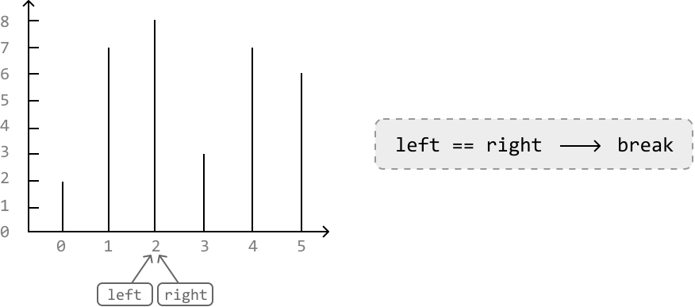

# Largest Container

You are given an array of numbers, each representing the height of a vertical line on a graph. A container can be formed with any pair of these lines, along with the x-axis of the graph. Return the amount of water which the **largest container** can hold.

#### Example:



```python
Input: heights = [2, 7, 8, 3, 7, 6]
Output: 24

```

## Intuition

If we have two vertical lines, `heights[i]` and `heights[j]`, the amount of water that can be contained between these two lines is `min(heights[i], heights[j]) * (j - i)`, where `j - i` represents the width of the container. We take the minimum height because filling water above this height would result in overflow.



In other words, the area of the container depends on two things:

- The **width** of the rectangle.

- The **height** of the rectangle, as dictated by the shorter of the two lines.

The brute force approach to this problem involves checking all pairs of lines, and returning the largest area found between each pair:

```python
from typing import List
    
def largest_container_brute_force(heights: List[int]) -> int:
   n = len(heights)
   max_water = 0
   # Find the maximum amount of water stored between all pairs of lines.
   for i in range(n):
       for j in range(i + 1, n):
           water = min(heights[i], heights[j]) * (j - i)
           max_water = max(max_water, water)
   return max_water

```

```javascript
export function largest_container(heights) {
  const n = heights.length
  let maxWater = 0
  // Find the maximum amount of water stored between all pairs of lines.
  for (let i = 0; i < n; i++) {
    for (let j = i + 1; j < n; j++) {
      const water = Math.min(heights[i], heights[j]) * (j - i)
      maxWater = Math.max(maxWater, water)
    }
  }
  return maxWater
}

```

```java
import java.util.ArrayList;

public class Main {
    public int largest_container_brute_force(ArrayList<Integer> heights) {
        int n = heights.size();
        int max_water = 0;
        // Find the maximum amount of water stored between all pairs of lines.
        for (int i = 0; i < n; i++) {
            for (int j = i + 1; j < n; j++) {
                int water = Math.min(heights.get(i), heights.get(j)) * (j - i);
                max_water = Math.max(max_water, water);
            }
        }
        return max_water;
    }
}

```

Searching through all possible pairs of values takes O(n^2) time, where n denotes the length of the array. Let's look for a more efficient solution.

We would like both the height and width to be as large as possible to have the largest container.

It’s not immediately obvious how to find the container with the largest height, as the heights of the lines in the array don’t follow a clear pattern. However, we do know the container with the maximum width: the one starting at index 0 and ending at index `n - 1`.

So, we could start by maximizing the width by setting a pointer at each end of the array. Then, we can gradually reduce the width by moving these two pointers inward, hoping to find a container with a larger height that potentially yields a larger area. This suggests we can use the **two-pointer** pattern to solve the problem.

> 
> 
> Moving a pointer inward means shifting either the left pointer to the right, or the right pointer to the left, effectively narrowing the gap between them.
> 
> 

Consider the following example:

![Image represents a bar chart visualizing the data contained within the Python list `heights = [2, 7, 8, 3, 7, 6]`.  The ](./images/bdc2147b_image-01-04-2-2GSU2V4T.svg)

The widest container can store an area of water equal to 10. Since this is the largest container we’ve found so far, let’s set `max_water` to 10.



How should we proceed? Moving either pointer inward yields a container with a shorter width. This leaves height as the determining factor. In this case, the left line is shorter than the right line, which means that the left line limits the water's height. Therefore, to find a larger container, let's move the left pointer inward:



---

The current container can hold 24 units of water, the largest amount so far. So, let’s update `max_water` to 24. Here, the right line is shorter, limiting the water's height. To find a larger container, move the right pointer inward:



---

After this, we encounter a situation where **the height of the left and right lines are equal**. In this situation, which pointer should we move inward? Well, regardless of which one, the next container is guaranteed to store less water than the current one. Let’s try to understand why.

Moving either pointer inward yields a container of shorter width, leaving height as the determining factor. However, regardless of which pointer we move inward, the other pointer remains at the same line. So, even if a pointer is moved to a taller line, the other pointer will restrict the height of the water, as we take the minimum of the two lines.

Therefore, since we can’t increase height by moving just one pointer, we can just move both pointers inward:



---

Now, the right line is limiting the height of the water. So, we move the right pointer inward:



---

Finally, the left and right pointers meet. We can conclude our search here and return `max_water`:



---

Based on the decisions taken in the example, we can summarize the logic:

- If the left line is smaller, move the left pointer inward.

- If the right line is smaller, move the right pointer inward.

- If both lines have the same height, move both pointers inward.

## Implementation

```python
from typing import List
  
def largest_container(heights: List[int]) -> int:
    max_water = 0
    left, right = 0, len(heights) - 1
    while (left < right):
        # Calculate the water contained between the current pair of lines.
        water = min(heights[left], heights[right]) * (right - left)
        max_water = max(max_water, water)
        # Move the pointers inward, always moving the pointer at the shorter line. If
        # both lines have the same height, move both pointers inward.
        if (heights[left] < heights[right]):
            left += 1
        elif (heights[left] > heights[right]):
            right -= 1
        else:
            left += 1
            right -= 1
    return max_water

```

```javascript
export function largest_container(heights) {
  let maxWater = 0
  let left = 0
  let right = heights.length - 1
  while (left < right) {
    // Calculate the water contained between the current pair of lines.
    const water = Math.min(heights[left], heights[right]) * (right - left)
    maxWater = Math.max(maxWater, water)
    // Move the pointers inward, always moving the pointer at the shorter line. If
    // both lines have the same height, move both pointers inward.
    if (heights[left] < heights[right]) {
      left += 1
    } else if (heights[left] > heights[right]) {
      right -= 1
    } else {
      left += 1
      right -= 1
    }
  }
  return maxWater
}

```

```java
import java.util.ArrayList;

public class Main {
    public int largest_container(ArrayList<Integer> heights) {
        int max_water = 0;
        int left = 0, right = heights.size() - 1;
        while (left < right) {
            // Calculate the water contained between the current pair of lines.
            int water = Math.min(heights.get(left), heights.get(right)) * (right - left);
            max_water = Math.max(max_water, water);
            // Move the pointers inward, always moving the pointer at the shorter line. If
            // both lines have the same height, move both pointers inward.
            if (heights.get(left) < heights.get(right)) {
                left++;
            } else if (heights.get(left) > heights.get(right)) {
                right--;
            } else {
                left++;
                right--;
            }
        }
        return max_water;
    }
}

```

### Complexity Analysis

**Time complexity:** The time complexity of `largest_container` is O(n) because we perform approximately n iterations using the two-pointer technique.

**Space complexity:** We only allocated a constant number of variables, so the space complexity is O(1).

### Test Cases

In addition to the examples discussed throughout this explanation, below are some other examples to consider when testing your code.

| Input | Expected output | Description |
| --- | --- | --- |
| `heights = []` | `0` | Tests an empty array. |
| `heights = [1]` | `0` | Tests an array with just one element. |
| `heights = [0, 1, 0]` | `0` | Tests an array with no containers that can contain water. |
| `heights = [3, 3, 3, 3]` | `9` | Tests an array where all heights are the same. |
| `heights = [1, 2, 3]` | `2` | Tests an array with strictly increasing heights. |
| `heights = [3, 2, 1]` | `2` | Tests an array with strictly decreasing heights. |