# Shift Zeros to the End

Given an array of integers, modify the array in place to **move all zeros to the end** while maintaining the relative order of non-zero elements.

#### Example:

```python
Input: nums = [0, 1, 0, 3, 2]
Output: [1, 3, 2, 0, 0]

```

## Intuition

This problem has three main requirements:

- Move all zeros to the end of the array.

- Maintain the relative order of the non-zero elements.

- Perform the modification in place.

A naive approach to this problem is to build the output using a separate array (`temp`). We can add all non-zero elements from the left of `nums` to this temporary array and leave the rest of it as zeros. Then, we just set the input array equal to `temp`.

> 
> 
> By identifying and moving the non-zero elements from the left side of the array first, we ensure their order is preserved when we add them to the output:
> 
> 

```python
def shift_zeros_to_the_end_naive(nums: List[int]) -> None:
    temp = [0] * len(nums)
    i = 0
    # Add all non-zero elements to the left of 'temp'.
    for num in nums:
        if num != 0:
            temp[i] = num
            i += 1
    # Set 'nums' to 'temp'.
    for j in range(len(nums)):
        nums[j] = temp[j]

```

```javascript
export function shift_zeros_to_the_end_naive(nums) {
  const temp = new Array(nums.length).fill(0)
  let i = 0
  // Add all non-zero elements to the left of 'temp'.
  for (const num of nums) {
    if (num !== 0) {
      temp[i] = num
      i += 1
    }
  }
  // Set 'nums' to 'temp'.
  for (let j = 0; j < nums.length; j++) {
    nums[j] = temp[j]
  }
}

```

```java
import java.util.ArrayList;

class UserCode {
    public static void shiftZerosToTheEndNaive(ArrayList<Integer> nums) {
        ArrayList<Integer> temp = new ArrayList<>();
        // Add all non-zero elements to the left of 'temp'.
        for (int num : nums) {
            if (num != 0) {
                temp.add(num);
            }
        }
        // Fill the rest of 'temp' with zeros.
        while (temp.size() < nums.size()) {
            temp.add(0);
        }
        // Set 'nums' to 'temp'.
        for (int i = 0; i < nums.size(); i++) {
            nums.set(i, temp.get(i));
        }
    }
}

```

Unfortunately, this solution breaks the third requirement of modifying the input array in place.

However, there's still valuable insight to be gained from this approach. In particular, notice that this solution focuses on the non-zero elements instead of zeros. This means if we change our goal to **move all non-zero elements to the left of the array**, the zeros will consequently end up on the right. Therefore, we only need to focus on non-zero elements:

![The image represents a data transformation process.  It shows an input array `[0 1 0 2 3]` enclosed in square brackets. ](./images/5062a64d_image-01-05-1-IJRTSKQD.svg)

If there was a way to iterate over the above range of the array where the non-zero elements go, we could iteratively place each non-zero element in that range.

**Two pointers**

We can use two pointers for this:

- A left pointer to iterate over the left of the array where the non-zero elements should be placed.

- A right pointer to find non-zero elements.

Consider the example below. Start by placing the left and right pointers at the start of the array. Before we move non-zero elements to the left, we need the right pointer to be pointing at a non-zero element. So, we ignore the zero at the first element and increment `right`:

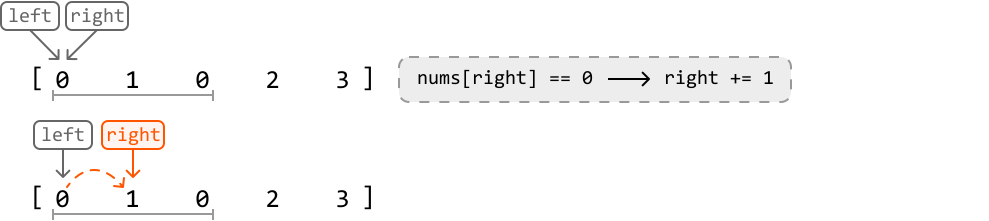

Remember, we only use the left pointer to keep track of where non-zero elements should be placed. So, until we find a non-zero element, we shouldn’t move this pointer.

---

Now, the value at the right pointer is non-zero. Let’s discuss how to handle this case.

**1. Swap the elements at `left` and `right`:** First, we’d like to move the element at the right pointer to the left of the array. So, we swap it with the element at the left pointer.

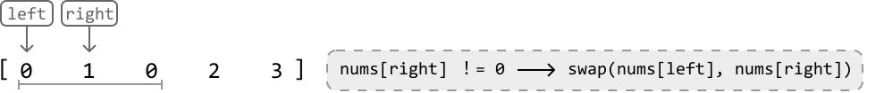

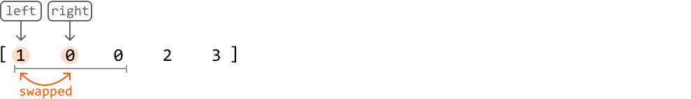

**2. Increment the pointers:**

- After the swap is complete, we should increment the left pointer to position it where the next non-zero element should go.

- Let’s also increment the right pointer in search of the next non-zero element.

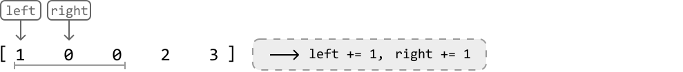

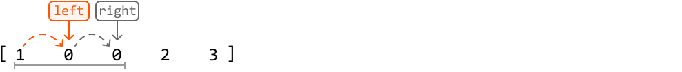

---

We can apply this logic to the rest of the array, incrementing the right pointer at each step to find the next non-zero element:

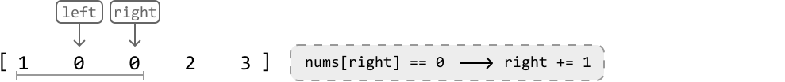

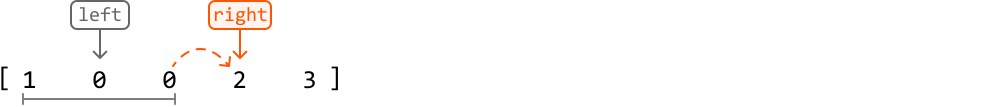

---

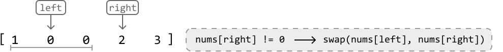

![Image represents a visual depiction of a swapping operation within an array.  The diagram shows an array `[1, 2, 0, 3]` ](./images/2400573f_image-01-05-10-67EQWWFS.svg)

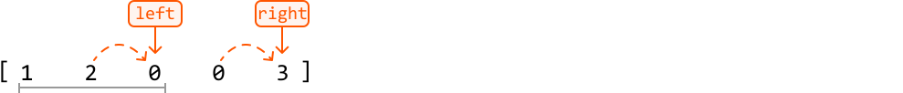

---

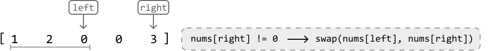

![Image represents a visual depiction of a swapping operation within an array.  The diagram shows an array `[1, 2, 3, 0]` ](./images/ab0f5720_image-01-05-13-EFX6N3MT.svg)

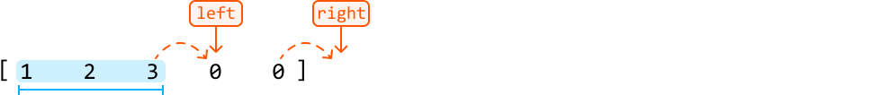

Once all swapping is done, all zeros will end up at the right end of the array as intended, without disturbing the order of the non-zero elements. The two-pointer strategy used in this problem is unidirectional traversal.

## Implementation

You might have noticed that we always move the right pointer forward, regardless of whether it points to a zero or a non-zero. This allows us to use a for-loop to iterate the right pointer.

```python
def shift_zeros_to_the_end(nums: List[int]) -> None:
    # The 'left' pointer is used to position non-zero elements.
    left = 0
    # Iterate through the array using a 'right' pointer to locate non-zero
    # elements.
    for right in range(len(nums)):
        if nums[right] != 0:
            if right != left:
                nums[left], nums[right] = nums[right], nums[left]
            # Increment 'left' since it now points to a position already occupied
            # by a non-zero element.
            left += 1

```

```javascript
export function shift_zeros_to_the_end(nums) {
  // The 'left' pointer is used to position non-zero elements.
  let left = 0
  // Iterate through the array using a 'right' pointer to locate non-zero
  // elements.
  for (let right = 0; right < nums.length; right++) {
    if (nums[right] !== 0) {
      if (right !== left) {
        // Swap elements at left and right positions
        ;[nums[left], nums[right]] = [nums[right], nums[left]]
      }
      // Increment 'left' since it now points to a position already occupied
      // by a non-zero element.
      left += 1
    }
  }
}

```

```java
import java.util.ArrayList;

class UserCode {
    public static void shiftZerosToTheEnd(ArrayList<Integer> nums) {
        // The 'left' pointer is used to position non-zero elements.
        int left = 0;
        // Iterate through the array using a 'right' pointer to locate non-zero
        // elements.
        for (int right = 0; right < nums.size(); right++) {
            if (nums.get(right) != 0) {
                if (right != left) {
                    // Swap nums[left] and nums[right].
                    int temp = nums.get(left);
                    nums.set(left, nums.get(right));
                    nums.set(right, temp);
                }
            // Increment 'left' since it now points to a position already occupied
            // by a non-zero element.
            left++;
            }
        }
    }
}

```

### Complexity Analysis

**Time complexity:** The time complexity of `shift_zeros_to_the_end` is O(n), where n denotes the length of the array. This is because we iterate through the input array once.

**Space complexity:** The space complexity is O(1) because shifting is done in place.

**Test Cases**

In addition to the examples discussed, below are more examples to consider when testing your code.

| Input | Expected output | Description |
| --- | --- | --- |
| `nums = []` | `[]` | Tests an empty array. |
| `nums = [0]` | `[0]` | Tests an array with one 0. |
| `nums = [1]` | `[1]` | Tests an array with one 1. |
| `nums = [0, 0, 0]` | `[0, 0, 0]` | Tests an array with all 0s. |
| `nums = [1, 3, 2]` | `[1, 3, 2]` | Tests an array with all non-zeros. |
| `nums = [1, 1, 1, 0, 0]` | `[1, 1, 1, 0, 0]` | Tests an array with all zeros already at the end. |
| `nums = [0, 0, 1, 1, 1]` | `[1, 1, 1, 0, 0]` | Tests an array with all zeros at the start. |