# Next Lexicographical Sequence

Given a string of lowercase English letters, rearrange the characters to form a new string representing the **next immediate sequence in lexicographical** (alphabetical) **order**. If the given string is already last in lexicographical order among all possible arrangements, return the arrangement that's first in lexicographical order.

#### Example 1:

```python
Input: s = 'abcd'
Output: 'abdc'

```

Explanation: `"abdc"` is the next sequence in lexicographical order after rearranging `"abcd"`.

#### Example 2:

```python
Input: s = 'dcba'
Output: 'abcd'

```

Explanation: Since `"dcba"` is the last sequence in lexicographical order, we return the first sequence: `"abcd"`.

#### Constraints:

- The string contains at least one character.

## Intuition

Before devising a solution, let’s first make sure we understand what the next lexicographical sequence of a string is.

An important detail is that a string’s next lexicographical sequence is lexicographically *larger* than the original string. Consider the string “abc” and all its permutations in a lexicographically ordered sequence:

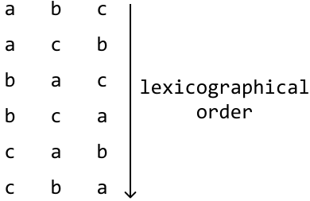

We can see the increasing order of the strings in the sequence when we translate each letter to its position in the alphabet:

 

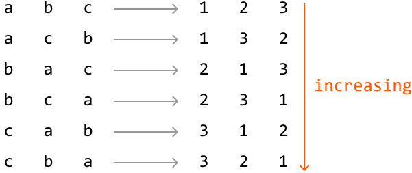

From this, we also notice the next string in the sequence after “abc” is “acb”, which is the first string larger than the original string:

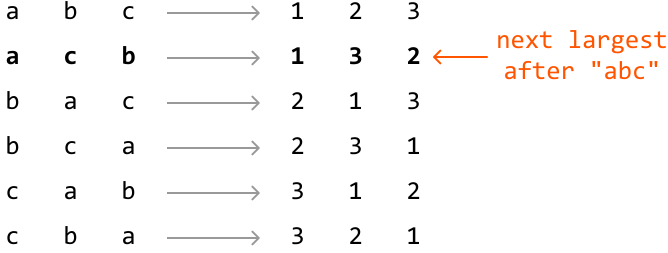

This gives us some indication of what we need to find. The next lexicographical string:

- Incurs the **smallest possible lexicographical increase** from the original string.

- Uses the same letters as the original string.

**Identifying which characters to rearrange**

Since our goal is to make the smallest possible increase, we need to somehow rearrange the characters on the right side of the string.

To understand why, imagine trying to “increase” a string’s value. Increasing the rightmost letter causes the resulting string to be closer to the original string lexicographically than increasing the leftmost letter does:

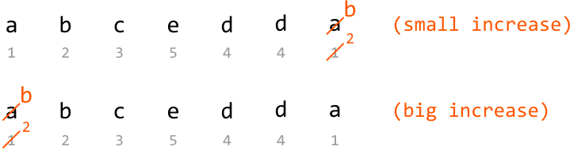

Therefore, **we should focus on rearranging characters on the right-hand side of the string first**, if possible.

A key insight is that the last string in a lexicographical sequence (i.e., the largest permutation) will always follow a **non-increasing** order. We can see this with the string “abcc”, for example, with its largest possible permutation being “ccba”:

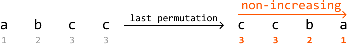

How does this help us? We know we need to rearrange the characters on the right of the string, but we don’t know how many to rearrange. From now on, let’s refer to the rightmost characters that should be rearranged as the **suffix**.

Take the string "abcedda" as an example. We traverse it from right to left with the **goal of finding the shortest suffix that can be rearranged to form a larger permutation.** The last 4 characters form a non-increasing suffix, and cannot be rearranged to make the string larger:

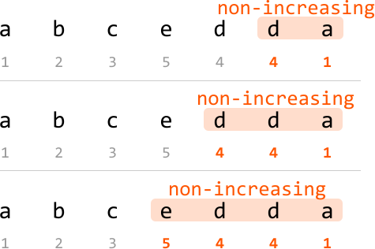

However, the next character, ‘c’, breaks the non-increasing sequence:

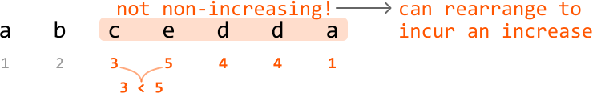

Let’s call this character the **pivot**:

 

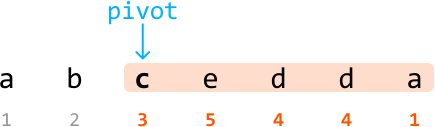

If no pivot is found, it means the string is already the last lexicographical sequence. In this case, we need to obtain its first lexicographical permutation as the problem states. This can be done by reversing the string:

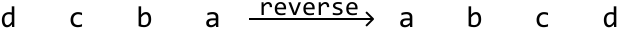

**Rearranging characters**

Having identified the shortest suffix to rearrange, the next objective is to rearrange this suffix to make the **smallest increase possible**. We have to start the rearrangement at the pivot since the rest of the suffix is already arranged in its largest permutation.

To make the character at the pivot position larger, we’d need to **swap the pivot with a character larger than it on the right**.

In our example, which character should our pivot (‘c’) swap with? We want to swap it with a character larger than 'c,' but not *too* much larger because the increase should be as small as possible. Let’s figure out how we find such a character.

Since the substring after the pivot is lexicographically non-increasing, we can find the closest character larger than ‘c’ by **traversing this suffix from right to left and stopping at the first character larger than it.** In other words, we’re finding the rightmost successor to the pivot, which is ‘d’:

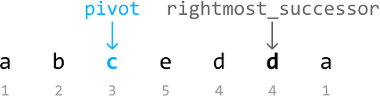

Now, we swap the pivot and the rightmost successor:

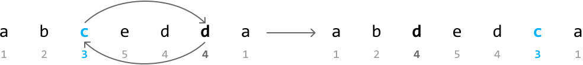

The character at the pivot has increased, so to get the next permutation, **we should make the substring after the pivot as small as possible**. After the swap shown above, we see that substring “edca” is not at its smallest permutation. So, we need to minimize the permutation of this substring.

An important observation is that after the previous swap, the substring after the pivot is still lexicographically non-increasing.

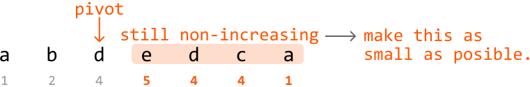

This means we can minimize this substring’s permutation by reversing it:

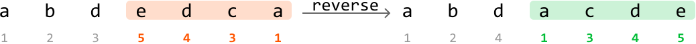

And just like that, we found the next lexicographical sequence! The two-pointer strategy used in this problem is staged traversal, where we first identify the pivot, and then identify the rightmost successor relative to it.

Many steps are involved in identifying the next lexicographical sequence. So, here’s a summary:

- Locate the pivot.

- The pivot is the first character that breaks the non-increasing sequence from the right of the string.

- If no pivot is found, the string is already at its last lexicographical sequence, and the result is just the reverse of the string.

- Find the rightmost successor to the pivot.

- Swap the rightmost successor with the pivot to increase the lexicographical order of the suffix.

- Reverse the suffix after the pivot to minimize its permutation.

## Implementation

```python
def next_lexicographical_sequence(s: str) -> str:
    letters = list(s)
    # Locate the pivot, which is the first character from the right that breaks
    # non-increasing order. Start searching from the second-to-last position.
    pivot = len(letters) - 2
    while pivot >= 0 and letters[pivot] >= letters[pivot + 1]:
        pivot -= 1
    # If pivot is not found, the string is already in its largest permutation. In
    # this case, reverse the string to obtain the smallest permutation.
    if pivot == -1:
        return ''.join(reversed(letters))
    # Find the rightmost successor to the pivot.
    rightmost_successor = len(letters) - 1
    while letters[rightmost_successor] <= letters[pivot]:
        rightmost_successor -= 1
    # Swap the rightmost successor with the pivot to increase the lexicographical
    # order of the suffix.
    letters[pivot], letters[rightmost_successor] = (letters[rightmost_successor], letters[pivot])
    # Reverse the suffix after the pivot to minimize its permutation.
    letters[pivot + 1:] = reversed(letters[pivot + 1:])
    return ''.join(letters)

```

```javascript
export function next_lexicographical_sequence(s) {
  const letters = s.split('')
  // Locate the pivot, which is the first character from the right that breaks
  // non-increasing order. Start searching from the second-to-last position.
  let pivot = letters.length - 2
  while (pivot >= 0 && letters[pivot] >= letters[pivot + 1]) {
    pivot -= 1
  }
  // If pivot is not found, the string is already in its largest permutation. In
  // this case, reverse the string to obtain the smallest permutation.
  if (pivot === -1) {
    return letters.reverse().join('')
  }
  // Find the rightmost successor to the pivot.
  let rightmostSuccessor = letters.length - 1
  while (letters[rightmostSuccessor] <= letters[pivot]) {
    rightmostSuccessor -= 1
  }
  // Swap the rightmost successor with the pivot to increase the lexicographical
  // order of the suffix.
  ;[letters[pivot], letters[rightmostSuccessor]] = [
    letters[rightmostSuccessor],
    letters[pivot],
  ]
  // Reverse the suffix after the pivot to minimize its permutation.
  const suffix = letters.splice(pivot + 1).reverse()
  return letters.concat(suffix).join('')
}

```

```java
public class Main {
    public static String next_lexicographical_sequence(String s) {
        char[] letters = s.toCharArray();
        // Locate the pivot, which is the first character from the right that breaks
        // non-increasing order. Start searching from the second-to-last position.
        int pivot = letters.length - 2;
        while (pivot >= 0 && letters[pivot] >= letters[pivot + 1]) {
            pivot--;
        }
        // If pivot is not found, the string is already in its largest permutation. In
        // this case, reverse the string to obtain the smallest permutation.
        if (pivot == -1) {
            reverse(letters, 0, letters.length - 1);
            return new String(letters);
        }
        // Find the rightmost successor to the pivot.
        int rightmostSuccessor = letters.length - 1;
        while (letters[rightmostSuccessor] <= letters[pivot]) {
            rightmostSuccessor--;
        }
        // Swap the rightmost successor with the pivot to increase the lexicographical
        // order of the suffix.
        char temp = letters[pivot];
        letters[pivot] = letters[rightmostSuccessor];
        letters[rightmostSuccessor] = temp;
        // Reverse the suffix after the pivot to minimize its permutation.
        reverse(letters, pivot + 1, letters.length - 1);
        return new String(letters);
    }

    private static void reverse(char[] arr, int left, int right) {
        while (left < right) {
            char temp = arr[left];
            arr[left] = arr[right];
            arr[right] = temp;
            left++;
            right--;
        }
    }
}

```

### Complexity Analysis

**Time complexity:** The time complexity of `next_lexicographical_sequence` is O(n), where n denotes the length of the input string. This is because we perform a maximum of two iterations across the string: one to find the pivot and another to find the rightmost character in the suffix that’s greater in value than the pivot. We also perform one reversal, which takes O(n) time.

**Space complexity:** The space complexity is O(n) due to the space taken up by the letters list. In Python, this additional space is used because strings are immutable, which necessitates storing the input string as a list.

### Test Cases

In addition to the examples discussed, below are more examples to consider when testing your code.

| Input | Expected output | Description |
| --- | --- | --- |
| s = 'a' | 'a' | Tests a string with a single character. |
| s = 'aaaa' | 'aaaa' | Tests a string with a repeated character. |
| s = 'ynitsed' | 'ynsdeit' | Tests a string with a random pivot character. |

## Interview Tip

Tip: Be precise with your language. It’s crucial to be precise with your choice of words during an interview, especially for technical descriptions. For instance, in this problem, we use “non-increasing” instead of “decreasing,” as “decreasing” implies each term is strictly smaller than the previous one, which isn’t true in this case since adjacent characters can be equal.