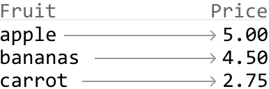
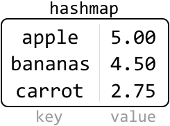
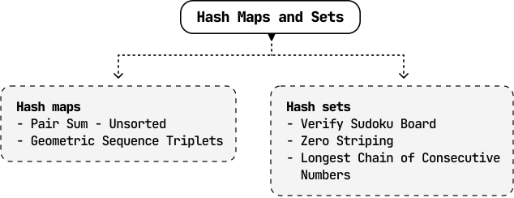

# Introduction to Hash Maps and Sets

## Intuition

Picture working in a grocery store. A customer asks for the price of a fruit. If you just have a paper list of all the fruits, you would need to look through it to find the specific fruit, which can be time-consuming. However, by memorizing the list, you can know the prices of all fruits instantly, enabling you to promptly give the correct price to the customer. This is similar to how hash maps work, enabling quick access to information.

**Hash maps**

A hash map – also known as a hash table or dictionary, depending on the language – is a data structure that pairs keys with values. Let's illustrate this using the example of fruits and their prices:

Having a mental map of fruit prices is conceptually similar to being able to instantly access fruit prices using a hash map, where the fruit name is the key, and its price is the value. When we look up a price using the fruit's name as the key, the hash map will immediately return its price:

Hash maps are incredibly efficient for lookups, insertions, and deletions, as they typically perform these operations in constant time: O(1). They are one of the most versatile, widely-used data structures in computer science, used for tasks such as counting the frequency of elements, caching data, and more.

Properties of hash maps:

- Data is stored in the form of key-value pairs.

- Hash maps don't store duplicates. Every key in a hash map is unique, ensuring each value can be distinctly identified and accessed.

- Hash maps are unordered data structures, meaning keys are not stored in any specific order.

**Time complexity breakdown**

Below, n denotes the number of entries in the hash map.

| Operation | Average case | Worst case | Description |
| --- | --- | --- | --- |
| Insert | O(1) | O(n) | Add a key-value pair to the hash map. |
| Access | O(1) | O(n) | Find or retrieve an element. |
| Delete | O(1) | O(n) | Delete a key-value pair. |

 

**In coding interviews, we generally consider hash map operations to have a fast average time complexity of** O(1), as opposed to their worst-case complexities. This is based on the assumption that an efficient hash function minimizes collisions [HashCollision]. However, in the worst-case scenario where a poorly optimized hash function results in frequent collisions, the time complexity can deteriorate to O(n), necessitating a linear search through all entries.

**Hash sets**

Hash sets are a simpler form of hash maps. Instead of storing key-value pairs, they store only the keys. Using the grocery store analogy, a hash set is like having a mental checklist of fruits without their prices. It's useful for quickly checking the presence or absence of an item, like checking whether a particular fruit is in stock.

**When to use hash maps or sets**

Common use cases of hash maps include implementing dictionaries, counting frequencies, storing key-value pairs, and handling scenarios requiring quick lookups.

Common use cases of hash sets include storing unique elements, marking elements as used or visited, and checking for duplicates.

In the description of a problem, pay attention to keywords like "frequency", "unique", "map", "dictionary", or "fast lookup", because these often indicate that hash maps or sets could be useful.

**Essential concepts for mastering hash maps and sets**

This chapter discusses the practical uses of hash maps and sets. For a more complete understanding of how they work and why they're so efficient, please explore topics that go beyond the scope of this chapter, such as:

- Hash functions: explore the intricacies of how keys are mapped to specific values in a hash table [[1]](https://en.wikipedia.org/wiki/Hash_function).

- Collision and collision-handling techniques: understand methods like chaining, or open addressing for resolving hash collisions [[2]](https://en.wikipedia.org/wiki/Hash_collision).

- Load factors and rehashing: these make it easier to understand how hash tables grow and change size [[3]](https://www.scaler.com/topics/data-structures/load-factor-and-rehashing/).

## Real-world Example

**Web browser cache**: Hash maps and sets are used everywhere in real-world systems. A classic example of hash maps in action is in caching systems within web browsers. When you visit a website, your browser stores data such as images, HTML, and CSS files in a cache so it can load much faster on future visits.

## Chapter Outline

This chapter includes problems involving the most popular use cases of hash maps and sets, aiming to improve your understanding and effectiveness in utilizing them.