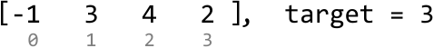
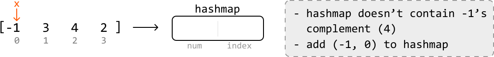
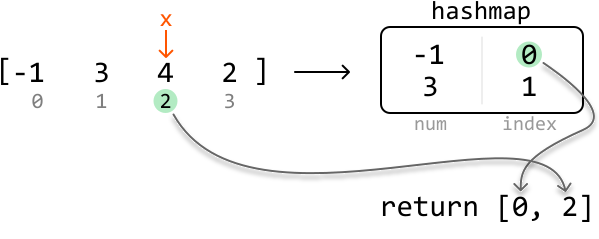

# Pair Sum - Unsorted

Given an array of integers, return the indexes of **any two numbers that add up to a target**. The order of the indexes in the result doesn't matter. If no pair is found, return an empty array.

#### Example:

```python
Input: nums = [-1, 3, 4, 2], target = 3
Output: [0, 2]

```

Explanation: `nums[0] + nums[2] = -1 + 4 = 3`

#### Constraints:

- The same index cannot be used twice in the result.

## Intuition

A brute force approach is to iterate through every possible pair in the array to see if their sum is equal to the target. This is the same as the brute force solution described in the *Pair Sum - Sorted* problem, which has a time complexity of O(n^2), where n is the length of the array. We could also sort the array and then perform the two-pointer algorithm used in *Pair Sum - Sorted*, which would take O(nlog(n)) time due to sorting. Let’s see if we can find an even faster solution.

**Complement**

We're asked to find a pair (`x`, `y`) such that `x + y == target`. In this equation, there are two unknowns: `x` and `y`. An important observation is that if we know one of these numbers, we can easily calculate what the other number should be.

> 
> 
> For each number x in nums, we need to find another number `y` such that `x + y = target`, or in other words, `y = target - x`. We can call this number the complement of `x`.
> 
> 

Keep in mind, we need to return the indexes of the pair of numbers, not the pair itself. So, we’ll need a way to find a number's complement as well as its index.

One way we could do this is to loop through the array to find each number’s complement and corresponding index. But this takes O(n^2) time since we’d need to do a linear traversal to search for each number’s complement. Instead, we’d like an efficient way to determine the index of any number in the array without needing to search the array. Is there a data structure that can help with this?

**Hash map**

A hash map works great because we can store and look up values in O(1) time. Each number and its index can be stored in the hash map as key-value pairs:

![Image represents a transformation of a numerical array into a hashmap.  The input is an array `[-1, 3, 4, 2]` with indic](./images/a36aa26f_image-02-01-1-A3GUI4CR.svg)

This allows us to retrieve the index of any number’s complement efficiently. Notice
that duplicate numbers don’t need to be considered here since only one valid pair
needs to be found.

The most intuitive way to incorporate a hash map is to:

- In the first pass, populate the hash map with each number and its corresponding index.

- In the second pass, scan through the array to check if each number's complement exists in the hash map. If it does, we can return the indexes of that number and its complement.

Below is the code snippet for this two-pass approach:

```python
from typing import List
        
def pair_sum_unsorted_two_pass(nums: List[int], target: int) -> List[int]:
    num_map = {}
    # First pass: Populate the hash map with each number and its index.
    for i, num in enumerate(nums):
        num_map[num] = i
    # Second pass: Check for each number's complement in the hash map.
    for i, num in enumerate(nums):
        complement = target - num
        if complement in num_map and num_map[complement] != i:
            return [i, num_map[complement]]
    return []

```

```javascript
export function pair_sum_unsorted_two_pass(nums, target) {
  const numMap = {}
  // First pass: Populate the hash map with each number and its index.
  for (let i = 0; i < nums.length; i++) {
    numMap[nums[i]] = i
  }
  // Second pass: Check for each number's complement in the hash map.
  for (let i = 0; i < nums.length; i++) {
    const complement = target - nums[i]
    if (complement in numMap && numMap[complement] !== i) {
      return [i, numMap[complement]]
    }
  }
  return []
}

```

```java
import java.util.ArrayList;
import java.util.HashMap;

public class Main {
    public ArrayList<Integer> pair_sum_unsorted_two_pass(ArrayList<Integer> nums, int target) {
        // First pass: Populate the hash map with each number and its index.
        HashMap<Integer, Integer> numMap = new HashMap<>();
        for (int i = 0; i < nums.size(); i++) {
            numMap.put(nums.get(i), i);
        }
        // Second pass: Check for each number's complement in the hash map.
        for (int i = 0; i < nums.size(); i++) {
            int complement = target - nums.get(i);
            if (numMap.containsKey(complement) && numMap.get(complement) != i) {
                ArrayList<Integer> result = new ArrayList<>();
                result.add(i);
                result.add(numMap.get(complement));
                return result;
            }
        }
        return new ArrayList<>();
    }
}

```

This algorithm requires two passes. Is it possible to do this in only one? A one-pass solution implies that we would need to populate the hash map while searching for complements. Is this possible? Consider the example below:



Start at index 0. Its complement would be 3 - (-1) = 4. Does our hash map have 4 in it? No, it's empty at the moment. So, let's add -1 and its index to the hash map:



---

Next, let’s look at index 1. Its complement (0) does not exist in the hash map. So, just add 3 and its index to the hash map:

![Image represents a step-by-step illustration of a coding pattern involving a hashmap.  An input array `[-1, 3, 4, 2]` is](./images/905bc15b_image-02-01-4-DZH76J2A.svg)

---

At index 2, we notice 4's complement (-1) exists in the hash map. This means we found a pair that sums to the target:

![Image represents a data transformation process.  An input array `[-1, 3, 4, 2]` with indices [0, 1, 2, 3] is shown.  A d](./images/174571a4_image-02-01-5-LVD6664V.svg)

Now, we can return the indexes of the two values. Fetch the index of 4 from the input array and the index of its complement from the hash map:



## Implementation

```python
from typing import List
   
def pair_sum_unsorted(nums: List[int], target: int) -> List[int]:
    hashmap = {}
    for i, x in enumerate(nums):
        if target - x in hashmap:
            return [hashmap[target - x], i]
        hashmap[x] = i
    return []

```

```javascript
export function pair_sum_unsorted(nums, target) {
  const hashmap = {}
  for (let i = 0; i < nums.length; i++) {
    const x = nums[i]
    if (target - x in hashmap) {
      return [hashmap[target - x], i]
    }
    hashmap[x] = i
  }
  return []
}

```

```java
import java.util.ArrayList;
import java.util.HashMap;

public class Main {
    public ArrayList<Integer> pair_sum_unsorted(ArrayList<Integer> nums, int target) {
        HashMap<Integer, Integer> hashmap = new HashMap<>();
        for (int i = 0; i < nums.size(); i++) {
            int x = nums.get(i);
            if (hashmap.containsKey(target - x)) {
                ArrayList<Integer> result = new ArrayList<>();
                result.add(hashmap.get(target - x));
                result.add(i);
                return result;
            }
            hashmap.put(x, i);
        }
        return new ArrayList<>();
    }
}

```

### Complexity Analysis

**Time complexity:** The time complexity of `pair_sum_unsorted` is O(n) because we iterate through each element in the `nums` array once and perform constant-time hash map operations during each iteration.

**Space complexity:** The space complexity is O(n) since the hash map can grow up to n in size.

## Interview Tip

*Tip: Iterate through solutions.*

Don’t always jump straight to the most optimal or clever solution, as this won't give the interviewer much insight into your problem-solving process. Consider multiple approaches, starting with the more straightforward ones, and gradually refine them. This way, you demonstrate your thought process and how you arrive at a more optimal solution.