# Verify Sudoku Board

Given a partially completed 9×9 Sudoku board, determine if the current state of the board adheres to the rules of the game:

- Each **row** and **column** must contain unique numbers between 1 and 9, or be empty (represented as 0).

- Each of the nine 3×3 **subgrids** that compose the grid must contain unique numbers between 1 and 9, or be empty.

Note: You are asked to determine whether the **current state of the board** is valid given these rules, **not** whether the board is solvable.

#### Example:

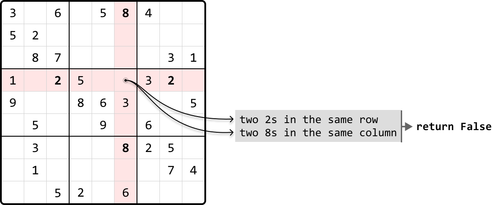

```python
Output: False

```

#### Constraints:

- Assume each integer on the board falls in the range of `[0, 9]`.

## Intuition

Our primary objective is to check every row, column, and each of the nine 3x3 subgrids, for any duplicate numbers. Let's first discuss the mechanism for finding duplicate elements, then look into how we can apply this to rows, columns, and subgrids.

**Checking for duplicates**

Let’s start by figuring out how to check for duplicates on a single row of the board:

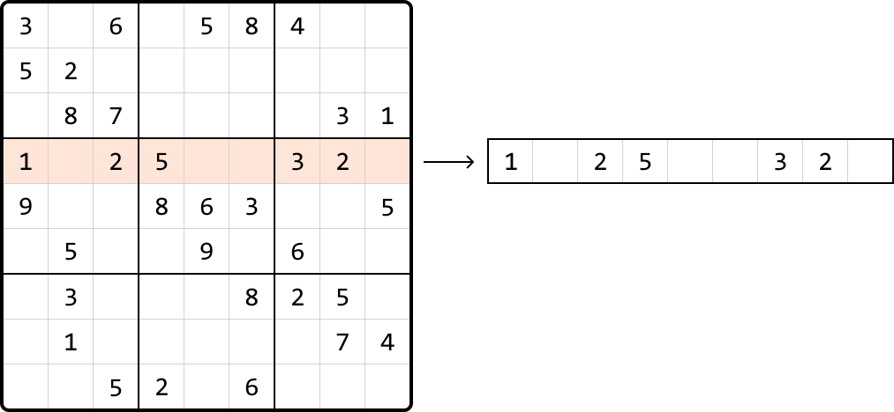

A naive way to do this is to take each number in the row and search the row to see if that number appears again. Performing a linear search for each number would result in a time complexity of O(n^2) to check all numbers in one row, which is quite time consuming.

We can use a **hash set** to improve the time complexity. By using a hash set, we can keep track of which numbers were previously visited as we iterate through the row. When we encounter a new number, we can check if it's already in the set in O(1) time. If it is, then it's a duplicate:

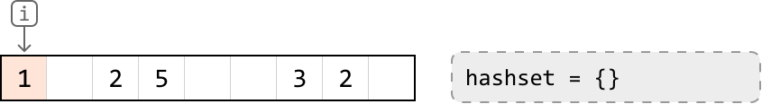

---

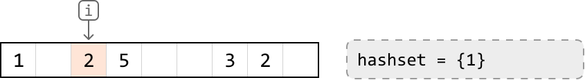

---

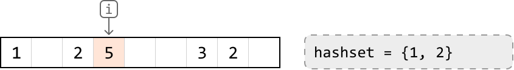

---

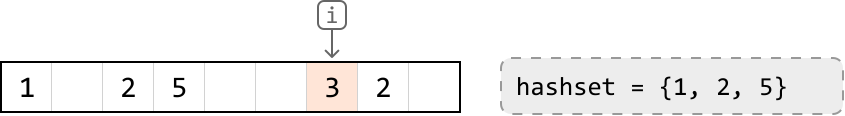

---

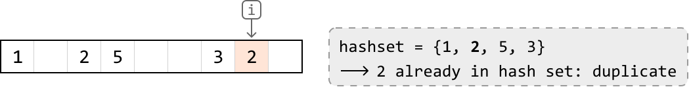

If we had a hash set for each of the 9 rows, we could keep track of duplicates in each row separately. We can do this for columns and subgrids as well, with one hash set for each column, and one hash set for each subgrid. The challenge here is determining which hash sets correspond to each cell's row, column, and subgrid, so we know which hash sets to reference:

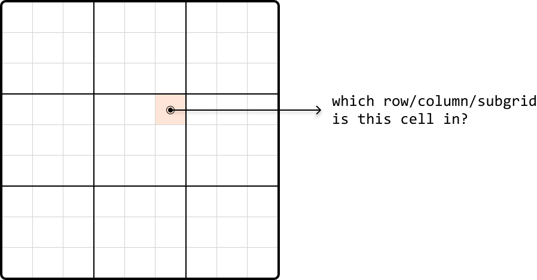

So, let’s discuss how we can identify a cell’s row, column, or subgrid.

**Identifying rows and columns**

Identifying rows is straightforward because each row has an index. The same applies to columns. Therefore, we can create an array of 9 hash sets, one for each row, allowing us to access a row’s hash set directly by its index. Similarly, we can set up an array of hash sets for each column.


**Identifying subgrids**

Subgrids pose an interesting challenge because we can’t immediately identify which subgrid a cell belongs to, unlike the straightforward index-based identification for rows and columns.

That said, as with rows and columns, there are still only 9 subgrids. If we visualize the subgrids, we can see them displayed in a 3x3 grid:

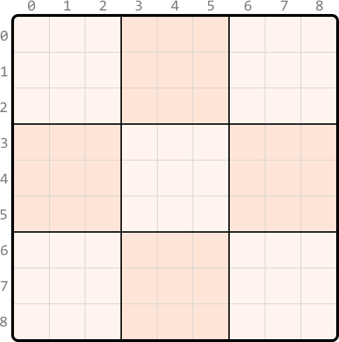

What we'd like is a way to index each of these subgrids as if indexing a 3x3 matrix. To do this, we require a method to convert the indexes ranging from 0 to 8 to the corresponding adjusted indexes from 0 to 2, as illustrated below:

 

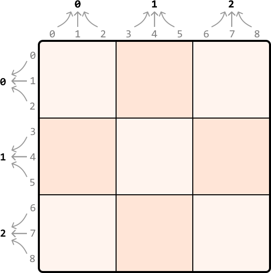

Since we got these **adjusted indexes** from shrinking a 9x9 grid to a 3x3 grid – which is effectively dividing the number of rows and columns by 3 – we can get the new subgrid row and column indexes by dividing by 3 (using integer division), as well:

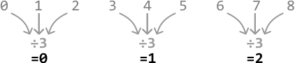

With these modified indexes, we can organize nine hash sets within a 3x3 table, one for each subgrid. Each cell in this table represents the corresponding subgrid in the above 3x3 representation. So, we can access the hash set of a subgrid at any cell by using our adjusted indexes (i.e., `subgrid_sets[r // 3][c // 3]`) (the `//` operator performs integer division).

**One-pass Sudoku verification**

We now have everything needed for a one-pass solution. We can start by initializing hash sets, 9 for each row, 9 for each column, and 9 for each subgrid, using a 3x3 array.

As we iterate through each cell in the grid, we check if a previously encountered number already exists in the current row, column, or subgrid, by querying the appropriate hash sets:

- If the number is in any of these hash sets, return false.

- Otherwise, add it to the corresponding row, column, and subgrid hash sets.

This process helps us keep track of numbers in each row, column, and subgrid. If we successfully iterate through the board without encountering any duplicates, it indicates the Sudoku board is valid. Therefore, we can return true.

## Implementation

```python
from typing import List
  
def verify_sudoku_board(board: List[List[int]]) -> bool:
    # Create hash sets for each row, column, and subgrid to keep track of numbers
    # previously seen on any given row, column, or subgrid.
    row_sets = [set() for _ in range(9)]
    column_sets = [set() for _ in range(9)]
    subgrid_sets = [[set() for _ in range(3)] for _ in range(3)]
    for r in range(9):
        for c in range(9):
            num = board[r][c]
            if num == 0:
                continue
            # Check if 'num' has been seen in the current row, column, or subgrid.
            if num in row_sets[r]:
                return False
            if num in column_sets[c]:
                return False
            if num in subgrid_sets[r // 3][c // 3]:
                return False
            # If we passed the above checks, mark this value as seen by adding it to
            # its corresponding hash sets.
            row_sets[r].add(num)
            column_sets[c].add(num)
            subgrid_sets[r // 3][c // 3].add(num)
    return True

```

```javascript
export function verify_sudoku_board(board) {
  // Create hash sets for each row, column, and subgrid to keep track of numbers
  // previously seen on any given row, column, or subgrid.
  const rowSets = Array(9)
    .fill()
    .map(() => new Set())
  const columnSets = Array(9)
    .fill()
    .map(() => new Set())
  const subgridSets = Array(3)
    .fill()
    .map(() =>
      Array(3)
        .fill()
        .map(() => new Set())
    )
  for (let r = 0; r < 9; r++) {
    for (let c = 0; c < 9; c++) {
      const num = board[r][c]
      if (num === 0) {
        continue
      }
      // Check if 'num' has been seen in the current row, column, or subgrid.
      if (rowSets[r].has(num)) {
        return false
      }
      if (columnSets[c].has(num)) {
        return false
      }
      if (subgridSets[Math.floor(r / 3)][Math.floor(c / 3)].has(num)) {
        return false
      }
      // If we passed the above checks, mark this value as seen by adding it to
      // its corresponding hash sets.
      rowSets[r].add(num)
      columnSets[c].add(num)
      subgridSets[Math.floor(r / 3)][Math.floor(c / 3)].add(num)
    }
  }
  return true
}

```

```java
import java.util.ArrayList;
import java.util.HashSet;

public class Main {
    public boolean verify_sudoku_board(ArrayList<ArrayList<Integer>> board) {
        // Create hash sets for each row, column, and subgrid to keep track of numbers
        // previously seen on any given row, column, or subgrid.
        ArrayList<HashSet<Integer>> row_sets = new ArrayList<>();
        ArrayList<HashSet<Integer>> column_sets = new ArrayList<>();
        HashSet<Integer>[][] subgrid_sets = new HashSet[3][3];
        for (int i = 0; i < 9; i++) {
            row_sets.add(new HashSet<>());
            column_sets.add(new HashSet<>());
        }
        for (int i = 0; i < 3; i++) {
            for (int j = 0; j < 3; j++) {
                subgrid_sets[i][j] = new HashSet<>();
            }
        }
        for (int r = 0; r < 9; r++) {
            for (int c = 0; c < 9; c++) {
                int num = board.get(r).get(c);
                if (num == 0) {
                    continue;
                }
                // Check if 'num' has been seen in the current row, column, or subgrid.
                if (row_sets.get(r).contains(num)) {
                    return false;
                }
                if (column_sets.get(c).contains(num)) {
                    return false;
                }
                if (subgrid_sets[r / 3][c / 3].contains(num)) {
                    return false;
                }
                // If we passed the above checks, mark this value as seen by adding it to
                // its corresponding hash sets.
                row_sets.get(r).add(num);
                column_sets.get(c).add(num);
                subgrid_sets[r / 3][c / 3].add(num);
            }
        }
        return true;
    }
}

```

### Complexity Analysis

In this problem, the length of the board is fixed at 9, effectively reducing all approaches to a time and space complexity of O(1). However, to better understand the efficiency of our algorithm in a broader context, let's use n to denote the board's length, allowing us to evaluate the algorithm's performance against arbitrary board sizes.

**Time complexity:** The time complexity of `verify_sudoku_board` is O(n^2) because we iterate through each cell in the board once, and perform constant-time hash set operations.

**Space complexity:** The space complexity is O(n^2) due to the `row_sets`, `column_sets`, and `subgrid_sets` arrays. Each array contains n hash sets, and each hash set is capable of growing to a size of n.