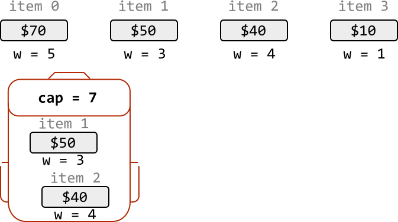
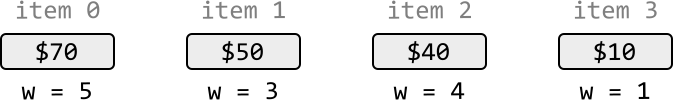
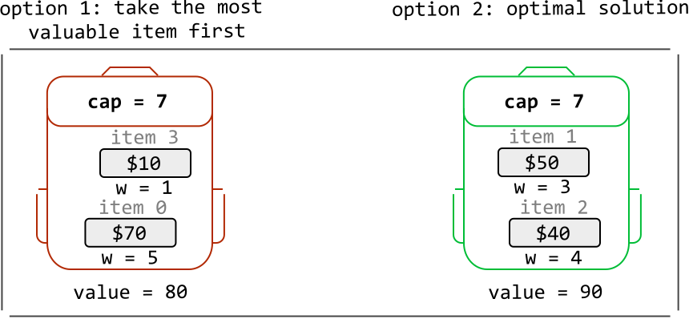
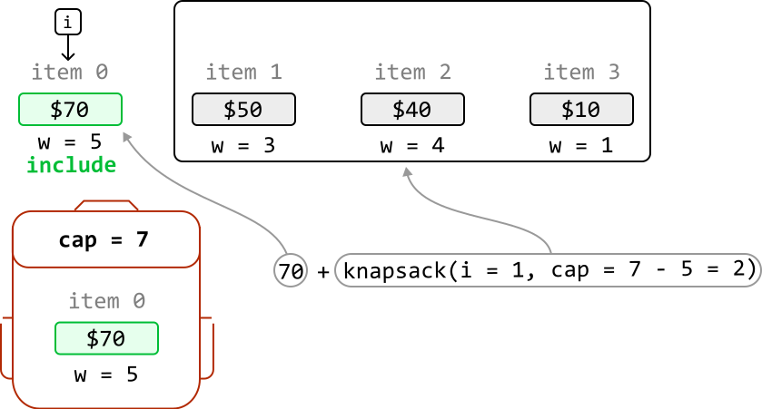
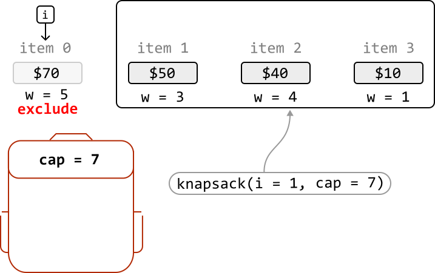
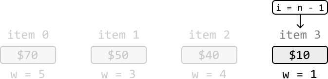
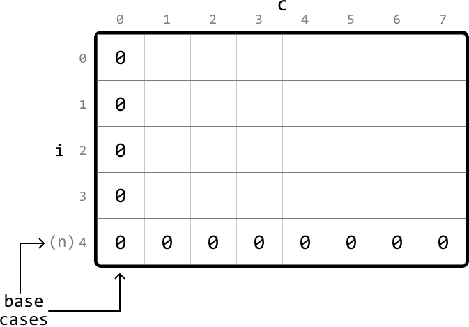
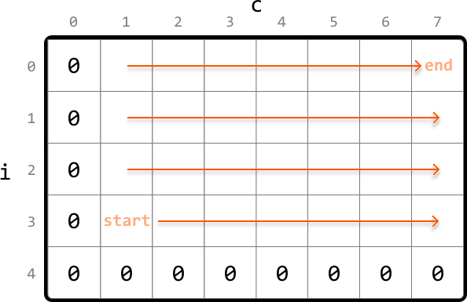

# 0/1 Knapsack

You are a thief planning to rob a store. However, you can only carry a knapsack with a maximum capacity of `cap` units. Each item (`i`) in the store has a weight (`weights[i]`) and a value (`values[i]`).

Find the maximum total value of items you can carry in your knapsack.

#### Example:



```python
Input: cap = 7, weights = [5, 3, 4, 1], values = [70, 50, 40, 10]
Output: 90

```

Explanation: The most valuable combination of items that can fit in the knapsack together are items 1 and 2 . These items have a combined value of 50 + 40 = 90 and a total weight of 3 + 4 = 7 , which fits within the knapsack's capacity.

## Intuition

For each item, we have two choices: include it in the knapsack, or exclude it. This binary decision is why this classic problem is called “0/1 Knapsack.”

The brute force approach involves making this decision for every item. Since two choices can be made for each item, this results in 2· 2· 2…2=2n possible combinations of choices. As we can see, generating all possible combinations is inefficient.

A greedy solution that involves picking the most valuable items first isn’t a good choice either, as it doesn’t always lead to the optimal outcome, which we can see in the example below:





So, let's approach this problem from a different angle. Consider the first item from the above item list (`i = 0`). What’s the most value we can attain with a knapsack of capacity 7, if we include this item? What about if we exclude this item? Let’s define the function `knapsack(i, cap)` to represent the maximum value achievable with items starting from index `i` and a knapsack capacity of `cap`:


We explore the implications of including or excluding this item, separately.

**Including item i**

Picking the first item gives a value of 70. This item weighs 5, so our knapsack now has a remaining capacity of 7 - 5 = 2. With an updated capacity of 2, what’s the optimal combination possible with the remaining items in our selection?

This question leads us to realize that if we determine the maximum value that can be obtained from the remaining items (starting from index 1) with a knapsack capacity of 2, we can find the solution:



We’ve identified that this case can be solved by solving a subproblem, which means we’re dealing with a problem that has an **optimal substructure**.

Therefore, we can generalize a recurrence relation for this case. Below, c denotes the remaining knapsack capacity we want to solve for (we give it a different name because it can be different to the initial value of `cap`):

If we include item `i`, the most value we can get is `values[i] + knapsack(i + 1, c - weights[i])`

---

**Excluding item `i`**

Now, let’s say we exclude item 0. This means our knapsack will maintain a capacity of 7. Here, the most value we can get is just from the maximum value from the rest of the items, with a knapsack of capacity 7:



Again, this case can be solved by solving a subproblem:

If we exclude item `i`, the most value we can get is `knapsack(i + 1, c)`.

---

Now that we’ve established the recurrence relations for both cases (including and excluding item `i`), we can combine them: the maximum value we can get from any selection of items is the larger value obtained from these two cases:

`knapsack(i, c)` = max(include item `i`, exclude item `i`) = `max(values[i] + knapsack(i + 1, c - weights[i]), knapsack(i + 1, c))`

One case we haven’t covered yet is the possibility the item does not fit in the knapsack. In this case, we have no choice but to exclude the item, resulting in a maximum value of `knapsack(i + 1, c)`, as discussed earlier.

**Dynamic programming**

Given this problem has an **optimal substructure**, we can translate our recurrence relations directly into DP formulas:

```python
if weights[i] <= c: \# If item i fits in a knapsack of capacity c.
    dp[i][c] = max(values[i] + dp[i + 1][c - weights[i]], dp[i + 1][c])
else: \# If item i doesn't fit.
    dp[i][c] = dp[i + 1][c]

```

```javascript
if (weights[i] <= c) {
  // If item i fits in a knapsack of capacity c.
  dp[i][c] = Math.max(values[i] + dp[i + 1][c - weights[i]], dp[i + 1][c])
} else {
  // If item i doesn't fit.
  dp[i][c] = dp[i + 1][c]
}

```

```java
if (weights[i] <= c) { // If item i fits in a knapsack of capacity c
    dp[i][c] = Math.max(values[i] + dp[i + 1][c - weights[i]], dp[i + 1][c]);
} else { // If item i doesn't fit
    dp[i][c] = dp[i + 1][c];
}

```

For clarity, there are two dimensions in our DP table:

- One for the current item, `i`, represented by the rows of the DP table.

- One for the current knapsack capacity, `c`, represented by the columns on the DP table.

With this in mind, let’s think about what the base cases should be.

**Base cases**

The simplest version of this problem is when there are no items in our selection, meaning the maximum value we can attain is 0. But which cells of the DP table represent this base case?

We know that when `i = n - 1`, only one item from the selection is being considered (where `n` denotes the total number of items):



This implies that when `i = n`, no items are being considered. Therefore, we can populate the DP table using `dp[n][c] = 0` for all c. The reason `i = 0` isn’t the base case is because `i = 0` encapsulates all items starting from index 0.

Another subproblem we know the answer to is `c = 0`, since no items can fit in a knapsack of capacity 0. For this, we can populate the DP table using `dp[i][0] = 0` for all `i`.

Let’s draw the DP table with just the base case values, to get a better idea of what this looks like:



As shown, the first column and last row are set to 0 for the base cases.

**Populating the DP table**

We populate the DP table starting from the smallest subproblems (excluding base cases). Specifically, this means starting from row `i = n - 1`, where only the last item is considered, and ending at `i = 0`, where we consider all items. For each of these rows, we iterate through each possible knapsack capacity from `c = 1` to `c = cap`.



Once the DP table is populated, we return `dp[0][cap]`, which stores the maximum value after all items and knapsack capacities are considered.

## Implementation

```python
from typing import List
    
def knapsack(cap: int, weights: List[int], values: List[int]) -> int:
    n = len(values)
    # Base case: Set the first column and last row to 0 by initializing the entire DP
    # table to 0.
    dp = [[0 for x in range(cap + 1)] for x in range(n + 1)]
    # Populate the DP table.
    for i in range(n - 1, -1, -1):
        for c in range(1, cap + 1):
           # If the item 'i' fits in the current knapsack capacity, the maximum
           # value at 'dp[i][c]' is the largest of either:
            # 1. The maximum value if we include item 'i'.
            # 2. The maximum value if we exclude item 'i'.
            if weights[i] <= c:
                dp[i][c] = max(values[i] + dp[i + 1][c - weights[i]], dp[i + 1][c])
            # If it doesn't fit, we have to exclude it.
            else:
                dp[i][c] = dp[i + 1][c]
    return dp[0][cap]

```

```javascript
export function knapsack(cap, weights, values) {
  const n = values.length
  // Base case: Initialize the DP table with 0s.
  const dp = Array.from({ length: n + 1 }, () => Array(cap + 1).fill(0))
  // Populate the DP table.
  for (let i = n - 1; i >= 0; i--) {
    for (let c = 1; c <= cap; c++) {
      // If the item 'i' fits in the current knapsack capacity, the maximum
      // value at 'dp[i][c]' is the largest of either:
      // 1. The maximum value if we include item 'i'.
      // 2. The maximum value if we exclude item 'i'.
      if (weights[i] <= c) {
        dp[i][c] = Math.max(values[i] + dp[i + 1][c - weights[i]], dp[i + 1][c])
      } else {
        // If it doesn't fit, we have to exclude it.
        dp[i][c] = dp[i + 1][c]
      }
    }
  }
  return dp[0][cap]
}

```

```java
import java.util.ArrayList;

public class Main {
    public int knapsack(int cap, ArrayList<Integer> weights, ArrayList<Integer> values) {
        int n = values.size();
        // Base case: Set the first column and last row to 0 by initializing the entire DP
        // table to 0.
        int[][] dp = new int[n + 1][cap + 1];
        // Populate the DP table.
        for (int i = n - 1; i >= 0; i--) {
            for (int c = 1; c <= cap; c++) {
                // If the item 'i' fits in the current knapsack capacity, the maximum
                // value at 'dp[i][c]' is the largest of either:
                // 1. The maximum value if we include item 'i'.
                // 2. The maximum value if we exclude item 'i'.
                if (weights.get(i) <= c) {
                    dp[i][c] = Math.max(values.get(i) + dp[i + 1][c - weights.get(i)], dp[i + 1][c]);
                }
                // If it doesn't fit, we have to exclude it.
                else {
                    dp[i][c] = dp[i + 1][c];
                }
            }
        }
        return dp[0][cap];
    }
}

```

### Complexity Analysis

**Time complexity:** The time complexity of `knapsack` is O(n· cap) because each cell of the DP table is populated once.

**Space complexity:** The space complexity is O(n· cap) because we're maintaining a DP table that stores (n+1)· (cap+1) elements.

## Optimization

We can optimize the solution by recognizing that, for each cell in the DP table, we only need access cells from the row below it.

Therefore, we only need to maintain two rows:

- `curr_row`: the current row being populated.

- `prev_row`: the row below the current row.

This effectively reduces the space complexity to O(cap). Below is the optimized code:

```python
from typing import List
    
def knapsack_optimized(cap: int, weights: List[int], values: List[int]) -> int:
    n = len(values)
    # Initialize 'prev_row' as the DP values of the row below the
    # current row.
    prev_row = [0] * (cap + 1)
    for i in range(n - 1, -1, -1):
        # Set the first cell of the 'curr_row' to 0 to set the base
        # case for this row. This is done by initializing the entire
        # row to 0.
        curr_row = [0] * (cap + 1)
        for c in range(1, cap + 1):
            # If item 'i' fits in the current knapsack capacity, the
            # maximum value at 'curr_row[c]' is the largest of either:
            # 1. The maximum value if we include item 'i'.
            # 2. The maximum value if we exclude item 'i'.
            if weights[i] <= c:
                curr_row[c] = max(values[i] + prev_row[c - weights[i]],prev_row[c])
            # If item 'i' doesn't fit, we exclude it.
            else:
                curr_row[c] = prev_row[c]
        # Set 'prev_row' to 'curr_row' values for the next iteration.
        prev_row = curr_row
    return prev_row[cap]

```

```javascript
export function knapsack_optimized(cap, weights, values) {
  const n = values.length
  // Initialize 'prevRow' as the DP values of the row below the current row.
  let prevRow = new Array(cap + 1).fill(0)
  for (let i = n - 1; i >= 0; i--) {
    // Set the first cell of the 'currRow' to 0 to set the base case for this row.
    let currRow = new Array(cap + 1).fill(0)
    for (let c = 1; c <= cap; c++) {
      // If item 'i' fits in the current knapsack capacity, the maximum value
      // at 'currRow[c]' is the largest of either:
      // 1. The maximum value if we include item 'i'.
      // 2. The maximum value if we exclude item 'i'.
      if (weights[i] <= c) {
        currRow[c] = Math.max(values[i] + prevRow[c - weights[i]], prevRow[c])
      } else {
        // If item 'i' doesn't fit, we exclude it.
        currRow[c] = prevRow[c]
      }
    }
    // Set 'prevRow' to 'currRow' values for the next iteration.
    prevRow = currRow
  }
  return prevRow[cap]
}

```

```java
import java.util.ArrayList;

public class Main {
    public int knapsack_optimized(int cap, ArrayList<Integer> weights, ArrayList<Integer> values) {
        int n = values.size();
        // Initialize 'prev_row' as the DP values of the row below the
        // current row.
        int[] prevRow = new int[cap + 1];
        for (int i = n - 1; i >= 0; i--) {
            // Set the first cell of the 'curr_row' to 0 to set the base
            // case for this row. This is done by initializing the entire
            // row to 0.
            int[] currRow = new int[cap + 1];
            for (int c = 1; c <= cap; c++) {
                // If item 'i' fits in the current knapsack capacity, the
                // maximum value at 'curr_row[c]' is the largest of either:
                // 1. The maximum value if we include item 'i'.
                // 2. The maximum value if we exclude item 'i'.
                if (weights.get(i) <= c) {
                    currRow[c] = Math.max(values.get(i) + prevRow[c - weights.get(i)], prevRow[c]);
                }
                // If item 'i' doesn't fit, we exclude it.
                else {
                    currRow[c] = prevRow[c];
                }
            }
            // Set 'prev_row' to 'curr_row' values for the next iteration.
            prevRow = currRow;
        }
        return prevRow[cap];
    }
}

```