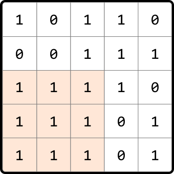
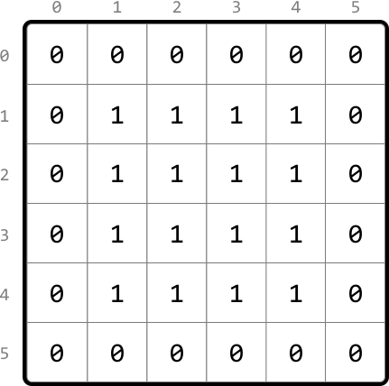
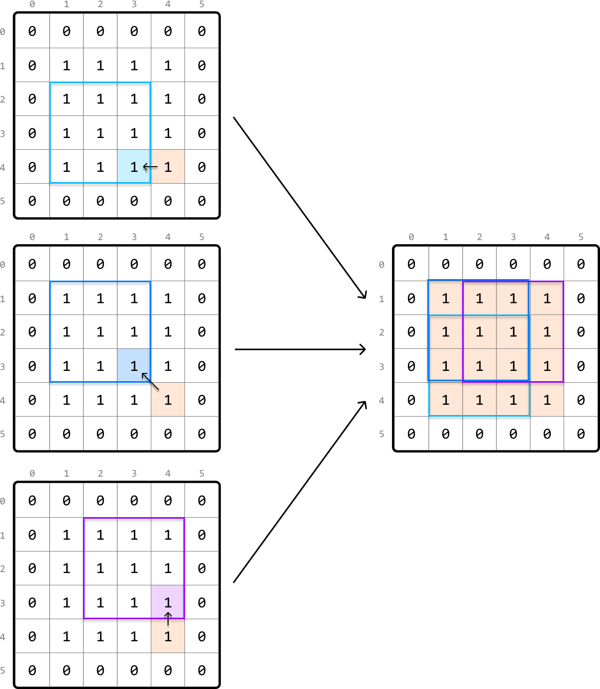
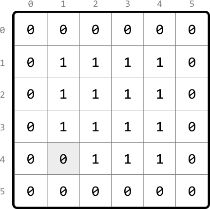
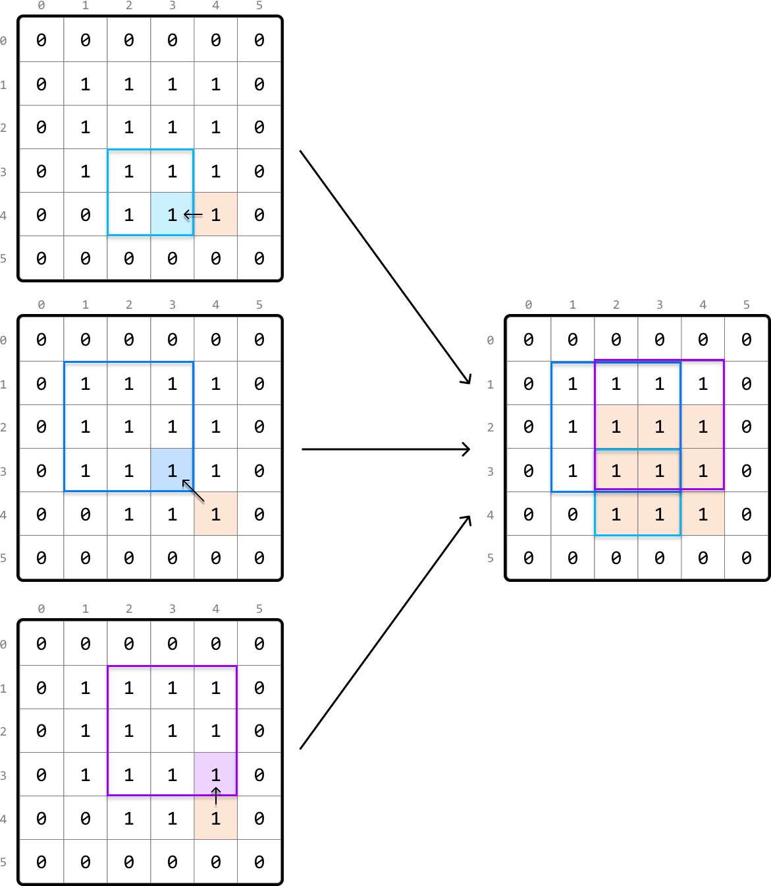
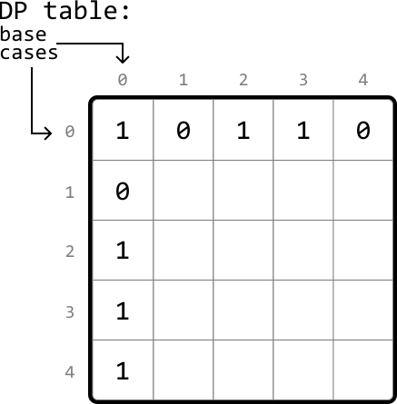
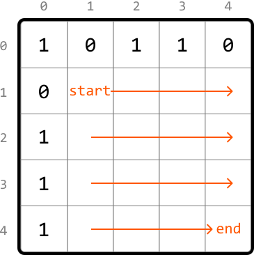
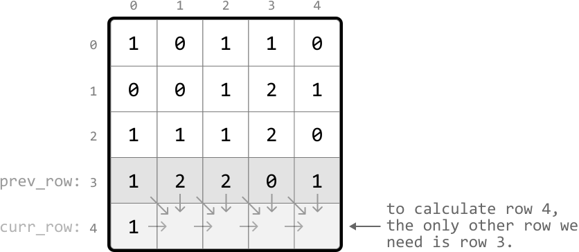

# Largest Square in a Matrix

Determine the **area of the largest square** of 1's in a binary matrix.

#### Example:



```python
Output: 9

```

## Intuition

The brute force solution to this problem involves examining every possible submatrix within the given matrix to determine if it forms a square of 1s. This can be done by treating each cell as a potential top-left corner of a square, and checking all possible squares that extend from that cell. For each of these squares, we'll need to verify that all cells within the square are 1's. Repeating this process for each cell allows us to find the largest square. This process is quite inefficient, so let's explore alternatives.

One important thing to understand is that squares contain smaller squares inside them. This indicates that subproblems might exist in this problem. Let's see if we can find what the subproblems are and how we can use them. Consider the following 6x6 matrix containing a 4×4 square of 1s:



Let's say we're at cell (4, 4). We know just by looking at the matrix that a square of length 4 with all 1s ends at this cell, but what information would we need algorithmically to determine that this 4x4 exists? A key observation here is that there are three 3×3 squares around this cell:

- one that ends directly to the left of the current cell (4, 3).

- one that ends at the top-left diagonal of the current cell (3, 3).

- one that ends directly above the current cell (3, 4).



This more clearly highlights the existence of subproblems: the length of a square that ends at the current cell depends on the lengths of the squares that end at its left, top, and top-left neighboring cells.

Let's consider a slightly different scenario, where this time, the input matrix contains one less 1, meaning there's no longer a 4×4 square of 1s:



Let's see if our strategy of checking the three neighboring squares around the current cell (4, 4) changes at all here. Keep in mind that this time, the square that ends directly to the left of the current cell only has a length of 2. This means the square that ends at the current cell can, at most, have a length of 3, with 1 unit from the current cell and 2 units from the smallest neighboring square:



This indicates that the length of the current square is restricted by the smallest of its three neighboring squares. We can express this as a recursive formula where `matrix[i][j]` represents the value of the current cell, (`i`, `j`):

> 
> 
> `if matrix[i][j] == 1: max_square(i, j) = 1 + min(max_square(i - 1, j), max_square(i - 1, j - 1), max_square(i, j - 1))`
> 
> 

We now have all the information we need. Given this problem has an **optimal substructure**, we can translate the above recurrence relation directly into a DP formula.

> 
> 
> `if matrix[i][j] == 1: dp[i][j] = 1 + min(dp[i - 1][j], dp[i - 1][j - 1], dp[i][j - 1])`
> 
> 

Now, let's think about what the base cases should be.

**Base cases**

We know `dp[0][0]` should be 1 if `matrix[0][0]` is 1 since the top-left cell can only have a square of length 1.

What other base cases are there? Consider row 0 and column 0 of the matrix. These are special because the length of a square ending at any of these cells is at most 1.

So, for the base cases, we can set all cells in row 0 and column 0 to 1 in our DP table, provided those cells in the original matrix are also 1:



**Populating the DP table**

We populate the DP table starting from the smallest subproblems (excluding the base cases). Specifically, with row 0 and column 0 populated, we begin by populating cell (1, 1) and work our way down to the last cell (`m - 1`, `n - 1`) row by row, where `m` and `n` are the dimensions of the matrix:



The largest value in the DP table represents the length of the largest square in our matrix. Therefore, we just need to track the maximum DP value (`max_len`) as we populate the table. Once done, we just return `max_len`^2, which represents the area of the largest square.

## Implementation

In this implementation, it's possible to merge the base case handling with the code which populates the DP table. However, in an interview setting, code is often easier to understand when the base cases are defined separately, which is why they are implemented separately here.

```python
def largest_square_in_a_matrix(matrix: List[List[int]]) -> int:
    if not matrix:
        return 0
    m, n = len(matrix), len(matrix[0])
    dp = [[0] * n for _ in range(m)]
    max_len = 0
    # Base case: If a cell in row 0 is 1, the largest square ending there has a
    # length of 1.
    for j in range(n):
        if matrix[0][j] == 1:
            dp[0][j] = 1
            max_len = 1
    # Base case: If a cell in column 0 is 1, the largest square ending there has
    # a length of 1.
    for i in range(m):
        if matrix[i][0] == 1:
            dp[i][0] = 1
            max_len = 1
    # Populate the rest of the DP table.
    for i in range(1, m):
        for j in range(1, n):
            if matrix[i][j] == 1:
                # The length of the largest square ending here is determined by
                # the smallest square ending at the neighboring cells (left,
                # top-left, top), plus 1 to include this cell.
                dp[i][j] = 1 + min(dp[i - 1][j], dp[i - 1][j - 1], dp[i][j - 1])
            max_len = max(max_len, dp[i][j])
    return max_len ** 2

```

```javascript
export function largest_square_in_a_matrix(matrix) {
  if (!matrix || matrix.length === 0) return 0
  const m = matrix.length
  const n = matrix[0].length
  const dp = Array.from({ length: m }, () => Array(n).fill(0))
  let maxLen = 0
  // Base case: If a cell in row 0 is 1, the largest square ending there has a length of 1.
  for (let j = 0; j < n; j++) {
    if (matrix[0][j] === 1) {
      dp[0][j] = 1
      maxLen = 1
    }
  }
  // Base case: If a cell in column 0 is 1, the largest square ending there has a length of 1.
  for (let i = 0; i < m; i++) {
    if (matrix[i][0] === 1) {
      dp[i][0] = 1
      maxLen = 1
    }
  }
  // Populate the rest of the DP table.
  for (let i = 1; i < m; i++) {
    for (let j = 1; j < n; j++) {
      if (matrix[i][j] === 1) {
        // The length of the largest square ending here is determined by
        // the smallest square ending at the neighboring cells (left,
        // top-left, top), plus 1 to include this cell.
        dp[i][j] = 1 + Math.min(dp[i - 1][j], dp[i - 1][j - 1], dp[i][j - 1])
        maxLen = Math.max(maxLen, dp[i][j])
      }
    }
  }
  return maxLen * maxLen
}

```

```java
import java.util.ArrayList;

public class Main {
    public static int largest_square_in_a_matrix(ArrayList<ArrayList<Integer>> matrix) {
        if (matrix == null || matrix.isEmpty()) {
            return 0;
        }
        int m = matrix.size();
        int n = matrix.get(0).size();
        int[][] dp = new int[m][n];
        int maxLen = 0;
        // Base case: If a cell in row 0 is 1, the largest square ending there has a
        // length of 1.
        for (int j = 0; j < n; j++) {
            if (matrix.get(0).get(j) == 1) {
                dp[0][j] = 1;
                maxLen = 1;
            }
        }
        // Base case: If a cell in column 0 is 1, the largest square ending there has
        // a length of 1.
        for (int i = 0; i < m; i++) {
            if (matrix.get(i).get(0) == 1) {
                dp[i][0] = 1;
                maxLen = 1;
            }
        }
        // Populate the rest of the DP table.
        for (int i = 1; i < m; i++) {
            for (int j = 1; j < n; j++) {
                if (matrix.get(i).get(j) == 1) {
                    // The length of the largest square ending here is determined by
                    // the smallest square ending at the neighboring cells (left,
                    // top-left, top), plus 1 to include this cell.
                    dp[i][j] = 1 + Math.min(dp[i - 1][j], Math.min(dp[i - 1][j - 1], dp[i][j - 1]));
                }
                maxLen = Math.max(maxLen, dp[i][j]);
            }
        }
        return maxLen * maxLen;
    }
}

```

### Complexity Analysis

**Time complexity:** The time complexity of `largest_square_in_a_matrix` is O(m· n) because each cell of the DP table is populated once.

**Space complexity:** The space complexity is O(m· n) since we're maintaining a 2D DP table that has m· n elements.

## Optimization

We can optimize our solution by realizing that, for each cell in the DP table, we only need to access the cell directly above it, the cell to its left, and the top-left diagonal cell.

- To get the cell above it or the top-left diagonal cell, we only need access to the previous row.

- To get the cell to its left, we just need to look at the cell to the left of the current cell in the same row we're populating.

Therefore, we only need to maintain two rows:

- `prev_row`: the previous row.

- `curr_row`: the current row being populated.



This effectively reduces the space complexity to O(m). Below is the optimized code:

```python
def largest_square_in_a_matrix_optimized(matrix: List[List[int]]) -> int:
    if not matrix:
        return 0
    m, n = len(matrix), len(matrix[0])
    prev_row = [0] * n
    max_len = 0
    # Iterate through the matrix.
    for i in range(m):
        curr_row = [0] * n
        for j in range(n):
            # Base cases: if we're in row 0 or column 0, the largest square ending
            # here has a length of 1. This can be set by using the value in the
            # input matrix.
            if i == 0 or j == 0:
                curr_row[j] = matrix[i][j]
            else:
                if matrix[i][j] == 1:
                      # curr_row[j] = 1 + min(left, top-left, top)
                    curr_row[j] = 1 + min(curr_row[j - 1], prev_row[j - 1], prev_row[j])
            max_len = max(max_len, curr_row[j])
        # Update 'prev_row' with 'curr_row' values for the next iteration.
        prev_row, curr_row = curr_row, [0] * n
    return max_len ** 2

```

```javascript
export function largest_square_in_a_matrix_optimized(matrix) {
  if (!matrix || matrix.length === 0) return 0
  const m = matrix.length
  const n = matrix[0].length
  let prevRow = new Array(n).fill(0)
  let maxLen = 0
  // Iterate through the matrix.
  for (let i = 0; i < m; i++) {
    const currRow = new Array(n).fill(0)
    for (let j = 0; j < n; j++) {
      // Base cases: if we’re in row 0 or column 0, the largest square ending
      // here has a length of 1. This can be set by using the value in the
      // input matrix.
      if (i === 0 || j === 0) {
        currRow[j] = matrix[i][j]
      } else if (matrix[i][j] === 1) {
        // currRow[j] = 1 + min(left, top-left, top)
        currRow[j] = 1 + Math.min(currRow[j - 1], prevRow[j - 1], prevRow[j])
      }
      maxLen = Math.max(maxLen, currRow[j])
    }
    // Update 'prevRow' with 'currRow' values for the next iteration.
    prevRow = currRow
  }
  return maxLen * maxLen
}

```

```java
import java.util.ArrayList;

public class Main {
    public static int largest_square_in_a_matrix_optimized(ArrayList<ArrayList<Integer>> matrix) {
        if (matrix == null || matrix.isEmpty()) {
            return 0;
        }
        int m = matrix.size();
        int n = matrix.get(0).size();
        int[] prevRow = new int[n];
        int maxLen = 0;
        // Iterate through the matrix.
        for (int i = 0; i < m; i++) {
            int[] currRow = new int[n];
            for (int j = 0; j < n; j++) {
                // Base cases: if we're in row 0 or column 0, the largest square ending
                // here has a length of 1. This can be set by using the value in the
                // input matrix.
                if (i == 0 || j == 0) {
                    currRow[j] = matrix.get(i).get(j);
                } else {
                    if (matrix.get(i).get(j) == 1) {
                        // curr_row[j] = 1 + min(left, top-left, top)
                        currRow[j] = 1 + Math.min(currRow[j - 1], Math.min(prevRow[j - 1], prevRow[j]));
                    }
                }
                maxLen = Math.max(maxLen, currRow[j]);
            }
            // Update 'prev_row' with 'curr_row' values for the next iteration.
            prevRow = currRow;
        }
        return maxLen * maxLen;
    }
}

```