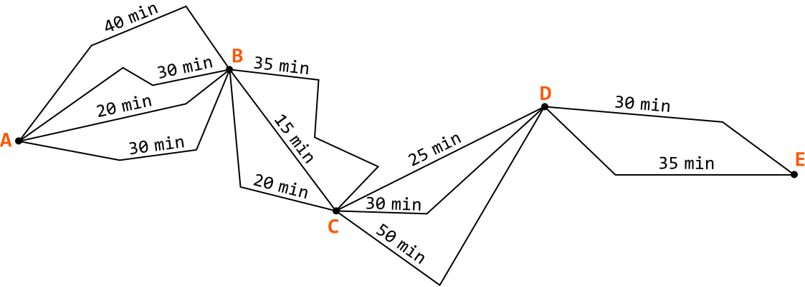
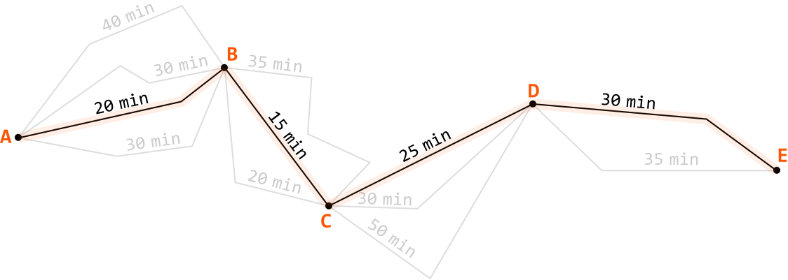
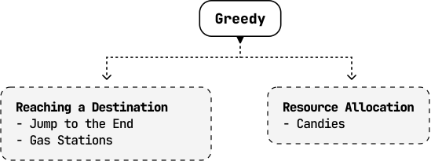

# Introduction to Greedy Algorithms

## Intuition

Greedy algorithms are a class of algorithms that make a series of decisions, where each decision is the best immediate choice given the options available. To understand this, let’s dive into an analogy.

Imagine you're planning a road trip from city A to city E, and you want to visit cities B, C, and D along the way:

You want the fastest route for this journey, so you aim to optimize the route. One option is to check every possible route to see which one takes the least amount of time to drive through, but this approach is quite time consuming.

Instead, you decide to take the route with the shortest duration at each leg of the trip, understanding that it will result in the quickest journey:

This is effectively a greedy approach to the problem, where you choose the best option at each step, aiming to find the best solution overall.

**How does a greedy algorithm work?**

More formally, a greedy algorithm follows the **greedy choice property**, which states that the best overall solution to a problem (global optimum) can be arrived at by making the best possible decision at each step (local optimum).

Each decision is made based only on the current context, and ignores its impact on future steps. This process continues until the algorithm reaches a final solution.

**How to tell if a problem can be solved using a greedy approach**

Greedy approaches are generally used for optimization problems, similar to DP. This means we check if the problem has an **optimal substructure** which can be broken down and solved by smaller subproblems.

The key difference between DP and greedy approaches is their decision-making strategies. Greedy algorithms follow the greedy choice property, while DP considers all possible solutions to find the global optimum. It’s generally the case that all greedy problems can be solved using DP, **but not all DP problems can be solved using a greedy approach**.

## Real-world Example

**Huffman coding in data compression:** Huffman coding is an algorithm that assigns variable-length codes to input characters based on their frequencies, with the most frequent characters getting the shortest codes. The goal is to minimize the overall size of the encoded data. The greedy approach works by always combining the two least frequent characters first (local optimum), ensuring that each step reduces the size of the overall encoding (global optimum). This method is widely used in file compression formats like ZIP, and media compression standards like JPEG.

## Chapter Outline

It’s impractical to provide a one-size-fits-all framework for solving greedy problems because each one is unique. Instead, this chapter explores a variety of unique situations in which a problem can be solved using the greedy choice property to provide a general understanding of how this property works.