# Jump to the End

You are given an integer array in which you're originally positioned at index 0. Each number in the array represents the **maximum jump distance** from the current index. Determine if it's possible to reach the end of the array.

#### Example 1:

![Image represents a sequence of numbers, [3, 2, 0, 2, 5], depicted within square brackets.  A green curved arrow originat](./images/994926fa_jump-to-the-end1-SUME32HH.svg)

```python
Input: nums = [3, 2, 0, 2, 5]
Output: True

```

#### Example 2:

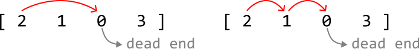

```python
Input: nums = [2, 1, 0, 3]
Output: False

```

#### Constraints:

- There is at least one element in `nums`.

- All integers in `nums` are non-negative integers.

## Intuition

From any index `i` in the array, we can jump up to `nums[i]` positions to the right. This means the furthest index we can reach from any given index `i`, is **`i + nums[i]`**:

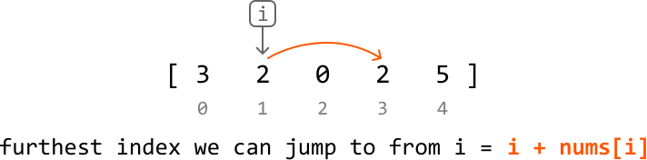

If the array consisted entirely of positive numbers, jumping from index 0 to the last index would be straightforward, as there would always be a way to progress forward toward the last index. The challenge arises when we encounter a 0 in the array, as a 0 is effectively a dead end, since landing on it disallows any further movement.

Consider the example below:

![Image represents a two-row array of numbers. The top row, enclosed in square brackets `[ ]`, displays the numbers 3, 2, ](./images/b3d13bd9_image-16-01-2-ZYKKJYDQ.svg)

Let’s think about this problem backward. Our destination is the last index, index 4, but let’s say we’ve already made it there. How did we reach this index? In this example, it’s possible to make it to index 4 from index 3:

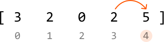

This means that if we find a way to reach index 3, we know for sure we can make it to index 4. The key observation here is that **if we can reach the last index from any earlier index, this earlier index becomes our new destination**.

With this in mind, let’s go through this example in full, starting with the last index as our initial destination:

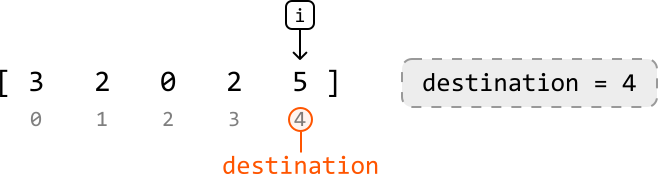

---

To find earlier indexes that can reach the destination, let’s move backward through the array, starting at index 3. As we do this for each index, we check if we can reach the current destination from this index. If we can, this index becomes the new destination. We do this by checking if it's possible to jump to the destination from this index:

> 
> 
> `if i + nums[i] ≥ destination`, we can jump to destination from index `i`.
> 
> 

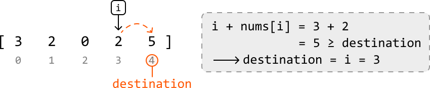

---

![Image represents a visual depiction of an array and an index.  The top row shows an array represented by `[3 2 0 2 5]`, ](./images/cb3f74dc_image-16-01-6-CY53S2HF.svg)

With the destination at index 3, let’s continue moving backward through the array.

---

Now, we’re at index 2. Below, we see we cannot reach the destination from index 2, so the destination is not updated.

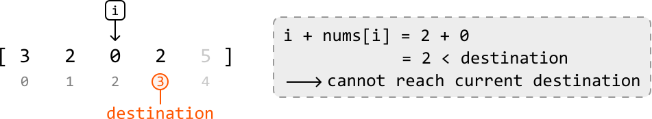

Continue with this logic for the remaining numbers in the array:

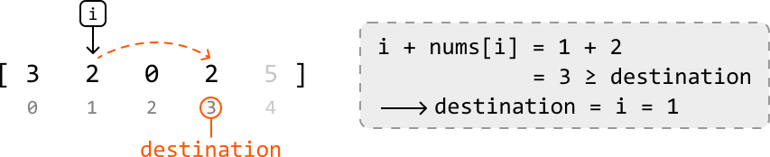

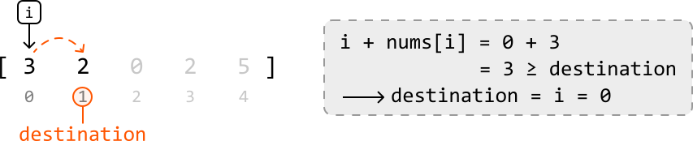

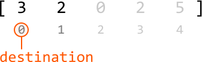

Finally, we see that once we’ve finished iterating through each index, the destination is set to index 0. This means we've successfully found a way to jump to the end from index 0.

Therefore, we **return true when `destination == 0`**. Otherwise, we cannot reach the destination from index 0, so we return false.

---

An interesting aspect of this approach is that as soon as we find an index `i` from where we can reach the destination, we update the destination to that index and assume that this is the correct decision:

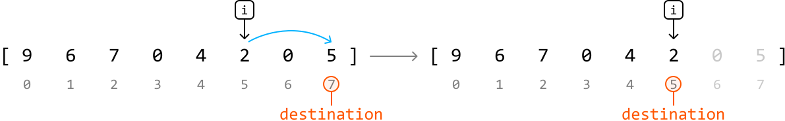

The thing is, there can sometimes be multiple indexes which can reach the destination. So, how do we know that choosing the first valid index we encounter from the right is the best choice?

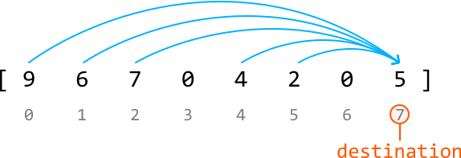

The key to understanding why is realizing that **all the other indexes which can reach the destination can also reach this first valid index**:

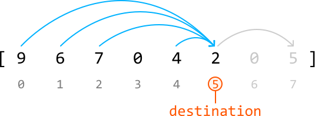

Therefore, by choosing the first valid index, we effectively simplify our problem without missing any potential solutions.

This is indicative of a **greedy solution**; since the greedy choice property is satisfied, we make the best immediate choice at each step as we move backward through the array (local optimums), hoping it leads to the overall solution (global optimum).

## Implementation

```python
from typing import List
    
def jump_to_the_end(nums: List[int]) -> bool:
    # Set the initial destination to the last index in the array.
    destination = len(nums) - 1
    # Traverse the array in reverse to see if the destination can be reached by
    # earlier indexes.
    for i in range(len(nums) - 1, -1, -1):
        # If we can reach the destination from the current index, set this index as
        # the new destination.
        if i + nums[i] >= destination:
            destination = i
    # If the destination is index 0, we can jump to the end from index 0.
    return destination == 0

```

```javascript
export function jump_to_the_end(nums) {
  // Set the initial destination to the last index in the array
  let destination = nums.length - 1
  // Traverse the array in reverse
  for (let i = nums.length - 1; i >= 0; i--) {
    // If we can reach the destination from the current index
    if (i + nums[i] >= destination) {
      destination = i
    }
  }
  // If the destination is 0, we can jump to the end from the start
  return destination === 0
}

```

```java
import java.util.ArrayList;

public class Main {
    public static boolean jump_to_the_end(ArrayList<Integer> nums) {
        // Set the initial destination to the last index in the array.
        int destination = nums.size() - 1;
        // Traverse the array in reverse to see if the destination can be reached by
        // earlier indexes.
        for (int i = nums.size() - 1; i >= 0; i--) {
            // If we can reach the destination from the current index, set this index as
            // the new destination.
            if (i + nums.get(i) >= destination) {
                destination = i;
            }
        }
        // If the destination is index 0, we can jump to the end from index 0.
        return destination == 0;
    }
}

```

### Complexity Analysis

**Time complexity:** The time complexity of `jump_to_the_end` is O(n), where n denotes the length of the array. This is because we iterate through each element of `nums` in reverse order.

**Space complexity:** The space complexity is O(1).