# Gas Stations

There's a circular route which contains gas stations. At each station, you can fill your car with a certain amount of gas, and moving from that station to the next one consumes some fuel.

Find the **index of the gas station you would need to start at**, in order to complete the circuit **without running out of gas**. Assume your car starts with an empty tank. If it's not possible to complete the circuit, return -1. If it's possible, assume only one solution exists.

#### Example:

```python
Input: gas = [2, 5, 1, 3], cost = [3, 2, 1, 4]
Output: 1

```

Explanation:

Start at station 1: gain 5 gas (tank = 5), costs 2 gas to go to station 2 (tank = 3).

At station 2: gain 1 gas (tank = 4), costs 1 gas to go to station 3 (tank = 3).

At station 3: gain 3 gas (tank = 6), costs 4 gas to go to station 0 (tank = 2).

At station 0: gain 2 gas (tank = 4), costs 3 gas to go to station 1 (tank = 1).

We started and finished the circuit at station 1 without running out of gas.

## Intuition

Before deciding which gas station to start with, let's first determine if it's even possible to complete the circuit with the total amount of gas available.

**Total gas vs total cost**

Case 1: `sum(gas) < sum(cost)`:

The first thing to realize is if the total gas is less than the total cost, **it's impossible to complete the circuit**. No matter where we start, we'll run out of gas before completing the circuit. So, in this situation, we should return -1.

Case 2: `sum(gas) ≥ sum(cost)`:

Now, let's consider the more interesting case where the total travel cost is less than or equal to the total amount of gas available.

Here's a potential hypothesis:

Since there's enough total gas to cover the total cost of travel, there must be a start point in the circuit that allows us to complete it without ever running out of gas.

It's tough to confirm this hypothesis without examining an example, so let's dive into one.

**Finding a start point**

Consider the following example where `sum(gas) > sum(cost)`:

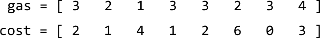

We don't necessarily need to consider the gas and cost separately. At any station `i`, we collect `gas[i]` and consume `cost[i]` to move to the next station. We can consider both at the same time by getting the difference between these values, which provides the net gas gained or lost at each station:

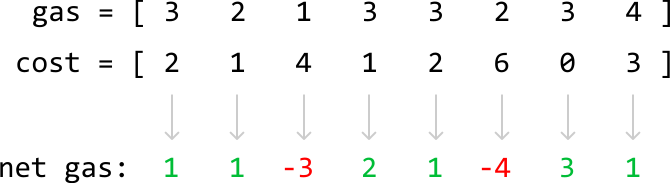

---

Let's start at station 0 with an empty gas tank and see how far we can go. The net gas at this station is positive (1), which means we have enough gas to reach the next station. Let's add 1 to our tank:

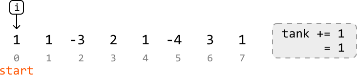

Note that index `i` refers to the current gas station, whereas start refers to the gas station we started from.

---

At station 1, we encounter the same situation:

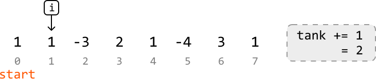

---

At station 2, our tank falls below 0, indicating we don't have enough gas to make it to the next station:

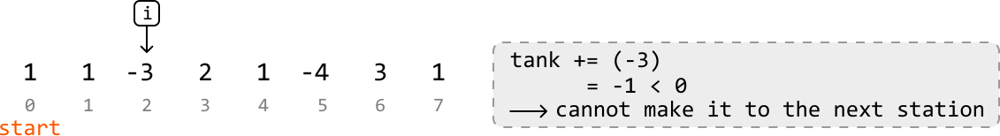

---

This means we cannot start our journey at station 0. Should we go back and try station 1? The key observation here is that if we didn't have enough gas to get from station 0 to station 3, we also wouldn't have enough if we started at any other station before station 3:

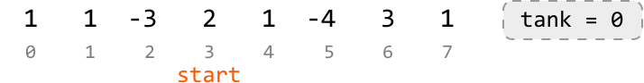

This is a general rule:

> 
> 
> If we cannot make it to station b from station a, we cannot make it to station b from any of the stations in between, either:
> 
> 

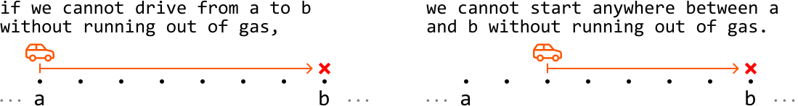

Let's try to understand why. If we only just ran out of gas right before reaching station b, this means our tank maintained a non-negative amount of gas until station b:

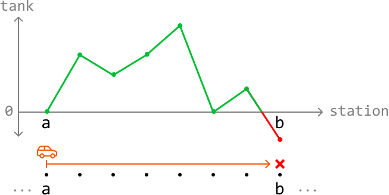

Consequently, starting anywhere else before station b will result in us missing a non-negative amount of gas from the previous stations. Therefore, starting at any of these in-between stations doesn't allow us to progress to station b.

---

Back to our example. Let's now try resetting our tank to 0 and restarting at station 3 (at `i + 1`), since we just discussed how starting at stations 0 to `i` doesn't work:

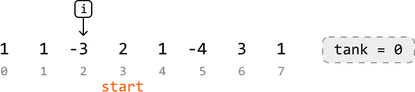

We continue until we reach a point where we cannot proceed to the next station:

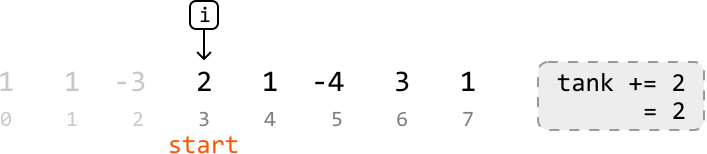

---

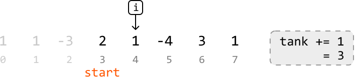

---

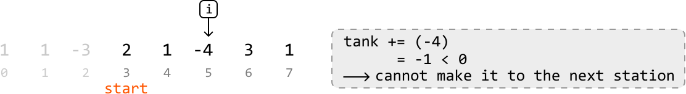

As we can see, we ran out of gas at station 5, which means we can't start from stations 3 to 5, either. So, let's try restarting at station 6.

---

After resetting the tank to 0, let's continue traveling through the stations:

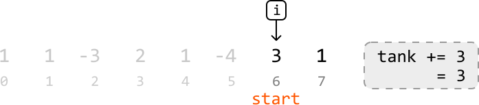

---

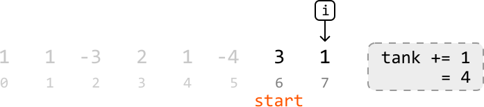

---

We've reached the end of the array. Should we go back to the start of the array to check if starting from station 6 allows us to complete the circuit? Or is reaching the end from station 6 enough to finish the circuit? Let's look into this.

**Proving we have enough gas to complete the circuit after reaching the end of the array**

We can determine this via a proof by contradiction. If the gas we have by the end of the array is not enough, that means no solution exists: no station at which we could start in order to complete the circuit. This implies that no matter where we start, we will hit a deficit (i.e., a point where our tank falls below 0) before completing the circuit.

Consider a segment of the circuit where we run into a deficit:

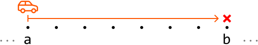

We learned earlier that we cannot start at any station between a and b (inclusive)
without running into a deficit. So, we can characterize this entire segment as having
less total gas than the total cost required to travel through it.

After concluding that we cannot start anywhere from stations a to b, we decide to restart at the next station after b, which represents the start of the next segment. Keep in mind that since there is no solution in this proof, every segment in the circuit will end with a deficit:

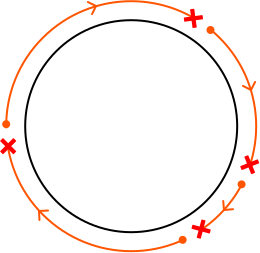

This means each of these segments has less total gas than total cost. Therefore, for there to be no starting point, `sum(gas)` would have to be less than `sum(cost)`.

However, we know that `sum(gas) ≥ sum(cost)`, confirming **there must be a valid start point that allows us to complete the circuit**.

Therefore, in our example, we can confirm that station 6 is the answer for the following reasons.

- `sum(gas) ≥ sum(cost)` implies that a solution must exist.

- We confirmed that starting anywhere before station 6 will result in us running into a deficit.

- We didn't encounter any deficit from station 6 to the last station in the array.

So, we just need to return start, which is station 6 in our example.

---

This is considered a **greedy solution** because we assume the first station we encounter that doesn't run into a deficit by the end of our array, is the start point that allows us to complete the circuit without testing every possible station in the array as the start point. The locally optimal choices (moving forward when possible, resetting when encountering a deficit) lead to the globally optimal solution (finding the correct starting point).

## Implementation

```python
from typing import List
    
def gas_stations(gas: List[int], cost: List[int]) -> int:
    # If the total gas is less than the total cost, completing the circuit is
    # impossible.
    if sum(gas) < sum(cost):
        return -1
    start = tank = 0
    for i in range(len(gas)):
        tank += gas[i] - cost[i]
        # If our tank has negative gas, we cannot continue through the circuit from
        # the current start point, nor from any station before or including the
        # current station 'i'.
        if tank < 0:
            # Set the next station as the new start point and reset the tank.
            start, tank = i + 1, 0
    return start

```

```javascript
export function gas_stations(gas, cost) {
  // If total gas is less than total cost, we can't complete the circuit
  if (gas.reduce((a, b) => a + b, 0) < cost.reduce((a, b) => a + b, 0)) {
    return -1
  }
  let start = 0
  let tank = 0
  for (let i = 0; i < gas.length; i++) {
    tank += gas[i] - cost[i]
    // If tank is negative, we can't reach the next station
    if (tank < 0) {
      start = i + 1
      tank = 0
    }
  }
  return start
}

```

```java
import java.util.ArrayList;

public class Main {
    public static int gas_stations(ArrayList<Integer> gas, ArrayList<Integer> cost) {
        // If the total gas is less than the total cost, completing the circuit is
        // impossible.
        int totalGas = 0;
        int totalCost = 0;
        for (int i = 0; i < gas.size(); i++) {
            totalGas += gas.get(i);
            totalCost += cost.get(i);
        }
        if (totalGas < totalCost) {
            return -1;
        }
        int start = 0;
        int tank = 0;
        for (int i = 0; i < gas.size(); i++) {
            tank += gas.get(i) - cost.get(i);
            // If our tank has negative gas, we cannot continue through the circuit from
            // the current start point, nor from any station before or including the
            // current station 'i'.
            if (tank < 0) {
                // Set the next station as the new start point and reset the tank.
                start = i + 1;
                tank = 0;
            }
        }
        return start;
    }
}

```

### Complexity Analysis

**Time complexity:** The time complexity of `gas_stations` is O(n), where n denotes the length of the input arrays. This is because we iterate through each element in the gas and cost arrays.

**Space complexity:** The space complexity is O(1).

## Interview Tip

*Tip: Demonstrate your greedy solution with examples if proving it formally is too difficult*

In some problems, such as this one, proving that a greedy solution works might be complicated, especially in an interview setting. If you and the interviewer are on the same page about this, a good compromise is to demonstrate the solution's correctness with a few diverse examples. This approach allows both you and the interviewer to have confidence in your solution in the absence of a thorough proof.