# Candies

You teach a class of children sitting in a row, each of whom has a rating based on their performance. You want to **distribute candies** to the children while abiding by the following rules:

- Each child must receive at least one candy.

- If two children sit next to each other, the child with the higher rating must receive more candies.

Determine the **minimum number of candies** you need to distribute to satisfy these conditions.

#### Example 1:

```python
Input: ratings = [4, 3, 2, 4, 5, 1]
Output: 12

```

Explanation: You can distribute candies to each child as follows: `[3, 2, 1, 2, 3, 1]`.

#### Example 2:

```python
Input: ratings = [1, 3, 3]
Output: 4

```

Explanation: You can distribute candies to each child as follows: `[1, 2, 1]`.

## Intuition

For starters, we know we need to give at least 1 candy to each of the n children to satisfy the first requirement of this problem. As for the other requirement, let's start off by considering a few specific cases.

**Uniform ratings**

Consider the situation where all children have the same rating. Since no child has a higher rating than another, we can give each child one candy to meet both requirements.

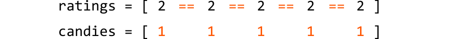

**Increasing ratings**

Now, consider the case where the children’s ratings are in strictly increasing order. Here, **each child should receive one more candy than their left-side neighbor**.

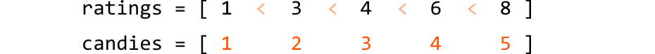

The first child gets one candy because they have no left-side neighbor, and a smaller rating than their right-side neighbor. Each subsequent child has a higher rating than their left-side neighbor, so gets one more candy than that neighbor.


**Decreasing ratings**

Here, **each child needs to receive one more candy than their right-side neighbor**.

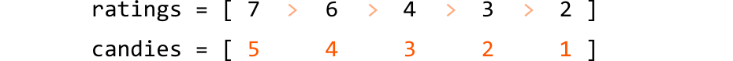

This is the same as the previous case, but in reverse. To populate the `candies` array in reverse, we start with the child furthest to the right, giving them one candy. Moving leftward, we give each child one more candy than their right-side neighbor:


**Non-uniform ratings**

Unlike previous cases, in a non-uniform distribution of ratings, children can have higher ratings than their left-side neighbor, right-side neighbor, both neighbors, or neither. This makes handling non-uniform ratings more complex.

What if we can handle these cases separately? Specifically, we could use:

- One pass to ensure children with a higher rating than their left-side neighbor get more candy (handle increasing ratings).

- A second pass to ensure children with a higher rating than their right-side neighbor get more candy (handle decreasing ratings).

This allows us to apply the logic we used for increasing and decreasing ratings in two separate passes. Let’s see if this strategy works over the following example, starting with an initial distribution of 1 candy for each child to ensure we meet the first requirement of this problem:

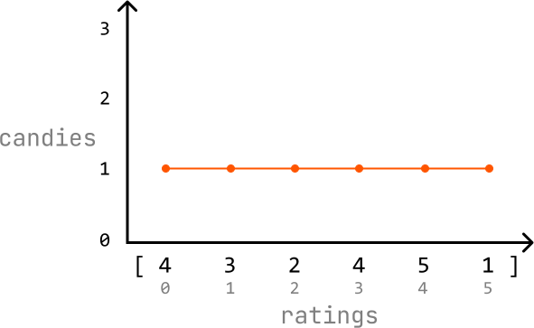

---

First pass: handle increasing ratings

Iterate through the `ratings` array and, for each child, check if they have a higher rating than their left-side neighbor (`if ratings[i] > ratings[i - 1]`). Start from index 1 since the child at index 0 doesn’t have a left-side neighbor.

- If a child's rating is higher than their left-side neighbor's rating, make sure they have at least one more candy than their left-side neighbor `(candies[i] = candies[i - 1] + 1`).

- Otherwise, just continue to the next child’s rating.

We can see how this process updates the candy distribution below:

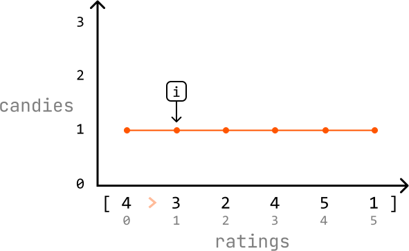

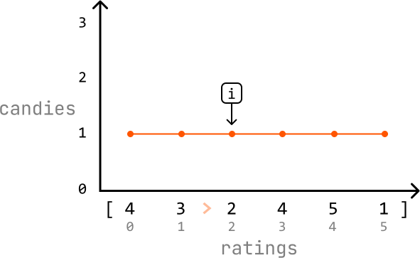

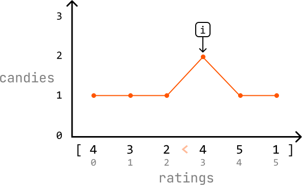

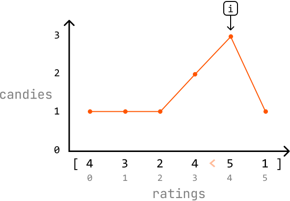

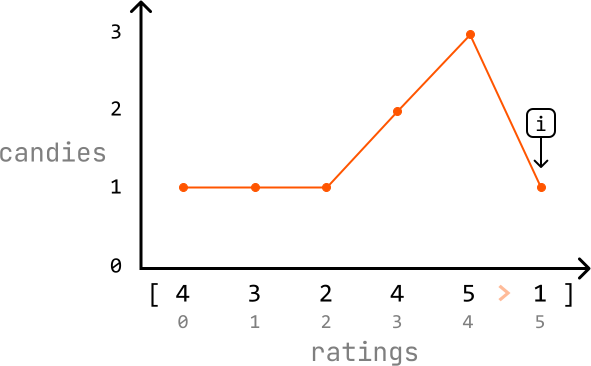

---

Second pass: handle decreasing ratings

Iterate through the `ratings` array in reverse and, for each child, check if they have a higher rating than their right-side neighbor (`if ratings[i] > ratings[i + 1]`). Start at index 4 since the child at index 5 (the last child) doesn’t have a right-side neighbor.

- If a child's rating is higher than their right-side neighbor's rating, make sure they have one more candy than that neighbor. Note that because we already did one pass through the `candies` array, they might already have more candies than their right-side neighbor, in which case the current amount of candy they have is sufficient.

- Otherwise, continue to the next child’s rating.

We can see how this process updates the candy distribution below:


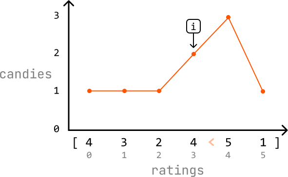

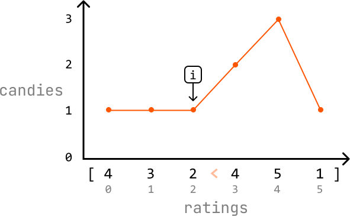

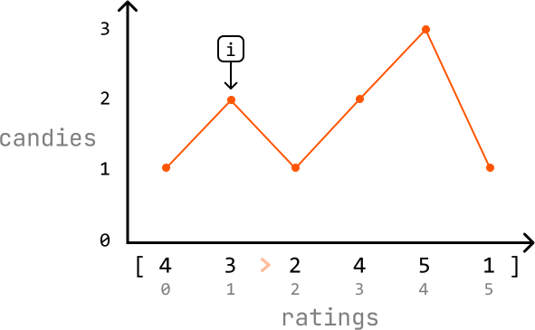

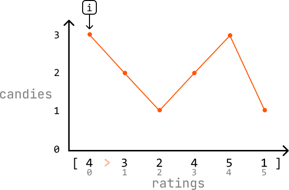

At the end of the second pass, each child should have the correct number of candies. Now, we just need to return the sum of all the candies in the `candies` array.

---

The solution we came up with is a **greedy solution** because it satisfies the greedy choice property: we make a locally optimal choice for the current child by only considering the ratings of their immediate neighbors, without worrying about the ratings of other children.

How can we be sure this strategy works? Over our two passes, we ensure both the left-side and right-side neighbors of each child are considered when distributing candies. This guarantees that the solution meets the problem's requirements.

## Implementation

```python
from typing import List
    
def candies(ratings: List[int]) -> int:
    n = len(ratings)
    # Ensure each child starts with 1 candy.
    candies = [1] * n
    # First pass: for each child, ensure the child has more candies than their
    # left-side neighbor if the current child's rating is higher.
    for i in range(1, n):
        if ratings[i] > ratings[i - 1]:
            candies[i] = candies[i - 1] + 1
    # Second pass: for each child, ensure the child has more candies than their
    # right-side neighbor if the current child's rating is higher.
    for i in range(n - 2, -1, -1):
        if ratings[i] > ratings[i + 1]:
            # If the current child already has more candies than their right-side
            # neighbor, keep the higher amount.
            candies[i] = max(candies[i], candies[i + 1] + 1)
    return sum(candies)

```

```javascript
export function candies(ratings) {
  const n = ratings.length
  const candies = new Array(n).fill(1)
  // First pass: left to right
  for (let i = 1; i < n; i++) {
    if (ratings[i] > ratings[i - 1]) {
      candies[i] = candies[i - 1] + 1
    }
  }
  // Second pass: right to left
  for (let i = n - 2; i >= 0; i--) {
    if (ratings[i] > ratings[i + 1]) {
      candies[i] = Math.max(candies[i], candies[i + 1] + 1)
    }
  }
  return candies.reduce((sum, c) => sum + c, 0)
}

```

```java
import java.util.ArrayList;

public class Main {
    public static int candies(ArrayList<Integer> ratings) {
        int n = ratings.size();
        // Ensure each child starts with 1 candy.
        int[] candies = new int[n];
        for (int i = 0; i < n; i++) {
            candies[i] = 1;
        }
        // First pass: for each child, ensure the child has more candies than their
        // left-side neighbor if the current child's rating is higher.
        for (int i = 1; i < n; i++) {
            if (ratings.get(i) > ratings.get(i - 1)) {
                candies[i] = candies[i - 1] + 1;
            }
        }
        // Second pass: for each child, ensure the child has more candies than their
        // right-side neighbor if the current child's rating is higher.
        for (int i = n - 2; i >= 0; i--) {
            if (ratings.get(i) > ratings.get(i + 1)) {
                // If the current child already has more candies than their right-side
                // neighbor, keep the higher amount.
                candies[i] = Math.max(candies[i], candies[i + 1] + 1);
            }
        }
        int total = 0;
        for (int c : candies) {
            total += c;
        }
        return total;
    }
}

```

### Complexity Analysis

**Time complexity:** The time complexity of candies is O(n) because we perform two passes over the `nums` array.

**Space complexity:** The space complexity is O(n) due to the space taken up by the `candies` array.