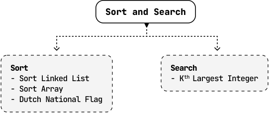

# Introduction to Sort and Search

## Intuition

When sorting and searching items in data structures, efficiency is key. This chapter covers common sorting methods and their roles in efficient searching.

First, we present a comparison of the time and space complexities for various sorting algorithms. Below, n denotes the number of elements in the data structure:

| Algorithm | Time complexity |  |  | Space complexity |
| --- | --- | --- | --- | --- |
|  | Best case | Average case | Worst case |  |
| Insertion sort [[1]](https://en.wikipedia.org/wiki/Insertion_sort) | O(n) | O(n^2) | O(n^2) | O(1) |
| Selection sort [[2]](https://en.wikipedia.org/wiki/Selection_sort) | O(n^2) | O(n^2) | O(n^2) | O(1) |
| Bubble sort [[3]](https://en.wikipedia.org/wiki/Bubble_sort) | O(n) | O(n^2) | O(n^2) | O(1) |
| Merge sort | O(nlog(n)) | O(nlog(n)) | O(nlog(n)) | O(n) |
| Quicksort | O(nlog(n)) | O(nlog(n)) | O(n^2) | O(log(n)) (average) O(n) (worst) |
| Heapsort [[4]](https://en.wikipedia.org/wiki/Heapsort) | O(nlog(n)) | O(nlog(n)) | O(nlog(n)) | O(1) |
| Counting sort[1](#user-content-fn-1) | O(n+k) | O(n+k) | O(n+k) | O(n+k) |
| Bucket sort[2](#user-content-fn-2) [[5]](https://en.wikipedia.org/wiki/Bucket_sort) | O(n+k) | O(n+k) | O(n^2) | O(n+k) |
| Radix sort[3](#user-content-fn-3) [[6]](https://en.wikipedia.org/wiki/Radix_sort) | O(d(n+k)) | O(d(n+k)) | O(d(n+k)) | O(n+k) |

 

This chapter focuses on merge sort, quicksort, and counting sort. There is additional information on the other algorithms in the references provided, as well as a tool for visualizing how these algorithms work [[7]](https://www.toptal.com/developers/sorting-algorithms).

**Fundamental concepts for sorting algorithms**

Here’s a list of fundamental attributes of sorting algorithms you should be familiar with:

- **Stability:** A sorting algorithm is considered stable if it preserves the relative order of equal elements in the sorted output. If two elements have equal values, their order in the sorted output is the same as in the input.

- **In-place sorting:** An in-place sorting algorithm transforms the input using a constant amount of extra storage space. It involves sorting the elements within the original data structure.

- **Comparison-based sorting:** Comparison-based sorting algorithms sort elements by comparing them pairwise. These algorithms typically have a lower bound of O(nlog(n)), whereas non-comparison-based sorting algorithms can achieve linear time complexity, but require specific assumptions about the input data.

These concepts are referenced throughout the problems in this chapter.

## Real-world Example

**Sorting products by category:** When users search for products, the platform often sorts the results based on various criteria such as lowest to highest price, highest to lowest rating, or even relevance to the search query. Efficient sorting algorithms ensure large datasets of products can be quickly arranged according to user preferences.

## Chapter Outline

## Footnotes

- In counting sort, k represents the range of the values in the input array. [↩](#user-content-fnref-1)

- In bucket sort, k represents the number of buckets used. [↩](#user-content-fnref-2)

- In radix sort, k represents the range of the inputs and d represents the number of digits in the maximum element. [↩](#user-content-fnref-3)