# Sort Linked List

Given the head of a singly linked list, **sort the linked list** in ascending order.

#### Example:

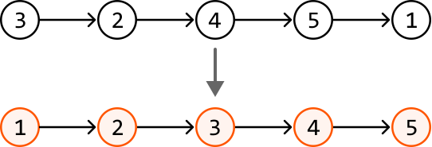

## Intuition

Let’s start by finding a sorting algorithm that allows us to sort a linked list.

**Choosing a sorting algorithm**

We're tasked with sorting a linked list, not an array. This distinction is crucial because algorithms like quicksort rely on random access through indexing, which linked lists don't support. Merge sort is a great O(nlog(n)) time option, where n denotes the length of the linked list, because it does not require random access and works well with linked lists, as we’ll see in this explanation.

**Merge sort**

The merge sort algorithm uses a divide and conquer strategy. At a high level, it can be broken down into three steps:

- Split the linked list into two halves:

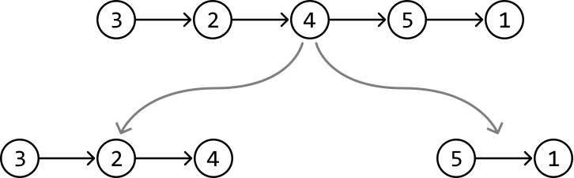

- Recursively sort both halves:

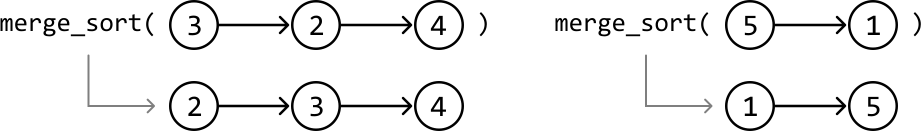

- Merge the halves back together in a sorted manner to form a single sorted list:

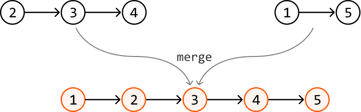

We can see what the entire process looks like in the diagram below:

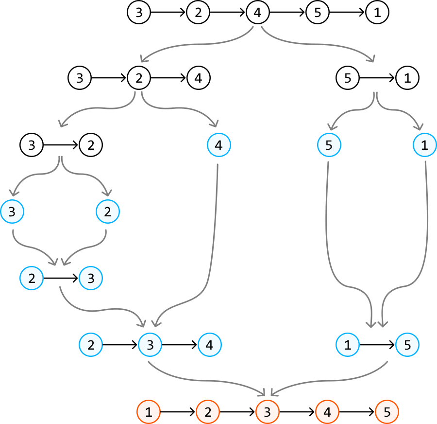

This is what this process looks like as pseudocode:

```python
def merge_sort(head):
    # Split the linked list into two halves.
    second_head = split_list(head)
    # Recursively sort both halves.
    first_half_sorted = merge_sort(head)
    second_half_sorted = merge_sort(second_head)
    # Merge the sorted sublists.
    return merge(first_half_sorted, second_half_sorted)

```

Let’s discuss in more detail how to split a linked list, and how to merge two sorted linked lists.

**Splitting the linked list in half**

To split a linked list in half, we need access to its middle node because the node next to the middle node can represent the head of the second linked list:

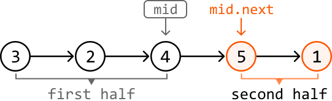

We can retrieve the middle node using the **fast and slow pointer** technique, as described in the *Linked List Midpoint* problem:

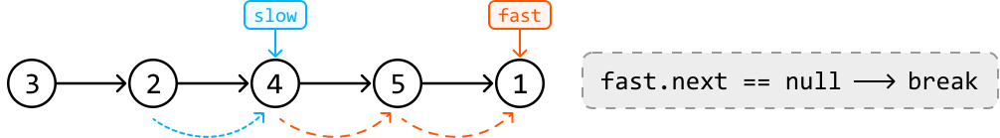

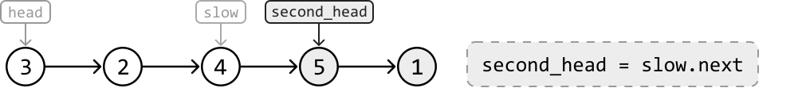

Then, we just need to disconnect the two halves by setting slow.next to null:

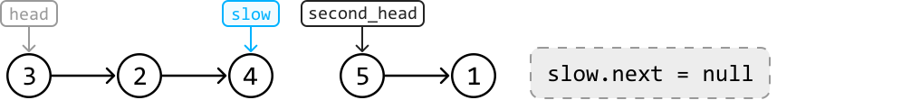

---

Note that when the linked list is of even length, there are two middle nodes. We want the slow pointer to stop at the first middle node so we can get the head of the second half more easily. As mentioned in *Linked List Midpoint*, we can achieve this by stopping the fast pointer when `fast.next.next` is null:

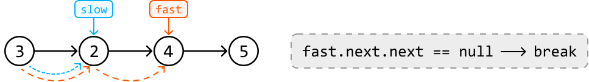

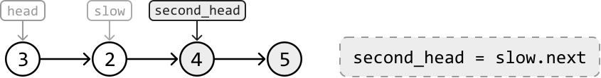

**Merging two sorted linked lists**

First, let's consider merging two linked lists, each containing a single node, meaning they’re both inherently sorted. We merge them by placing the smaller node first, followed by the other node:

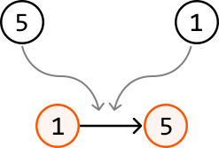

With that established, how would we merge two longer linked lists? To do this, we can set two pointers, one at the start of each linked list, then perform the following steps:

- Compare the nodes at each pointer and add the node with the smaller value to the merged linked list.

- Advance the pointer at that node with the smaller value to the next node in its linked list.

- Repeat the above two steps until we can no longer advance either pointer.

Before discussing the final step, observe how these steps are applied to the following two sorted linked lists. We can use a dummy node to point to the head of the merged linked list:

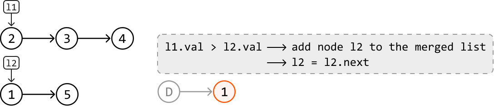

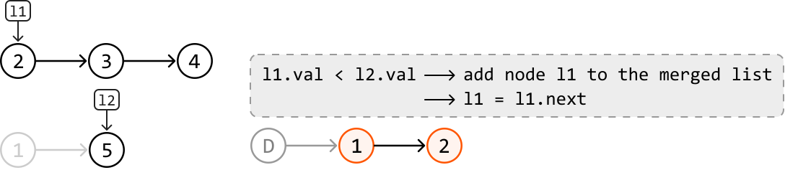

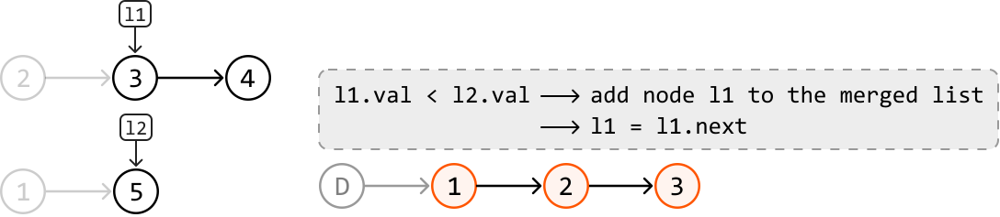

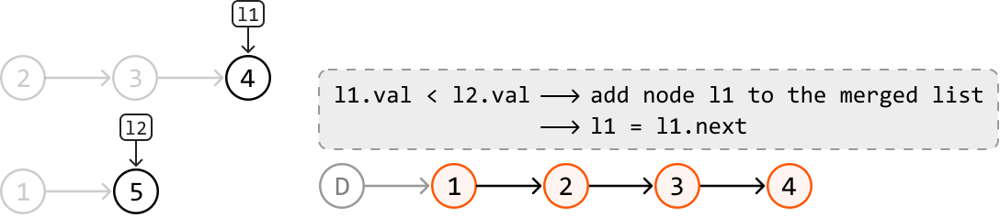

If one of the linked lists has been entirely added to the merged list, we can just add the rest of the other linked list to the merged list:

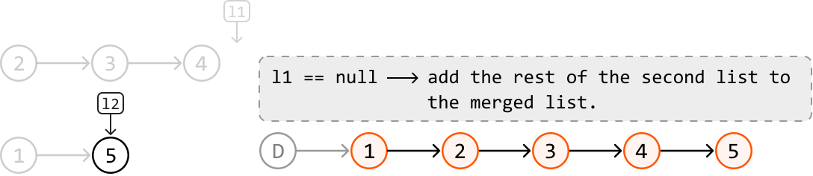

## Implementation

```python
from typing import List
    
def sort_linked_list(head: ListNode) -> ListNode:
    # If the linked list is empty or has only one element, it's already sorted.
    if not head or not head.next:
        return head
    # Split the linked list into halves using the fast and slow pointer technique.
    second_head = split_list(head)
    # Recursively sort both halves.
    first_half_sorted = sort_linked_list(head)
    second_half_sorted = sort_linked_list(second_head)
    # Merge the sorted sublists.
    return merge(first_half_sorted, second_half_sorted)
    
def split_list(head: ListNode) -> ListNode:
    slow = fast = head
    while fast.next and fast.next.next:
        slow = slow.next
        fast = fast.next.next
    second_head = slow.next
    slow.next = None
    return second_head
    
def merge(l1: ListNode, l2: ListNode) -> ListNode:
    dummy = ListNode(0)
    # This pointer will be used to append nodes to the tail of the merged linked list.
    tail = dummy
    # Continually append the node with the smaller value from each linked list to the
    # merged linked list until one of the linked lists has no more nodes to merge.
    while l1 and l2:
        if l1.val < l2.val:
            tail.next = l1
            l1 = l1.next
        else:
            tail.next = l2
            l2 = l2.next
        tail = tail.next
    # One of the two linked lists could still have nodes remaining. Attach those nodes
    # to the end of the merged linked list.
    tail.next = l1 or l2
    return dummy.next

```

```javascript
export function sort_linked_list(head) {
  // If the linked list is empty or has only one element, it's already sorted.
  if (!head || !head.next) return head
  // Split the linked list into halves using the fast and slow pointer technique.
  const secondHead = splitList(head)
  // Recursively sort both halves.
  const firstHalfSorted = sort_linked_list(head)
  const secondHalfSorted = sort_linked_list(secondHead)
  // Merge the sorted sublists.
  return merge(firstHalfSorted, secondHalfSorted)
}

function splitList(head) {
  let slow = head
  let fast = head
  while (fast.next && fast.next.next) {
    slow = slow.next
    fast = fast.next.next
  }
  const secondHead = slow.next
  slow.next = null
  return secondHead
}

function merge(l1, l2) {
  const dummy = new ListNode(0)
  let tail = dummy
  // Continually append the node with the smaller value from each linked list
  // to the merged linked list until one of them has no more nodes to merge.
  while (l1 && l2) {
    if (l1.val < l2.val) {
      tail.next = l1
      l1 = l1.next
    } else {
      tail.next = l2
      l2 = l2.next
    }
    tail = tail.next
  }
  // Attach remaining nodes, if any.
  tail.next = l1 || l2
  return dummy.next
}

```

```java
import core.LinkedList.ListNode;

public class Main {
    public static ListNode<Integer> sort_linked_list(ListNode<Integer> head) {
        // If the linked list is empty or has only one element, it's already sorted.
        if (head == null || head.next == null) {
            return head;
        }
        // Split the linked list into halves using the fast and slow pointer technique.
        ListNode<Integer> secondHead = splitList(head);
        // Recursively sort both halves.
        ListNode<Integer> firstHalfSorted = sort_linked_list(head);
        ListNode<Integer> secondHalfSorted = sort_linked_list(secondHead);
        // Merge the sorted sublists.
        return merge(firstHalfSorted, secondHalfSorted);
    }

    public static ListNode<Integer> splitList(ListNode<Integer> head) {
        ListNode<Integer> slow = head;
        ListNode<Integer> fast = head;
        while (fast.next != null && fast.next.next != null) {
            slow = slow.next;
            fast = fast.next.next;
        }
        ListNode<Integer> secondHead = slow.next;
        slow.next = null;
        return secondHead;
    }

    public static ListNode<Integer> merge(ListNode<Integer> l1, ListNode<Integer> l2) {
        ListNode<Integer> dummy = new ListNode<>(0);
        // This pointer will be used to append nodes to the tail of the merged linked list.
        ListNode<Integer> tail = dummy;
        // Continually append the node with the smaller value from each linked list to the
        // merged linked list until one of the linked lists has no more nodes to merge.
        while (l1 != null && l2 != null) {
            if (l1.val < l2.val) {
                tail.next = l1;
                l1 = l1.next;
            } else {
                tail.next = l2;
                l2 = l2.next;
            }
            tail = tail.next;
        }
        // One of the two linked lists could still have nodes remaining. Attach those nodes
        // to the end of the merged linked list.
        tail.next = (l1 != null) ? l1 : l2;
        return dummy.next;
    }
}

```

### Complexity Analysis

**Time complexity:** The time complexity of `sort_linked_list` is O(nlog(n)) because it uses merge sort. Here’s the breakdown:

- The linked list is recursively split until each sublist contains only one node. This splitting process happens about log₂(n) times because each split reduces the size of the linked list by half.

- At each level, we merge the split linked lists. Merging all elements at one level takes about n operations.

- Since there are log₂(n) levels of splitting and merging, and there are n operations at each level, the time complexity is O(nlog(n)).

**Space complexity:** The space complexity is O(log(n)) due to the recursive call stack, which can grow up to log₂(n) in height.

## Stable Sorting

Merge sort is a stable sorting algorithm. This is important in scenarios where the original order of equal elements must be preserved. For example, if we are sorting a list of nodes that share the same value, but have an additional attribute storing the time they were created, then it’s important for the relative order of these nodes to stay the same. Stability can be important for database systems; for instance, where stable sorting is required to maintain data integrity and consistency across multiple operations.