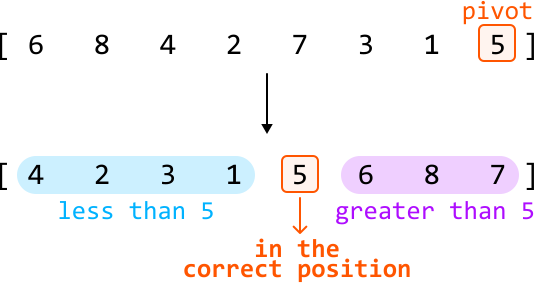
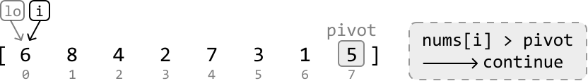
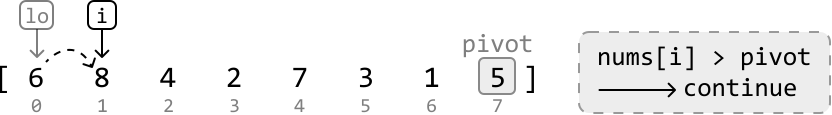
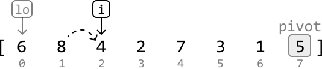
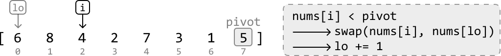
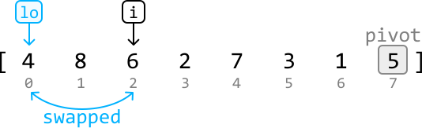
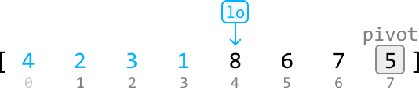
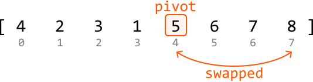
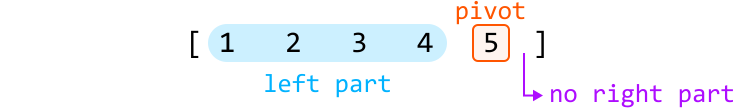
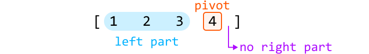

# Sort Array

Given an integer array, **sort the array** in ascending order.

#### Example:

```python
Input: nums = [6, 8, 4, 2, 7, 3, 1, 5]
Output: [1, 2, 3, 4, 5, 6, 7, 8]

```

## Intuition

This problem is quite open-ended because there are many sorting algorithms we could use to sort an array, each with its own pros and cons. In this explanation, we focus on the quicksort algorithm, which runs in O(nlog(n)) time on average, where n denotes the length of the array.

**Quicksort**

Conceptually, the goal of quicksort is to sort the array by **placing each number in its sorted position one at a time**. To correctly position a number, we move all numbers smaller than it to its left, and all numbers larger than it to its right. At each step, we call this number the pivot. We discuss how a pivot is selected later in the explanation.



This process is called **partitioning** because we’re dividing the array into two parts around the pivot:

- The left part with elements smaller than the pivot.

- The right part with elements larger than the pivot.

Note that neither the left nor the right part of the pivot value need to be sorted. All that matters is that the pivot is in the correct position.

After partitioning, we just need to **sort the left and right parts**. We can do this by recursively calling quicksort on both of them. This makes quicksort a divide and conquer strategy. The pseudocode for this is provided below:

```python
def quicksort(nums, left, right):
    # Partition the array and obtain the index of the pivot.
    pivot_index = partition(nums, left, right)
    # Sort the left and right parts.
    quicksort(nums, left, pivot_index - 1)
    quicksort(nums, pivot_index + 1, right)

```

Let’s discuss the partitioning process in more detail.

**Partitioning**

There are two primary steps to partitioning:

- Selecting the pivot.

- Rearranging the elements so elements smaller than the pivot are on its left, and elements larger than the pivot are on its right.

Selecting the pivot

We can actually choose any number as the pivot. The method of selecting a pivot can be optimized, which is discussed later, but for simplicity, we can choose the rightmost number as the pivot:

![Image represents a sequence of numbers, [6, 8, 4, 2, 7, 3, 1, 5], displayed horizontally.  Each number is positioned abo](./images/3ce58405_image-17-02-2-KADGY7NO.svg)

Rearranging elements around the pivot

Let’s see if we can do this in linear time without using extra space.

If we can ensure all numbers less than the pivot are placed to the left, then numbers greater than or equal to the pivot will consequently be placed to the right. This can be done using two pointers:

- One pointer at the left of the array (`lo`) to position the numbers less than the pivot.

- One pointer to iterate through the array (`i`), looking for numbers less than the pivot.

The main idea here is that whenever we encounter a number less than the pivot, swap it with `nums[lo]`.

---

Let's look at the example below to understand how this works. First, keep advancing `i` until we find a number less than the pivot:







---

Once a number less than the pivot is found, move it to the left by swapping it with `nums[lo]`. Then, increment lo so it points to where the next number less than the pivot should be placed:





![Image represents a visual depiction of a step in a sorting algorithm, likely Quicksort.  An array [4, 8, 6, 2, 7, 3, 1] ](./images/0d1a70fe_image-17-02-8-KEG32EBV.svg)

---

Continue this process until all numbers less than the pivot are on the left of the array:



---

The last step is to move the pivot to the correct position by swapping the pivot with `nums[lo]`:



## Implementation

```python
from typing import List
    
def sort_array(nums: List[int]) -> List[int]:
    quicksort(nums, 0, len(nums) - 1)
    return nums
    
def quicksort(nums: List[int], left: int, right: int) -> None:
    # Base case: if the subarray has 0 or 1 element, it's already sorted.
    if left >= right:
        return
    # Partition the array and retrieve the pivot index.
    pivot_index = partition(nums, left, right)
    # Call quicksort on the left and right parts to recursively sort them.
    quicksort(nums, left, pivot_index - 1)
    quicksort(nums, pivot_index + 1, right)
    
def partition(nums: List[int], left: int, right: int) -> int:
    pivot = nums[right]
    lo = left
    # Move all numbers less than the pivot to the left, which consequently positions
    # all numbers greater than or equal to the pivot to the right.
    for i in range(left, right):
        if nums[i] < pivot:
            nums[lo], nums[i] = nums[i], nums[lo]
            lo += 1
    # After partitioning, 'lo' will be positioned where the pivot should be. So, swap
    # the pivot number with the number at the 'lo' pointer.
    nums[lo], nums[right] = nums[right], nums[lo]
    return lo

```

```javascript
export function sort_array(nums) {
  quicksort(nums, 0, nums.length - 1)
  return nums
}

function quicksort(nums, left, right) {
  // Base case: if the subarray has 0 or 1 element, it's already sorted.
  if (left >= right) return
  // Partition the array and retrieve the pivot index.
  const pivotIndex = partition(nums, left, right)
  // Call quicksort on the left and right parts to recursively sort them.
  quicksort(nums, left, pivotIndex - 1)
  quicksort(nums, pivotIndex + 1, right)
}

function partition(nums, left, right) {
  const pivot = nums[right]
  let lo = left
  // Move all numbers less than the pivot to the left, which consequently positions
  // all numbers greater than or equal to the pivot to the right.
  for (let i = left; i < right; i++) {
    if (nums[i] < pivot) {
      ;[nums[lo], nums[i]] = [nums[i], nums[lo]]
      lo++
    }
  }
  // After partitioning, 'lo' will be positioned where the pivot should be. So, swap
  // the pivot number with the number at the 'lo' pointer.
  ;[nums[lo], nums[right]] = [nums[right], nums[lo]]
  return lo
}

```

```java
import java.util.ArrayList;

public class Main {
    public static ArrayList<Integer> sort_array(ArrayList<Integer> nums) {
        quicksort(nums, 0, nums.size() - 1);
        return nums;
    }

    public static void quicksort(ArrayList<Integer> nums, int left, int right) {
        // Base case: if the subarray has 0 or 1 element, it's already sorted.
        if (left >= right) {
            return;
        }
        // Partition the array and retrieve the pivot index.
        int pivotIndex = partition(nums, left, right);
        // Call quicksort on the left and right parts to recursively sort them.
        quicksort(nums, left, pivotIndex - 1);
        quicksort(nums, pivotIndex + 1, right);
    }

    public static int partition(ArrayList<Integer> nums, int left, int right) {
        int pivot = nums.get(right);
        int lo = left;
        // Move all numbers less than the pivot to the left, which consequently positions
        // all numbers greater than or equal to the pivot to the right.
        for (int i = left; i < right; i++) {
            if (nums.get(i) < pivot) {
                int temp = nums.get(lo);
                nums.set(lo, nums.get(i));
                nums.set(i, temp);
                lo++;
            }
        }
        // After partitioning, 'lo' will be positioned where the pivot should be. So, swap
        // the pivot number with the number at the 'lo' pointer.
        int temp = nums.get(lo);
        nums.set(lo, nums.get(right));
        nums.set(right, temp);
        return lo;
    }
}

```

### Complexity Analysis

**Time complexity:** The time complexity of `sort_array` can be analyzed in terms of the average and worst cases:

- Average case: O(nlog(n)). In the average case, quicksort effectively divides the array into two roughly equal parts after each partition, leading to a recursive tree with a depth of approximately log₂(n). For each of these levels, we perform a partition which takes O(n) time, resulting in a total time complexity of O(nlog(n)).

- Worst case: O(n^2). The worst-case scenario occurs when the pivot selection consistently results in extremely unbalanced partitions, such as when the smallest or largest element is always chosen as a pivot, which is explained in more detail in the optimization. Uneven partitioning can result in a recursive depth as deep as n. For each of these n levels of recursion, we perform a partition which takes O(n) time, resulting in a total time complexity of O(n^2).

**Space complexity:** The space complexity can also be analyzed in terms of the average and worst cases:

- Average case: O(log(n)). In the average case, the depth of the recursive call stack is approximately log₂(n).

- Worst case: O(n). In the worst case, the depth of the recursive call stack can be as deep as n.

## Optimization

As mentioned in the above complexity analysis, it’s possible for a worst-case time complexity of O(n^2) to occur. Let’s dive into when this can happen. Consider the following array, which is already sorted:

![Image represents a simple array or list data structure depicted using square brackets `[]` to enclose five integer eleme](./images/7a52b6ac_image-17-02-11-LVSDL4QB.svg)

If we perform quicksort on this array, we choose the rightmost element as the pivot and partition the other elements around this pivot. However, since this pivot is the largest element, there will be `n-1` elements less than the pivot and 0 elements greater than or equal to it:



This creates quite an uneven partition. When we call quicksort on the left part, the same imbalance will occur, but with a left part consisting of `n-2` elements:



Continuing this until the quicksort process is complete results in a recursion depth of n.

An uneven partition occurs when we choose an **extreme pivot**: one that’s larger or smaller than most other elements. Consistently picking an extreme pivot can occur when the array is sorted in increasing or decreasing order, or when there are many duplicates in the array.

To reduce the likelihood of choosing an extreme pivot, we can modify quicksort to choose a **random pivot** instead. There still remains a small chance of consistently picking an extreme pivot, but this outcome is no longer dependent on the order of the input array. A more detailed answer is discussed in the provided reference [[1]](https://cs.stackexchange.com/questions/7582/what-is-the-advantage-of-randomized-quicksort).

We can integrate this change into our current solution by randomly selecting an index and swapping its element with the rightmost element, before performing the partition. This way, we don't have to modify the partition function, as it uses the rightmost element:

```python
def quicksort_optimized(nums: List[int], left: int, right: int) -> None:
    if left >= right:
        return
    # Choose a pivot at a random index.
    random_index = random.randint(left, right)
    # Swap the randomly chosen pivot with the rightmost element to position the pivot
    # at the rightmost index.
    nums[random_index], nums[right] = nums[right], nums[random_index]
    pivot_index = partition(nums, left, right)
    quicksort_optimized(nums, left, pivot_index - 1)
    quicksort_optimized(nums, pivot_index + 1, right)

```

```javascript
function quicksort_optimized(nums, left, right) {
  if (left >= right) return
  // Choose a pivot at a random index.
  const randomIndex = Math.floor(Math.random() * (right - left + 1)) + left
  // Swap the randomly chosen pivot with the rightmost element to position the pivot
  // at the rightmost index.
  ;[nums[randomIndex], nums[right]] = [nums[right], nums[randomIndex]]
  const pivotIndex = partition(nums, left, right)
  quicksort_optimized(nums, left, pivotIndex - 1)
  quicksort_optimized(nums, pivotIndex + 1, right)
}

```

```java
public static void quicksort_optimized(ArrayList<Integer> nums, int left, int right) {
    if (left >= right) {
        return;
    }
    // Choose a pivot at a random index.
    Random rand = new Random();
    int randomIndex = rand.nextInt(right - left + 1) + left;
    // Swap the randomly chosen pivot with the rightmost element to position the pivot
    // at the rightmost index.
    int temp = nums.get(randomIndex);
    nums.set(randomIndex, nums.get(right));
    nums.set(right, temp);
    int pivotIndex = partition(nums, left, right);
    quicksort_optimized(nums, left, pivotIndex - 1);
    quicksort_optimized(nums, pivotIndex + 1, right);
}

```

## Interview Follow-Up

Let’s say the interviewer introduces the following constraints to the initial sorting problem:

- The input array does not contain negative values.

- All values in the input array are less than or equal to 10^3.

Does our approach to the problem change, and should we still use quicksort? Considering that all values in our array now fall within the limited range of [0, 10^3], a counting sort approach becomes appropriate.

**Counting sort**

Counting sort is a non-comparison-based sorting algorithm that works by counting the number of occurrences of each element in the array, then using these counts to place each element in its correct sorted position:


We can do this in two steps:

- Count occurrences: create a counts array, where each of its indexes represents an element from the original array. Increment the value at each index based on how many times the corresponding element appears in the original array.

- Build sorted array (`res`): iterate through each index of the counts array and add that index (`i`) to the sorted array as many times as its value (`counts[i`]) indicates.

Counting sort is efficient here because we know the largest possible number in the array is at most 10^3, which means our counts array will have a maximum size of 10^3 + 1. However, if this problem constraint is not specified and the maximum value in the array may be very large, then a counting sort solution might not be appropriate, due to the potentially large size of the counts array.

## Implementation

Note that there’s another common method for implementing counting sort, which is detailed in the reference provided [[2]](https://en.wikipedia.org/wiki/Counting_sort).

```python
from typing import List
    
def sort_array_counting_sort(nums: List[int]) -> List[int]:
    if not nums:
        return []
    res = []
    # Count occurrences of each element in 'nums'.
    counts = [0] * (max(nums) + 1)
    for num in nums:
        counts[num] += 1
    # Build the sorted array by appending each index 'i' to it a total of 'counts[i]'
    # times.
    for i, count in enumerate(counts):
        res.extend([i] * count)
    return res

```

```javascript
export function sort_array_counting_sort(nums) {
  if (nums.length === 0) return []
  const res = []
  const maxVal = Math.max(...nums)
  const counts = new Array(maxVal + 1).fill(0)
  // Count occurrences of each element in 'nums'.
  for (const num of nums) {
    counts[num]++
  }
  // Build the sorted array.
  for (let i = 0; i < counts.length; i++) {
    for (let j = 0; j < counts[i]; j++) {
      res.push(i)
    }
  }
  return res
}

```

```java
import java.util.ArrayList;
import java.util.Collections;

public class Main {
    public static ArrayList<Integer> sort_array_counting_sort(ArrayList<Integer> nums) {
        if (nums == null || nums.isEmpty()) {
            return new ArrayList<>();
        }
        ArrayList<Integer> res = new ArrayList<>();
        // Count occurrences of each element in 'nums'.
        int max = Collections.max(nums);
        int[] counts = new int[max + 1];
        for (int num : nums) {
            counts[num]++;
        }
        // Build the sorted array by appending each index 'i' to it a total of 'counts[i]'
        // times.
        for (int i = 0; i < counts.length; i++) {
            for (int j = 0; j < counts[i]; j++) {
                res.add(i);
            }
        }
        return res;
    }
}

```

### Complexity Analysis

**Time complexity:** The time complexity of `sort_array_counting_sort` is O(n+k), where k denotes the maximum value of `nums`. This is because it takes O(n) time to count the occurrences of each element and O(k) time to build the sorted array.

**Space complexity:** The space complexity is O(n+k), since the `res` array occupies O(n) space, and the counts array takes up O(k) space. Note that `res` is considered in the space complexity, as counting sort is not an in-place sorting algorithm requiring an additional array to store the sorted result.

## Interview Tip

*Tip: Quicksort is useful for in-place sorting.*

While quicksort isn’t a stable sorting algorithm, it is an in-place sorting algorithm, meaning it requires less additional space compared to an algorithm such as merge sort, which takes O(n) space when used to sort an array.