# Kth Largest Integer

Return the **`kth` largest integer** in an array.

#### Example:

```python
Input: nums = [5, 2, 4, 3, 1, 6], k = 3
Output: 4

```

#### Constraints:

- The array contains no duplicates.

- The array contains at least one element.

- `1 ≤ k ≤ n`, where `n` denotes the length of the array.

## Intuition - Min-Heap

A straightforward solution to this problem is to sort the array in reverse order and return the number at the (`k - 1`)th index:

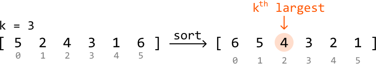

This solution takes O(nlog(n)) time, but as we only need the kth largest integer, sorting all the elements in the input array might not be necessary. Let’s explore some solutions which take this into account.

An interesting thing to realize is that if we know what the top k largest integers are, we’d know that the smallest of these would be the kth largest integer:

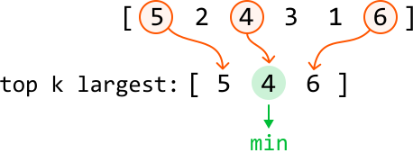

This leads to the idea that instead of sorting the entire array, we can keep track of the top k largest integers in the array. Is there a way to maintain the top k largest integers, while having access to the smallest of these integers?

A min-heap seems like it should work well for this purpose because it provides efficient access to the smallest element. Let’s explore how to use it to maintain the top k integers in the array.

---

Consider the below example with k = 3. Let’s begin by pushing the first k integers to the heap:

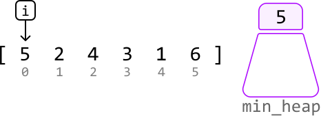

---

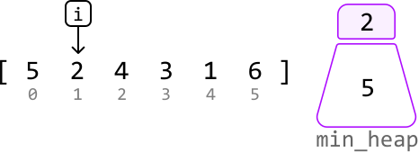

---

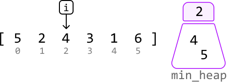

---

We shouldn’t immediately push the next element, 3, in the heap because the heap already contains k integers. This gives us a choice:

- Skip 3, or:

- Remove an integer from the heap and push 3 in.

The smallest integer in the heap is 2. Integer 3 is more likely to belong in the top k integers than 2 is, so let’s pop 2 from the heap and push 3 in:

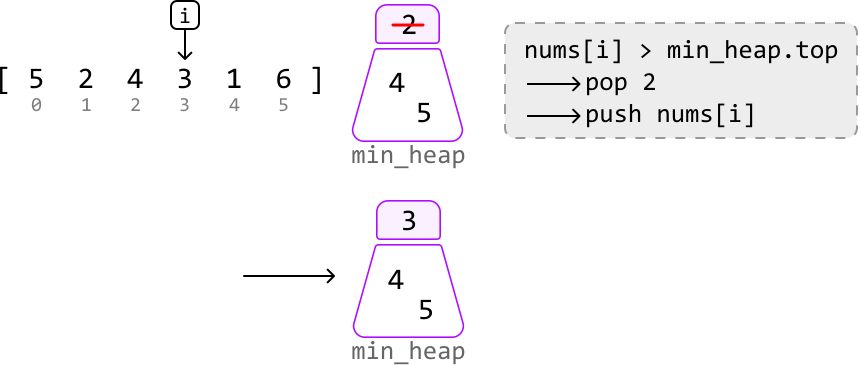

---

The next integer is 1, which is smaller than the smallest integer in the heap. So, we know it’s not among the top k integers:

![Image represents a step in an algorithm, likely involving a min-heap data structure.  A numbered array `[5 2 4 3 1 6]` i](./images/8404e38b_image-17-03-7-B534DCET.svg)

---

The final integer is 6. It’s larger than the smallest integer in the heap. So, let’s pop off the top of the heap and push in 6:

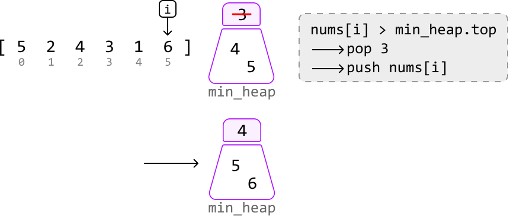

---

At this point, the k integers in the heap represent the top k largest integers from the array, with the smallest of these integers located at the top of the heap. This smallest value is the kth largest integer in the entire array, so we can just return this integer from the top of the heap:

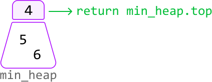

## Implementation - Min-Heap

```python
from typing import List
import heapq
    
def kth_largest_integer_min_heap(nums: List[int], k: int) -> int:
    min_heap = []
    heapq.heapify(min_heap)
    for num in nums:
        # Ensure the heap has at least 'k' integers.
        if len(min_heap) < k:
            heapq.heappush(min_heap, num)
        # If 'num' is greater than the smallest integer in the heap, pop off this
        # smallest integer from the heap and push in 'num'.
        elif num > min_heap[0]:
            heapq.heappop(min_heap)
            heapq.heappush(min_heap, num)
    return min_heap[0]

```

```javascript
import { MinPriorityQueue } from './helpers/heap/MinPriorityQueue.js'

export function kth_largest_integer_min_heap(nums, k) {
  // Create a min-heap with a simple comparator
  const minHeap = new MinPriorityQueue((n) => n)
  for (const num of nums) {
    // Ensure the heap has at least 'k' integers.
    if (minHeap.size() < k) {
      minHeap.enqueue(num)
    } else if (num > minHeap.front()) {
      // If 'num' is greater than the smallest integer in the heap,
      // replace the smallest with 'num'.
      minHeap.dequeue()
      minHeap.enqueue(num)
    }
  }
  // The kth largest element is the smallest in the heap now.
  return minHeap.front()
}

```

```java
import java.util.ArrayList;
import java.util.PriorityQueue;

public class Main {
    public Integer kth_largest_integer_min_heap(ArrayList<Integer> nums, int k) {
        PriorityQueue<Integer> minHeap = new PriorityQueue<>();
        for (int num : nums) {
            // Ensure the heap has at least 'k' integers.
            if (minHeap.size() < k) {
                minHeap.add(num);
            }
            // If 'num' is greater than the smallest integer in the heap, pop off this
            // smallest integer from the heap and push in 'num'.
            else if (num > minHeap.peek()) {
                minHeap.poll();
                minHeap.add(num);
            }
        }
        return minHeap.peek();
    }
}

```

### Complexity Analysis

**Time complexity:** The time complexity of `kth_largest_integer_min_heap` is O(nlog(k)) because for each integer, we perform at most one `push` and `pop` operation on the min-heap, which has a size no larger than k. Each heap operation takes O(log(k)) time.

**Space complexity:** The space complexity is O(k) because the heap can grow to a size of k.

## Intuition - Quickselect

The previous approach involved keeping track of the k largest integers to identify the kth largest integer. This effectively required us to keep these k values partially sorted through the use of a heap. But what if there’s a way to position only the kth largest value in its expected sorted position, without sorting the other numbers?

![Image represents a comparison of three different approaches to sorting an array.  The input array `[5 2 4 3 1 6]` is sho](./images/f58991d2_image-17-03-10-PL77Z6CU.svg)

**Quickselect** can be used to achieve this.

Quickselect is an algorithm that **leverages the partition step of quicksort**, which positions a value in its sorted position. Quickselect is generally used to find the kth *smallest* element, whereas, in this problem, we're asked to find the kth *largest* element. To utilize quickselect for this purpose, we can instead **find the (n - k)th smallest integer**, which is equivalent to finding the kth largest element:


Now, let’s dive into how quickselect works. To understand quickselect, we recommend you study the quicksort solution provided in the *Sort Array* problem.

Quickselect works identically to quicksort in that we:

1. Choose a pivot.

2. Partition the array into two parts by moving elements around the pivot so that:

- Numbers less than the pivot are moved to its left.

- Numbers greater than the pivot are moved to its right.

The primary difference between these two algorithms lies in the recursion step:

- In quicksort, we recursively process both the left and right parts.

- In quickselect, **we only need to recursively process one of these parts**.

Let’s explore why only one part is chosen.

**Deciding which part of a partition to process**

Suppose we pick a random number as a pivot. After performing a partition, this pivot will be positioned correctly. From here, there are three possibilities for the position of the (`n - k`)th smallest integer:

- If the pivot is positioned before index `n - k`, it means the (`n - k`)th smallest integer must be somewhere to the right of the pivot. So, perform quickselect on the right part:
  
  
  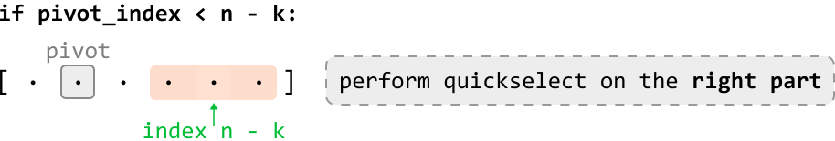

- If the pivot is positioned after index `n - k`, perform quickselect on the left part:
  
  
  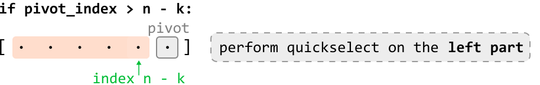

- If the pivot is positioned exactly at index `n - k`, the pivot itself is the (`n - k`)th smallest integer. So, we just return the pivot:
  
  
  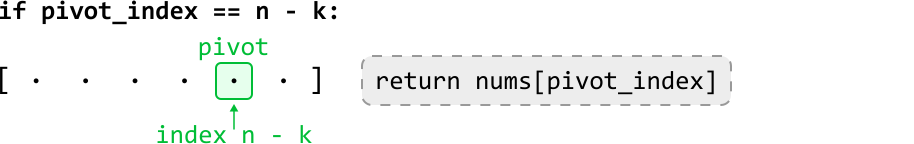

## Implementation - Quickselect

Note that the partition function in this implementation is identical to the partition function in *Sort Array*. Also, this implementation selects a random pivot, as per the optimization discussed in *Sort Array*.

```python
import random
from typing import List
    
def kth_largest_integer_quickselect(nums: List[int], k: int) -> int:
    return quickselect(nums, 0, len(nums) - 1, k)
    
def quickselect(nums: List[int], left: int, right: int, k: int) -> None:
    n = len(nums)
    if left >= right:
        return nums[left]
    random_index = random.randint(left, right)
    nums[random_index], nums[right] = nums[right], nums[random_index]
    pivot_index = partition(nums, left, right)
    # If the pivot comes before 'n - k', the ('n - k')th smallest integer is somewhere
    # to its right. Perform quickselect on the right part.
    if pivot_index < n - k:
        return quickselect(nums, pivot_index + 1, right, k)
    # If the pivot comes after 'n - k', the ('n - k')th smallest integer is somewhere
    # to its left. Perform quickselect on the left part.
    elif pivot_index > n - k:
        return quickselect(nums, left, pivot_index - 1, k)
    # If the pivot is at index 'n - k', it's the ('n - k')th smallest integer.
    else:
        return nums[pivot_index]
    
def partition(nums: List[int], left: int, right: int) -> int:
    pivot = nums[right]
    lo = left
    for i in range(left, right):
        if nums[i] < pivot:
            nums[lo], nums[i] = nums[i], nums[lo]
            lo += 1
    nums[lo], nums[right] = nums[right], nums[lo]
    return lo

```

```javascript
/**
 * @param {number[]} nums - Array of integers
 * @param {number} k - The kth largest integer to find
 * @returns {number}
 */
export function kth_largest_integer(nums, k) {
  return quickselect(nums, 0, nums.length - 1, k)
}

function quickselect(nums, left, right, k) {
  const n = nums.length
  if (left >= right) {
    return nums[left]
  }
  const randomIndex = Math.floor(Math.random() * (right - left + 1)) + left
  ;[nums[randomIndex], nums[right]] = [nums[right], nums[randomIndex]]
  const pivotIndex = partition(nums, left, right)
  // If the pivot comes before 'n - k', the ('n - k')th smallest is to the right.
  if (pivotIndex < n - k) {
    return quickselect(nums, pivotIndex + 1, right, k)
  }
  // If the pivot comes after 'n - k', it's to the left.
  else if (pivotIndex > n - k) {
    return quickselect(nums, left, pivotIndex - 1, k)
  }
  // If the pivot is at 'n - k', it's the answer.
  else {
    return nums[pivotIndex]
  }
}

function partition(nums, left, right) {
  const pivot = nums[right]
  let lo = left
  for (let i = left; i < right; i++) {
    if (nums[i] < pivot) {
      ;[nums[i], nums[lo]] = [nums[lo], nums[i]]
      lo++
    }
  }
  ;[nums[lo], nums[right]] = [nums[right], nums[lo]]
  return lo
}

```

```java
import java.util.ArrayList;
import java.util.Random;

public class Main {
    public int kth_largest_integer_quickselect(ArrayList<Integer> nums, int k) {
        return quickselect(nums, 0, nums.size() - 1, k);
    }

    public int quickselect(ArrayList<Integer> nums, int left, int right, int k) {
        int n = nums.size();
        if (left >= right) {
            return nums.get(left);
        }
        Random rand = new Random();
        int randomIndex = rand.nextInt(right - left + 1) + left;
        int temp = nums.get(randomIndex);
        nums.set(randomIndex, nums.get(right));
        nums.set(right, temp);
        int pivotIndex = partition(nums, left, right);
        // If the pivot comes before 'n - k', the ('n - k')th smallest integer is somewhere
        // to its right. Perform quickselect on the right part.
        if (pivotIndex < n - k) {
            return quickselect(nums, pivotIndex + 1, right, k);
        }
        // If the pivot comes after 'n - k', the ('n - k')th smallest integer is somewhere
        // to its left. Perform quickselect on the left part.
        else if (pivotIndex > n - k) {
            return quickselect(nums, left, pivotIndex - 1, k);
        }
        // If the pivot is at index 'n - k', it's the ('n - k')th smallest integer.
        else {
            return nums.get(pivotIndex);
        }
    }

    public int partition(ArrayList<Integer> nums, int left, int right) {
        int pivot = nums.get(right);
        int lo = left;
        for (int i = left; i < right; i++) {
            if (nums.get(i) < pivot) {
                int temp = nums.get(lo);
                nums.set(lo, nums.get(i));
                nums.set(i, temp);
                lo++;
            }
        }
        int temp = nums.get(lo);
        nums.set(lo, nums.get(right));
        nums.set(right, temp);
        return lo;
    }
}

```

### Complexity Analysis

**Time complexity:** The time complexity of `kth_largest_integer_quickselect` can be analyzed in terms of the average and worst cases:

- Average case: O(n). In the average case, quickselect partitions the array and reduces the problem size by approximately half each time by performing a recursive call on only one part of each partition. A linear partition is performed during each of these recursive calls. This results in a total time complexity of O(n) + O(n/2) + O(n/4) + O(n/8) + \dots, which is a geometric series that sums to O(n).

- Worst case: O(n^2). The worst-case scenario occurs when the pivot selection consistently results in extremely unbalanced partitions. This can result in the problem size only being reduced by one element after each partition, leading to a total time complexity of O(n)+O(n-1)+O(n-2)+…, which can be simplified to an O(n^2) time complexity.

**Space complexity:** The space complexity can also be analyzed in terms of the average and worst cases:

- Average Case: O(log(n)). In the average case, the depth of the recursive call stack is approximately log₂(n).

- Worst Case: O(n). In the worst case, the depth of the recursive call stack can be as deep as n.