# Zero Striping

For each zero in an `m x n` matrix, set its entire row and column to zero **in place**.

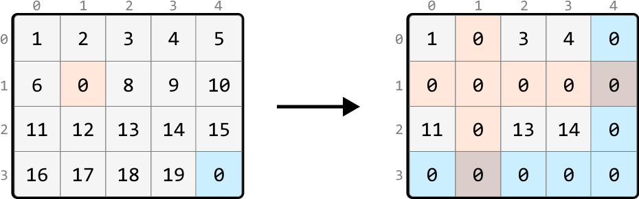

## Intuition - Hash Sets

A brute-force solution involves recording the positions of all 0s initially in the matrix and, for each of these 0s, iterating over their row and column to set them to zero. However, imagine an input array that's filled with many zeros. In the worst case, iterating over every row and column for each zero will take O(m· n(m+n)), where m · n denotes the number of 0s, and (m+n) represents the total number of cells in a row and column combined. This approach is quite inefficient, so let’s look for a better solution.

Imagine any cell in the matrix. After the matrix is transformed, this cell will either retain its original value, or become zero. Is there a way to tell if a cell is going to become zero?

> 
> 
> The key observation is that if a cell is in a row or column containing a zero, that cell will become zero.
> 
> 

We could search a cell’s row and column to check if they contain a zero, meaning each search would take O(m+n) time. But it would be more efficient if we had a way to check this in constant time, and this is where **hash sets** would be useful. If we create two hash sets – one to track all the rows containing a zero and another to track all the columns containing a zero – we can determine if a specific cell's row or column contains a zero in O(1) time.

With these hash sets created, the next step is to populate them. As we iterate through the matrix, when encountering a cell containing zero, we:

- Add its row index to the row hash set (`zero_rows`).

- Add its column index to the column hash set (`zero_cols`).

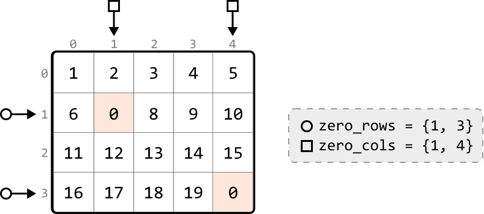

Next, we identify the cells whose row or column indexes are present in the respective hash sets, and change their values to zero. Let’s look at how this works with a few examples:

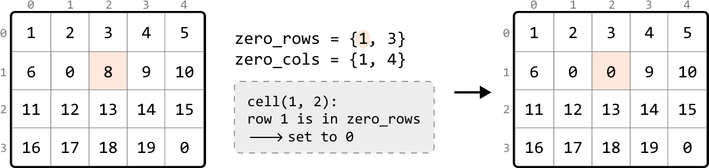

---

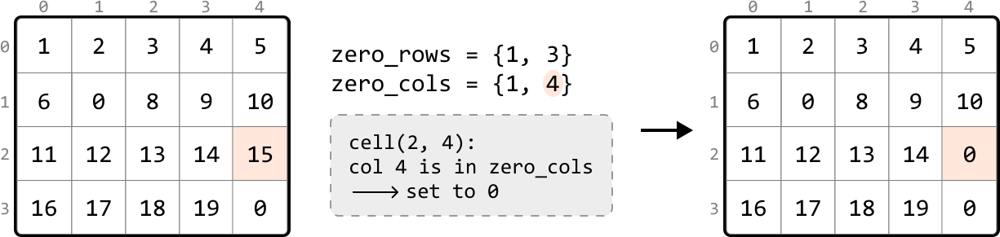

---

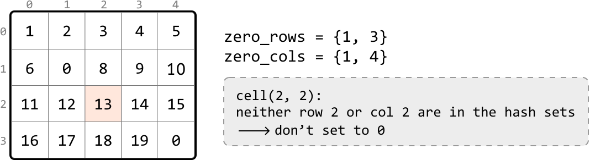

This provides a general strategy:

- In one pass of the matrix, identify each cell containing a zero and add its row and column indexes to the `zero_rows` and `zero_cols` hash sets, respectively.

- In a second pass, set any cell to zero if its row index is in `zero_rows` or its column index is in `zero_cols`.

## Implementation - Hash Sets

```python
from typing import List
    
def zero_striping_hash_sets(matrix: List[List[int]]) -> None:
    if not matrix or not matrix[0]:
        return
    m, n = len(matrix), len(matrix[0])
    zero_rows, zero_cols = set(), set()
    # Pass 1: Traverse through the matrix to identify the rows and columns
    # containing zeros and store their indexes in the appropriate hash sets.
    for r in range(m):
        for c in range(n):
            if matrix[r][c] == 0:
                zero_rows.add(r)
                zero_cols.add(c)
    # Pass 2: Set any cell in the matrix to zero if its row index is in 'zero_rows'
    # or its column index is in 'zero_cols’.
    for r in range(m):
        for c in range(n):
            if r in zero_rows or c in zero_cols:
                matrix[r][c] = 0

```

```javascript
export function zero_striping_hash_sets(matrix) {
  if (!matrix || !matrix.length || !matrix[0].length) {
    return
  }
  const m = matrix.length
  const n = matrix[0].length
  const zeroRows = new Set()
  const zeroCols = new Set()
  // Pass 1: Traverse through the matrix to identify the rows and columns
  // containing zeros and store their indexes in the appropriate hash sets.
  for (let r = 0; r < m; r++) {
    for (let c = 0; c < n; c++) {
      if (matrix[r][c] === 0) {
        zeroRows.add(r)
        zeroCols.add(c)
      }
    }
  }
  // Pass 2: Set any cell in the matrix to zero if its row index is in 'zeroRows'
  // or its column index is in 'zeroCols'.
  for (let r = 0; r < m; r++) {
    for (let c = 0; c < n; c++) {
      if (zeroRows.has(r) || zeroCols.has(c)) {
        matrix[r][c] = 0
      }
    }
  }
}

```

### Complexity Analysis

**Time complexity:** The time complexity of `zero_striping_hash_sets` is O(m· n) because we perform two passes over the matrix and perform constant-time operations in each pass.

**Space complexity:** The space complexity is O(m+n) due to the growth of the hash sets used to track zeros: one hash set scales with the number of rows, and the other scales with the number of columns. In the worst case, every row and column has a zero.

## Intuition - In-place Zero Tracking

The previous solution was time efficient mainly due to the use of hash sets. However, this came at the cost of extra space used to store the hash set values. Is there an alternate way to keep track of which rows and columns contain a zero?

A key observation is that if a row or column contains a zero, all the cells in that row or column will be eventually replaced by zero. Therefore, there's no need to preserve the values in these rows or columns.

A strategy we can try is to **use the first row and column (row 0 and column 0) as markers to track which rows and columns contain zeros.**

To understand how this would work, consider the example below. For rows, we can use the first column to **mark** the rows that contain a zero. Specifically, this means if any cell in a row is zero, we set the corresponding cell in the first column to zero. This zero in the first column serves as a marker to indicate the entire row should eventually be set to zeros.

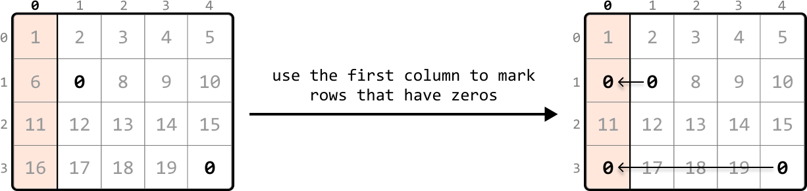

---

Similarly to how we marked rows, we can mark columns containing zeros using the first row:

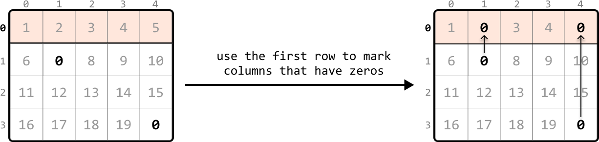

---

To set markers for the first row and first column, we can begin searching the rest of the matrix, excluding the first row and first column, for any zero-valued cells. Let’s refer to this part of the matrix as the ‘submatrix.’ When we find a zero, we set the corresponding cell in the first row and column to zero. Scanning every cell in the submatrix for zeros allows us to set markers in the first row and first column:

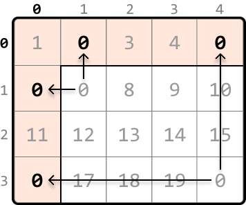

---

Now, we should start converting cells in the submatrix to zeros based on their corresponding markers. We can assess any cell in the submatrix by checking:

- Whether its corresponding marker in the first column is zero.

- Whether its corresponding marker in the first row is zero.

If either of these conditions are met, we should set that cell’s value to zero, as shown below:

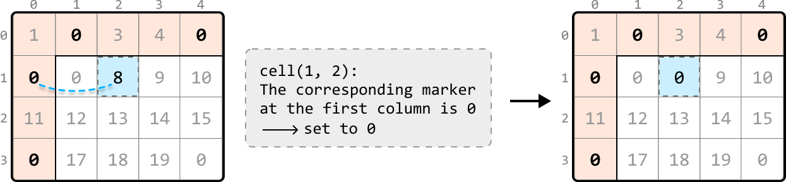

To update this submatrix, we can iterate from the second row and column and update cell values based on the logic we just mentioned:

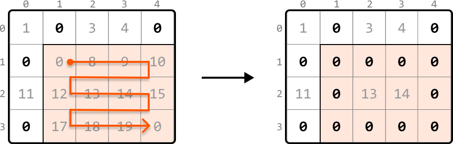

**Handling zeros in the first row and column**

After completing the previous step, there’s just one issue to address. What if the first row or column originally had a zero, like in the example below?

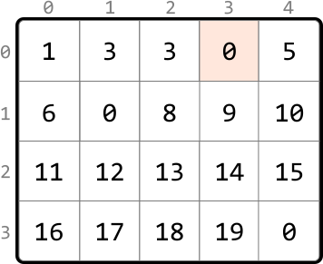

Here, we can’t distinguish which zero in the first row was originally present, or resulted from being used as a marker. This means we won’t know if the first row should be zeroed:

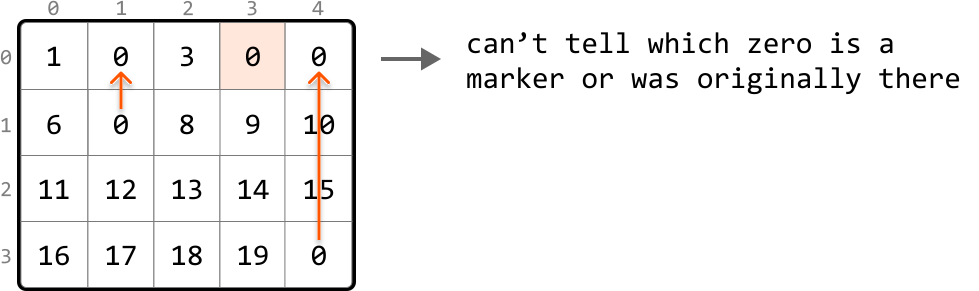

The remedy for this is to **flag whether a zero exists in the first row or first column *before* using them as markers**.

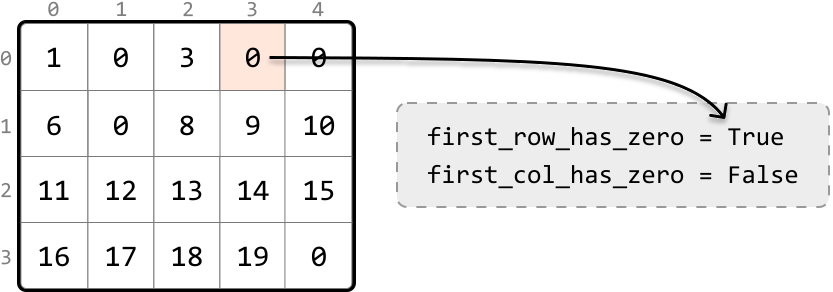

Once we've filled the first row and column with markers, as shown in matrix X below, and set the appropriate cell values in the submatrix to zero, as shown in matrix Y, we then evaluate the first row and column separately. The first row was initially marked as containing a zero, so we convert all cells in the first row to zero (matrix Z). The first column was not flagged for having a zero initially, so it remains unaltered at this step:

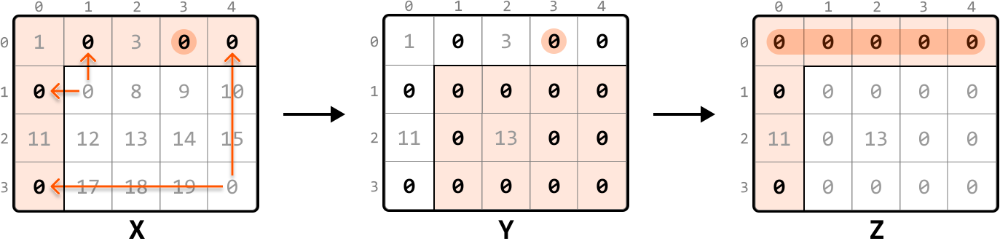

**In-place zero-marking strategy**

Let's summarize the above approach into the following steps:

- Use a flag to indicate if the first row initially contains any zero.

- Use a flag to indicate if the first column initially contains any zero.

- Traverse the submatrix, setting zeros in the first row and column to serve as markers for rows and columns that contain zeros.

- Apply zeros based on markers: iterate through the submatrix that starts from the second row and second column. For each cell, check if its corresponding marker in the first row or column is marked with a zero. If so, set that element to zero.

- If the first row was initially marked as containing a zero, set all elements in the first row to zero.

- If the first column was initially marked as having a zero, set all elements in the first column to zero.

## Implementation - In-place Zero Tracking

```python
from typing import List
   
def zero_striping(matrix: List[List[int]]) -> None:
   if not matrix or not matrix[0]:
       return
   m, n = len(matrix), len(matrix[0])
   # Check if the first row initially contains a zero.
   first_row_has_zero = False
   for c in range(n):
       if matrix[0][c] == 0:
           first_row_has_zero = True
           break
   # Check if the first column initially contains a zero.
   first_col_has_zero = False
   for r in range(m):
       if matrix[r][0] == 0:
           first_col_has_zero = True
           break
   # Use the first row and column as markers. If an element in the submatrix is zero,
   # mark its corresponding row and column in the first row and column as 0.
   for r in range(1, m):
       for c in range(1, n):
           if matrix[r][c] == 0:
               matrix[0][c] = 0
               matrix[r][0] = 0
   # Update the submatrix using the markers in the first row and column.
   for r in range(1, m):
       for c in range(1, n):
           if matrix[0][c] == 0 or matrix[r][0] == 0:
               matrix[r][c] = 0
   # If the first row had a zero initially, set all elements in the first row to
   # zero.
   if first_row_has_zero:
       for c in range(n):
           matrix[0][c] = 0
   # If the first column had a zero initially, set all elements in the first column
   # to zero.
   if first_col_has_zero:
       for r in range(m):
           matrix[r][0] = 0

```

```javascript
export function zero_striping(matrix) {
  if (!matrix || !matrix.length || !matrix[0].length) {
    return
  }
  const m = matrix.length
  const n = matrix[0].length
  // Check if the first row initially contains a zero.
  let firstRowHasZero = false
  for (let c = 0; c < n; c++) {
    if (matrix[0][c] === 0) {
      firstRowHasZero = true
      break
    }
  }
  // Check if the first column initially contains a zero.
  let firstColHasZero = false
  for (let r = 0; r < m; r++) {
    if (matrix[r][0] === 0) {
      firstColHasZero = true
      break
    }
  }
  // Use the first row and column as markers. If an element in the submatrix is zero,
  // mark its corresponding row and column in the first row and column as 0.
  for (let r = 1; r < m; r++) {
    for (let c = 1; c < n; c++) {
      if (matrix[r][c] === 0) {
        matrix[0][c] = 0
        matrix[r][0] = 0
      }
    }
  }
  // Update the submatrix using the markers in the first row and column.
  for (let r = 1; r < m; r++) {
    for (let c = 1; c < n; c++) {
      if (matrix[0][c] === 0 || matrix[r][0] === 0) {
        matrix[r][c] = 0
      }
    }
  }
  // If the first row had a zero initially, set all elements in the first row to
  // zero.
  if (firstRowHasZero) {
    for (let c = 0; c < n; c++) {
      matrix[0][c] = 0
    }
  }
  // If the first column had a zero initially, set all elements in the first column
  // to zero.
  if (firstColHasZero) {
    for (let r = 0; r < m; r++) {
      matrix[r][0] = 0
    }
  }
}

```

```java
import java.util.ArrayList;

class UserCode {
    public static void zeroStriping(ArrayList<ArrayList<Integer>> matrix) {
        if (matrix == null || matrix.size() == 0 || matrix.get(0).size() == 0) {
            return;
        }
        int m = matrix.size();
        int n = matrix.get(0).size();
        // Check if the first row initially contains a zero.
        boolean firstRowHasZero = false;
        for (int c = 0; c < n; c++) {
            if (matrix.get(0).get(c) == 0) {
                firstRowHasZero = true;
                break;
            }
        }
        // Check if the first column initially contains a zero.
        boolean firstColHasZero = false;
        for (int r = 0; r < m; r++) {
            if (matrix.get(r).get(0) == 0) {
                firstColHasZero = true;
                break;
            }
        }
        // Use the first row and column as markers. If an element in the submatrix is zero,
        // mark its corresponding row and column in the first row and column as 0.
        for (int r = 1; r < m; r++) {
            for (int c = 1; c < n; c++) {
                if (matrix.get(r).get(c) == 0) {
                    matrix.get(0).set(c, 0);
                    matrix.get(r).set(0, 0);
                }
            }
        }
        // Update the submatrix using the markers in the first row and column.
        for (int r = 1; r < m; r++) {
            for (int c = 1; c < n; c++) {
                if (matrix.get(0).get(c) == 0 || matrix.get(r).get(0) == 0) {
                    matrix.get(r).set(c, 0);
                }
            }
        }
        // If the first row had a zero initially, set all elements in the first row to zero.
        if (firstRowHasZero) {
            for (int c = 0; c < n; c++) {
                matrix.get(0).set(c, 0);
            }
        }
        // If the first column had a zero initially, set all elements in the first column to zero.
        if (firstColHasZero) {
            for (int r = 0; r < m; r++) {
                matrix.get(r).set(0, 0);
            }
        }
    }
}

```

### Complexity Analysis

**Time complexity:** The time complexity of `zero_striping` is O(m· n). Here’s why:

- Checking the first row for zeros takes O(m) time, and checking the first column takes O(n) time.

- Then, we perform two passes of the entire matrix, one to mark 0s and another to update the matrix based on those markers. Each pass takes O(m· n) time.

- Finally, we iterate through the first row and first column up to once each, which takes O(m) and O(n) time, respectively.

Therefore, the overall time complexity is O(m)+O(n)+O(m· n)=O(m· n).

**Space complexity:** The space complexity is O(1) because we use the first row and column as markers to track which rows and columns contain zeros, instead of using auxiliary data structures.