# Dutch National Flag

Given an array of 0s, 1s, and 2s representing red, white, and blue, respectively, sort the array in place so that it resembles the Dutch national flag, with all **reds** (0s) coming first, followed by **whites** (1s), and finally **blues** (2s).

#### Example:

```python
Input: nums = [0, 1, 2, 0, 1, 2, 0]
Output: [0, 0, 0, 1, 1, 2, 2]

```

## Intuition

This problem is just asking us to sort three numbers in ascending order. A straightforward solution would be to use an in-built sorting function. However, this is an O(nlog(n)) approach, where n denotes the length of the array. However, this isn’t taking advantage of an important problem constraint: there are only three types of elements in the array.

To sort these numbers, we essentially want to position all 0s to the left, all 2s to the right, and any 1s in between. A key observation is that if we place the 0s and the 2s in their correct positions, the 1s will automatically be positioned correctly:

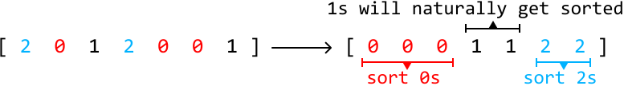

This allows us to focus on only positioning two numbers.

One strategy we could use is to iterate through the array and move any 0s we encounter to the left, and any 2s we encounter to the right.

We can set a left pointer to move any 0s we encounter to the left, and a right pointer to move any 2s to the right. To iterate through the array, we can use a separate pointer, `i`:

- When we encounter a 0 at index `i`, swap it with `nums[left]`.

- When we encounter a 2 at index `i`, swap it with `nums[right]`.

To understand how we should adjust these pointers after each swap, let’s use the following example:

![Image represents a one-dimensional array or list depicted using square brackets `[]`.  The array contains seven integer ](./images/c8a24e6e_image-17-04-2-2PJR5I3X.svg)

---

The first element is 2, so let’s swap it with `nums[right]`. Then, let’s move the right pointer inward so it points to where the next 2 should be placed:

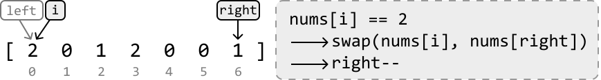

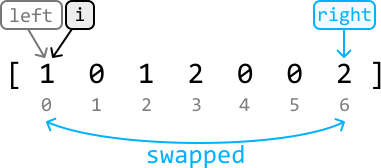

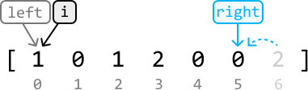

Notice that after this swap, there’s now a new element at index `i`. So, we should not yet advance `i`, as we still need to decide whether this new element needs to be positioned elsewhere.

---

The pointer `i` is now pointing at a 1. We don’t need to handle any 1s we encounter, so let’s just advance the `i` pointer:

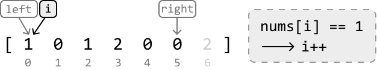

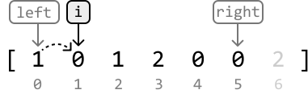

---

Now, pointer `i` is pointing at a 0, so let’s swap it with `nums[left]`:

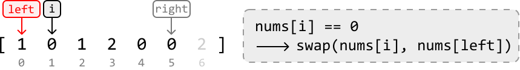

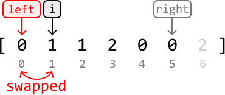

After this swap, there’s a new element at index `i`. Since `i` is positioned after the left pointer, this element can only be a 1 for the following reasons:

- Before the swap, all 0s originally to the left of `i` would have already been positioned to the left of the `left` index.

- Before the swap, all 2s originally to the left of `i` would have already been positioned to the right of the `right` index.

Therefore, we can also advance the `i` pointer while advancing the `left` pointer.

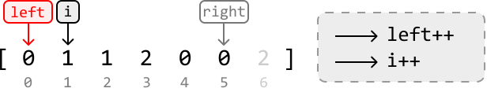

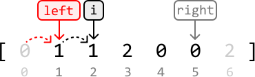

---

We now know what to do whenever we encounter a 0, 1, or 2. We can continue applying this logic until the pointer `i` surpasses the `right` pointer, indicating all elements have been positioned correctly:

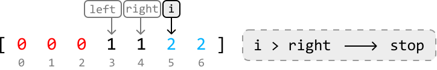

Note that we don’t stop the process when `i == right` because the `i` pointer could still be pointing at a 0, which would need to be swapped.

---

**Why do we advance both `i` and `left` pointers when we encounter a 0?**

A question we might have regarding the above process is why we advance the `i` pointer along with the `left` pointer when `nums[i] == 0`.

The reason becomes clear when we consider the following example:

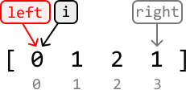

Here, `nums[i] == 0`, so the first thing we do is swap `nums[i]` and `nums[left]`, which doesn’t change anything in this case since `left` and `i` point to the same element. Now, observe what happens if we only advance the left pointer:

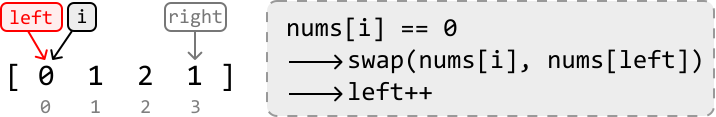

 

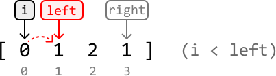

As we can see, the left pointer will surpass the `i` pointer, which shouldn’t happen since `i` needs to stay between `left` and `right` throughout the algorithm. To avoid this, we advance both the `i` and `left` pointers:

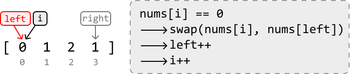

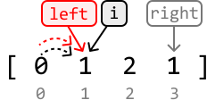

## Implementation

```python
from typing import List
    
def dutch_national_flag(nums: List[int]) -> None:
    i, left, right = 0, 0, len(nums) - 1
    while i <= right:
        # Swap 0s with the element at the left pointer.
        if nums[i] == 0:
            nums[i], nums[left] = nums[left], nums[i]
            left += 1
            i += 1
        # Swap 2s with the element at the right pointer.
        elif nums[i] == 2:
            nums[i], nums[right] = nums[right], nums[i]
            right -= 1
        else:
            i += 1

```

```javascript
export function dutch_national_flag(nums) {
  let i = 0,
    left = 0,
    right = nums.length - 1
  while (i <= right) {
    if (nums[i] === 0) {
      // Swap 0s with the element at the left pointer.
      ;[nums[i], nums[left]] = [nums[left], nums[i]]
      left++
      i++
    } else if (nums[i] === 2) {
      // Swap 2s with the element at the right pointer.
      ;[nums[i], nums[right]] = [nums[right], nums[i]]
      right--
    } else {
      i++
    }
  }
}

```

```java
import java.util.ArrayList;

class UserCode {
    public static void dutchNationalFgilag(ArrayList<Integer> nums) {
        int i = 0;
        int left = 0;
        int right = nums.size() - 1;
        while (i <= right) {
            // Swap 0s with the element at the left pointer.
            if (nums.get(i) == 0) {
                int temp = nums.get(i);
                nums.set(i, nums.get(left));
                nums.set(left, temp);
                left++;
                i++;
            }
            // Swap 2s with the element at the right pointer.
            else if (nums.get(i) == 2) {
                int temp = nums.get(i);
                nums.set(i, nums.get(right));
                nums.set(right, temp);
                right--;
            } else {
                i++;
            }
        }
    }
}

```

### Complexity Analysis

**Time complexity:** The time complexity of `dutch_national_flag` is O(n) because we iterate through each element of `nums` once.

**Space complexity:** The space complexity is O(1).