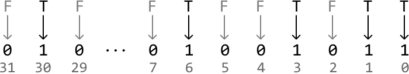
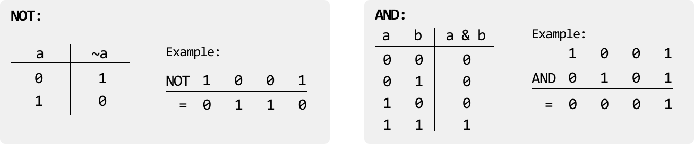
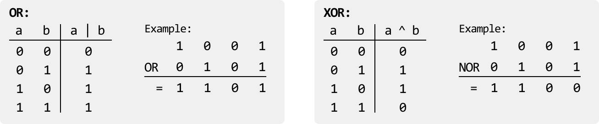
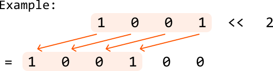
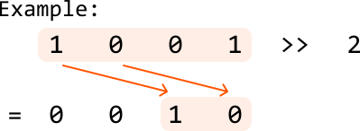
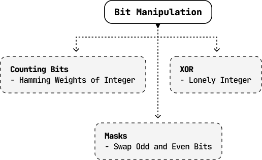

# Introduction to Bit Manipulation

## Intuition

Bit manipulation is a technique used in programming to perform operations at the bit level, which can often lead to more efficient and faster algorithms.

**When is bit manipulation useful?**

Bit manipulation allows us to work directly with the binary representation of numbers, making certain operations more efficient. Common tasks such as setting, clearing, toggling, and checking bits can be performed quickly using bitwise operators.

For example, one of the most common space optimization techniques involves using an unsigned 32-bit integer to represent a set of boolean values, where each bit in the integer corresponds to a different boolean value. This allows us to store and manipulate up to 32 states without using a boolean array or hash set.

## Bitwise Operators

There are several fundamental bitwise operations, each serving a specific purpose. These are shown below, along with each operation’s truth table:

Some useful characteristics of the XOR operator are:

- `a ^ 0 = a`

- `a ^ a = 0`

In addition, it’s also important to understand the fundamental shift operators:

- **Left shift (`<< n`)**: Shifts the bits of a number to the left by `n` positions, adding 0s on the right. This is equivalent to multiplying a number by `2n`.
  
  
  

- **Right shift (`>> n`)**: Shifts the bits of a number to the right by `n` positions, discarding bits on the right. This is equivalent to dividing a number by `2n` (integer division).
  
  
  

Using these operators, here are some useful bit manipulation techniques to be aware of:

- **Setting the `i`th bit of `x` to 1**: `x |= (1 << i)`

- **Clearing the `i`th bit of `x`:** `x &= ~(1 << i)`

- **Toggling the `i`th bit of `x`** (from 0 to 1 or 1 to 0): `x ^= (1 << i)`

- **Checking if the `i`th bit is set:** if `x & (1 << i) != 0`, the `i`th bit is set

- **Checking if a number `x` is even or odd:** `if x & 1 == 0`, `x` is even

- **Checking if a number is a power of 2**: if `x > 0` and `x & (x - 1) == 0`, `x` is a power of 2

## Real-world Example

**Data transmission in networks:** In many network protocols, bit manipulation is used to efficiently encode, compress, and transmit data for fast communication. For example, IP addresses and subnet masks use bitwise AND operations to determine whether two devices are on the same network. Similarly, in error detection and correction algorithms like checksums or parity bits, bit manipulation promotes data integrity during transmission by identifying and correcting errors in the binary data.

## Chapter Outline

To best grasp the fundamentals of bit manipulation, this chapter explores a variety of problems that utilize a range of complex bit manipulation techniques, as well as how to identify the appropriate bitwise operator based on specific requirements.