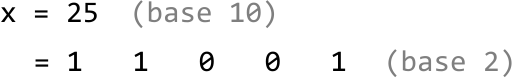
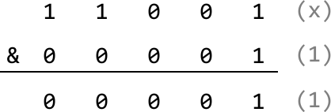
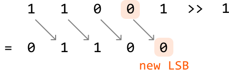
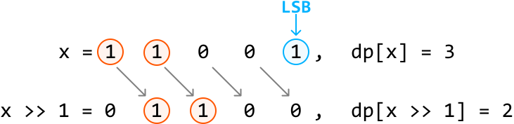

# Hamming Weights of Integers

The Hamming weight of a number is the **number of set bits** (1-bits) in its binary representation. Given a positive integer `n`, return an `array` where the `ith` element is the Hamming weight of integer `i` for all integers from `0` to `n`.

#### Example:

```python
Input: n = 7
Output: [0, 1, 1, 2, 1, 2, 2, 3]

```

Explanation:

| **Number** | **Binary representation** | **Number of set bits** |
| --- | --- | --- |
| 0 | 0 | 0 |
| 1 | 1 | 1 |
| 2 | 10 | 1 |
| 3 | 11 | 2 |
| 4 | 100 | 1 |
| 5 | 101 | 2 |
| 6 | 110 | 2 |
| 7 | 111 | 3 |

## Intuition - Count Bits For Each Number

The most straightforward strategy is to individually count the number of bits for each number from 0 to `n`.

Consider a number `x = 25` and its binary representation:



To count the number of set bits (1s) in a number, we can check each bit and increase a count whenever we find a set bit. Let’s see how this works.

For starters, we can determine the least significant bit (LSB) of `x` by performing `x & 1`, which masks all bits of `x` except the LSB: `if x & 1 == 1`, the LSB is 1. Otherwise, it’s 0. We can see this below for `x = 25`:



Now, how do we check the next bit? If we perform a bitwise right-shift operation on `x`, we shift all bits of `x` one position to the right. This effectively makes this next bit the new LSB:



We now have a process we can repeat to count the number of set bits in a number:

- If `x & 1 == 1`, increment our count. Otherwise, don’t.

- Right shift `x`.

Continue with the two steps above until `x` equals 0, indicating there are no more set bits to count. Doing this for every number from 0 to `n` provides the answer.

## Implementation - Count Bits For Each Number

```python
from typing import List
    
def hamming_weights_of_integers(n: int) -> List[int]:
    return [count_set_bits(x) for x in range(n + 1)]
    
def count_set_bits(x: int) -> int:
    count = 0
    # Count each set bit of 'x' until 'x' equals 0.
    while x > 0:
        # Increment the count if the LSB is 1.
        count += x & 1
        # Right shift 'x' to shift the next bit to the LSB position.
        x >>= 1
    return count

```

```javascript
export function hamming_weights_of_integers(n) {
  const result = []
  for (let i = 0; i <= n; i++) {
    result.push(countSetBits(i))
  }
  return result
}

function countSetBits(x) {
  let count = 0
  // Count each set bit of 'x' until 'x' equals 0.
  while (x > 0) {
    count += x & 1
    // Right shift 'x' to shift the next bit to the LSB position.
    x >>= 1
  }
  return count
}

```

```java
import java.util.ArrayList;

public class Main {
    public ArrayList<Integer> hamming_weights_of_integers(int n) {
        ArrayList<Integer> result = new ArrayList<>();
        for (int x = 0; x <= n; x++) {
            result.add(count_set_bits(x));
        }
        return result;
    }

    public int count_set_bits(int x) {
        int count = 0;
        // Count each set bit of 'x' until 'x' equals 0.
        while (x > 0) {
            // Increment the count if the LSB is 1.
            count += x & 1;
            // Right shift 'x' to shift the next bit to the LSB position.
            x >>= 1;
        }
        return count;
    }
}

```

### Complexity Analysis

**Time complexity**: The time complexity of hamming_weights_of_integers is O(nlog(n)) because for each integer x from 0 to n, counting the number of set bits takes logarithmic time, as there are approximately log₂(x) bits in that number. If we assume all integers have 32 bits, the time complexity simplifies to just O(n), since counting the set bits for a number will take at most 32 steps, which we do for n+1 numbers.

**Space complexity:** The space complexity is O(1) because no extra space is used except the space occupied by the output.

## Intuition - Dynamic Programming

In the previous approach, it's important to note that by the time we reach integer `x`, we have already computed the result for all integers from 0 to `x - 1`. If we find a way to leverage these previous results, we can improve the efficiency of constructing the output array.

It would be wise to find a way to take advantage of some **optimal substructure** by treating the results from integers 0 to `x - 1` as potential subproblems of `x`. This is the beginning of a DP solution. Let `dp[x]` represent the number of set bits in integer `x`.

A predictable way to access a subproblem of `dp[x]` is to right-shift `x` by 1, effectively removing its LSB. This is the subproblem `dp[x >> 1]`, and the only difference between this and `dp[x]` is the LSB which was just removed.

As mentioned earlier, the LSB of `x` can be found using `x & 1`. Therefore:

- If the LSB of `x` is 0, there is no difference in the number of bits between `x` and `x >> 1`:
  
  
  

- If the LSB of `x` is 1, the difference in the number of bits between `x` and `x >> 1` is 1:
  
  
  

Therefore, we can obtain `dp[x]` by using the result of `dp[x >> 1]` and adding the LSB to it:

> 
> 
> `dp[x] = dp[x >> 1] + (x & 1)`
> 
> 

Now, we just need to know what our base case is.

**Base case**

The simplest version of this problem is when `n` is 0. In this case, there are no set bits, so the number of set bits is 0. We can apply this base case by setting `dp[0]` to 0.

After the base case is set, we populate the rest of the DP array by applying our formula from `dp[1]` to `dp[n]`. The answer to the problem is then just the values in the DP array, containing the number of set bits for each number from 0 to `n`.

## Implementation - Dynamic Programming

```python
from typing import List
    
def hamming_weights_of_integers_dp(n: int) -> List[int]:
    # Base case: the number of set bits in 0 is just 0. We set dp[0] to 0 by
    # initializing the entire DP array to 0.
    dp = [0] * (n + 1)
    for x in range(1, n + 1):
        # 'dp[x]' is obtained using the result of 'dp[x >> 1]', plus the LSB of 'x'.
        dp[x] = dp[x >> 1] + (x & 1)
    return dp

```

```javascript
export function hamming_weights_of_integers_dp(n) {
  // Base case: the number of set bits in 0 is just 0. We set dp[0] to 0 by
  // initializing the entire DP array to 0.
  const dp = new Array(n + 1).fill(0)
  for (let x = 1; x <= n; x++) {
    // 'dp[x]' is obtained using the result of 'dp[x >> 1]', plus the LSB of 'x'.
    dp[x] = dp[x >> 1] + (x & 1)
  }
  return dp
}

```

```java
import java.util.ArrayList;

public class Main {
    public ArrayList<Integer> hamming_weights_of_integers(int n) {
        // Base case: the number of set bits in 0 is just 0. We set dp[0] to 0 by
        // initializing the entire DP array to 0.
        int[] dp = new int[n + 1];
        for (int x = 1; x <= n; x++) {
            // 'dp[x]' is obtained using the result of 'dp[x >> 1]', plus the LSB of 'x'.
            dp[x] = dp[x >> 1] + (x & 1);
        }
        ArrayList<Integer> result = new ArrayList<>();
        for (int count : dp) {
            result.add(count);
        }
        return result;
    }
}

```

### Complexity Analysis

**Time complexity**: The time complexity of `hamming_weights_of_integers_dp` is O(n) since we populate each element of the DP array once.

**Space complexity:** The space complexity is O(1) because no extra space is used, aside from the space taken up by the output, which is the DP array in this case.