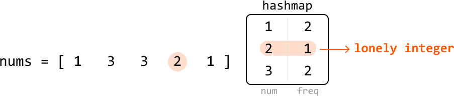
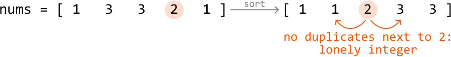
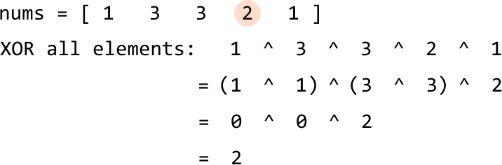

# Lonely Integer

Given an integer array where each number occurs twice except for one of them, find the **unique number**.

#### Example:

```python
Input: nums = [1, 3, 3, 2, 1]
Output: 2

```

#### Constraints:

- `nums` contains at least one element.

## Intuition

**Hash map solution**

A straightforward way to solve this problem is by using a hash map. The idea is to count the occurrences of each element in the array. We can do this by iterating through the array and increasing the frequency stored in the hash map of each element encountered in the array.



Once populated, we can iterate through the hash map to find the element with a frequency of 1, which is our lonely integer. This approach takes O(n) time, but comes at the cost of O(n) space, where n denotes the length of the input array. Let’s see if there’s a way to solve this without additional data structures like a hash map.

**Sorting solution**

Another way to solve this problem is to sort the array first, then look for the lonely integer by iterating through the array, and comparing each element with its neighbors. The lonely integer will be the one that doesn’t have a duplicate next to it.



This method takes O(nlog(n)) time due to sorting, but has the benefit of not requiring any additional data structures (aside from any used during sorting). Is there a way we can achieve a linear time complexity while also maintaining constant space?

**Bit manipulation**

A way to avoid using additional space is with bit manipulation. The XOR operation in particular can be useful when handling duplicate integers. Recall the following two characteristics of the XOR operator:

- `a ^ a == 0`

- `a ^ 0 == a`

As we can see, when we XOR two identical numbers, the result is 0. As each number except the lonely integer appears twice in the array, **if we XOR all the numbers together, all pairs of identical numbers will cancel out to 0**. This isolates the lonely integer: once all duplicate elements cancel to 0, XORing 0 with the lonely integer gives us the lonely integer.

This works independently of where the numbers are located in the array, as XOR follows the commutative and associative properties:

- Commutative property: `a ^ b == b ^ a`

- Associative property: `(a ^ b) ^ c == a ^ (b ^ c)`

So, as long as two of the same numbers exist in the array, they will get canceled out when we XOR all the elements. An example of this is shown below:



This allows us to identify the lonely integer in linear time without using extra space.

## Implementation

```python
from typing import List
    
def lonely_integer(nums: List[int]) -> int:
    res = 0
    # XOR each element of the array so that duplicate values will cancel each other
    # out (x ^ x == 0).
    for num in nums:
        res ^= num
    # 'res' will store the lonely integer because it would not have been canceled out
    # by any duplicate.
    return res

```

```javascript
export function lonely_integer(nums) {
  let res = 0
  // XOR each element of the array so that duplicate values will cancel each other
  // out (x ^ x == 0).
  for (const num of nums) {
    res ^= num
  }
  return res
}

```

```java
import java.util.ArrayList;

public class Main {
    public Integer lonely_integer(ArrayList<Integer> nums) {
        int res = 0;
        // XOR each element of the array so that duplicate values will cancel each other
        // out (x ^ x == 0).
        for (int num : nums) {
            res ^= num;
        }
        // 'res' will store the lonely integer because it would not have been canceled out
        // by any duplicate.
        return res;
    }
}

```

### Complexity Analysis

**Time complexity:** The time complexity of `lonely_integer` is O(n) because we perform a constant-time XOR operation on each element in `nums`.

**Space complexity:** The space complexity is O(1).