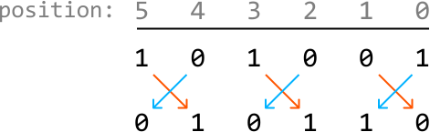
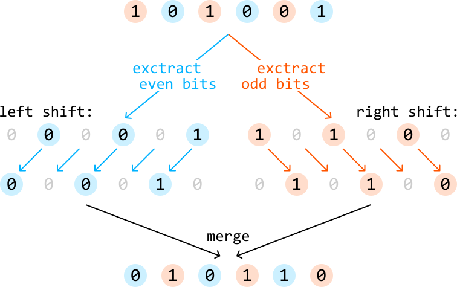
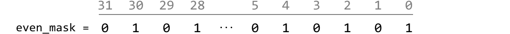
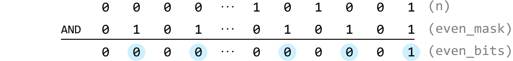
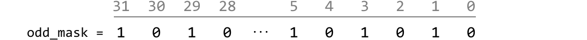
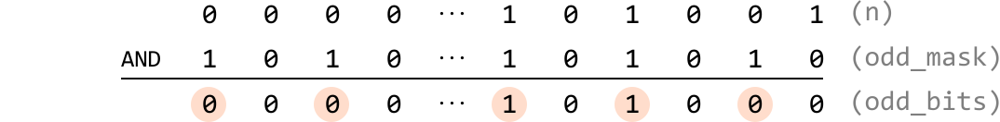
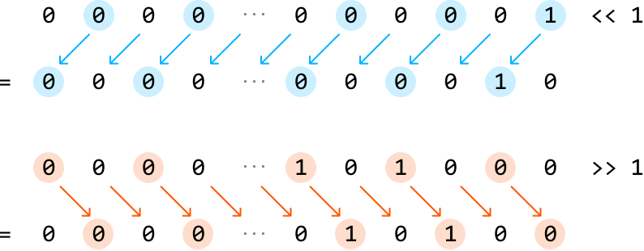
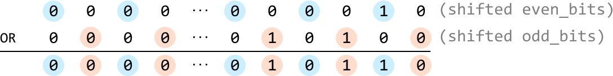

# Swap Odd and Even Bits

Given an unsigned 32-bit integer `n`, return an integer where all of `n`'s even bits are **swapped** with their adjacent odd bits.

#### Example 1:


```python
Input: n = 41
Output: 22

```

#### Example 2:


```python
Input: n = 23
Output: 43

```

## Intuition

Swapping even and odd bits means that each bit in an even position is swapped with the bit in the next odd position, and vice versa. Note that the positions start at position 0, which is the position of the least significant bit.

The key thing to notice is that, in order to perform the swap:

- All bits in the even positions need to be shifted one position to the left.

- All bits in the odd positions need to be shifted one position to the right.



This suggests that if we had a way to extract all the even and odd-positioned bits separately, we could shift them accordingly and then merge them back together, so the odd-positioned bits are in the even positions, and vice versa.



Let’s start by figuring out how to obtain the even and odd bits of n.

**Obtaining all even bits**

To obtain all even bits of n, we can use a mask which has all even bit positions set to 1:



Performing a bitwise-AND with this mask and n gives us an integer where all the bits at odd positions are set to 0, ensuring only the bits in even positions of n are preserved:



**Obtaining all odd bits**

Similarly, to obtain all the odd bits of n, we can use a mask with all odd bit positions are set to 1:



Performing a bitwise-AND with this mask and n gives us an integer where all the bits at even positions are set to 0, ensuring only the bits at odd positions of n are preserved:



Now that we’ve extracted all the even bits and odd bits separately, let’s use them to obtain the result, where the bits at odd and even positions are swapped.

**Shifting and merging the bits at odd and even positions**

We can use the shift operator to shift the bits at even positions to the left once, and the bits at odd positions to the right once:



Then, to merge these together, we can use the bitwise-OR operator because it combines the two sets of bits into the final result.



Now, the odd-positioned bits are in the even positions and vice versa.

## Implementation

```python
def swap_odd_and_even_bits(n: int) -> int:
    even_mask = 0x55555555   # 01010101010101010101010101010101
    odd_mask = 0xAAAAAAAA  # 10101010101010101010101010101010
    even_bits = n & even_mask
    odd_bits = n & odd_mask
    # Shift the even bits to the left, the odd bits to the right, and merge these
    # shifted values together.
    return (even_bits << 1) | (odd_bits >> 1)

```

```javascript
export function swap_odd_and_even_bits(n) {
  const evenMask = 0x55555555 // 01010101010101010101010101010101
  const oddMask = 0xaaaaaaaa // 10101010101010101010101010101010
  const evenBits = n & evenMask
  const oddBits = n & oddMask
  // Shift the even bits to the left, the odd bits to the right, and merge these
  // shifted values together.
  return (evenBits << 1) | (oddBits >>> 1)
}

```

```java
public class Main {
    public Integer swap_odd_and_even_bits(int n) {
        int evenMask = 0x55555555;  // 01010101010101010101010101010101
        int oddMask = 0xAAAAAAAA;   // 10101010101010101010101010101010
        int evenBits = n & evenMask;
        int oddBits = n & oddMask;
        // Shift the even bits to the left, the odd bits to the right, and merge these
        // shifted values together.
        return (evenBits << 1) | (oddBits >>> 1);
    }
}

```

### Complexity Analysis

**Time complexity**: The time complexity of `swap_odd_and_even_bits` is O(1).

**Space complexity:** The space complexity is O(1).