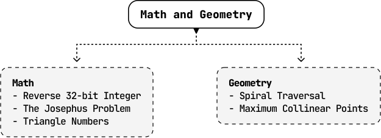

# Introduction to Math and Geometry

## Intuition

This chapter tackles several problems relating to important math and geometry concepts in programming, which regularly appear in technical interviews.

We explore subjects such as:

- Greatest common divisor (GCD).

- Modular arithmetic.

- Handling floating-point precision.

- Handling integer overflow and underflow.

- Recognizing patterns.

## Real-world Example

**Computer graphics:** In 3D rendering, geometry is used to represent objects as shapes like polygons, and mathematical transformations such as rotation, scaling, and translation, are applied to these objects to animate them, or change their perspective. Algorithms that use trigonometry, vector math, and matrix operations, are critical for determining how objects move, interact with light, or cast shadows in virtual environments.

## Chapter Outline

