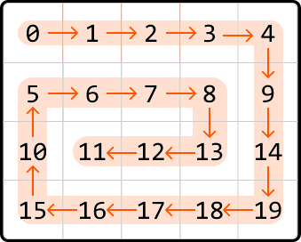
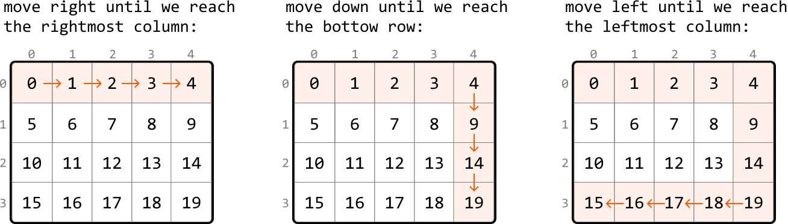
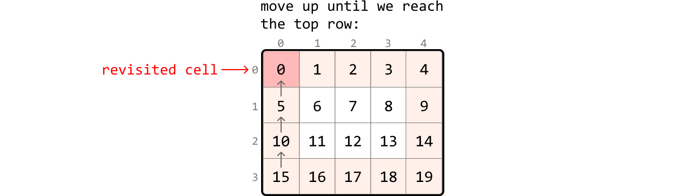
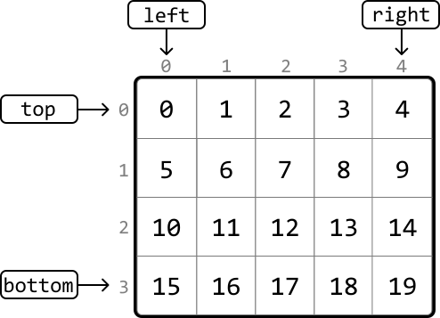
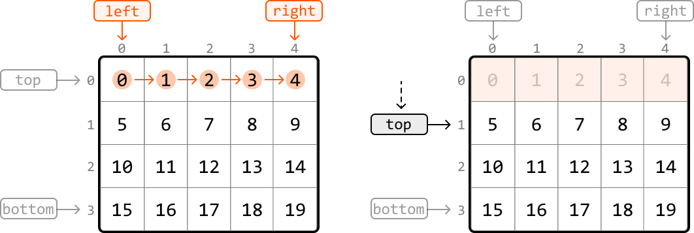
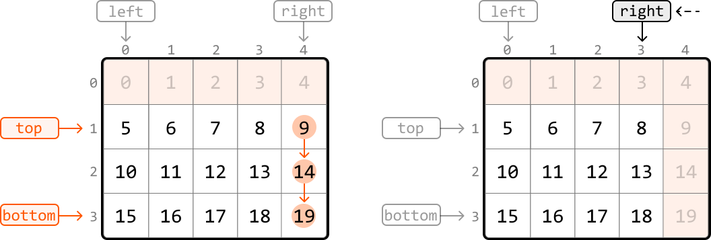
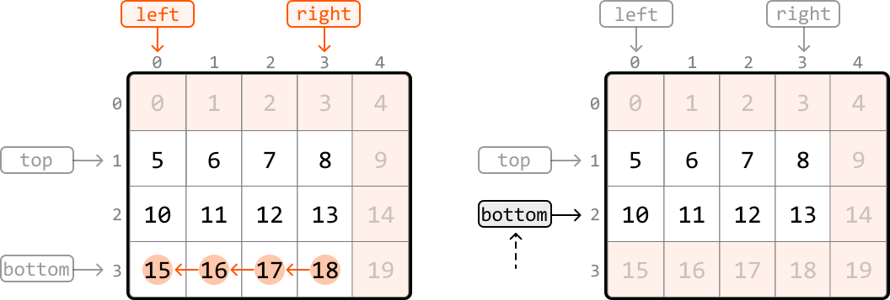
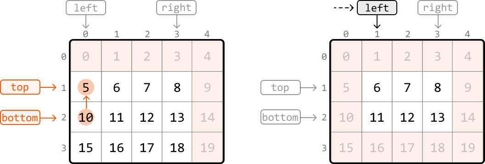

# Spiral Traversal

Return the elements of a matrix in **clockwise spiral order**.

#### Example:



```python
Output: [0, 1, 2, 3, 4, 9, 14, 19, 18, 17, 16, 15, 10, 5, 6, 7, 8, 13, 12, 11]

```

## Intuition

To create the expected output for this problem, let's try simulating exactly what the problem describes and traverse the matrix in spiral order, adding each value to the output as we go. How can we do this?

Spiral traversal involves moving through the matrix in one direction until we can't go any further, then changing direction and continuing. Specifically, the sequence of directions is right, down, left, and up, repeated until all elements are traversed. To achieve this, we need to determine the exact conditions for switching directions.

Initially, our approach may seem simple: we start by moving right until reaching the right-most column of the matrix, at which point we switch directions. We can move and switch directions like this three times without running into any problems:



However, as shown below, if we move upward until we hit the top row of the matrix, we'll return to where we started, adding a value from a previously visited cell to the output:



A potential solution to this is to keep track of all cells visited by using a hash set. This allows us to stop moving in a direction when we encounter a visited cell. While this approach is effective, it requires O(m· n) space, where m and n are the dimensions of the matrix. This is because we need to store every cell of the matrix in the hash set. Is there a way to avoid revisiting cells without using an additional data structure?

Notice in the above diagrams that when we move in a certain direction, we continue until we reach one of the boundary rows or columns (i.e., the top or bottom row, or the leftmost or rightmost column).

What if we adjust these boundaries as we traverse the matrix, to avoid revisiting previous cells?

**Adjusting boundaries**

Let's initialize the four boundaries (`top`, `bottom`, `left`, `right`) with their initial positions:

- `top = 0`

- `bottom = m - 1`

- `left = 0`

- `right = n - 1`



---

We begin traversal by moving **right** through the first row from the left boundary to the right. Since we've just visited all cells in the first row, we need to prevent future access to this row. This can be done by moving the top boundary down by 1 (`top += 1`), ensuring the top row can't be accessed:



---

Next, we move **down** from the top boundary to the bottom boundary. To ensure this column is not revisited, update the right boundary (`right -= 1`):



---

Next, we move **left** from the right boundary to the left. To ensure this row doesn't get revisited, update the bottom boundary (`bottom -= 1`):



---

Next, we move **up** from the bottom boundary to the top boundary. To ensure this column isn't revisited, update the left boundary (`left += 1`):



---

We've just discussed how to traverse in each of the four directions and update the corresponding boundaries. These traversals are repeated until either the top boundary surpasses the bottom boundary, or the left boundary surpasses the right boundary. Either of these indicate there are no more cells left to traverse.

---

In summary, we traverse the matrix in spiral order by repeating the following sequences of traversals:

- Move from left to right along the top boundary, then update the top boundary (`top += 1`)

- Move from top to bottom along the right boundary, then update the right boundary (`right -= 1`)

- Move from right to left along the bottom boundary, then update the bottom boundary (`bottom -= 1`)

- Move from bottom to top along the left boundary, then update the left boundary (`left += 1`)

This continues while top ≤ bottom and `left ≤ right`.

A crucial thing to keep in mind is that after updating the top boundary, the top boundary might pass the bottom boundary (`top > bottom`). So, we need to check that `top ≤ bottom` before traversing the bottom boundary. Similarly, we need to check that `left ≤ right` before traversing the left boundary to ensure the boundaries haven't crossed.

As we move through the matrix, we add each value we encounter to the output array. This way, the matrix values are recorded in a spiral order.

## Implementation

```python
from typing import List
    
def spiral_matrix(matrix: List[List[int]]) -> List[int]:
    if not matrix:
        return []
    result = []
    # Initialize the matrix boundaries.
    top, bottom = 0, len(matrix) - 1
    left, right = 0, len(matrix[0]) - 1
    # Traverse the matrix in spiral order.
    while top <= bottom and left <= right:
        # Move from left to right along the top boundary.
        for i in range(left, right + 1):
            result.append(matrix[top][i])
        top += 1
        # Move from top to bottom along the right boundary.
        for i in range(top, bottom + 1):
            result.append(matrix[i][right])
        right -= 1
        # Check that the bottom boundary hasn't passed the top boundary before
        # moving from right to left along the bottom boundary.
        if top <= bottom:
            for i in range(right, left - 1, -1):
                result.append(matrix[bottom][i])
            bottom -= 1
        # Check that the left boundary hasn't passed the right boundary before
        # moving from bottom to top along the left boundary.
        if left <= right:
            for i in range(bottom, top - 1, -1):
                result.append(matrix[i][left])
            left += 1
    return result

```

```javascript
export function spiral_matrix(matrix) {
  if (!matrix || matrix.length === 0) return []
  const result = []
  let top = 0
  let bottom = matrix.length - 1
  let left = 0
  let right = matrix[0].length - 1
  while (top <= bottom && left <= right) {
    // Move from left to right along the top boundary.
    for (let i = left; i <= right; i++) {
      result.push(matrix[top][i])
    }
    top++
    // Move from top to bottom along the right boundary.
    for (let i = top; i <= bottom; i++) {
      result.push(matrix[i][right])
    }
    right--
    // Check that the bottom boundary hasn't passed the top boundary before
    // moving from right to left along the bottom boundary.
    if (top <= bottom) {
      for (let i = right; i >= left; i--) {
        result.push(matrix[bottom][i])
      }
      bottom--
    }
    // Check that the left boundary hasn't passed the right boundary before
    // moving from bottom to top along the left boundary.
    if (left <= right) {
      for (let i = bottom; i >= top; i--) {
        result.push(matrix[i][left])
      }
      left++
    }
  }

  return result
}

```

```java
import java.util.ArrayList;

public class Main {
    public static ArrayList<Integer> spiral_matrix(ArrayList<ArrayList<Integer>> matrix) {
        if (matrix == null || matrix.isEmpty()) {
            return new ArrayList<>();
        }
        ArrayList<Integer> result = new ArrayList<>();
        // Initialize the matrix boundaries.
        int top = 0;
        int bottom = matrix.size() - 1;
        int left = 0;
        int right = matrix.get(0).size() - 1;
        // Traverse the matrix in spiral order.
        while (top <= bottom && left <= right) {
            // Move from left to right along the top boundary.
            for (int i = left; i <= right; i++) {
                result.add(matrix.get(top).get(i));
            }
            top++;
            // Move from top to bottom along the right boundary.
            for (int i = top; i <= bottom; i++) {
                result.add(matrix.get(i).get(right));
            }
            right--;
            // Check that the bottom boundary hasn't passed the top boundary before
            // moving from right to left along the bottom boundary.
            if (top <= bottom) {
                for (int i = right; i >= left; i--) {
                    result.add(matrix.get(bottom).get(i));
                }
                bottom--;
            }
            // Check that the left boundary hasn't passed the right boundary before
            // moving from bottom to top along the left boundary.
            if (left <= right) {
                for (int i = bottom; i >= top; i--) {
                    result.add(matrix.get(i).get(left));
                }
                left++;
            }
        }
        return result;
    }
}

```

### Complexity Analysis

**Time complexity:** The time complexity of `spiral_matrix` is O(m· n) because we traverse each cell of the matrix once.

**Space complexity:** The space complexity is O(1). The res array is not included in the space complexity.