# Reverse 32-Bit Integer

**Reverse the digits** of a signed 32-bit integer. If the reversed integer overflows (i.e., is outside the range [-2^{31}, 2^{31} - 1]), return 0. Assume the environment only allows you to store integers within the signed 32-bit integer range.

#### Example 1:

```python
Input: n = 420
Output: 24

```

#### Example 2:

```python
Input: n = -15
Output: -51

```

## Intuition

The primary challenge with this problem is in handling its edge cases. Before tackling these edge cases, let’s first try handling the more basic cases and later see how we would need to modify our strategy.

**Reversing positive numbers**

Consider n = 123. Let's try building the reversed integer one digit at a time. The first thing to figure out is how to iterate through the digits of n to build our reversed number (initially set to 0):

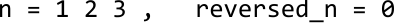

---

One way to do this is by starting at the last digit of `n` and appending each digit to `reversed_n`:

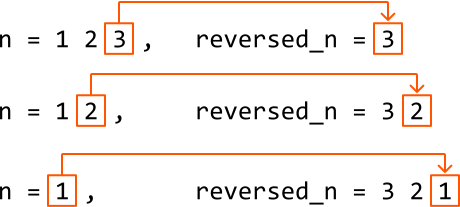

Let’s explore how we can do this. To extract the last digit, we can use the modulus operator: `n % 10`. This operation effectively finds what the remainder of `n` would be if divided by 10:

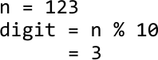

After extracting the last digit, we can remove it by dividing `n` by 10, which shifts the second-to-last digit to the last position, preparing it for the next iteration:

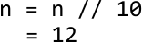

Once that’s done, let’s add the last digit extracted to our reversed number:

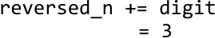

---

Below, we see the current states of `n` and `reversed_n`:

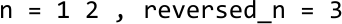

To process the next digit, let’s extract it from `n` using the modulus operation, then remove it by dividing n by 10:

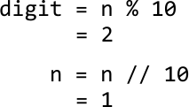

To append this digit to `reversed_n`, we can multiply `reversed_n` by 10 to shift its digits to the left, making space for the new digit. Then, we just add the new digit as before:

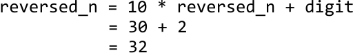

---

We can repeat the above process until all digits of n are appended to `reversed_n` (i.e., until `n` equals 0). Here’s a breakdown of this process:

- Extract the last digit: `digit = n % 10`.

- Remove the last digit: `n = n // 10`.

- Append the digit: `reversed_n = reversed_n * 10 + digit`.

**Reversing negative numbers**

Before considering a separate strategy to handle negative numbers, let's first check if the set of steps above also work for negative numbers. Applying these steps to n = -15 gives:

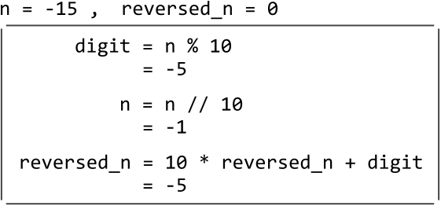

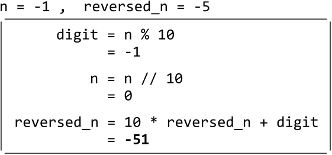

As we can see, it works for negative numbers. Now, let’s tackle situations in which reversing a number could result in integer overflow or underflow.

**Detecting integer overflow**

If the reverse of a positive number is larger than 2^{31} - 1, it will overflow, and we should return 0. Let’s call this maximum value `INT_MAX`.

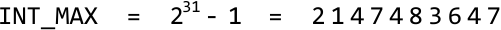

Initially, it might seem sufficient to reverse the number completely, check if it exceeds 2^{31} - 1, and return 0 if it does. However, in an environment where integers larger than 2^{31} - 1 cannot be stored, attempting to reverse such an integer would cause an overflow:

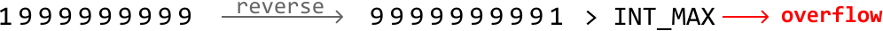

So, let’s think of another way to detect overflow.

We're constructing the number `reversed_n` one digit at a time, which means we need to ensure not to cause the number to overflow with each new digit we add. Let's think about when adding a new digit might cause `reversed_n` to become too large. Here's how we can analyze this:

If `reversed_n` is equal to `214748364` (i.e., `INT_MAX // 10`), then the final digit we can add to it must be less than or equal to 7 to avoid an overflow (since `214748364**7** == INT_MAX`):

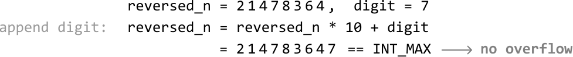

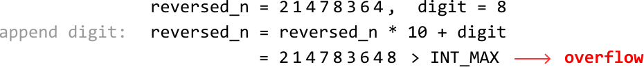

Now, keep in mind that when `reversed_n == INT_MAX // 10`, only one more digit can be added to it. The key observation here is that this digit can only ever be 1 because a larger final digit would be impossible, as shown below:

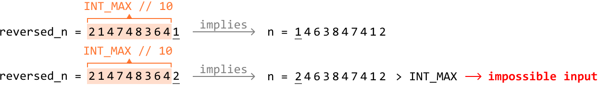

This means that when `reversed_n == INT_MAX // 10`, the last digit added to it won’t cause an overflow, meaning we don’t need to check the last digit in this case.

If `reversed_n` is already larger than `INT_MAX // 10`, adding any digit will cause it to overflow. We can handle this case with the following condition:

> 
> 
> `if reversed_n > INT_MAX // 10: return 0`
> 
> 

**Detecting integer underflow**

We can apply similar logic to the above for handling integer underflow. Here, we just need to check that `reversed_n` never falls below `INT_MIN // 10`:

> 
> 
> `if reversed_n < INT_MIN // 10: return 0`
> 
> 

## Implementation

In Python, using the modulus operator (%) with a negative number gives a positive result. To avoid this, we can instead use **math.fmod** and cast its result to an integer to attain a negative modulus value.

For division, Python's // operator performs floor division, which can result in an undesired value when dealing with negative numbers (e.g., -15 // 10 results in -2, instead of the desired -1). To achieve the desired behavior, use **/** for division and cast its result to an integer.

```python
import math
    
def reverse_32_bit_integer(n: int) -> int:
    INT_MAX = 2**31 - 1
    INT_MIN = -2**31
    reversed_n = 0
    # Keep looping until we've added all digits of 'n' to 'reversed_n' in reverse
    # order.
    while n != 0:
        # digit = n % 10
        digit = int(math.fmod(n, 10))
        # n = n // 10
        n = int(n / 10)
        # Check for integer overflow or underflow.
        if reversed_n > int(INT_MAX / 10) or reversed_n < int(INT_MIN / 10):
            return 0
        # Add the current digit to 'reversed_n'.
        reversed_n = reversed_n * 10 + digit
    return reversed_n

```

```javascript
export function reverse_32_bit_integer(n) {
  const INT_MAX = Math.pow(2, 31) - 1
  const INT_MIN = -Math.pow(2, 31)
  let reversed = 0
  // Keep looping until we've added all digits of 'n' to 'reversed_n' in reverse
  // order.
  while (n !== 0) {
    let digit = n % 10
    n = (n / 10) | 0 // Truncate towards zero
    // Check for integer overflow or underflow.
    if (
      reversed > Math.trunc(INT_MAX / 10) ||
      reversed < Math.trunc(INT_MIN / 10)
    ) {
      return 0
    }
    // Add the current digit to 'reversed_n'.
    reversed = reversed * 10 + digit
  }
  return reversed
}

```

```java
class Main {
    public Integer reverse_32_bit_integer(int n) {
        int INT_MAX = Integer.MAX_VALUE;
        int INT_MIN = Integer.MIN_VALUE;
        int reversedN = 0;
        // Keep looping until we've added all digits of 'n' to 'reversed_n' in reverse
        // order.
        while (n != 0) {
            // digit = n % 10
            int digit = n % 10;
            // n = n // 10
            n = n / 10;
            // Check for integer overflow or underflow.
            if (reversedN > INT_MAX / 10 || reversedN < INT_MIN / 10) {
                return 0;
            }
            // Add the current digit to 'reversed_n'.
            reversedN = reversedN * 10 + digit;
        }
        return reversedN;
    }
}

```

### Complexity Analysis

**Time complexity:** The time complexity of reverse_32_bit_integer is O(log(n)) because we loop through each digit of n, of which there are roughly log(n) digits. As this environment only supports 32-bit integers, the time complexity can also be considered O(1).

**Space complexity:** The space complexity is O(1).