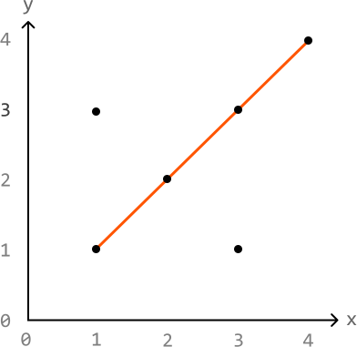
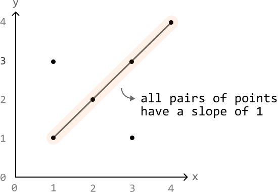
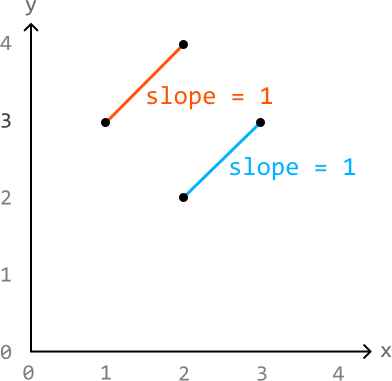
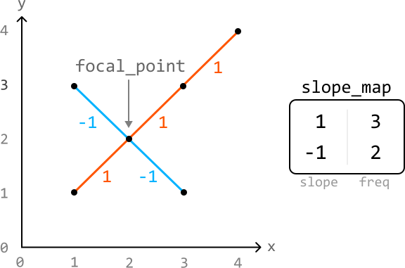
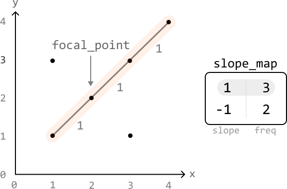
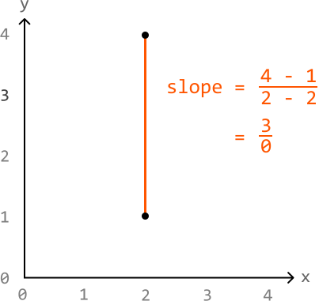
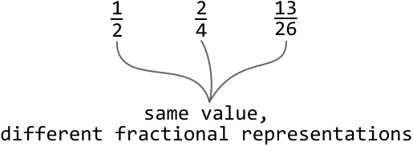
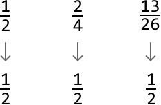
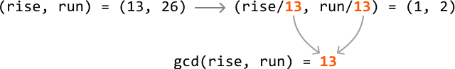

# Maximum Collinear Points

Given a set of points in a two-dimensional plane, determine the **maximum number of points** that lie along the same straight line.

#### Example:



```python
Input: points = [[1, 1], [1, 3], [2, 2], [3, 1], [3, 3], [4, 4]]
Output: 4

```

#### Constraints:

- The input won't contain duplicate points.

## Intuition

Two or more points are collinear if they lie on the same straight line. In other words, the **slope** between any pair of points among them will be equal:



Let’s remind ourselves how the slope of a line is calculated given two points (x_a, y_a) and (x_b, y_b):

slope = rise / run = (y_b-y_a) / (x_b-x_a)

Using this formula, we can calculate the slope between all pairs of points from the input, and determine the largest number of pairs that share the same slope. However, this approach is flawed because two pairs of points with the same slope value may not be collinear:



Let's think of a different way to find the answer. What if we try to find the maximum number of points collinear with a specific point? Let’s call this point a **focal point**.

We can calculate the slope between the focal point and every other point in the input, using a hash map to count how many points correspond with each slope value. Note that the frequencies of points stored in the hash map do not include the focal point.



This allows us to find the maximum number of points collinear with this focal point:



Here, the slope with the highest frequency is 3, which means the number of points on the line defined by that slope is 3 + 1 = 4, where +1 is used to account for the focal point itself.

By repeating the process for every point, we can determine the maximum number of points that are collinear with each focal point. Our final answer is equal to the largest of these maximums.

**Edge case: two points on the same x-axis**

When two collinear points share the same x-axis, the denominator of the slope equation will equal 0 (i.e., run = x_b - x_a = 0). This is problematic because dividing by 0 is undefined:



To handle this issue, we can check if our run value is equal to 0. If so, we can just use infinity (`float('inf')`) to represent the value of this slope.

**Avoiding precision issues**

A crucial thing to be mindful of is the precision of slopes when storing them as floats or doubles. Consider the following slopes:


As we can see, despite the fractions themselves representing different slopes, presenting them as a float or double doesn’t provide enough decimal-point precision to distinguish between them accurately. This can result in incorrectly identifying distinct slopes as the same.

To avoid this, we can represent a slope as a pair of integers, stored as a tuple: (rise, run). For example, the slope with a rise of 1 and a run of 2 can be represented as (1, 2) instead of 1 / 2 = 0.5.

**Ensuring consistent representation of slopes**

There’s just one more challenge to address: ensuring the representation of a slope is consistent for all equivalent slope fractions:



If we reduce fractions to their simplest forms, we can consistently represent equal fractions that have different initial representations.



But how can we do this? We can reduce fractions by dividing both the rise and run by their greatest common divisor (GCD).

**Greatest common divisor**

The GCD of two numbers is the largest number that divides both of them exactly. By dividing the rise and run by their GCD, we reduce the slope to its simplest form:



This ensures all equal fractions are represented in the same way.

## Implementation

```python
from typing import List, Tuple
from collections import defaultdict
    
def maximum_collinear_points(points: List[List[int]]) -> int:
    res = 0
    # Treat each point as a focal point, and determine the maximum number of points
    # that are collinear with each focal point. The largest of these maximums is the
    # answer.
    for i in range(len(points)):
        res = max(res, max_points_from_focal_point(i, points))
    return res
    
def max_points_from_focal_point(focal_point_index: int, points: List[List[int]]) -> int:
    slopes_map = defaultdict(int)
    max_points = 0
    # For the current focal point, calculate the slope between it and every other
    # point. This allows us to group points that share the same slope.
    for j in range(len(points)):
        if j != focal_point_index:
            curr_slope = get_slope(points[focal_point_index], points[j])
            slopes_map[curr_slope] += 1
            # Update the maximum count of collinear points for the current focal
            # point.
            max_points = max(max_points, slopes_map[curr_slope])
    # Add 1 to the maximum count to include the focal point itself.
    return max_points + 1
    
def get_slope(p1: List[int], p2: List[int]) -> Tuple[int, int]:
    rise = p2[1] - p1[1]
    run = p2[0] - p1[0]
    # Handle vertical lines separately to avoid dividing by 0.
    if run == 0:
        return (1, 0)
    # Simplify the slope to its reduced form.
    gcd_val = gcd(rise, run)
    return (rise // gcd_val, run // gcd_val)

```

```javascript
export function maximum_collinear_points(points) {
  let res = 0
  // Treat each point as a focal point, and determine the maximum number of points
  // that are collinear with each focal point. The largest of these maximums is the
  // answer.
  for (let i = 0; i < points.length; i++) {
    res = Math.max(res, maxPointsFromFocalPoint(i, points))
  }
  return res
}

function maxPointsFromFocalPoint(focalIndex, points) {
  const slopesMap = new Map()
  let maxPoints = 0
  // For the current focal point, calculate the slope between it and every other
  // point. This allows us to group points that share the same slope.
  for (let j = 0; j < points.length; j++) {
    if (j !== focalIndex) {
      const currSlope = getSlope(points[focalIndex], points[j])
      slopesMap.set(currSlope, (slopesMap.get(currSlope) || 0) + 1)
      // Update the maximum count of collinear points for the current focal
      // point.
      maxPoints = Math.max(maxPoints, slopesMap.get(currSlope))
    }
  }
  // Add 1 to the maximum count to include the focal point itself.
  return maxPoints + 1
}

function getSlope(p1, p2) {
  const rise = p2[1] - p1[1]
  const run = p2[0] - p1[0]
  // Handle vertical lines separately to avoid dividing by 0.
  if (run === 0) {
    return '1/0'
  }
  // Simplify the slope to its reduced form.
  const gcdVal = gcd(rise, run)
  return `${rise / gcdVal}/${run / gcdVal}`
}

function gcd(a, b) {
  // The Euclidean algorithm.
  while (b !== 0) {
    ;[a, b] = [b, a % b]
  }
  return a
}

```

```java
import java.util.ArrayList;
import java.util.HashMap;
import java.util.Map;

public class Main {
    public int maximum_collinear_points(ArrayList<ArrayList<Integer>> points) {
        int res = 0;
        // Treat each point as a focal point, and determine the maximum number of points
        // that are collinear with each focal point. The largest of these maximums is the
        // answer.
        for (int i = 0; i < points.size(); i++) {
            res = Math.max(res, max_points_from_focal_point(i, points));
        }
        return res;
    }

    public int max_points_from_focal_point(int focalPointIndex, ArrayList<ArrayList<Integer>> points) {
        Map<String, Integer> slopesMap = new HashMap<>();
        int maxPoints = 0;
        // For the current focal point, calculate the slope between it and every other
        // point. This allows us to group points that share the same slope.
        for (int j = 0; j < points.size(); j++) {
            if (j != focalPointIndex) {
                String currSlope = get_slope(points.get(focalPointIndex), points.get(j));
                slopesMap.put(currSlope, slopesMap.getOrDefault(currSlope, 0) + 1);
                // Update the maximum count of collinear points for the current focal
                // point.
                maxPoints = Math.max(maxPoints, slopesMap.get(currSlope));
            }
        }
        // Add 1 to the maximum count to include the focal point itself.
        return maxPoints + 1;
    }

    public String get_slope(ArrayList<Integer> p1, ArrayList<Integer> p2) {
        int rise = p2.get(1) - p1.get(1);
        int run = p2.get(0) - p1.get(0);
        // Handle vertical lines separately to avoid dividing by 0.
        if (run == 0) {
            return "1/0";
        }
        // Simplify the slope to its reduced form.
        int gcdVal = gcd(rise, run);
        return (rise / gcdVal) + "/" + (run / gcdVal);
    }

    public int gcd(int a, int b) {
        if (b == 0) {
            return Math.abs(a);
        }
        return gcd(b, a % b);
    }
}

```

While some programming languages, Python included, have their own internal implementation of the GCD function, its implementation is provided below for your information. This implementation is commonly known as the Euclidean algorithm:

```python
# The Euclidean algorithm.
def gcd(a, b):
    while b != 0:
        a, b = b, a % b
    return a

```

```javascript
export function gcd(a, b) {
  while (b !== 0) {
    ;[a, b] = [b, a % b]
  }
  return a
}

```

```java
public int gcd(int a, int b) {
    if (b == 0) {
        return Math.abs(a);
    }
    return gcd(b, a % b);
}

```

### Complexity Analysis

**Time complexity:** The time complexity of `maximum_collinear_points` is O(n^2log(m)), where n denotes the number of points, and m denotes the largest value among the coordinates. Here’s why:

- The time complexity of the `gcd(rise, run)` function is O(log(min(rise, run))), which is approximately equal to O(log(m)) in the worst case.

- The helper function `max_points_from_focal_point`, calls the gcd function a total of n-1 times: one for each point excluding the focal point, giving a time complexity of O(nlog(m)).

- The `max_points_from_focal_point` function is called a total of n times, resulting in an overall time complexity of O(n^2log(m)).

**Space complexity:** The space complexity is O(n) due to the hash map, which in the worst case, stores n-1 key-value pairs: one for each point excluding the focal point.