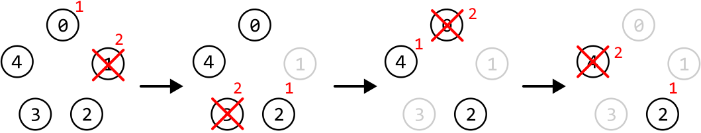
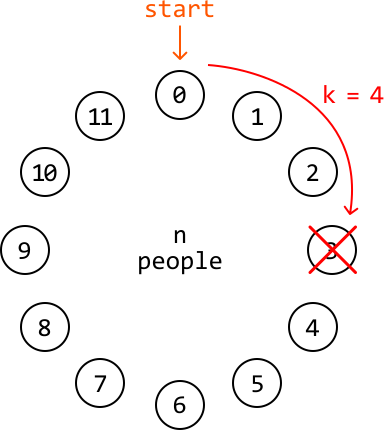
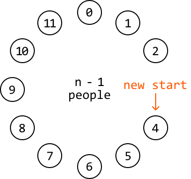

# The Josephus Problem

There are `n` people standing in a circle, numbered from `0` to `n - 1`. Starting from person 0, count `k` people clockwise and remove the `kth` person. After the removal, begin counting again from the next person still in the circle. Repeat this process until only one person remains, and return that person's position.

#### Example:



```python
Input: n = 5, k = 2
Output: 2

```

#### Constraints:

- There will be at least one person in the circle

- `k` will at least be equal to 1.

## Intuition

The naive approach to solving this problem is to simulate the removal of people step by step. We can create a circular linked list with n nodes. Starting from node 0, we iterate through the linked list, removing every kth person. The last node remaining after all removals will represent the last remaining person.

This approach takes O(n· k) time because, to remove a node, we must iterate through k nodes in the linked list. Therefore, for each of the n nodes, we perform k iterations. Let's see if we can find a faster solution.

Consider an example where `n = 12` and `k = 4`. For the first removal, we start counting `k` nodes from node 0 and remove the person we end up on after counting.



---



As we can see, after the first removal, there is one less person in the circle. Additionally, after the removal, our new start position is at the kth position (person 4).

Now, we effectively need to find the last person remaining in a circle of `n - 1` people, where we start counting at person `k`. This indicates that solving the **subproblem** `josephus(n - 1, k)` will help us get the answer to the problem `josephus(n, k)`. Note that the answer to subproblem `josephus(i, k)` represents the last person standing in a circle of `i` people, where we start counting at person 0.

To account for the adjusted start position, we need to add `k` to the answer returned by `josephus(n - 1, k)`. This is because, in this subproblem, it won’t know to start counting from position 4: it will, by default, count from position 0. So, adding `k` to this subproblem’s result accounts for this difference in the starting position.

This can be expressed with the following recurrence relation:

> 
> 
> `josephus(n, k) = josephus(n - 1, k) + k`
> 
> 

The final consideration is ensuring the value of `josephus(n - 1, k) + k` doesn’t exceed `n - 1`, as this represents the position of the last person. We can achieve this by applying the modulus operator (`% n`) to `josephus(n - 1, k) + k`. This results in the following updated recurrence relation:

> 
> 
> `josephus(n, k) = (josephus(n - 1, k) + k) % n`
> 
> 

Now, all we need is a base case.

**Base case**

The simplest version of this problem is when the circle contains only one person: `n = 1`. In this case, the last person remaining is person 0, so we just return person 0 for this base case.

## Implementation

---

```python
def josephus(n: int, k: int) -> int:
    # Base case: If there's only one person, the last person is person 0.
    if n == 1:
        return 0
    # Calculate the position of the last person remaining in the reduced problem
    # with 'n - 1' people. We use modulo 'n' to ensure the answer doesn't exceed
    # 'n - 1'.
    return (josephus(n - 1, k) + k) % n

```

```javascript
export function josephus(n, k) {
  // Base case: If there's only one person, the last person is person 0.
  if (n === 1) {
    return 0
  }
  // Calculate the position of the last person remaining in the reduced problem
  // with 'n - 1' people. We use modulo 'n' to ensure the answer doesn't exceed
  // 'n - 1'.
  return (josephus(n - 1, k) + k) % n
}

```

```java
public class Main {
    public Integer josephus(int n, int k) {
        // Base case: If there's only one person, the last person is person 0.
        if (n == 1) {
            return 0;
        }
        // Calculate the position of the last person remaining in the reduced problem
        // with 'n - 1' people. We use modulo 'n' to ensure the answer doesn't exceed
        // 'n - 1'.
        return (josephus(n - 1, k) + k) % n;
    }
}

```

---

### Complexity Analysis

**Time complexity:** The time complexity of josephus is O(n) because we make a total of n recursive calls to this function until we reach the base case.

**Space complexity:** The space complexity is O(n) due to the recursive call stack, which grows up to a depth of n.

## Optimization

We can implement the top-down recursive solution above using a bottom-up iterative approach. Let `res` represent an array that stores the solution to each subproblem, where `res[i]` contains the solution to the subproblem of an `i`-person circle. Using this array, our formula becomes:

> 
> 
> `res[i] = (res[i - 1] + k) % i`
> 
> 

The key observation here is that we only ever need access to the previous element of the `res` array (at `i - 1`) to calculate the result of the current subproblem (at `i`). This means we don’t need to store the entire array.

Instead, we can use a single variable to keep track of the solution to the previous subproblem. We can then update this variable to store the solution for the current subproblem:

> 
> 
> `res = (res + k) % i`
> 
> 

Note that the 'res' value used on the right-hand side of the equation represents the previous subproblem’s result.

## Implementation

```python
def josephus_optimized(n: int, k: int) -> int:
    res = 0
    for i in range(2, n + 1):
        # res[i] = (res[i - 1] + k) % i.
        res = (res + k) % i
    return res

```

```javascript
export function josephus_optimized(n, k) {
  let res = 0
  for (let i = 2; i <= n; i++) {
    // res[i] = (res[i - 1] + k) % i.
    res = (res + k) % i
  }
  return res
}

```

```java
public class Main {
    public Integer josephus_optimized(int n, int k) {
        int res = 0;
        for (int i = 2; i <= n; i++) {
            // res[i] = (res[i - 1] + k) % i.
            res = (res + k) % i;
        }
        return res;
    }
}

```

### Complexity Analysis

**Time complexity:** The time complexity of `josephus_optimized` is O(n) because we iterate through n subproblems.

**Space complexity:** The space complexity is O(1).