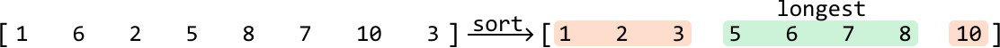
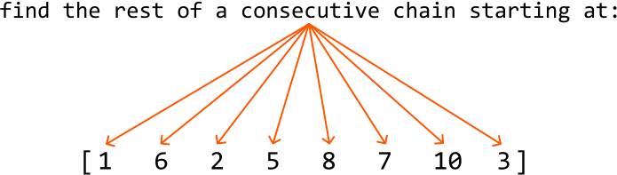
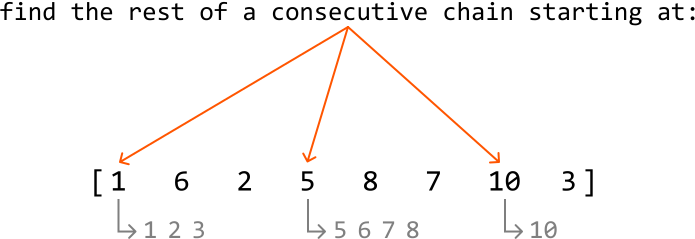
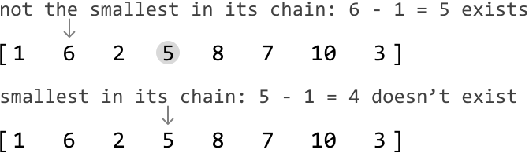

# Longest Chain of Consecutive Numbers

Find the **longest chain of consecutive numbers** in an array. Two numbers are consecutive if they have a difference of 1.

#### Example:

```python
Input: nums = [1, 6, 2, 5, 8, 7, 10, 3]
Output: 4

```

Explanation: The longest chain of consecutive numbers is 5, 6, 7, 8.

## Intuition

A naive approach to this problem is to sort the array. When all numbers are arranged in ascending order, consecutive numbers will be placed next to each other. This allows us to iterate through the array to identify the longest sequence of consecutive numbers.



This approach requires sorting, which takes O(nlog (n)) time, where n denotes the length of the array. Let’s see how we could do better.

It’s important to understand that every number in the array can represent the start of some consecutive chain. One approach is to treat each number as the start of a chain and search through the array to identify the rest of its chain.

To do this, we can leverage the fact that for any number `num`, its next consecutive number will be `num + 1`. This means we’ll always know which number to look for when trying to find the next number in a sequence. The code snippet for this approach is provided below:

```python
from typing import List
     
def longest_chain_of_consecutive_numbers_brute_force(nums: List[int]) -> int:
    if not nums:
        return 0
    longest_chain = 0
    # Look for chains of consecutive numbers that start from each number.
    for num in nums:
        current_num = num
        current_chain = 1
        # Continue to find the next consecutive numbers in the chain.
        while (current_num + 1) in nums:
            current_num += 1
            current_chain += 1
        longest_chain = max(longest_chain, current_chain)
    return longest_chain

```

```javascript
export function longest_chain_of_consecutive_numbers_brute_force(nums) {
  if (!nums || nums.length === 0) {
    return 0
  }
  let longestChain = 0
  // Look for chains of consecutive numbers that start from each number.
  for (const num of nums) {
    let currentNum = num
    let currentChain = 1
    // Continue to find the next consecutive numbers in the chain.
    while (nums.includes(currentNum + 1)) {
      currentNum += 1
      currentChain += 1
    }
    longestChain = Math.max(longestChain, currentChain)
  }
  return longestChain
}

```

```java
import java.util.ArrayList;

public class Main {
    public int longest_chain_of_consecutive_numbers_brute_force(ArrayList<Integer> nums) {
        if (nums == null || nums.size() == 0) {
            return 0;
        }
        int longestChain = 0;
        // Look for chains of consecutive numbers that start from each number.
        for (int num : nums) {
            int currentNum = num;
            int currentChain = 1;
            // Continue to find the next consecutive numbers in the chain.
            while (nums.contains(currentNum + 1)) {
                currentNum += 1;
                currentChain += 1;
            }
            longestChain = Math.max(longestChain, currentChain);
        }
        return longestChain;
    }
}

```

This brute force approach takes O(n^3) time because of the nested operations involved:

- The outer for-loop iterates through each element, which takes O(n) time.

- For each element, the inner while-loop can potentially run up to n iterations if there is a long consecutive sequence starting from the current number.

- For each, while-loop iteration, an O(n) check is performed to see if the next consecutive number exists in the array.

This is slower than the sorting approach, but we can make a couple of optimizations to improve the time complexity. Let’s discuss these.

**Optimization - hash set**

To find the next number in a sequence, we perform a linear search through the array. However, by storing all the numbers in a hash set, we can instead query this hash set in constant time to check if a number exists.

This reduces the time complexity from O(n^3) to O(n^2).

**Optimization - identifying the start of each chain**

In the brute force approach, we treat each number as the start of a chain. This becomes quite expensive because we perform a linear search for every number to find the rest of its chain:



The key observation here is that we don’t need to perform this search for every number in a chain. Instead, we only need to perform it for the smallest number in each chain since this number identifies the start of its chain:



We can determine if a number is the smallest number in its chain by **checking the array doesn’t contain the number that precedes it (`curr_num - 1`)**. We can also use the hash set for this check.



This reduces the time complexity from O(n^2) to O(n), as now every chain is searched through only once. This is explained in more detail in the complexity analysis.

## Implementation

```python
from typing import List
        
def longest_chain_of_consecutive_numbers(nums: List[int]) -> int:
    if not nums:
        return 0
    num_set = set(nums)
    longest_chain = 0
    for num in num_set:
        # If the current number is the smallest number in its chain, search for
        # the length of its chain.
        if num - 1 not in num_set:
            current_num = num
            current_chain = 1
            # Continue to find the next consecutive numbers in the chain.
            while current_num + 1 in num_set:
                current_num += 1
                current_chain += 1
            longest_chain = max(longest_chain, current_chain)
    return longest_chain

```

```javascript
export function longest_chain_of_consecutive_numbers(nums) {
  if (!nums || nums.length === 0) {
    return 0
  }
  // Convert array to a Set for O(1) lookups
  const numSet = new Set(nums)
  let longestChain = 0
  for (const num of numSet) {
    // If the current number is the smallest number in its chain, search for
    // the length of its chain.
    if (!numSet.has(num - 1)) {
      let currentNum = num
      let currentChain = 1
      // Continue to find the next consecutive numbers in the chain.
      while (numSet.has(currentNum + 1)) {
        currentNum += 1
        currentChain += 1
      }
      longestChain = Math.max(longestChain, currentChain)
    }
  }
  return longestChain
}

```

```java
import java.util.ArrayList;
import java.util.HashSet;

public class Main {
    public int longest_chain_of_consecutive_numbers(ArrayList<Integer> nums) {
        if (nums == null || nums.size() == 0) {
            return 0;
        }
        HashSet<Integer> numSet = new HashSet<>(nums);
        int longestChain = 0;
        for (int num : numSet) {
            // If the current number is the smallest number in its chain, search for
            // the length of its chain.
            if (!numSet.contains(num - 1)) {
                int currentNum = num;
                int currentChain = 1;
                // Continue to find the next consecutive numbers in the chain.
                while (numSet.contains(currentNum + 1)) {
                    currentNum += 1;
                    currentChain += 1;
                }
                longestChain = Math.max(longestChain, currentChain);
            }
        }
        return longestChain;
    }
}

```

### Complexity Analysis

**Time complexity:** The time complexity of `longest_chain_of_consecutive_numbers` is O(n) because, although there are two loops, the inner loop is only executed when the current number is the start of a chain. This ensures that each chain is iterated through only once in the inner while-loop. Thus, the total number of iterations for both loops combined is O(n): the outer for-loop runs n times, and the inner while-loop runs a total of n times across all iterations, resulting in a combined time complexity of O(n+n)=O(n).

**Space complexity:** The space complexity is O(n) since the hash set stores each unique number from the array.