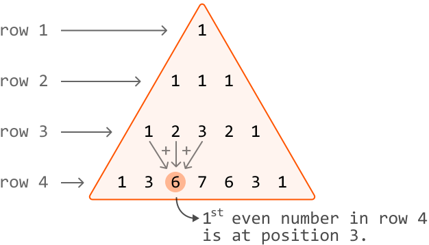
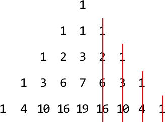
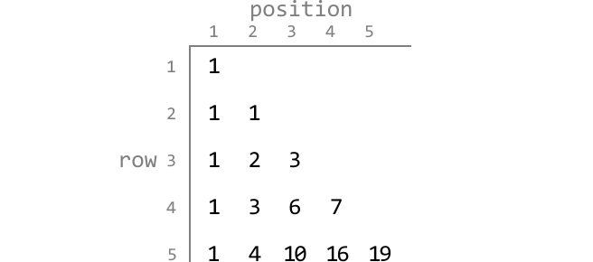
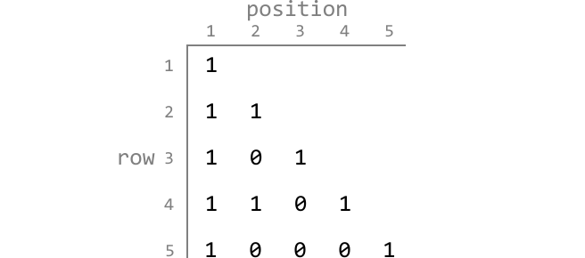
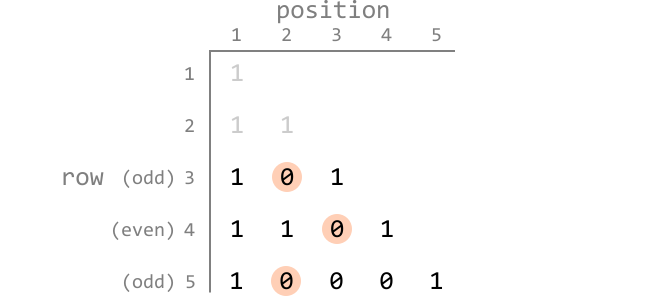
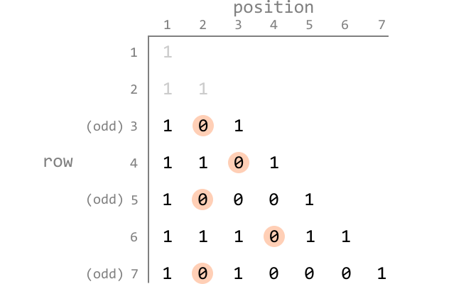
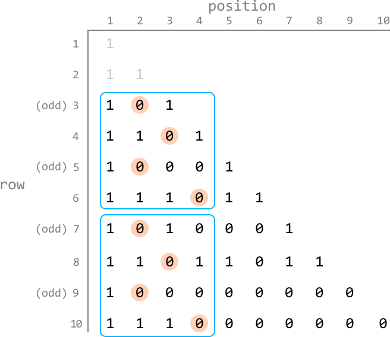
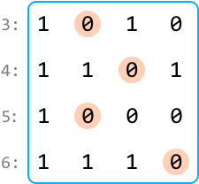
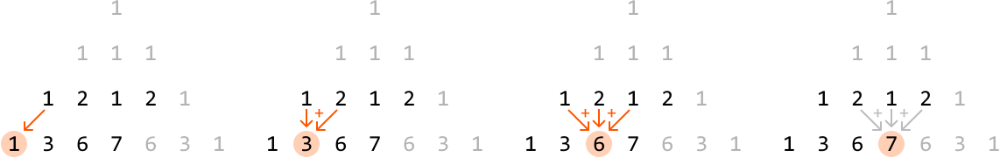
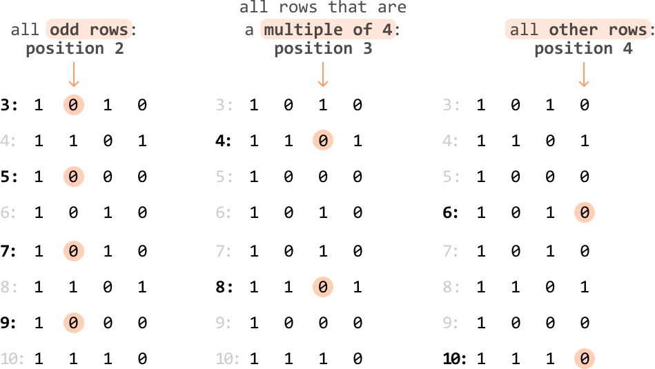

# Triangle Numbers

Consider a triangle composed of numbers where the top of the triangle is 1. Each subsequent number in the triangle is equal to the **sum of three numbers above it**: its top-left number, its top number, and its top-right number. If any of these three numbers don't exist, assume they are equal to 0.

Given a value representing a row of this triangle, **return the position of the first even number in this row**. Assume that the first number in each row is at position 1.

#### Example:



```python
Input: n = 4
Output: 3

```

#### Constraints:

- `n` will be at least 3.

## Intuition

A naive solution to this problem is to generate the entire triangle and all of its values up to the nth row. Then, we can iterate through the nth row until we encounter the first even number. However, this approach is inefficient because it results in an excessive use of time and memory to build the entire triangle. To find a more optimal solution, let’s consider how we can simplify the representation of our triangle.

**Simplifying the triangle**

The first key observation is that the triangle is symmetric. This means we can exclude the right half of the triangle because if an even number exists in the right half, it definitely exists in the left half:



To more easily visualize the positions of the numbers in each row, let’s draw it such that numbers belonging to the same position are aligned:



The next key observation is that we don’t necessarily care about the values themselves: we only care about the parity of each number (i.e., if they’re even or odd). Given this, we can simplify the triangle further by representing it as a binary triangle where 0 represents an even number and 1 represents an odd number:



Now that we’ve simplified the triangle, it’ll be easier to identify patterns in the positions of the first even number in each row. Let’s explore this further.

**Identifying patterns**

Let's ignore rows 1 and 2 since even numbers only begin appearing from row 3 onward. A good place to start looking for a pattern is to highlight the first even number at each row and observe their positions:



From rows 3 to 5, one possible pattern to observe is that odd-numbered rows have the first even number at position 2. We could also hypothesize that even-numbered rows have the first even at position 3.

---

To confirm if this observation is consistent, let’s look at some more rows:



So far, our hypothesis for odd-numbered rows is still true, but even-numbered rows seem to be following a different pattern. It’s still hard to pinpoint what it could be.

---

Let's continue by displaying a few more rows to figure out what this pattern is:



Now, we notice that the first four binary values from rows 3 to 6 repeat for rows 7 to 10. If we were to continue for future rows, we would notice that this pattern continues.

---

Essentially, the following pattern is consistently repeated, starting from row 3:



To understand why this pattern repeats, it’s important to realize that the first four values of a row are calculated solely from the four values of the previous row. We can see this visualized below, using the initial representation of the triangle to make it clearer:



So, whenever a specific sequence of four numbers occurs at the beginning of a row, it will generate a predictable sequence of four numbers in the following row. Extending this observation to the entire pattern, we can conclude that since the pattern repeated once (from rows 3 to 6 to rows 7 to 10), it will continue to repeat indefinitely.

This gives us the below cyclic rationale:

- **If `n` is odd** (`n % 2 != 0`), return 2.

- **If `n` is a multiple of 4** (`n % 4 == 0`), return 3.

- **Else**, return 4.



This problem demonstrates how recognizing patterns and simplifying the problem can turn a time-consuming solution into a quick, constant-time one.

## Implementation

```python
def triangle_numbers(n: int) -> int:
    # If n is an odd-numbered row, the first even number always starts at position
    # 2.
    if n % 2 != 0:
        return 2
    # If n is a multiple of 4, the first even number always starts at position 3.
    elif n % 4 == 0:
        return 3
    # For all other rows, the first even number always starts at position 4.
    return 4

```

```javascript
export function triangle_numbers(n) {
  // If n is an odd-numbered row, the first even number always starts at position 2.
  if (n % 2 !== 0) {
    return 2
  }
  // If n is a multiple of 4, the first even number always starts at position 3.
  else if (n % 4 === 0) {
    return 3
  }
  // For all other rows, the first even number always starts at position 4.
  return 4
}

```

```java
public class Main {
    public Integer triangle_numbers(int n) {
        // If n is an odd-numbered row, the first even number always starts at position
        // 2.
        if (n % 2 != 0) {
            return 2;
        }
        // If n is a multiple of 4, the first even number always starts at position 3.
        else if (n % 4 == 0) {
            return 3;
        }
        // For all other rows, the first even number always starts at position 4.
        return 4;
    }
}

```

### Complexity Analysis

**Time complexity:** The time complexity of `triangle_numbers` is O(1).

**Space complexity:** The space complexity is O(1).