# Geometric Sequence Triplets

A geometric sequence triplet is a **sequence of three numbers** where each successive number is obtained by multiplying the preceding number by a constant called the **common ratio**.

Let's examine three triplets to understand how this works:

- (1, 2, 4): This is a geometric sequence with a ratio of \underline{\text{2}} (i.e., [1, 1⋅\underline{\text{2}} = 2, 2⋅\underline{\text{2}} = 4]).

- (5, 15, 45): This is a geometric sequence with a ratio of \underline{\text{3}} (i.e., [5, 5⋅\underline{\text{3}} = 15, 15⋅\underline{\text{3}} = 45]).

- (2, 3, 4): Not a geometric sequence.

Given an array of integers and a common ratio `r`, find all triplets of indexes `(i, j, k)` that follow a geometric sequence for `i < j < k`. It's possible to encounter duplicate triplets in the array.

#### Example:

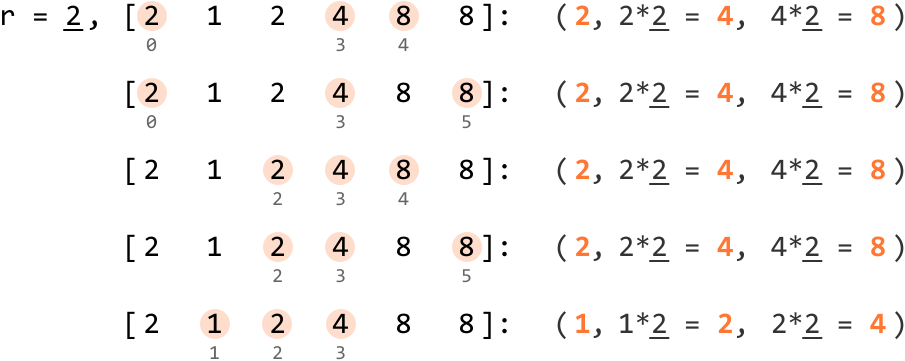

```python
Input: nums = [2, 1, 2, 4, 8, 8], `r` = 2
Output: 5

```

Explanation:

- Triplet `[2, 4, 8]` occurs at indexes `(0, 3, 4)`, `(0, 3, 5)`, `(2, 3, 4)`, `(2, 3, 5)`.

- Triplet `[1, 2, 4]` occurs at indexes `(1, 2, 3)`.

## Intuition

For a triplet to form a geometric sequence, it has to adhere to two main rules:

- It consists of three values that follow a geometric sequence with a common ratio `r`.

- The three values forming the triplet must appear in the same order within the array as they do in the geometric sequence. This means for a geometric triplet (`nums[i]`, `nums[j]`, `nums[k]`), the indexes must follow the order `i < j < k`.

How can we represent a geometric sequence so that it follows rule 1? Let’s say the first number is `x`. The second number is the first number multiplied by `r` (i.e., `x⋅r`), and the third is the second number multiplied by `r` (i.e., `x⋅r⋅r = x⋅r^2`). So, a triplet in a geometric sequence can be represented as (`x`, `x⋅r`, `x⋅r^2`).

A brute force approach is to iterate over every possible triplet in the array and check if any of these triplets follow a geometric progression. However, it would take three nested for-loops to search through all the triplets, resulting in a time complexity of O(n^3), where n denotes the length of the input array. Can we do better?

> 
> 
> An important observation here is that if we know one value of a triplet, we can calculate what the other two values should be.
> 
> 

This is because all three values are related by the common ratio `r`. So, for any number `x` in the array, we just need to find the values `x⋅r` and `x⋅r^2` to form a geometric triplet (`x`, `x⋅r`, `x⋅r^2`). However, we could run into issues when using this triplet representation. While it’s clear the values `x⋅r` and `x⋅r^2` must be positioned to the right of x, we have to be careful since the order of these values matters: we don’t want to accidentally identify a triplet such as (`x`, `x⋅r^2`, `x⋅r`), which is invalid:

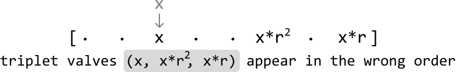

We can work around this issue by using the **(`x/r`, `x`, `x⋅r`)** triplet representation, which allows us to always maintain order by looking for `x/r` to the left of `x` and `x⋅r` to the right:

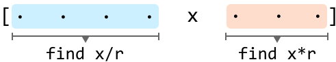

One way we can find the `x/r` and `x⋅r` values is by linearly searching through the left and right subarrays. This linear search would need to be done for each number in the array, resulting in an O(n^2) time complexity. While this is an improvement from the brute force solution, it would be great if we had a way to find those values faster.

**Hash maps**

A hash map would be a great way to solve this problem, as it allows us to query specific values in constant time.

What we would need are two hash maps:

- A hash map that contains numbers to the left of each `x` (`left_map`).

- A hash map that contains numbers to the right of each `x` (`right_map`).

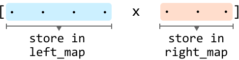

Hash maps allow us to query for both `x/r` in the left hash map and query for `x⋅r` in the right hash map in constant time on average. Note that a hash map would be preferred over a hash set because hash maps can also store the frequency of each value it stores. This is crucial since the array might contain duplicates, and we need to know the frequency of each value to accurately identify all possible triplets.

**Finding all (`x/r`, x, x**⋅**r) triplets**

Our goal is to find all triplets that follow a geometric sequence, representing each number in the array as the middle (x) number of a triplet.

Before we find a triplet’s `x/r` value, we need to **check if `x` is divisible by r**. If it’s not, it’s impossible to form a triplet from the current value of `x`. Otherwise, we can proceed to look for the triplet.

For any element x, there could be multiple instances of `x/r` in `left_map` and multiple instances of `x⋅r` in `right_map`, implying that multiple triplets can be formed using `x` as the middle value. So, to get the total number of triplets that can be formed with `x` in the middle, **multiply the frequencies of `x⋅r` and `x/r`**:

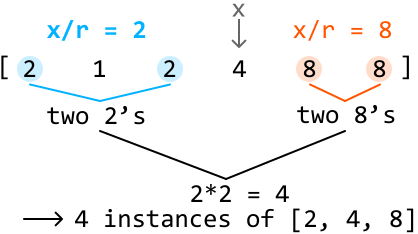

This overall methodology can be summarized in the following steps:

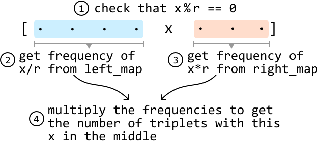

Note that if either `x/r` or `x⋅r` are not found in their hash maps, their frequency is 0 by default.

---

Let’s implement this strategy using the example below:

![Image represents a one-dimensional array or list enclosed in square brackets `[` and `]`, containing the integer sequenc](./images/42ddc719_image-02-05-6-UWRMOSID.svg)

To ensure the hash maps always contain the correct values, we’d need to incorporate a dynamic strategy that involves updating the hash maps as we go because the values in both hash maps will be different depending on the position of `x` in the array.

Since we're traversing the array from left to right, we should **initially fill the right hash map with all values in the array**. This is because, before the start of the iteration, every element is a potential candidate for `x⋅r`. Meanwhile, the left hash map is initially empty because there are no preceding elements to consider as potential `x/r` values:

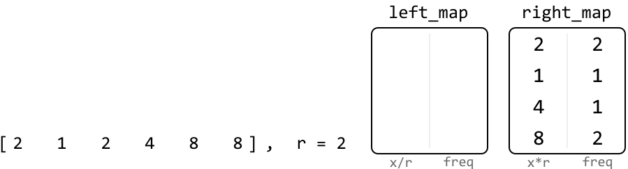

---

Now let’s look for triplets. Start by representing the first value as the middle value (`x`) of a triplet.

First, let’s **update `right_map`**. We should remove the current value (2) from `right_map` since this 2 is not to the right of itself. There are two 2’s in `right_map`, so let’s reduce its frequency to 1:

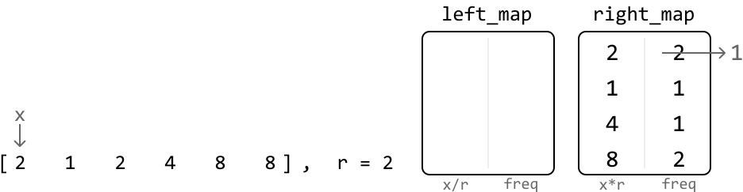

Next, **check if `x/r` is an integer.** In this case, it is, so let’s **find the number of triplets with `x` as the middle number** by multiplying the frequencies of `x/r` and `x⋅r`, which we can get from the respective hash maps. Since `left_map` doesn’t contain `x/r` at this point, its frequency is 0:

![The image represents a code snippet illustrating a calculation process. On the left, an array `[2 1 2 4 8 8]` is shown, ](./images/bcb31d29_image-02-05-9-OAMR6D5N.svg)

Before moving on to the next value, let’s **add the current number to the `left_map`** because it now becomes a potential `x/r` value for future triplets in the array:

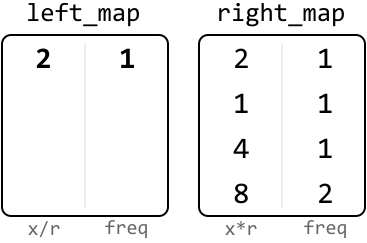

---

Repeating this process for the rest of the array allows us to find all geometric triplets with a ratio of `r`. To clarify, the hash maps in the upcoming diagrams represent their state at the current position of `x` in the array. This means that `left_map` includes values to the left of the current `x`, and the `right_map` includes values to the right of it.

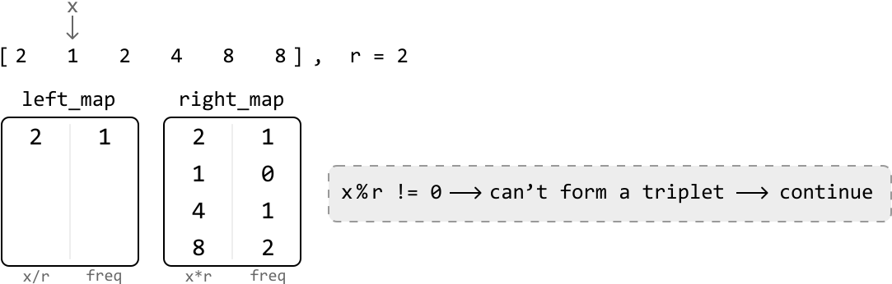

---

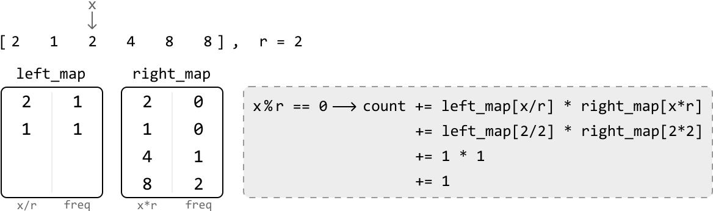

---


---


---

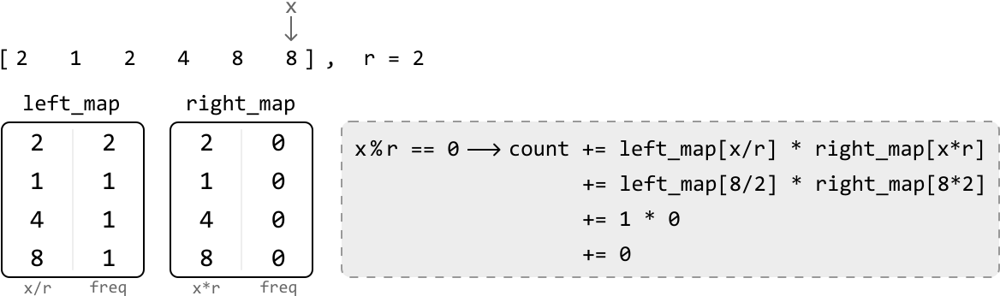

## Implementation

```python
from typing import List
from collections import defaultdict
    
def geometric_sequence_triplets(nums: List[int], r: int) -> int:
    # Use 'defaultdict' to ensure the default value of 0 is returned when
    # accessing a key that doesn’t exist in the hash map. This effectively sets
    # the default frequency of all elements to 0.
    left_map = defaultdict(int)
    right_map = defaultdict(int)
    count = 0
    # Populate 'right_map' with the frequency of each element in the array.
    for x in nums:
        right_map[x] += 1
    # Search for geometric triplets that have x as the center.
    for x in nums:
        # Decrement the frequency of x in 'right_map' since x is now being
        # processed and is no longer to the right.
        right_map[x] -= 1
        if x % r == 0:
            count += left_map[x // r] * right_map[x * r]
        # Increment the frequency of x in 'left_map' since it'll be a part of the
        # left side of the array once we iterate to the next value of `x`.
        left_map[x] += 1
    return count

```

```javascript
export function geometric_sequence_triplets(nums, r) {
  // Use Maps to track frequencies, similar to defaultdict in Python
  const leftMap = new Map()
  const rightMap = new Map()
  let count = 0
  // Populate 'rightMap' with the frequency of each element in the array
  for (const x of nums) {
    rightMap.set(x, (rightMap.get(x) || 0) + 1)
  }
  // Search for geometric triplets that have x as the center
  for (const x of nums) {
    // Decrement the frequency of x in 'rightMap' since x is now being
    // processed and is no longer to the right
    rightMap.set(x, rightMap.get(x) - 1)
    if (x % r === 0) {
      // Get frequencies of potential left and right elements
      const leftFreq = leftMap.get(x / r) || 0
      const rightFreq = rightMap.get(x * r) || 0
      // Add the number of triplets formed with x as the middle element
      count += leftFreq * rightFreq
    }
    // Increment the frequency of x in 'leftMap' since it'll be a part of the
    // left side of the array once we iterate to the next value of `x`
    leftMap.set(x, (leftMap.get(x) || 0) + 1)
  }
  return count
}

```

```java
import java.util.ArrayList;
import java.util.HashMap;

public class Main {
    public int geometric_sequence_triplets(ArrayList<Integer> nums, int r) {
        // Use 'HashMap' to ensure the default value of 0 is returned when
        // accessing a key that doesn’t exist in the hash map. This effectively sets
        // the default frequency of all elements to 0.
        HashMap<Long, Long> leftMap = new HashMap<>();
        HashMap<Long, Long> rightMap = new HashMap<>();
        long count = 0;
        // Populate 'rightMap' with the frequency of each element in the array.
        for (int num : nums) {
            long x = (long) num;
            rightMap.put(x, rightMap.getOrDefault(x, 0L) + 1);
        }
        // Search for geometric triplets that have x as the center.
        for (int num : nums) {
            long x = (long) num;
            // Decrement the frequency of x in 'rightMap' since x is now being
            // processed and is no longer to the right.
            rightMap.put(x, rightMap.get(x) - 1);
            if (x % r == 0) {
                count += leftMap.getOrDefault(x / r, 0L) * rightMap.getOrDefault(x * r, 0L);
            }
            // Increment the frequency of x in 'leftMap' since it'll be a part of the
            // left side of the array once we iterate to the next value of `x`.
            leftMap.put(x, leftMap.getOrDefault(x, 0L) + 1);
        }
        return (int) count;
    }
}

```

### Complexity Analysis

**Time complexity:** The time complexity of `geometric_sequence_triplets` is O(n) because we iterate through the `nums` array and perform constant-time hash map operations at each iteration.

**Space complexity:** The space complexity is O(n) because the hash maps can grow up to n in size.