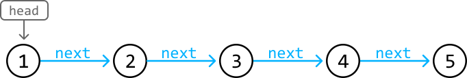
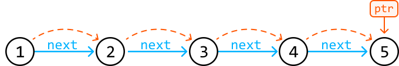
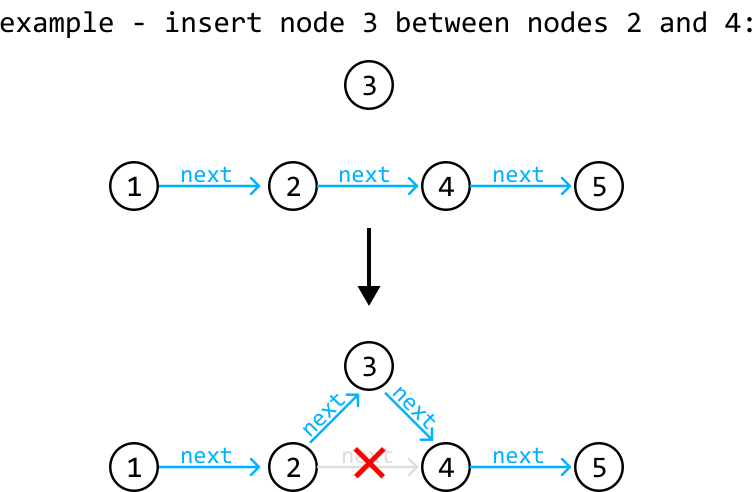
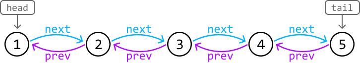
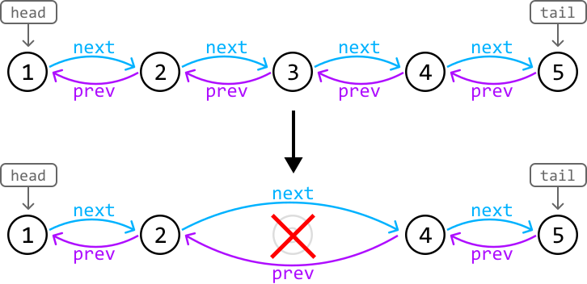
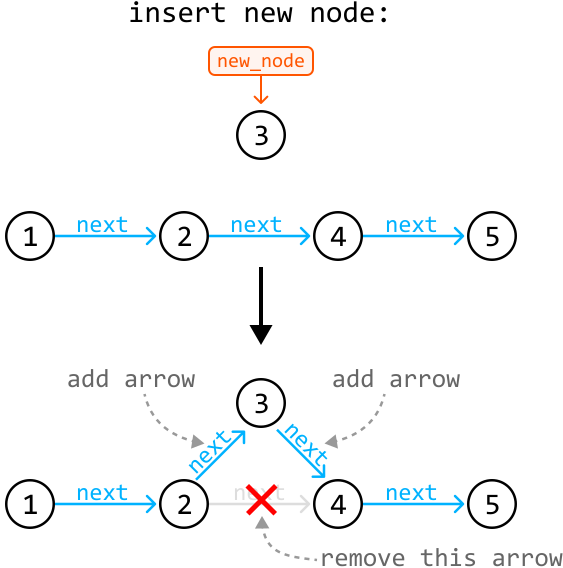
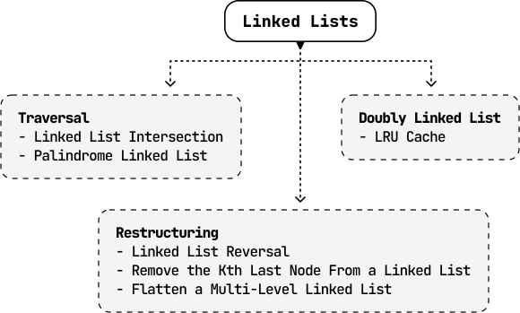

# Introduction to Linked Lists

## Intuition

A linked list is a data structure consisting of a sequence of nodes, where each node is linked to the next. A node in a linked list has two main components: the data it stores (`val`) and a reference to the next node (`next`) in the sequence:


We define a node using the `ListNode` class, as below:

```python
class ListNode:
   def __init__(self, val: int, next: ListNode):
       self.val = val
       self.next = next

```

```javascript
class ListNode {
  constructor(val = null, next = null) {
    this.val = val
    this.next = next
  }
}

```

```java
class ListNode<T> {
    T val;
    ListNode next;
    ListNode(T val) {
        this.val = val;
        this.next = null;
    }
}

```

**Singly linked list**

The simplest form of a linked list is a singly linked list, where each node points to the next node in the linked list, and the last node points to nothing (null), indicating the end of the linked list. The start of the linked list is called the ‘head,’ which is generally the only node we initially have immediate access to:



To access the other nodes in a linked list, we would need to traverse it starting at the head.



Singly linked lists can be used to store a collection of data. One of their main benefits lies in their **dynamic sizing** capability, since they can grow or shrink in size flexibly, unlike arrays which are fixed in size. Additionally, singly linked lists excel in scenarios requiring **frequent insertions and deletions**, as these operations can be performed more efficiently than in arrays, which need to shift elements to perform insertion or deletion.



The efficiency of these operations comes at the cost of the **inability to perform random access,** as nodes can’t be accessed by indexes like in an array. This trade-off may be acceptable in many use cases where the benefits of dynamic sizing and the efficiency of insertion/deletion outweigh the main performance benefits of random access.

**Doubly linked list**

A doubly linked list is an extended version of the linked list where each node contains two references: one to the next node (`next`), and one to the previous node (`prev`). In most implementations, doubly linked lists have immediate access to both the head node and the tail node.



A big advantage of doubly linked list is that it allows for **bidirectional traversal**. Additionally, deleting nodes in a doubly linked list is generally more straightforward because we have references to both the next and previous nodes:



## Pointer Manipulation

Many linked list interview problems require traversing or restructuring a linked list. Understanding and being proficient at pointer manipulation is essential to solving these problems. A useful tip is to visualize pointers as arrows that point from one node to another, and observe how these arrows should be moved to reflect the structural change. For example, this is how we would visualize a node insertion:



## Real-world Example

**Music Playlist**: Music player applications often use linked lists to implement playlists, particularly doubly linked lists, where each song node links to the next and previous songs. This structure enables efficient addition, removal, and reordering of songs because only the pointers between nodes need to be updated, rather than moving the song data in memory.

## Chapter Outline

In this chapter, we explore problems involving both singly and doubly linked lists. We also explore the unique challenge of restructuring a multi-level linked list.

