# Linked List Reversal

Reverse a singly linked list.

#### Example:

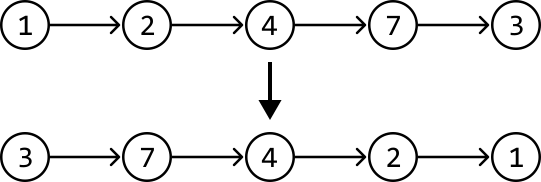

## Intuition - Iterative

A naive strategy is to store the values of the linked list in an array and reconstruct the linked list by traversing the array in reverse order. However, this solution does not reverse the original linked list; it just creates a new one. Could we try performing the reversal in place?

Let’s think about the problem in terms of pointer manipulation. The key observation here is that if we "flip" the direction of the pointers, we're effectively reversing the linked list:

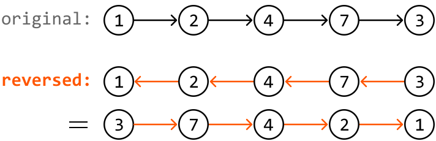

Now, we just need to figure out how to perform this pointer manipulation. Consider the example below:

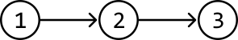

---

To reverse the direction of all pointers, we iterate through the nodes one by one. In this process, we need access to the current node (`curr_node`) and the previous node (`prev_node`) to adjust the current node's next pointer to the previous node. Note that `prev_node` will initially point at null since the first node has no previous node:

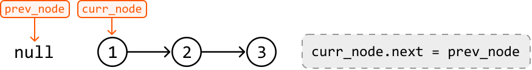

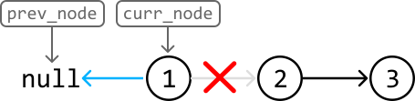

---

To reverse the next pointer, we'll need a way to shift the `curr_node` and `prev_node` pointers one node over. To shift `prev_node`, we can set it to the position of `curr_node`. However, we can't move `curr_node` to node 2 because we lost our reference to node 2:

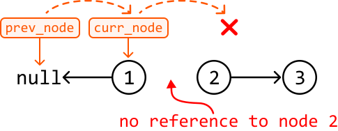

This suggests we should have preserved a reference to node 2 **before** reversing the `curr_node`. This can be done by creating a variable `next_node` and setting it to `curr_node.next`. Let’s assume we did this. Now, we can advance `prev_node` and `curr_node` forward by one:

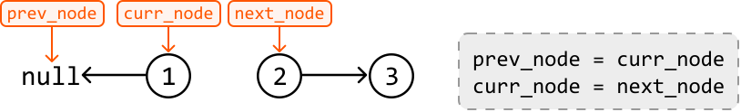

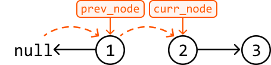

Note, we don't need to shift `next_node`, as it can be set by `curr_node.next` in the next iteration.

We can summarize this logic in three steps. At each node in the linked list:

- Save a reference to the next node (`next_node = curr_node.next`).

- Change the current node’s next pointer to link to the previous node (`curr_node.next = prev_node`).

- Move both `prev_node` and `curr_node` forward by one (`prev_node = curr_node`,`curr_node = next_node`).

---

Let's repeat these steps for the rest of the linked list:

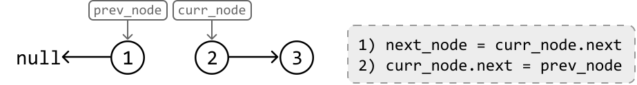

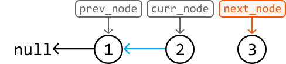

---

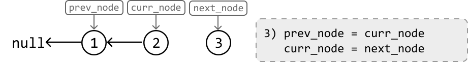

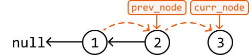

---

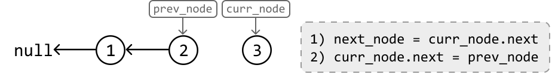

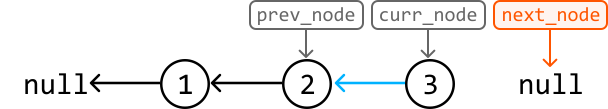

---

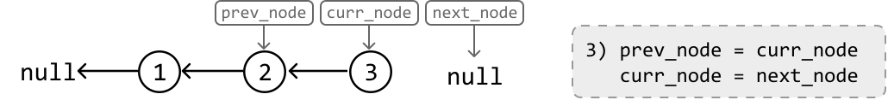

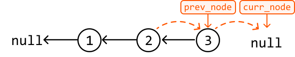

We can stop the reversal when `curr_node` becomes null, indicating there are no more nodes to reverse.

The final step is to return the head of the reversed linked list, which is pointed to by `prev_node` once `curr_node` becomes null.

## Implementation - Iterative

```python
from ds import ListNode
   
def linked_list_reversal(head: ListNode) -> ListNode:
    curr_node, prev_node = head, None
    # Reverse the direction of each node's pointer until 'curr_node' is null.
    while curr_node:
        next_node = curr_node.next
        curr_node.next = prev_node
        prev_node = curr_node
curr_node = next_node # 'prev_node' will be pointing at the head of the reversed linked list.
return prev_node

```

```javascript
import { ListNode } from './ds.js'

export function linked_list_reversal(head) {
  let currNode = head
  let prevNode = null
  // Reverse the direction of each node's pointer until 'currNode' is null.
  while (currNode) {
    const nextNode = currNode.next
    currNode.next = prevNode
    prevNode = currNode
    currNode = nextNode
  }
  // 'prevNode' will be pointing at the head of the reversed linked list.
  return prevNode
}

```

```java
import core.LinkedList.ListNode;

public class Main {
    public static ListNode<Integer> linked_list_reversal(ListNode<Integer> head) {
        ListNode<Integer> currNode = head;
        ListNode<Integer> prevNode = null;
        // Reverse the direction of each node's pointer until 'currNode' is null.
        while (currNode != null) {
            ListNode<Integer> nextNode = currNode.next;
            currNode.next = prevNode;
            prevNode = currNode;
            currNode = nextNode;
        }
        // 'prevNode' will be pointing at the head of the reversed linked list.
        return prevNode;
    }
}

```

### Complexity Analysis

**Time complexity:** The time complexity of `linked_list_reversal` is O(n), where n denotes the length of the linked list. This is because we perform constant-time pointer manipulation at each node of the linked list.

**Space complexity:** The space complexity is O(1).

## Intuition - Recursive

Sometimes, the interviewer may want the problem solved using recursion. Let’s see what a recursive solution to this problem would look like.

In a recursive solution, the problem is solved by **solving smaller instances of the same problem**. To solve these smaller subproblems, we would need to use the linked list reversal function (`linked_list_reversal`) in its own implementation. The process of solving smaller problems using recursive calls continues until the smallest version of the problem is solved.

The smallest version of this problem involves reversing a linked list of size 0 or 1. These are linked lists which are inherently the same as their reverse. So, these can be our **base cases**.

With this in mind, let's try crafting the logic of the recursive function using the example below:

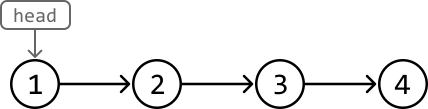

---

Think about which subproblem we should solve. To reverse the entire linked list, we can use our `linked_list_reversal` function to **reverse the sublist after the current node**. This way, we only need to focus on reversing the pointer of the current node. Let’s see how this works.

As mentioned, let’s first recursively call `linked_list_reversal` on the sublist starting at `head.next`. Let’s assume this recursive call reverses this sublist and returns its head as intended.

> 
> 
> When designing a recursive function, assume any recursive call to that function will behave as intended, even if the function hasn’t been fully implemented.
> 
> 

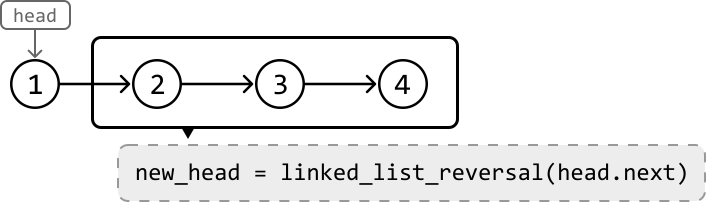

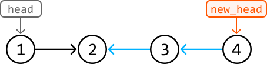

---

Next, we need the tail of the reversed sublist (node 2) to point to node 1. We can reference node 2 using `head.next`. So, all we need to do is set `head.next.next` to head as illustrated below:

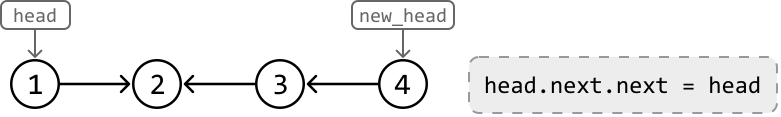

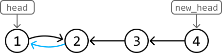

---

The linked list is almost fully reversed now, but node 1 is still pointing to node 2. To remove this link, just set `head.next` to null. Then, we can return `new_head`, which is the head of the reversed linked list:

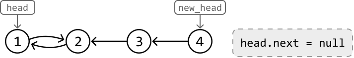

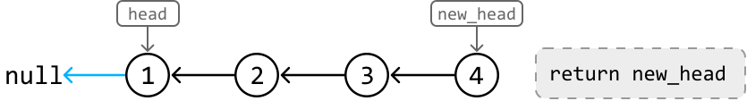

## Implementation - Recursive

```python
from ds import ListNode
   
def linked_list_reversal_recursive(head: ListNode) -> ListNode:
    # Base cases.
    if (not head) or (not head.next):
        return head
    # Recursively reverse the sublist starting at the next node.
    new_head = linked_list_reversal_recursive(head.next)
    # Connect the reversed sublist to the head node to fully reverse the entire linked list.
    head.next.next = head
    head.next = None
    return new_head

```

```javascript
import { ListNode } from './ds.js'

export function linked_list_reversal_recursive(head) {
  // Base cases.
  if (!head || !head.next) {
    return head;
  }
  // Recursively reverse the sublist starting at the next node.
  const newHead = linked_list_reversal_recursive(head.next);
  // Connect the reversed sublist to the head node to fully reverse the entire linked list.
  head.next.next = head;
  head.next = null;
  return newHead;
}

```

### Complexity Analysis

**Time complexity:** The time complexity of `linked_list_reversal_recursive` is O(n) because it involves a single recursive traversal through the linked list, visiting each node exactly once.

**Space complexity:** The space complexity is O(n) due to the stack space taken up by the recursive call stack, which grows up to n levels deep because n recursive calls are made.

## Interview Tip

*Tip: Visualize pointer manipulations.*

Often, it can be tricky to figure out exactly what to do when dealing with linked list manipulation. Drawing pointers as arrows between nodes can be quite helpful. By observing how these arrows should be reoriented to represent changes in the linked list's structure, we can deduce the necessary pointer manipulation logic. This approach also helps identify which nodes we need references to when making these changes.