# Remove the Kth Last Node From a Linked List

Return the head of a singly linked list after removing the kth node from the end of it.

#### Example:

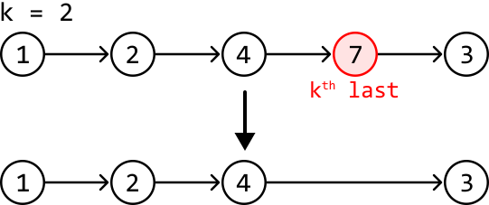

#### Constraints:

- The linked list contains at least one node.

## Intuition

We can divide this problem into two objectives:

- Find the position of the kth last node.

- Remove this node.

Let’s first understand how node removal works. Consider the example below, where we need to remove node b. To do this, we need access to the node preceding it (node a), so we can redirect the pointer of node a to skip over node b. This ensures node b is no longer reachable through linked list traversal:

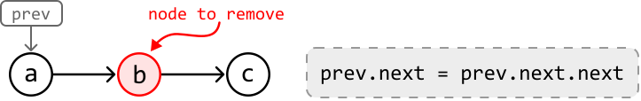

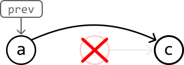

This indicates **we need to find the node directly before the kth last node** in order to remove it.

A naive solution to this problem is to first obtain the length of the linked list (n) by traversing it. Then, use this length to determine the number of steps required to arrive at the node before the kth last node, which is just n - k - 1 steps. This solution involves two for-loops, but is there a cleaner way to approach this problem?

The challenge with navigating a singly linked list in a single for-loop is that as we traverse, it’s hard to tell how far we are from the final node. The only way we’d know this is when we reach the final node itself, since its next node is null. How can we make use of this information?

Consider using two pointers instead of one. Could we create a scenario where, by the time one pointer reaches the end of the linked list, another pointer is positioned before the kth last node? Let’s explore this logic using the following example:

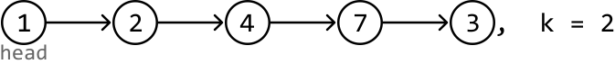

We denote the first pointer as leader and the pointer that follows it as trailer. When the leader pointer reaches the last node of the linked list, we want the trailer pointer to end up at node 4 (the node right before the kth last node) to prepare for deletion. In other words, the leader should be k nodes in front of the trailer when the leader reaches the last node.

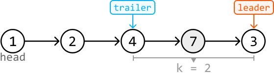

To achieve this, we can start by advancing the leader pointer through the linked list for k steps. When the leader pointer is k nodes ahead of the trailer, we can advance both pointers together until the leader reaches the last node. This process will be explained in more detail soon.

However, there’s an important edge case to consider first: **what if the head itself is the node we need to remove?** In this case, there’s no node before the head, so we cannot perform the removal, as mentioned earlier. To circumvent this, we can create a `dummy` node, place it before the head node, and start our traversal from there.

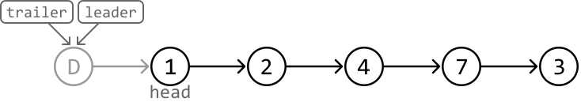

---

Let’s now try incorporating our strategy into the example.

First, advance the leader pointer k (2) times so it’s k nodes ahead of the trailer pointer:

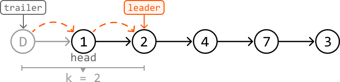

---

With the leader k nodes ahead, we can move both the trailer and leader pointers until the leader reaches the last node:

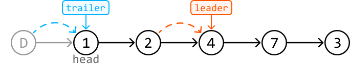

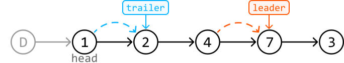

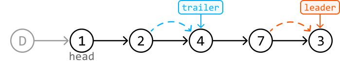

---

With the trailer pointer at the ideal position, we can remove node 7:

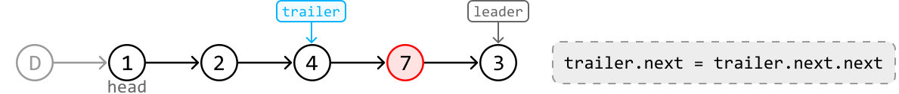

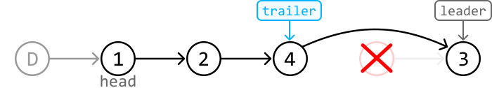

After this removal, we just return `dummy.next`, which points at the head of the modified linked list.

## Implementation

```python
from ds import ListNode
    
def remove_kth_last_node(head: ListNode, k: int) -> ListNode:
    # A dummy node to ensure there's a node before 'head' in case we need to remove
    # the head node.
    dummy = ListNode(-1)
    dummy.next = head
    trailer = leader = dummy
    # Advance 'leader' k steps ahead.
    for _ in range(k):
        leader = leader.next
        # If k is larger than the length of the linked list, no node needs to be
        # removed.
        if not leader:
            return head
    # Move 'leader' to the end of the linked list, keeping 'trailer' k nodes behind.
    while leader.next:
        leader = leader.next
        trailer = trailer.next
    # Remove the kth node from the end.
    trailer.next = trailer.next.next
    return dummy.next

```

```javascript
import { ListNode } from './ds.js'

export function remove_kth_last_node(head, k) {
  // A dummy node to ensure there's a node before 'head' in case we need to remove
  // the head node.
  const dummy = new ListNode(-1)
  dummy.next = head
  let trailer = dummy
  let leader = dummy
  // Advance 'leader' k steps ahead.
  for (let i = 0; i < k; i++) {
    leader = leader.next
    // If k is larger than the length of the linked list, no node needs to be
    // removed.
    if (!leader) {
      return head
    }
  }
  // Move 'leader' to the end of the linked list, keeping 'trailer' k nodes behind.
  while (leader.next) {
    leader = leader.next
    trailer = trailer.next
  }
  // Remove the kth node from the end.
  trailer.next = trailer.next.next
  return dummy.next
}

```

```java
import core.LinkedList.ListNode;

public class Main {
    public ListNode<Integer> remove_kth_last_node(ListNode<Integer> head, int k) {
        // A dummy node to ensure there's a node before 'head' in case we need to remove
        // the head node.
        ListNode<Integer> dummy = new ListNode<>(-1);
        dummy.next = head;
        ListNode<Integer> trailer = dummy;
        ListNode<Integer> leader = dummy;
        // Advance 'leader' k steps ahead.
        for (int i = 0; i < k; i++) {
            leader = leader.next;
            // If k is larger than the length of the linked list, no node needs to be
            // removed.
            if (leader == null) {
                return head;
            }
        }
        // Move 'leader' to the end of the linked list, keeping 'trailer' k nodes behind.
        while (leader.next != null) {
            leader = leader.next;
            trailer = trailer.next;
        }
        // Remove the kth node from the end.
        trailer.next = trailer.next.next;
        return dummy.next;
    }
}

```

### Complexity Analysis

**Time complexity:** The time complexity of `remove_kth_last_node` is O(n). This is because the algorithm first traverses at most n nodes of the linked list, and then two pointers traverse the linked list at most once each.

**Space complexity:** The space complexity is O(1).