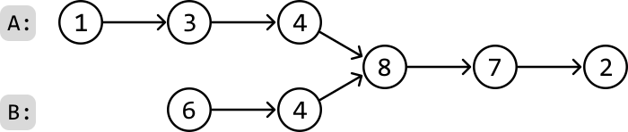
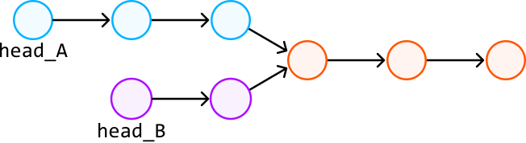
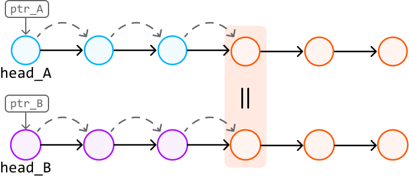
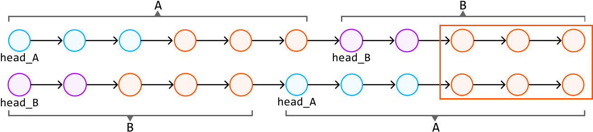
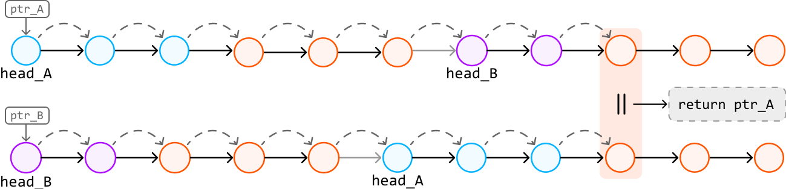
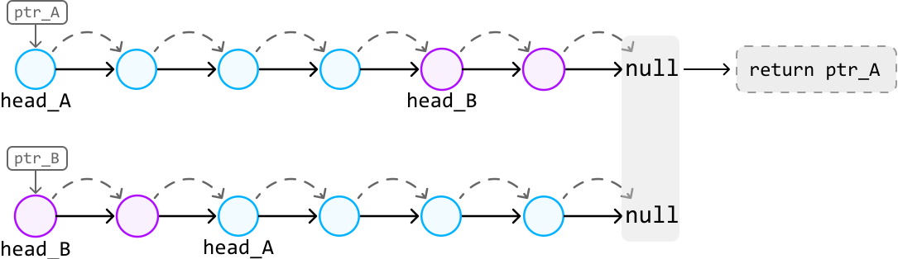
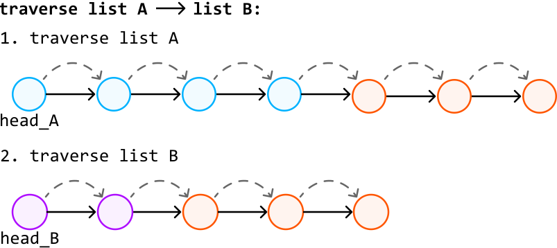

# Linked List Intersection

Return the node where two singly linked lists **intersect**. If the linked lists don't intersect, return null.

#### Example:



```python
Output: Node 8

```

## Intuition

Let’s first understand what an intersection between two linked lists is.

> 
> 
> An intersection occurs when two linked lists converge at a shared node and, from that point onwards, share all subsequent nodes.
> 
> 

Note, this intersection has nothing to do with the values of the nodes.

A naive approach is to use a hash set. We can traverse the first linked list once and store each node in a hash set. Next, we traverse the second linked list until we find the first node that exists in the hash set, signifying the intersection point since it’s the first node shared between the two linked lists. This approach solves the problem linearly, but can we find a solution that uses constant space?

Consider the following example:



Treating these as two separate linked lists can get confusing with the above visualization. Instead, let’s visualize the input as two linked lists to help us think about the problem more clearly. Note that the tail nodes are still shared between the two linked lists, we’re just visualizing them separately:


Notice that **this problem is easier to solve if the two linked lists are of equal length**. This is because the intersection node can be found at the same position from the heads of both linked lists. In other words, when we iterate through two linked lists of the same length, we’re guaranteed to reach the intersection node at the same time:



Could we somehow replicate this behavior when dealing with linked lists of varying lengths? The key observation is that, while two linked lists ‘list A’ and ‘list B’ may have different lengths, ‘list A → list B’ has the same length as ‘list B → list A’ (where ‘→’ represents the connection of two lists). Conveniently, these combined linked lists also share the same tail nodes:



We’ve now set up a scenario where we have two combined linked lists of the same length, which share the same tail nodes. By traversing these combined linked lists, we’ll eventually reach the intersection node simultaneously on both linked lists (if one exists).

To do this, we can traverse both combined linked lists with two pointers, and stop once the nodes at both pointers are the same. This node would be the intersection node:



If no intersection exists, both pointers will end up stopping at null nodes:

 



**Traversing combined linked lists**

An important observation is that to traverse through 'list A → list B', we don't actually need to connect these two linked lists together. Instead, we can traverse 'list A' and, upon reaching its end, continue by traversing 'list B':



This technique allows us to traverse the entire sequence of both linked lists as if they were connected.

## Implementation

```python
from ds import ListNode
   
def linked_list_intersection(head_A: ListNode, head_B: ListNode) -> ListNode:
    ptr_A, ptr_B = head_A, head_B
    # Traverse through list A with 'ptr_A' and list B with 'ptr_B' until they meet.
    while ptr_A != ptr_B:
        # Traverse list A -> list B by first traversing 'ptr_A' and then, upon
        # reaching the end of list A, continue the traversal from the head of list B.
        ptr_A = ptr_A.next if ptr_A else head_B
        # Simultaneously, traverse list B -> list A.
        ptr_B = ptr_B.next if ptr_B else head_A
    # At this point, 'ptr_A' and 'ptr_B' either point to the intersection node or both
    # are null if the lists do not intersect. Return either pointer.
    return ptr_A

```

```javascript
import { ListNode } from './ds.js'

export function linked_list_intersection(head_A, head_B) {
  let ptrA = head_A
  let ptrB = head_B
  // Traverse both lists until the two pointers meet
  while (ptrA !== ptrB) {
    // Move to the next node or switch to the other list's head
    ptrA = ptrA ? ptrA.next : head_B
    ptrB = ptrB ? ptrB.next : head_A
  }
  // Return the intersection node or null
  return ptrA
}

```

```java
import core.LinkedList.ListNode;

class UserCode {
    public static ListNode<Integer> linked_list_intersection(ListNode<Integer> head_A, ListNode<Integer> head_B) {
        ListNode<Integer> ptr_A = head_A;
        ListNode<Integer> ptr_B = head_B;
        // Traverse through list A with 'ptr_A' and list B with 'ptr_B' until they meet.
        while (ptr_A != ptr_B) {
            // Traverse list A -> list B by first traversing 'ptr_A' and then, upon
            // reaching the end of list A, continue the traversal from the head of list B.
            ptr_A = (ptr_A != null) ? ptr_A.next : head_B;
            // Simultaneously, traverse list B -> list A.
            ptr_B = (ptr_B != null) ? ptr_B.next : head_A;
        }
        // At this point, 'ptr_A' and 'ptr_B' either point to the intersection node or both
        // are null if the lists do not intersect. Return either pointer.
        return ptr_A;
    }
}

```

### Complexity Analysis

**Time complexity:** The time complexity of `linked_list_intersection` is O(n+m), where n and m denote the lengths of list A and B, respectively. This is because pointers linearly traverse both linked lists sequentially.

**Space complexity:** The space complexity is O(1).