# LRU Cache

Design and implement a data structure for the Least Recently Used (LRU) cache that supports the following operations:

- `LRUCache(capacity: int)`: Initialize an LRU cache with the specified capacity.

- `get(key: int) -> int`: Return the value associated with a key. Return -1 if the key doesn't exist.

- `put(key: int, value: int) -> None`: Add a key and its value to the cache. If adding the key would result in the cache exceeding its size capacity, **evict the least recently used element**. If the key already exists in the cache, update its value.

#### Example:

```python
Input: [
  put(1, 100),
  put(2, 250),
  get(2),
  put(4, 300),
  put(3, 200),
  get(4),
  get(1),
],
  capacity = 3
Output: [250, 300, -1]

```

Explanation:

```python
put(1, 100)  # cache is[1: 100]
put(2, 250)  # cache is[1: 100, 2: 250]
get(2)       # return 250
put(4, 300)  # cache is[1: 100, 2: 250, 4: 300]t
put(3, 200)  # cache is[2: 250, 4: 300, 3: 200]
get(4)       # return 300
get(1)       # key 1 was evicted when adding key 3 due to the capacity
             # limit: return -1

```

#### Constraints:

- All keys and values are positive integers.

- The cache capacity is positive.

## Intuition

When presented with a design problem, the first steps usually involve understanding the problem and deciding which data structures to use. Let's start by understanding how an LRU cache works at a high level.

Consider the LRU cache described below. It currently holds 3 elements and has reached full capacity. Assume that in this representation, the key-value pairs are ordered from the least recently used (left) to the most recently used (right):

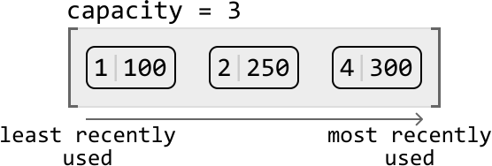

---

Let's try putting a new key-value pair into the cache:

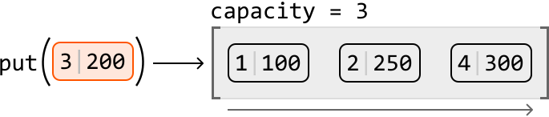

This new pair would effectively be the most recent in the cache, so we know it should be added at the most-recently-used end of the cache. Since the cache is currently at maximum capacity, we need to make room for the new pair by first evicting the least recently used pair:

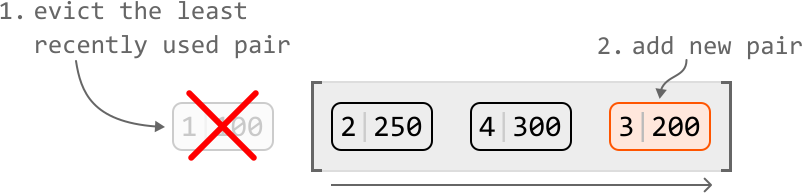

From this high-level overview, we can summarize operations we need to implement the `put` function:

- Remove a key-value pair from the least recently used end of the cache.

- Add a key-value pair to the most recently used end of the cache.

---

Now, let's try retrieving a value from this example cache. If we perform `get(2)`, we expect it to return 250. Accessing this pair would effectively make it the most recently used pair. So, we should move it to the most recently used end of the cache:


From this example, we identified two key operations for the `get` function:

- Move a key-value pair to the most recent end of the cache.

- Access a value using its key.

---

We’ve now narrowed the design down to the four main operations listed above. These will help us identify which data structures we can employ to design the LRU cache.

**Choosing data structures**

\underline{\text{Operations 1 and 2}}

The first two operations involve adding and removing key-value pairs. Specifically, we need the ability to remove a key-value pair from one end of a data structure (representing the least recently used end) and add a key-value pair to the other.

Which data structure allows us to efficiently add or remove an element from it? A suitable data structure for these operations is a linked list, particularly because we can add and remove a node in constant time if we have a reference to that node. But should we use a singly or doubly linked list?

\underline{\text{Singly vs. doubly linked list}}

Adding or removing a node from the head of a linked list takes O(1) time, whether it’s a singly or doubly linked list. However, removing the tail node from a singly linked list takes O(n) time, even with a reference to the tail, because we need to traverse the list to access the node before the tail. In contrast, a doubly linked list allows O(1) removal of the tail because each node has a reference to its previous node, enabling direct access without traversal. So, let’s choose the **doubly linked list**.

An important feature we need is the ability to access both ends of the doubly linked list when adding or removing nodes. With this in mind, let's establish some definitions:

- The tail of the linked list signifies the most frequently used node.

- The head of the linked list signifies the least recently used node.

To reference the ends of the linked list, we can establish head and tail nodes, where head points to the least recently used node, and tail points to the most recently used node:


\underline{\text{Operations 3 and 4}}

Operation 3 indicates that we’ll need to be able to move a node to the most recently-used end of the cache, and that this node doesn’t necessarily need to be at the head or tail of the linked list. If this node was somewhere in the middle, we’d need to traverse the linked list to find it. Is there a way we could access this node in O(1) time? Since this node is associated with a key, we could use a **hash map** to store key-node pairs. This allows us to access a node by its key in constant time. The diagram below illustrates how the hash map's values are references to nodes in the linked list:

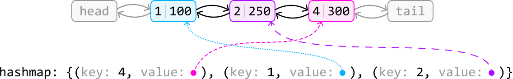

Using a hash map also addresses operation 4 regarding efficient access to values from their keys.

Now we’ve decided on using a doubly linked list and a hash map to represent the LRU cache, let’s examine how the `put` and `get` functions would be implemented.

**put(key: int, val: int) -> None:**

Below is the flow for adding a new key-value pair to the cache. This involves correctly updating the linked list and the hash map, while ensuring the cache does not exceed its capacity:

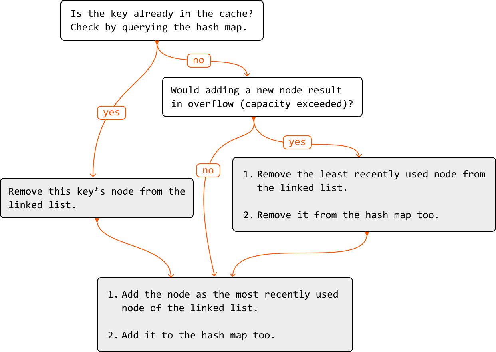

To better understand how to add a new node to a doubly linked list that’s at maximum capacity, check out the following example:

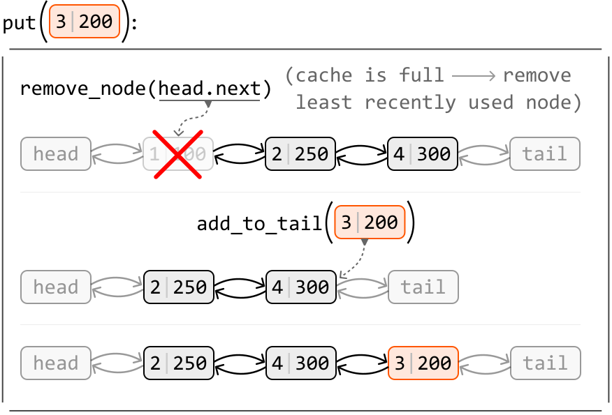

As you can see, we’ll need a function to remove a node (`remove_node`), as well as a function to add a node to the tail of the linked list (`add_to_tail`). We discuss these functions in more detail in the implementation section.

---

**get(key: int) -> int:**

Below is the process for retrieving a key's value from the cache:

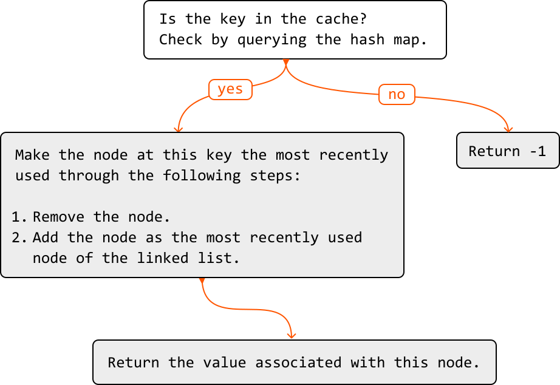

Now let’s take a look at an example of how the doubly linked list is updated during a `get` function call:


---

Now that we understand how the doubly linked list and hash map are used to design the LRU cache, let's dive into its implementation details, including the details of the helper methods `remove_node` and `add_to_tail`.

## Implementation

We can use the custom class below to represent a node in a doubly linked list:

```python
class DoublyLinkedListNode:
   def __init__(self, key: int, val: int):
       self.key = key
       self.val = val
       self.next = self.prev = None

```

```javascript
class DoublyLinkedListNode {
  constructor(key, val) {
    this.key = key
    this.val = val
    this.prev = this.next = null
  }
}

```

```java
class DoublyLinkedListNode {
    int key;
    int val;
    DoublyLinkedListNode next;
    DoublyLinkedListNode prev;

    public DoublyLinkedListNode(int key, int val) {
        this.key = key;
        this.val = val;
        this.next = null;
        this.prev = null;
    }
}

```

The example below illustrates how to add a node to the tail of the linked list. Let's refer to the node before the tail as `prev_node`.

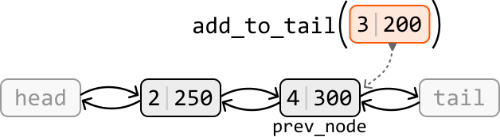

The new node should appear after `prev_node` and before the tail node. Let’s set the new node’s `prev` and `next` pointers to reflect this:

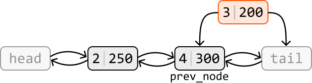

Now connect prev_node and tail to the new node:

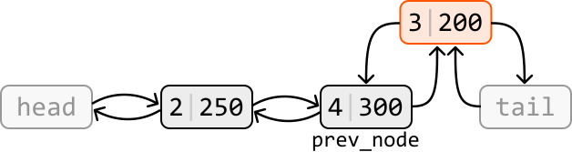

Below is the implementation of this function:

```python
def add_to_tail(self, node: DoublyLinkedListNode) -> None:
    prev_node = self.tail.prev
    node.prev = prev_node
    node.next = self.tail
    prev_node.next = node
    self.tail.prev = node

```

```javascript
addToTail(node) {
    const prevNode = this.tail.prev;
    node.prev = prevNode;
    node.next = this.tail;
    prevNode.next = node;
    this.tail.prev = node;
}

```

```java
private void addToTail(DoublyLinkedListNode node) {
    DoublyLinkedListNode prevNode = tail.prev;
    node.prev = prevNode;
    node.next = tail;
    prevNode.next = node;
    tail.prev = node;
}

```

The example below illustrates how to remove a node from the doubly linked list:

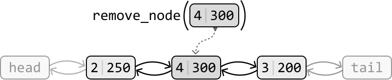

To remove a node, we make its two adjacent nodes point at each other, effectively excluding the node to be removed from the linked list:


Below is the implementation of this function:

```python
def remove_node(self, node: DoublyLinkedListNode) -> None:
    node.prev.next = node.next
    node.next.prev = node.prev

```

```javascript
removeNode(node) {
    node.prev.next = node.next;
    node.next.prev = node.prev;
}

```

```java
private void removeNode(DoublyLinkedListNode node) {
    node.prev.next = node.next;
    node.next.prev = node.prev;
}

```

With the help of the above two functions, we can complete the full implementation of the LRU cache.

**LRU Cache**

```python
class DoublyLinkedListNode:
    def __init__(self, key: int, val: int):
        self.key = key
        self.val = val
        self.next = self.prev = None
    
class LRUCache:
    def __init__(self, capacity: int):
        self.capacity = capacity
        # A hash map that maps keys to nodes.
        self.hashmap = {}
        # Initialize the head and tail dummy nodes and connect them to 
        # each other to establish a basic two-node doubly linked list.
        self.head = DoublyLinkedListNode(-1, -1)
        self.tail = DoublyLinkedListNode(-1, -1)
        self.head.next = self.tail
        self.tail.prev = self.head
    
    def get(self, key: int) -> int:
        if key not in self.hashmap:
            return -1
        # To make this key the most recently used, remove its node and
        # re-add it to the tail of the linked list.
        self.remove_node(self.hashmap[key])
        self.add_to_tail(self.hashmap[key])
        return self.hashmap[key].val
    
    def put(self, key: int, value: int) -> None:
        # If a node with this key already exists, remove it from the
        # linked list.
        if key in self.hashmap:
            self.remove_node(self.hashmap[key])
        node = DoublyLinkedListNode(key, value)
        self.hashmap[key] = node
        # Remove the least recently used node from the cache if adding
        # this new node will result in an overflow.
        if len(self.hashmap) > self.capacity:
            del self.hashmap[self.head.next.key]
            self.remove_node(self.head.next)
        self.add_to_tail(node)
    
    def add_to_tail(self, node: DoublyLinkedListNode) -> None:
        prev_node = self.tail.prev
        node.prev = prev_node
        node.next = self.tail
        prev_node.next = node
        self.tail.prev = node
    
    def remove_node(self, node: DoublyLinkedListNode) -> None:
        node.prev.next = node.next
        node.next.prev = node.prev

```

```javascript
class DoublyLinkedListNode {
  constructor(key, val) {
    this.key = key
    this.val = val
    this.prev = this.next = null
  }
}

export class LRUCache {
  constructor(capacity) {
    this.capacity = capacity
    // A hash map that maps keys to nodes.
    this.hashmap = new Map()
    // Initialize the head and tail dummy nodes and connect them to each other to
    // establish a basic two-node doubly linked list.
    this.head = this.tail = new DoublyLinkedListNode(-1, -1)
    this.head.next = this.tail
    this.tail.prev = this.head
  }

  get(key) {
    if (!this.hashmap.has(key)) {
      return -1
    }
    // To make this key the most recently used, remove its node and re-add it to
    // the tail of the linked list.
    const node = this.hashmap.get(key)
    this.removeNode(node)
    this.addToTail(node)
    return node.val
  }

  put(key, value) {
    // If a node with this key already exists, remove it from the linked list.
    if (this.hashmap.has(key)) {
      this.removeNode(this.hashmap.get(key))
    }
    const node = new DoublyLinkedListNode(key, value)
    this.hashmap.set(key, node)
    // Remove the least recently used node from the cache if adding this new node
    // will result in an overflow.
    if (this.hashmap.size > this.capacity) {
      const lru = this.head.next
      this.removeNode(lru)
      this.hashmap.delete(lru.key)
    }
    this.addToTail(node)
  }

  // Removes a node from the doubly linked list.
  removeNode(node) {
    node.prev.next = node.next
    node.next.prev = node.prev
  }

  // Adds a node to the end (tail) of the doubly linked list.
  addToTail(node) {
    const prevNode = this.tail.prev
    node.prev = prevNode
    node.next = this.tail
    prevNode.next = node
    this.tail.prev = node
  }
}

```

```java
import java.util.HashMap;

class DoublyLinkedListNode {
    int key;
    int val;
    DoublyLinkedListNode prev;
    DoublyLinkedListNode next;

    public DoublyLinkedListNode(int key, int val) {
        this.key = key;
        this.val = val;
        this.prev = null;
        this.next = null;
    }
}

class LRUCache {
    private int capacity;
    // A hash map that maps keys to nodes.
    private HashMap<Integer, DoublyLinkedListNode> hashmap;
    // Initialize the head and tail dummy nodes and connect them to
    // each other to establish a basic two-node doubly linked list.
    private DoublyLinkedListNode head;
    private DoublyLinkedListNode tail;

    public LRUCache(Integer capacity) {
        this.capacity = capacity;
        this.hashmap = new HashMap<>();
        this.head = new DoublyLinkedListNode(-1, -1);
        this.tail = new DoublyLinkedListNode(-1, -1);
        this.head.next = this.tail;
        this.tail.prev = this.head;
    }

    public Integer get(Integer key) {
        if (!hashmap.containsKey(key)) {
            return -1;
        }
        // To make this key the most recently used, remove its node and
        // re-add it to the tail of the linked list.
        DoublyLinkedListNode node = hashmap.get(key);
        removeNode(node);
        addToTail(node);
        return node.val;
    }

    public void put(Integer key, Integer value) {
        // If a node with this key already exists, remove it from the
        // linked list.
        if (hashmap.containsKey(key)) {
            removeNode(hashmap.get(key));
        }
        DoublyLinkedListNode node = new DoublyLinkedListNode(key, value);
        hashmap.put(key, node);
        // Remove the least recently used node from the cache if adding
        // this new node will result in an overflow.
        if (hashmap.size() > capacity) {
            DoublyLinkedListNode lru = head.next;
            hashmap.remove(lru.key);
            removeNode(lru);
        }
        addToTail(node);
    }

    private void addToTail(DoublyLinkedListNode node) {
        DoublyLinkedListNode prevNode = tail.prev;
        node.prev = prevNode;
        node.next = tail;
        prevNode.next = node;
        tail.prev = node;
    }

    private void removeNode(DoublyLinkedListNode node) {
        node.prev.next = node.next;
        node.next.prev = node.prev;
    }
}

```

### Complexity Analysis

**Time complexity:** The time complexity for the helper functions `remove_node` and `add_tail_node` is O(1) because they perform constant-time operations on a doubly linked list. The `put` and `get` functions utilize these helper functions, while also performing constant-time hash map operations. Consequently, they also have an O(1) time complexity.

**Space complexity:** The overall space complexity of this solution is O(n), where n is the capacity of the cache. This is because both the doubly linked list and hash map can each occupy O(n) space.

### Interview Tip

*Tip: Explore how combining data structures can help achieve certain functionality.*

It’s possible to encounter situations where no single data structure provides the functionality required for your solution. In such cases, try to work out if this functionality can be achieved using a combination of data structures. For instance, in this problem we combined a doubly-linked list and a hash map to achieve the functionality required for the LRU cache.