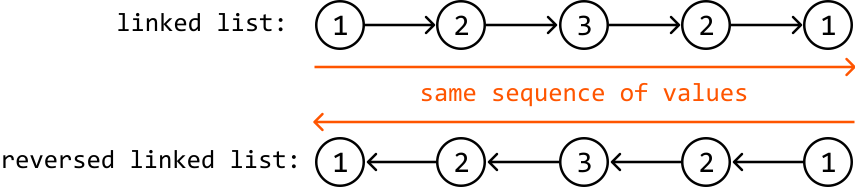
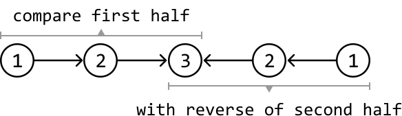
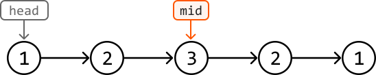
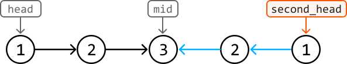

# Palindromic Linked List

Given the head of a singly linked list, determine if it's a palindrome.

#### Example 1:


```python
Output: True

```

#### Example 2:


```python
Output: False

```

## Intuition

A linked list would be palindromic if its values read the same forward and backward. A naive way to check this would be to store all the values of the linked list in an array, allowing us to freely traverse these values forward and backward to confirm if it’s palindromic. However, this takes linear space. Instead, it would be better if we had a way to traverse the linked list in reverse order to confirm if it's a palindrome. Is there a way to go about this?

Going off the above definition, we know that if a linked list is a palindrome, reversing it would result in the same sequence of values.



This means we could create a copy of the linked list, reverse it, and compare its values with the original linked list. However, this would still take up linear space. Can we adjust this idea to avoid creating a new linked list?

An important observation is that we only need to **compare the first half of the original linked list with the reverse of the second half** (if there are an odd number of elements, we can just include the middle node in both halves) to check if the linked list is a palindrome:



---

Before we can perform this comparison, we need to:

- Find the middle of the linked list to get the head of the second half.

- Reverse the second half of the linked list from this middle node.

Notice that step 2 involves modifying the input. In this problem, let’s assume this is acceptable. However, **it's always good to check with the interviewer if changing the input is allowed before moving forward with the solution**.

Now, let’s see how these two steps can be applied. Start by obtaining the middle node (`mid`) of the linked list.



To learn how to get to the middle of a linked list, read the explanation in the *Linked List Midpoint* problem in the *Fast and Slow Pointers* chapter.

---

Then, reverse the second half of the linked list starting at `mid`. The last node of the original linked list becomes the head of the second half. This second head is used to traverse the newly reversed second half.



To learn how to reverse a linked list in O(n) time, read the explanation in the *Reverse Linked List* problem in this chapter.

---

The last thing we need to do is check if the first half matches the now-reversed second half. We can do this by simultaneously traversing both halves node by node, and comparing each node from the first half to the corresponding node from the second half. If at any point the node values don't match, it indicates the linked list is not a palindrome.

We can use two pointers (`ptr1` and `ptr2`) to iterate through the first and the reversed second half of the linked list, respectively:


## Implementation

```python
from ds import ListNode
    
def palindromic_linked_list(head: ListNode) -> bool: 
    # Find the middle of the linked list and then reverse the second half of the # linked list starting at this midpoint.
    mid = find_middle(head)
    second_head = reverse_list(mid)
    # Compare the first half and the reversed second half of the list
    ptr1, ptr2 = head, second_head
    res = True
    while ptr2:
        if ptr1.val != ptr2.val:
            res = False
        ptr1, ptr2 = ptr1.next, ptr2.next
    return res
    
# From the 'Reverse Linked List' problem.
def reverse_list(head: ListNode) -> ListNode:
    prevNode, currNode = None, head
    while currNode:
        nextNode = currNode.next
        currNode.next = prevNode
        prevNode = currNode
        currNode = nextNode
    return prevNode
    
# From the 'Linked List Midpoint' problem.
def find_middle(head: ListNode) -> ListNode:
    slow = fast = head
    while fast and fast.next:
        slow = slow.next
        fast = fast.next.next
    return slow

```

```javascript
import { ListNode } from './ds.js'

export function palindromic_linked_list(head) {
  // Find the middle of the linked list and then reverse the second half.
  const mid = find_middle(head)
  const secondHead = reverse_list(mid)
  // Compare the first half and the reversed second half of the list.
  let ptr1 = head
  let ptr2 = secondHead
  let isPalindrome = true
  while (ptr2 !== null) {
    if (ptr1.val !== ptr2.val) {
      isPalindrome = false
      break
    }
    ptr1 = ptr1.next
    ptr2 = ptr2.next
  }
  return isPalindrome
}

// Reverses a linked list.
function reverse_list(head) {
  let prevNode = null
  let currNode = head
  while (currNode !== null) {
    const nextNode = currNode.next
    currNode.next = prevNode
    prevNode = currNode
    currNode = nextNode
  }
  return prevNode
}

// Finds the midpoint of a linked list.
function find_middle(head) {
  let slow = head
  let fast = head
  while (fast !== null && fast.next !== null) {
    slow = slow.next
    fast = fast.next.next
  }
  return slow
}

```

```java
import core.LinkedList.ListNode;

public class Main {
    public static Boolean palindromic_linked_list(ListNode<Integer> head) {
        // Find the middle of the linked list and then reverse the second half of the
        // linked list starting at this midpoint.
        ListNode<Integer> mid = findMiddle(head);
        ListNode<Integer> secondHead = reverseList(mid);
        // Compare the first half and the reversed second half of the list
        ListNode<Integer> ptr1 = head;
        ListNode<Integer> ptr2 = secondHead;
        boolean res = true;
        while (ptr2 != null) {
            if (!ptr1.val.equals(ptr2.val)) {
                res = false;
                break;
            }
            ptr1 = ptr1.next;
            ptr2 = ptr2.next;
        }
        return res;
    }

    // From the 'Reverse Linked List' problem.
    public static ListNode<Integer> reverseList(ListNode<Integer> head) {
        ListNode<Integer> prevNode = null;
        ListNode<Integer> currNode = head;
        while (currNode != null) {
            ListNode<Integer> nextNode = currNode.next;
            currNode.next = prevNode;
            prevNode = currNode;
            currNode = nextNode;
        }
        return prevNode;
    }

    // From the 'Linked List Midpoint' problem.
    public static ListNode<Integer> findMiddle(ListNode<Integer> head) {
        ListNode<Integer> slow = head;
        ListNode<Integer> fast = head;
        while (fast != null && fast.next != null) {
            slow = slow.next;
            fast = fast.next.next;
        }
        return slow;
    }
}

```

### Complexity Analysis

**Time complexity:** The time complexity of `palindromic_linked_list` is O(n), where n denotes the length of the linked list. This is because it involves iterating through the linked list three times: once to find the middle node, once to reverse the second half, and once more to compare the two halves.

**Space complexity:** The space complexity is O(1).

## Interview Tip

Tip: Confirm if it’s acceptable to modify the linked list. In our solution, we reversed the second half of the linked list which dismantled the input’s initial structure. Why does this matter? Oftentimes, the input data structure should not be modified, particularly if it's shared or accessed concurrently. As such, it’s important to confirm with your interviewer whether input modification is acceptable and to briefly address the implications of this.