# Flatten a Multi-Level Linked List

In a multi-level linked list, each node has a `next` pointer and `child` pointer. The next pointer connects to the subsequent node in the same linked list, while the child pointer points to the head of a new linked list under it. This creates multiple levels of linked lists. If a node does not have a child list, its `child` attribute is set to null.

**Flatten** the multi-level linked list into a single-level linked list by linking the end of each level to the start of the next one.

#### Example:

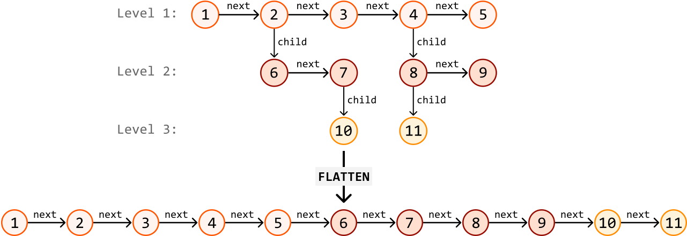

## Intuition

Consider the two main conditions required to form the flattened linked list:

- The order of the nodes on each level needs to be preserved.

- All the nodes in one level must connect before appending nodes from the next level.

The challenge with this problem is figuring out how we process linked lists in lower levels. One strategy that might come to mind is level-order traversal using breadth-first search. However, breadth-first search usually involves the use of a queue, which would result in at least a linear space complexity. Is there a way we could merge the levels of the linked lists in place?

A key observation is that **for any level of the multi-level linked list, we have direct access to all the nodes on the next level**. This is because each node’s child node at any given level ‘L’ has direct access to nodes on the next level ‘L + 1’:

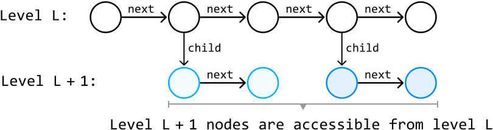

How can we connect the nodes on level ‘L + 1’ to the end of level ‘L’? Since we have access to the nodes at the next level from the current level’s child pointers, we can append each child linked list to the end of the current level, which effectively merges these two levels into one.

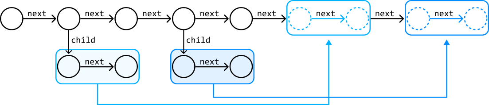

So, with all the nodes on level ‘L + 1’ appended to level ‘L’, we can continue this process by appending nodes from level ‘L + 2’ to level ‘L + 1’, and so on.

Now that we have a high-level idea about what we should do, let’s try this strategy on the following example:

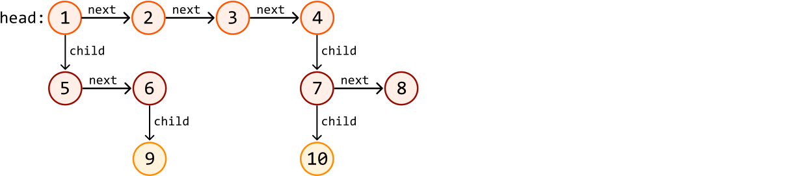

---

We’ll start by appending level 2’s nodes to the end of level 1. Before we can do this, we would need a reference to level 1’s tail node so we can easily add nodes to the end of the linked list. To set this reference, we'll create a tail pointer and advance it through level 1's linked list until it reaches the last node, which happens when tail.next is equal to null:


---

Now, let’s add the child linked lists (5 → 6 and 7 → 8) to the tail node. We must keep the tail pointer fixed at the end of the linked list, so let’s introduce a separate pointer, `curr`, to traverse the linked list. Whenever `curr` encounters a node with a child node that isn’t null, we know we’ve found a child linked list. In the example, the first node (node 1) has a child linked list, which we want to add to the tail node:

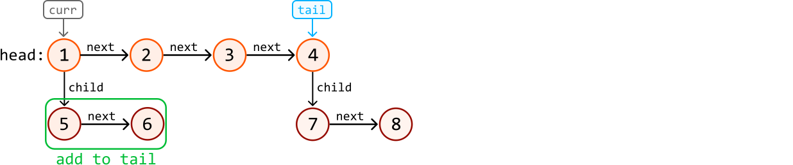

To add this child linked list to the end of the tail node, set tail.next to the head of the child list:

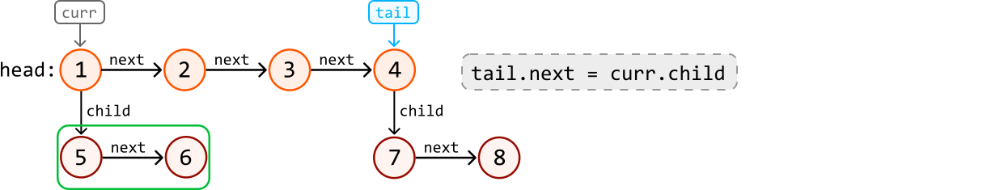

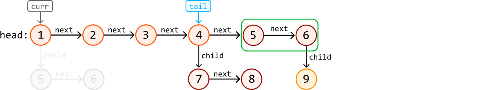

Before incrementing `curr` to find the next node with a child linked list, we need to readjust the position of the tail pointer so it’s pointing at the last node of the newly extended linked list (node 6 in this case). Again, we can do this by iterating the tail pointer until its next node is null:

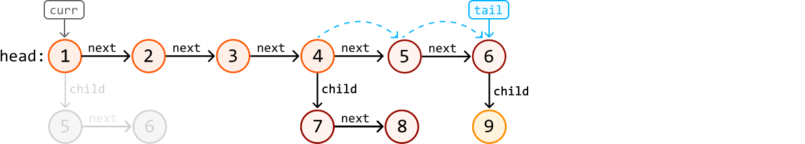

---

With the tail pointer now repositioned, we can continue this process of:

- Finding the next node with a child linked list using the `curr` pointer.

- Adding the child linked list to the tail node.

- Advancing the tail pointer to the last node of the flattened linked list.

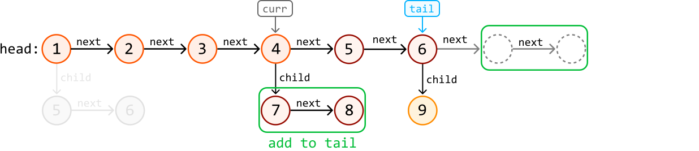

---

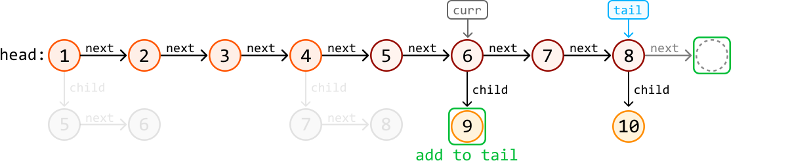

---

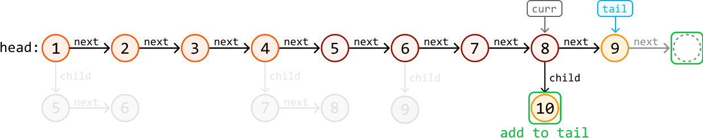

---

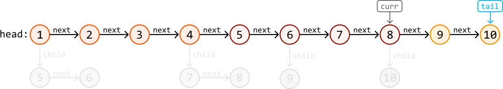

After the process is complete, we can return head, which is the head of the flattened linked list.

One last important detail to mention is that after appending any child linked list to the tail, we should nullify the `child` attribute to ensure the linked list is fully flattened.

## Implementation

The definition of the `MultiLevelListNode` class is provided below:

```python
class MultiLevelListNode:
    def __init__(self, val, next, child):
        self.val = val
        self.next = next
        self.child = child

```

```javascript
class MultiLevelListNode {
  constructor(val = null, next = null, child = null) {
    this.val = val
    this.next = next
    this.child = child
  }
}

```

```java
public class MultiLevelListNode<T> {
    T val;
    MultiLevelListNode<T> next;
    MultiLevelListNode<T> child;
}

```

```python
from ds import MultiLevelListNode
   
def flatten_multi_level_list(head: MultiLevelListNode) -> MultiLevelListNode:
    if not head:
        return None
    tail = head
    # Find the tail of the linked list at the first level.
    while tail.next:
        tail = tail.next
    curr = head
    # Process each node at the current level. If a node has a child linked list,
    # append it to the tail and then update the tail to the end of the extended linked
    # list. Continue until all nodes at the current level are processed.
    while curr:
        if curr.child:
            tail.next = curr.child
            curr.child = None
            while tail.next:
                tail = tail.next
        curr = curr.next
    return head

```

```javascript
import { MultiLevelListNode } from './ds.js'

export function flatten_multi_level_list(head) {
  if (!head) {
    return null
  }
  let tail = head
  // Find the tail of the linked list at the first level.
  while (tail.next) {
    tail = tail.next
  }
  let curr = head
  // Process each node at the current level. If a node has a child linked list,
  // append it to the tail and then update the tail to the end of the extended
  // linked list. Continue until all nodes at the current level are processed.
  while (curr) {
    if (curr.child) {
      tail.next = curr.child
      // Disconnect the child linked list from the current node.
      curr.child = null
      while (tail.next) {
        tail = tail.next
      }
    }
    curr = curr.next
  }
  return head
}

```

```java
public class Main {
    public static MultiLevelListNode flatten_multi_level_list(MultiLevelListNode head) {
        if (head == null) {
            return null;
        }
        MultiLevelListNode tail = head;
        // Find the tail of the linked list at the first level.
        while (tail.next != null) {
            tail = tail.next;
        }
        MultiLevelListNode curr = head;
        // Process each node at the current level. If a node has a child linked list,
        // append it to the tail and then update the tail to the end of the extended linked
        // list. Continue until all nodes at the current level are processed.
        while (curr != null) {
            if (curr.child != null) {
                tail.next = curr.child;
                curr.child = null;
                while (tail.next != null) {
                    tail = tail.next;
                }
            }
            curr = curr.next;
        }
        return head;
    }
}

```

### Complexity Analysis

**Time complexity:** The time complexity of `flatten_multi_level_list` is O(n), where n denotes the number of nodes in the multi-level linked list. This is because we iterate through each node in the multi-level linked list at most twice: once to iterate tail and once to iterate `curr`.

**Space complexity:** We only allocated a constant number of variables, so the space complexity is O(1).