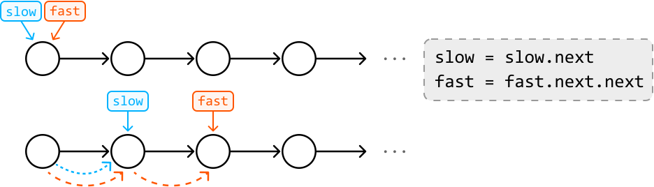
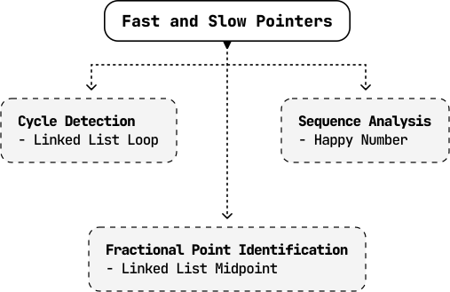

# Introduction to Fast and Slow Pointers

## Intuition

The fast and slow pointer technique is a specialized variant of the two-pointer pattern, characterized by the differing speeds at which two pointers traverse a data structure. In this technique, we designate a fast pointer and a slow pointer:

- Usually, **the** **slow pointer moves one step** in each iteration.

- Usually, **the fast pointer moves two steps** in each iteration.

This creates a dynamic in which the fast pointer moves at twice the speed of the slow pointer:

Keep in mind these pointers aren't limited to just one and two steps. As long as the fast pointer advances more steps than the slow pointer does, the logic of the fast and slow pointer technique still applies.

## Real-world Example

**Detecting cycles in symlinks**: Symlinks are shortcuts that point to files or directories in a file system. A real-world example of using the fast and slow pointer technique is detecting cycles in symlinks.

In this process, the slow pointer follows each symlink one step at a time, while the fast pointer moves two steps at a time. If the fast pointer catches up to the slow pointer, it indicates a loop in the symlinks, which can cause infinite loops or errors when accessing files. To understand how fast and slow pointers detect cycles in this way, study the *Linked List Loop* problem.

## Chapter Outline

Fast and slow pointers are particularly beneficial in data structures like linked lists, where index-based access isn't available. They allow us to gather crucial information about the data structure's elements through the relative positions of the two pointers, rather than with indexing. This will become clearer as we explore some common use cases in this chapter.

