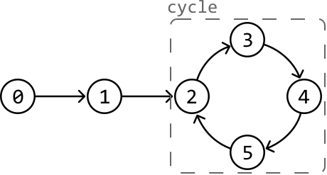
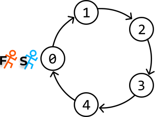
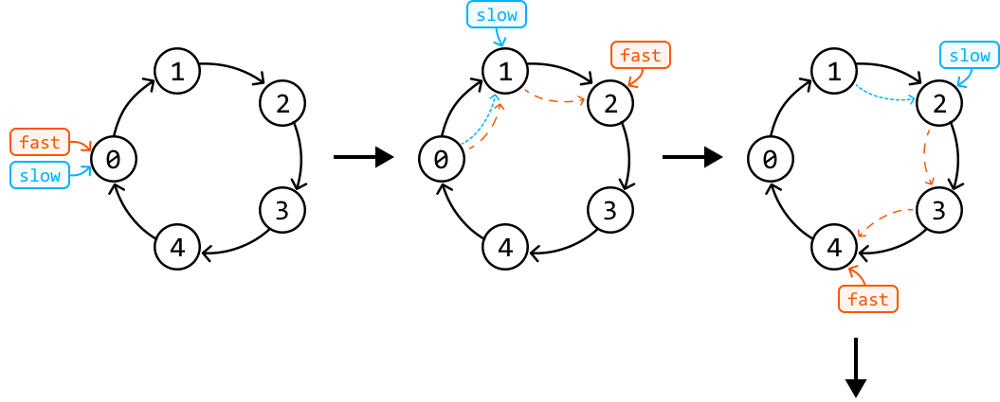
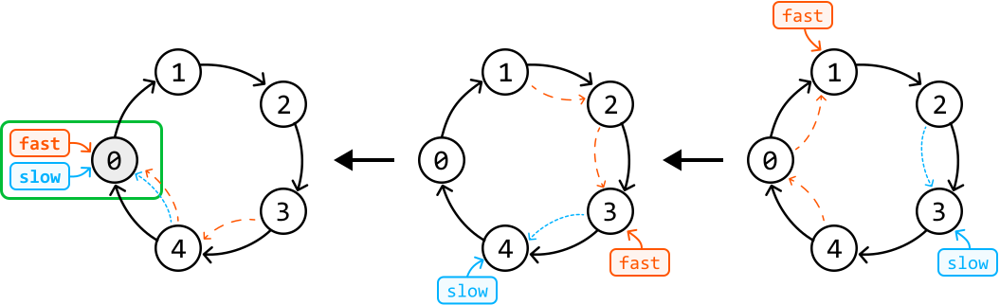
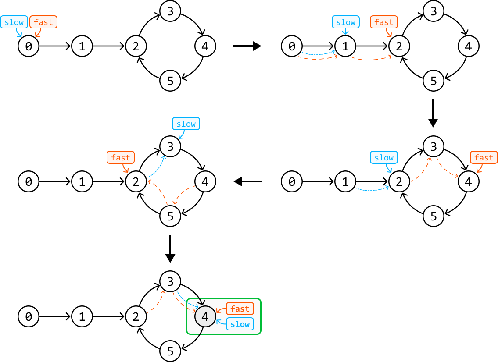
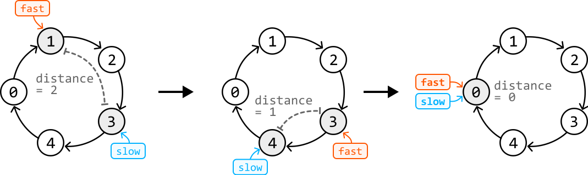
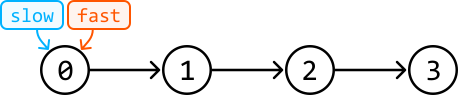
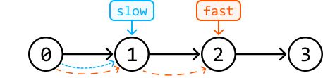
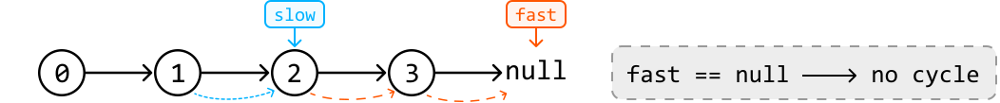

# Linked List Loop

Given a singly linked list, determine if it contains a **cycle**. A cycle occurs if a node's next pointer references an earlier node in the linked list, causing a loop.

#### Example:



```python
Output: True

```

## Intuition

A straightforward approach is to iterate through the linked list while keeping track of the nodes that were already visited in a hash set. Encountering a previously-visited node during the traversal indicates the presence of a cycle. Below is the code snippet for this approach:

```python
from ds import ListNode
    
def linked_list_loop_naive(head: ListNode) -> bool:
    visited = set()
    curr = head
    while curr:
        # Cycle detected if the current node has already been visited.
        if curr in visited:
            return True
        visited.add(curr)
        curr = curr.next
    return False

```

```javascript
import { ListNode } from './ds.js'

export function linked_list_loop_naive(head) {
  const visited = new Set()
  let curr = head
  while (curr) {
    // Cycle detected if the current node has already been visited.
    if (visited.has(curr)) {
      return true
    }
    visited.add(curr)
    curr = curr.next
  }
  return false
}

```

```java
import core.LinkedList.ListNode;
import java.util.HashSet;
import java.util.Set;

class Main {
    public static Boolean linked_list_loop_naive(ListNode<Integer> head) {
        Set<ListNode<Integer>> visited = new HashSet<>();
        ListNode<Integer> curr = head;
        while (curr != null) {
            // Cycle detected if the current node has already been visited.
            if (visited.contains(curr)) {
                return true;
            }
            visited.add(curr);
            curr = curr.next;
        }
        return false;
    }
}

```

This solution takes O(n) time, where n is the number of nodes in the linked list, since each node is visited once. However, this comes at the cost of O(n) extra space due to the hash set. Is there a way to achieve a linear time complexity while using constant space?

Imagine a race track represented as a circular linked list (i.e., a linked list with a perfect cycle) where two runners start at the same node.



If both runners move at the same speed, they will always be together at each node. However, consider what happens when one runner (the slow runner) moves one step at a time, while the other runner (the fast runner) moves two steps at a time. In this scenario, the fast runner will overtake the slow runner at some point since the track is cyclic. But how can we use this information to detect a cycle?

In a linked list, detecting whether the fast runner has overtaken the slow runner is difficult due to the lack of positional indicators (like indexes in an array). A better way to find a cycle is to see if the fast runner reunites with the slow runner by both landing on the same node at some point. This would be a clear sign the linked list has a cycle.

The question now is, will the fast runner reunite with the slow runner, or is there a chance for the fast runner to consistently bypass the slow runner without ever converging on the same node? To answer this, let’s start by looking at some examples.

**Perfect cycle**

First, let’s check whether the two runners, represented as a slow pointer and a fast pointer, will reunite in a linked list that forms a perfect cycle. As we can see from the figure below, the pointers will eventually meet.





**Delayed cycle**

What about when the cycle doesn’t start immediately in the linked list? Consider simulating the fast and slow pointer technique over the following example:



Again, the pointers eventually met in the cycle despite the fact that fast and slow entered the cycle at different times.

**Will fast always catch up with slow?**

In both cases, it might seem like the fast pointer could keep overtaking the slow pointer without ever meeting it, but this isn’t true. Here’s an easier way to understand why they will meet.

The fast pointer moves 2 steps at a time, and the slow pointer moves 1 step at a time, so the fast pointer will gain a distance of 1 node over the slow pointer at each iteration. This can be observed below, where the distance between the fast and slow pointers reduces by one in each iteration until they inevitably meet.



Therefore, the maximal number of steps required for the fast pointer to catch up with the slower pointer is k steps (once both are in the cycle), where k is the length of the cycle. In the worst case, the cycle will contain all the linked list’s nodes, and the pointers will eventually meet in n steps.

**No cycle**

The final case is when there is no cycle. In this case, the fast pointer will eventually reach the end of the list and exit the while-loop:



---



---



## Implementation

This algorithm is formally known as ‘Floyd's Cycle Detection’ algorithm [[1]](https://en.wikipedia.org/wiki/Cycle_detection).

```python
from ds import ListNode
    
def linked_list_loop(head: ListNode) -> bool:
    slow = fast = head
    # Check both 'fast' and 'fast.next' to avoid null pointer exceptions when we
    # perform 'fast.next' and 'fast.next.next'.
    while fast and fast.next:
        slow = slow.next
        fast = fast.next.next
        if fast == slow:
            return True
    return False

```

```javascript
import { ListNode } from './ds.js'

export function linked_list_loop(head) {
  let slow = head
  let fast = head
  // Check both 'fast' and 'fast.next' to avoid null pointer exceptions when we
  // perform 'fast.next' and 'fast.next.next'.
  while (fast && fast.next) {
    slow = slow.next
    fast = fast.next.next
    if (fast === slow) {
      return true
    }
  }
  return false
}

```

```java
import core.LinkedList.ListNode;

public class Main {
    public static boolean linked_list_loop(ListNode<Integer> head) {
        ListNode<Integer> slow = head;
        ListNode<Integer> fast = head;
        // Check both 'fast' and 'fast.next' to avoid null pointer exceptions when we
        // perform 'fast.next' and 'fast.next.next'.
        while (fast != null && fast.next != null) {
            slow = slow.next;
            fast = fast.next.next;
            if (fast == slow) {
                return true;
            }
        }
        return false;
    }
}

```

### Complexity Analysis

**Time complexity:** The time complexity of `linked_list_loop` is O(n) because the fast pointer will meet the slow pointer in a linear number of steps, as described.

**Space complexity:** The space complexity is O(1).