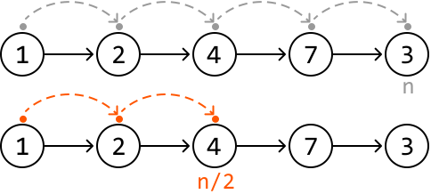
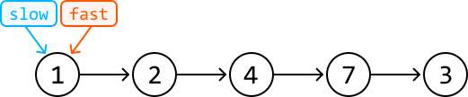
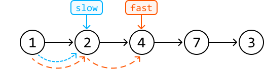
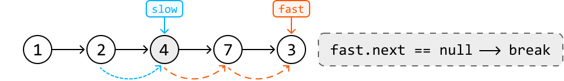
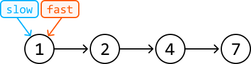
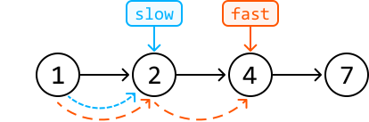
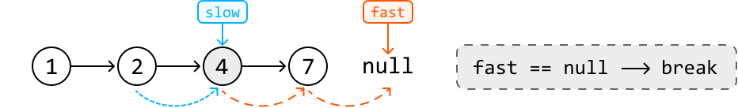
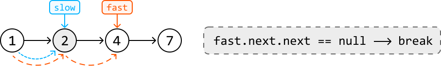

# Linked List Midpoint

Given a singly linked list, find and return its **middle node**. If there are two middle nodes, return the second one.

#### Example 1:


```python
Output: Node 4

```

#### Example 2:


```python
Output: Node 4

```

#### Constraints:

- The linked list contains at least one node.

- The linked list contains unique values.

## Intuition

The most intuitive approach to solve this problem is to traverse the linked list to find its length (n), and then traverse the linked list a second time to find the middle node (n / 2):



This approach solves the problem in O(n) time, but requires two iterations to find the midpoint. However, there’s a cleaner approach that uses only a single iteration.

When iterating through the linked list, our exact position is unclear. We only know where we are when we reach the final node. Is it possible to create a scenario where, as soon as one pointer reaches the end of the linked list, the other pointer is positioned at the middle node?

> 
> 
> If we had one pointer move at half the speed of the other, by the time the faster pointer reaches the end of the list, the slower one will be at the middle of the linked list.
> 
> 

We can achieve this by using the **fast and slow pointer technique**:

- Move a slow pointer one node at a time.

- Move a fast pointer two nodes at a time.



---



---



One thing we must be careful about is when we should stop advancing the fast pointer. We need to stop when the slow pointer reaches the middle node. When the list length is odd, this happens when `fast.next` equals null, as we can see above.

---

What about when the length of the linked list is even? Consider the below example:



---



---



As you can see, to have slow point at the **second** middle node, we'd need to stop fast when it reaches a null node.

## Implementation

```python
from ds import ListNode
    
def linked_list_midpoint(head: ListNode) -> ListNode:
    slow = fast = head
    # When the fast pointer reaches the end of the list, the slow pointer will be at
    # the midpoint of the linked list.
    while fast and fast.next:
        slow = slow.next
        fast = fast.next.next
    return slow

```

```javascript
import { ListNode } from './ds.js'

export function linked_list_midpoint(head) {
  let slow = head
  let fast = head
  // When the fast pointer reaches the end of the list, the slow pointer will be at
  // the midpoint of the linked list.
  while (fast && fast.next) {
    slow = slow.next
    fast = fast.next.next
  }
  return slow
}

```

```java
import core.LinkedList.ListNode;

class UserCode {
    public static ListNode<Integer> linked_list_midpoint(ListNode<Integer> head) {
        ListNode<Integer> slow = head;
        ListNode<Integer> fast = head;
        // When the fast pointer reaches the end of the list, the slow pointer will be at
        // the midpoint of the linked list.
        while (fast != null && fast.next != null) {
            slow = slow.next;
            fast = fast.next.next;
        }
        return slow;
    }
}

```

### Complexity Analysis

**Time complexity:** The time complexity of `linked_list_midpoint` is O(n) because we traverse the linked list linearly using two pointers.

**Space complexity:** The space complexity is O(1).

### Stop and Think

What if you were asked to modify your algorithm to return the first middle node when the linked list is of even length?

Answer: Following the same method, we should stop advancing the fast pointer when `fast.next.next` is null. This way, slow will end up pointing to the first middle node:



## Interview Tip

*Tip: Be prepared to address potential gaps in the information provided.*

During an interview, it’s possible the interviewer won't specify which middle node should be returned for linked lists of even length, leaving it up to you to recognize and address this special scenario. You might be expected to identify ambiguities like this and actively engage with the interviewer to discuss a suitable resolution.