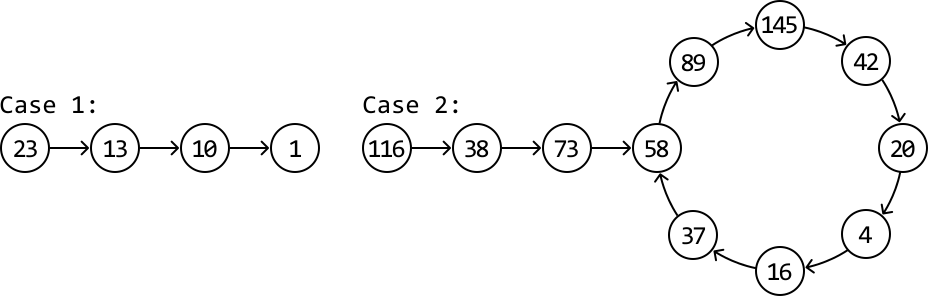

# Happy Number

In number theory, a happy number is defined as a number that, when repeatedly subjected to the process of **squaring its digits and summing those squares**, eventually leads to 1. An unhappy number will never reach 1 during this process, and will get stuck in an infinite loop [[1]](https://en.wikipedia.org/wiki/Happy_number).

Given an integer, determine if it's a happy number.

#### Example:

```python
Input: n = 23
Output: True

```

Explanation: 2^2 + 3^2 = 13 ⇒ 1^2 + 3^2 = 10 ⇒ 1^2 + 0^2 = 1

## Intuition

We can simulate the process of identifying a happy number by repeatedly summing the squares of each digit of a number, and then applying the same process to the resulting sum.

According to the problem statement, this process could conclude in one of two ways:

- Case 1: the process continues until the final number is 1.

- Case 2: the process gets stuck in an infinite loop.

If we diagram both scenarios, we observe something interesting:



This looks quite similar to a linked list problem. In particular, the problem of
determining if a linked list has a cycle (case 2) or doesn’t (case 1).

We can reduce this problem to the same **cycle** **detection** challenge as the *Linked List Loop* problem. By applying the fast and slow pointer technique (i.e., Floyd's Cycle Detection algorithm), we can efficiently determine if a cycle exists.

However, in this problem, we don't have an actual linked list to perform the fast and slow pointer algorithm on. Therefore, we need to find a way to traverse the sequence of numbers generated in the happy number process.

Conveniently, we already know what the “next” number in the sequence is for any number `x`. As described in the problem statement, the next number can be calculated by summing the square of each digit of `x`. So, if each number were a node in a linked list, we could get the “next” node by calculating the next number in the sequence.

**Getting the next number in the sequence**

To calculate the next number of `x`, we need a way to access each digit of `x`. This can be done in two steps:

- The modulo operation (**`x % 10`**) is used to extract the last digit of a number `x`.

- Divide `x` by 10 (**`x = x / 10`**) to truncate the last digit, positioning the next digit as the new last digit.

We can see this unfold in full below for `x = 123`:


Now that we have a way to traverse the sequence, we can implement Floyd’s Cycle Detection algorithm. To start, set the fast and slow pointers at the start of this sequence. Then move the pointers as follows:

- Advance the slow pointer one number at a time (`slow = get_next_num(slow)`).

- Advance the fast pointer two numbers at a time
  
  (`fast = get_next_num(get_next_num(fast))`).

If the fast and slow pointers meet during the process, it indicates the presence of a cycle, meaning the number is not a happy number. Otherwise, the algorithm will end when we reach 1, in which case the number is a happy number.

## Implementation

```python
def happy_number(n: int) -> bool:
    slow = fast = n
    while True:
        slow = get_next_num(slow)
        fast = get_next_num(get_next_num(fast))
        if fast == 1:
            return True
        # If the fast and slow pointers meet, a cycle is detected. Hence, 'n' is not
        # a happy number.
        elif fast == slow:
            return False
    
def get_next_num(x: int) -> int:
    next_num = 0
    while x > 0:
        # Extract the last digit of 'x'.
        digit = x % 10
        # Truncate (remove) the last digit from 'x' using floor division.
        x //= 10
        # Add the square of the extracted digit to the sum.
        next_num += digit ** 2
    return next_num

```

```javascript
export function happy_number(n) {
  let slow = n
  let fast = n
  while (true) {
    slow = get_next_num(slow)
    fast = get_next_num(get_next_num(fast))
    if (fast === 1) {
      return true
    }
    // If the fast and slow pointers meet, a cycle is detected. Hence, 'n' is not
    // a happy number.
    if (fast === slow) {
      return false
    }
  }
}

function get_next_num(x) {
  let next_num = 0
  while (x > 0) {
    // Extract the last digit of 'x'.
    let digit = x % 10
    // Truncate (remove) the last digit from 'x' using floor division.
    x = Math.floor(x / 10)
    // Add the square of the extracted digit to the sum.
    next_num += digit ** 2
  }
  return next_num
}

```

```java
public class Main {
    public boolean happy_number(int n) {
        int slow = n;
        int fast = n;
        while (true) {
            slow = getNextNum(slow);
            fast = getNextNum(getNextNum(fast));
            if (fast == 1) {
                return true;
            }
            // If the fast and slow pointers meet, a cycle is detected. Hence, 'n' is not
            // a happy number.
            if (fast == slow) {
                return false;
            }
        }
    }

    private int getNextNum(int x) {
        int next_num = 0;
        while (x > 0) {
            // Extract the last digit of 'x'.
            int digit = x % 10;
            // Truncate (remove) the last digit from 'x' using floor division.
            x /= 10;
            // Add the square of the extracted digit to the sum.
            next_num += digit * digit;
        }
        return next_num;
    }
}

```

### Complexity Analysis

**Time complexity:** The time complexity of `happy_number` is O(log(n)). The full analysis of this time complexity is quite complicated and beyond the scope of interviews. For interested readers, please see the detailed analysis below.

**Space complexity:** The space complexity is O(1).

## Interview Tip

*Tip: Visualize the problem.*

At first glance, this problem seems like it requires mathematical reasoning to solve. However, when we visualized the problem, we were able to formulate a solution using an algorithm we already know (Floyd’s Cycle Detection). Visualizing a problem can help uncover hidden patterns or data structures that can lead to the solution.

## Happy Number Time Complexity Analysis

The following time complexity analysis establishes an upper bound on the steps required to determine a happy number. In this analysis, we define the "next number" of a number n as the result obtained by summing the squares of the digits of n.

**1) Upper limit for the next number**
For any number n with a fixed number of digits, the maximum value for its successor is achieved when all its digits are 9. For instance, the maximum next number from a 3-digit number happens when this 3-digit number is 999.

**2) Size of the next number relative to the number of digits**

- If a number n has 1 or 2 digits, it’s possible for the next number to be larger than n (e.g., the next number of 99 is 162, which is one digit longer).

- If a number n has 3 or more digits, the next number is always smaller than the original value of n. The table below highlights how the largest number with 3 or more digits has a smaller next number.

| Digits | Largest Number | Next Number |
| --- | --- | --- |
| 1 | 9 | 81 |
| 2 | 99 | 162 |
| 3 | 999 | 243 |
| 4 | 9999 | 324 |
| 5 | 99999 | 405 |
| 6 | 999999 | 486 |
| ... | ... | ... |

 

**3) Implications for cycles**
Since the next number is always smaller for numbers with three or more digits, it means a cycle can only commence in the happy number process once the number falls below 243 (the next number of 999). This is because we’ve observed that any number n larger than 243 will have the next number smaller than n. However, once we fall below 243, the next number can potentially be larger, potentially cycling back to a previous number.

**4) Time complexity for numbers less than 243**
Once a number falls below 243, the algorithm will take less than 243 steps to either converge to 1 or to cycle back to a previous number in the sequence. Therefore, since the length of the cycle or the number of steps to reach 1 is bounded by 243, the time complexity of Floyd’s cycle detection algorithm for numbers less than 243 is O(1).

**5) Time complexity for numbers greater than 243**
The number of digits in a number is approximately equal to log(n) (base 10). So, the calculation of the next number of n will take approximately log(n) steps (i.e., `get_next_num` will take log(n) steps to execute).

Let's call n’s next number n^2. The next number after n^2 (n^3) will take approximately log(n^2) steps to calculate. The next number after n^3 (n^4) will take approximately log(n^3) steps to calculate, and so on. From this, we can summarize the time complexity of this process as O(log(n)+log(n^2)+log(n^3)+…). Since we've established that n>n^2>…>n^k where n^k is the last number greater than 243, the dominant component of this time complexity is O(log(n)). So, the time complexity for numbers greater than 243 is O(log(n)).

**Conclusion**
When n is less than 243, the time complexity is O(1), and when n is greater than 243, the time complexity is O(log(n)). Therefore, the overall time complexity of the algorithm is O(log(n)).

## Interview Tip

*Tip: Don’t waste time on complex proofs if it isn’t an important part of the interview.*

During an interview, correctly deciphering the exact time of an algorithm like the one used to solve this problem isn't usually expected. In situations like this, you can instead make an educated guess about how the algorithm's runtime would grow with larger inputs based on the behavior of the algorithm. Mention any assumptions you make when discussing your estimates.
It might also be helpful to mention what parts of the problem or the solution make it difficult to analyze the time complexity. In this problem, it’s initially unclear how many steps the happy number process would take before reaching 1 or revealing a cycle.