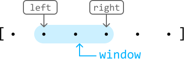
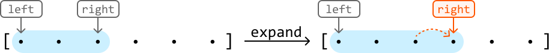
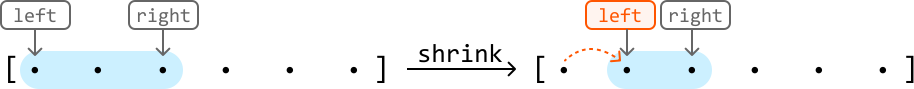
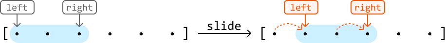
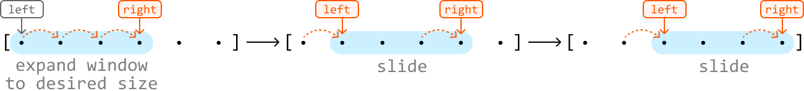
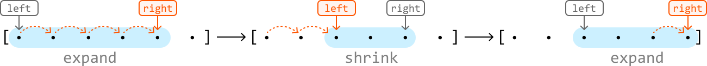
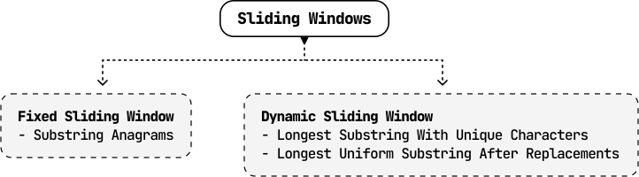

# Introduction to Sliding Windows

## Intuition

The sliding window technique is a subset of the two-pointer pattern, as it uses two pointers (generally left and right) to define the bounds of a "window" in iterable data structures like arrays. The window defines a subcomponent of the data structure (e.g., a subarray or substring), and it *slides* across the data structure unidirectionally, typically searching for a subcomponent that meets a certain requirement.



Sliding windows are particularly valuable in scenarios where algorithms might otherwise rely on using two nested loops to search through all possible subcomponents to find an answer, resulting in an O(n^2) time complexity, or worse. When using a sliding window, the subcomponent(s) we’re looking for can usually be found in O(n) time, in comparison. But before discussing how they work, let’s establish some terminology:

- To **expand** the window is to advance the right pointer:
  
  
  

- To **shrink** the window is to advance the left pointer:
  
  
  

- To **slide** the window is to advance both the left and right pointers:
  
  
  
  
  
  Note that sliding is equivalent to expanding and shrinking the window at the same time.

Now, let’s break down the two main types of sliding window algorithms:

- Fixed sliding window.

- Dynamic sliding window.

### Fixed Sliding Window

A fixed sliding window maintains a specific length as it slides across a data structure.



We use the fixed sliding window technique when the problem asks us to **find a subcomponent of a certain length**. If we know what this length is, we can fix our window to that length and slide it through the array.

> 
> 
> If a fixed window of length k traverses a data structure from start to finish, it’s guaranteed to see every subcomponent of length k in that data structure.
> 
> 

Below is a generic template of how a fixed sliding window traverses a data structure.

```python
left = right = 0
while right < n:
    # If the window has reached the expected fixed length, we slide the window (move
    # both left and right).
    if right - left + 1 == fixed_window_size:
        # Process the current window.
        result = process_current_window()
        left += 1
    right += 1

```

```javascript
let left = 0
let right = 0
while (right < n) {
  // If the window has reached the expected fixed length, we slide the window (move
  // both left and right).
  if (right - left + 1 === fixed_window_size) {
    // Process the current window.
    result = process_current_window()
    left += 1
  }
  right += 1
}

```

```java
int left = 0, right = 0;
while (right < n) {
    // If the window has reached the expected fixed length, we slide the window (move
    // both left and right).
    if (right - left + 1 == fixedWindowSize) {
        // Process the current window.
        ResultType result = processCurrentWindow();
        left++;
    }
    right++;
}

```

### Dynamic Sliding Window

Unlike fixed sliding windows, dynamic windows can expand or shrink in length as they traverse a data structure.



Generally, dynamic sliding windows can be applied to problems that ask us to **find the longest or shortest subcomponent that satisfies a condition** (for example, a condition could be that the numbers in the window must be greater than 10).

When finding the longest subcomponent, the dynamics of expanding and shrinking are typically as follows:

- If a window satisfies the condition, expand it to see if we can find a longer window that also meets the condition.

- If the condition is violated, shrink the window until the condition is met again.

Below is a generic template demonstrating how this works:

```python
left = right = 0
while right < n:
    # While the condition is violated, the window is invalid, so shrink the window by
    # advancing the left pointer.
    while condition is violated:
        left += 1
    # Once the window is valid, process it and then expand the window by advancing the
    # right pointer.
    result = process_current_window()
    right += 1

```

```javascript
let left = 0;
let right = 0;
while (right < n) {
  // While the condition is violated, the window is invalid, so shrink the window by
  // advancing the left pointer.
  while (condition is violated) {
    left += 1;
  }
  // Once the window is valid, process it and then expand the window by advancing the
  // right pointer.
  result = process_current_window();
  right += 1;
}

```

```java
int left = 0, right = 0;
while (right < n) {
    // While the condition is violated, the window is invalid, so shrink the window by
    // advancing the left pointer.
    while (conditionIsViolated()) {
        left++;
    }
    // Once the window is valid, process it and then expand the window by advancing the
    // right pointer.
    ResultType result = processCurrentWindow();
    right++;
}

```

Note that the provided templates for fixed and dynamic windows primarily emphasize the movement of the left and right pointers rather than the specifics of updating the window itself. If the problem requires updating the window, the logic around it will be highly context-dependent. This is explored in detail through specific problems in this chapter.

## Real-world Example

**Buffering in video streaming**: In video streaming, a dynamic sliding window can be used to manage buffering and ensure smooth playback.

For instance, when streaming a video, the player downloads chunks of the video data and stores them in a buffer. A sliding window controls which part of the video is buffered, with the window "sliding" forward as the video plays. The sliding window ensures the video player can adapt to varying network conditions by dynamically adjusting the buffer size and position, leading to a smoother streaming experience for the viewer.

## Chapter Outline

