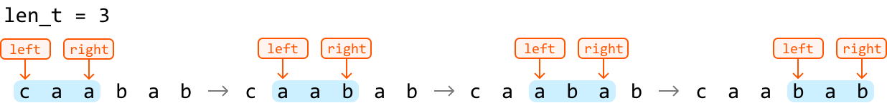
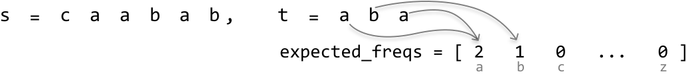
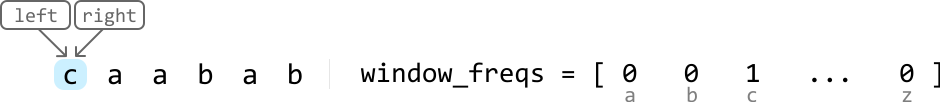
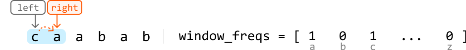
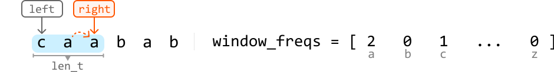
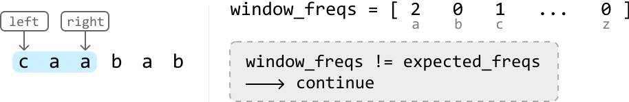
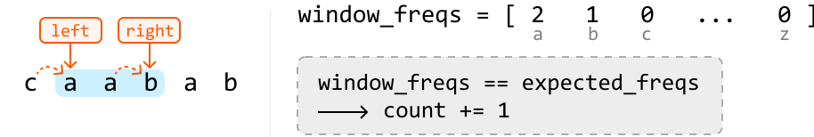
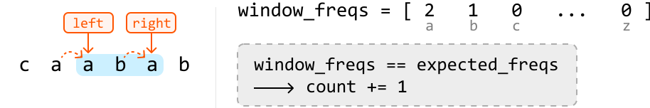
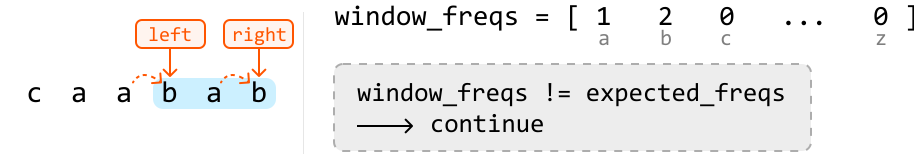

# Substring Anagrams

Given two strings, `s` and `t` , both consisting of lowercase English letters, return the number of substrings in `s` that are **anagrams of `t`**.

An anagram is a word or phrase formed by rearranging the letters of another word or phrase, using all the original letters exactly once.

#### Example:

```python
Input: s = 'caabab', t = 'aba'
Output: 2

```

Explanation: There is an anagram of `t` starting at index 1 ("caabab") and another starting at index 2 ("caabab")

## Intuition

We can reframe how we think about an anagram by altering the provided definition. A substring of s qualifies as an anagram of t if it contains exactly the same characters as t in any order.

For a substring in s to be an anagram of t, it must have the same length as t (denoted as `len_t`). This means we only need to consider substrings of s that match the length `len_t`, which saves us from examining every possible substring.

To examine all substrings of a **fixed length**, `len_t`, we can use the **fixed sliding window** technique because a window of `len_t` is guaranteed to slide through every substring of this length. We can see this in the example below:



Now, we just need a way to check if a window is an anagram of t. Remember that in an anagram, the order of the letters doesn’t matter; only the **frequency of each letter** does. By comparing the frequency of each character in a window against the frequencies of characters in string t, we can determine if that window is an anagram of t.

Let's explore this reasoning with an example. Before starting the sliding window algorithm, we need a way to store the frequencies of the characters in string t. We could use a hash map for this, or an array, `expected_freqs`, to store the frequencies of each character in string t.

> 
> 
> `expected_freqs` is an integer array of size 26, with each index representing one of the lowercase English letters (0 for 'a', 1 for 'b', and so on, up to 25 for 'z').
> 
> 



---

To set up the sliding window algorithm, let’s define the following components:

- Left and right pointers: Initialize both at the start of the string to define the window's boundaries.

- `window_freqs`: Use an array of size 26 to keep track of the frequencies of characters within the window.

- count: Maintain a variable to count the number of anagrams detected.

Before we slide the window, we first need to expand it to a fixed length of `len_t`. This can be done by advancing the right pointer until the window length is equal to `len_t`. As we expand, ensure to keep `window_freqs` updated to reflect the frequencies of the characters in the window:



---



---



---

Once the window is at the fixed length of `len_t`, we can check if it’s an anagram of t by checking if the `expected_freqs` and `window_freqs` arrays are the same. This can be done in constant time since it requires only 26 comparisons, one for each lowercase English letter.

To slide this window across the string, advance both the left and right pointers one step in each iteration. Ensure to keep `window_freqs` updated by incrementing the frequency of each new character at the right pointer and decrementing the frequency of the character at the left pointer as we move past this left character:

![Image represents a Python-like array assignment statement.  The statement `expected_freqs = [...]` assigns a numerical a](./images/059078f5_image-05-01-6-ITVC2B3I.svg)

---



---



---



---



Once we’ve finished processing all substrings of length `len_t`, we can return `count`, which represents the number of anagrams found.

A small optimization we can make is returning 0 if t's length exceeds the length of s because forming an anagram of t from the substrings of s is impossible if t is longer.

## Implementation

In Python, we can use `ord(character) - ord('a')` to find the index of a lowercase English letter in an array of size 26. The ord function takes an integer and returns its ASCII value. This formula calculates the distance of this character from 'a', resulting in an index between 0 and 25.

```python
def substring_anagrams(s: str, t: str) -> int:
    len_s, len_t = len(s), len(t)
    if len_t > len_s:
        return 0
    count = 0
    expected_freqs, window_freqs = [0] * 26, [0] * 26
    # Populate 'expected_freqs' with the characters in string 't'.
    for c in t:
        expected_freqs[ord(c) - ord('a')] += 1
    left = right = 0
    while right < len_s:
        # Add the character at the right pointer to 'window_freqs' before sliding the
        # window.
        window_freqs[ord(s[right]) - ord('a')] += 1
        # If the window has reached the expected fixed length, we advance the left
        # pointer as well as the right pointer to slide the window.
        if right - left + 1 == len_t:
            if window_freqs == expected_freqs:
                count += 1
            # Remove the character at the left pointer from 'window_freqs' before
            # advancing the left pointer.
            window_freqs[ord(s[left]) - ord('a')] -= 1
            left += 1
        right += 1
    return count

```

```javascript
export function substring_anagrams(s, t) {
  const len_s = s.length
  const len_t = t.length
  if (len_t > len_s) {
    return 0
  }
  let count = 0
  const expected_freqs = Array(26).fill(0)
  const window_freqs = Array(26).fill(0)
  // Populate 'expected_freqs' with the characters in string 't'.
  for (let c of t) {
    expected_freqs[c.charCodeAt(0) - 'a'.charCodeAt(0)] += 1
  }
  let left = 0
  let right = 0
  while (right < len_s) {
    // Add the character at the right pointer to 'window_freqs' before sliding the window.
    window_freqs[s.charCodeAt(right) - 'a'.charCodeAt(0)] += 1
    // If the window has reached the expected fixed length, we advance the left
    // pointer as well as the right pointer to slide the window.
    if (right - left + 1 === len_t) {
      if (arrays_equal(window_freqs, expected_freqs)) {
        count += 1
      }
      // Remove the character at the left pointer from 'window_freqs' before advancing the left pointer.
      window_freqs[s.charCodeAt(left) - 'a'.charCodeAt(0)] -= 1
      left += 1
    }
    right += 1
  }
  return count
}

function arrays_equal(arr1, arr2) {
  for (let i = 0; i < 26; i++) {
    if (arr1[i] !== arr2[i]) {
      return false
    }
  }
  return true
}

```

```java
public class Main {
    public Integer substring_anagrams(String s, String t) {
        int lenS = s.length(), lenT = t.length();
        if (lenT > lenS) {
            return 0;
        }
        int count = 0;
        int[] expectedFreqs = new int[26];
        int[] windowFreqs = new int[26];
        // Populate 'expectedFreqs' with the characters in string 't'.
        for (char c : t.toCharArray()) {
            expectedFreqs[c - 'a'] += 1;
        }
        int left = 0, right = 0;
        while (right < lenS) {
            // Add the character at the right pointer to 'windowFreqs' before sliding the
            // window.
            windowFreqs[s.charAt(right) - 'a'] += 1;
            // If the window has reached the expected fixed length, we advance the left
            // pointer as well as the right pointer to slide the window.
            if (right - left + 1 == lenT) {
                boolean isMatch = true;
                for (int i = 0; i < 26; i++) {
                    if (windowFreqs[i] != expectedFreqs[i]) {
                        isMatch = false;
                        break;
                    }
                }
                if (isMatch) {
                    count += 1;
                }
                // Remove the character at the left pointer from 'windowFreqs' before
                // advancing the left pointer.
                windowFreqs[s.charAt(left) - 'a'] -= 1;
                left += 1;
            }
            right += 1;
        }

        return count;
    }
}

```

### Complexity Analysis

**Time complexity:** The time complexity of `substring_anagrams` is O(n), where n denotes the length of `s`. Here’s why:

- Populating the `expected_freqs` array takes O(m) time, where m denotes the length of t. Since m is guaranteed to be less than or equal to n at this point, it’s not a dominant term in the time complexity.

- Then, we traverse string `s` linearly with two pointers, which takes O(n) time.

- Note that at each iteration, the comparison performed between the two frequency arrays (`expected_freqs` and `window_freqs`) takes O(1) time because each array contains only 26 elements.

**Space complexity:** The space complexity is O(1) because each frequency array contains only 26 elements.