# Longest Substring With Unique Characters

Given a string, determine the length of its longest substring that consists only of **unique characters**.

#### Example:

```python
Input: s = 'abcba'
Output: 3

```

Explanation: Substring "abc" is the longest substring of length 3 that contains unique characters ("cba" also fits this description).

## Intuition

The brute force approach involves examining all possible substrings and checking if any consist of exclusively unique characters. Let’s break down this approach:

- Checking a substring for uniqueness can be done in O(n) time by scanning the substring and using a **hash set** to keep track of each character, where n denotes the length of s. If we encounter a character already in the hash set, we know it’s a duplicate character.

- Iterating through all possible substrings takes O(n^2) time.

This means the brute force approach would take O(n^3) time overall. This is quite slow, largely because we look through every substring. Is there a way to reduce the number of substrings we examine?

**Sliding window**

Sliding window approaches can be quite useful for problems that involve substrings. In particular, because we’re looking for the longest substring that satisfies a specific condition (i.e., contains unique characters), a **dynamic sliding window** algorithm might be the way to go, as discussed in the introduction.

We can categorize any window in two ways. A window either:

- Consists only of unique characters (a window with no duplicate characters).

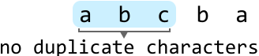

- Contains at least one character of a frequency greater than 1.
  
  
  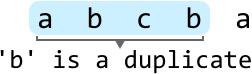

If A is true, we should **expand** the window by advancing the right pointer to find a longer window that also contains no duplicates.

If B is true because we encounter a duplicate character in the window, we should **shrink** the window by advancing the left pointer until it no longer contains a duplicate.

Let’s try this strategy over the following example. We initialize a hash set to keep track of the characters in a window.

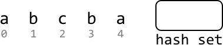

---

To implement the sliding window technique, we should establish the following:

- Left and right pointers: Initialize both at the start of the string to define the window's boundaries.

- `hash_set`: Maintain a hash set to record the unique characters within the window, updating it as the window expands. Note, the hash set shown in the diagram displays its state before the character at the right pointer is added to it.

Now, let’s start looking for the longest window. Expand the window from the beginning of the string by advancing the right pointer. Keep expanding until a duplicate character is found:

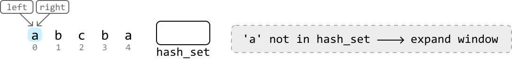

---

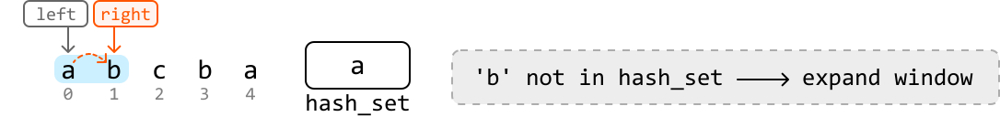

---

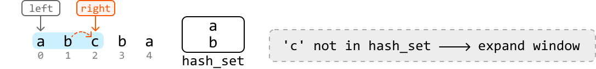

---

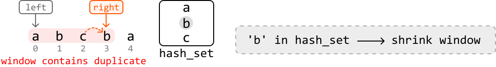

We see above that the ‘b’ at index 3 is a duplicate character in the window because ‘b’ is already in the hash set.

---

Now that we found a duplicate, we should shrink the window by advancing the left pointer until the window no longer contains a duplicate ‘b’. Once the window is valid again, continue expanding:

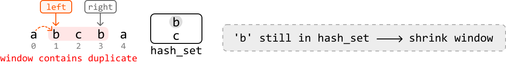

---

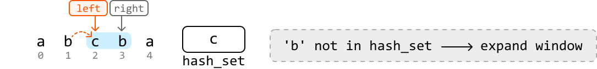

---

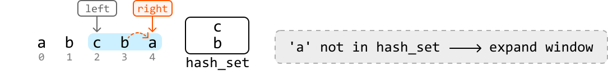

Expanding the window any further will cause the right pointer to exceed the string’s boundary, at which point we end our search. The longest substring we’ve found with no duplicates is of length 3. We can use the variable **`max_len`** to keep track of this length during our search.

## Implementation

```python
def longest_substring_with_unique_chars(s: str) -> int:
    max_len = 0
    hash_set = set()
    left = right = 0
    while right < len(s):
        # If we encounter a duplicate character in the window, shrink the window until
        # it’s no longer a duplicate.
        while s[right] in hash_set:
            hash_set.remove(s[left])
            left += 1
        # Once there are no more duplicates in the window, update 'max_len' if the
        # current window is larger.
        max_len = max(max_len, right - left + 1)
        hash_set.add(s[right])
        # Expand the window.
        right += 1
    return max_len

```

```javascript
export function longest_substring_with_unique_chars(s) {
  let maxLen = 0
  const hashSet = new Set()
  let left = 0
  let right = 0
  while (right < s.length) {
    // If we encounter a duplicate character in the window, shrink the window until
    // it’s no longer a duplicate.
    while (hashSet.has(s[right])) {
      hashSet.delete(s[left])
      left += 1
    }

    // Once there are no more duplicates in the window, update 'maxLen' if the
    // current window is larger.
    maxLen = Math.max(maxLen, right - left + 1)
    hashSet.add(s[right])
    // Expand the window.
    right += 1
  }
  return maxLen
}

```

```java
import java.util.HashSet;

public class Main {
    public Integer longest_substring_with_unique_chars(String s) {
        int maxLen = 0;
        HashSet<Character> hashSet = new HashSet<>();
        int left = 0, right = 0;
        while (right < s.length()) {
            // If we encounter a duplicate character in the window, shrink the window until
            // it’s no longer a duplicate.
            while (hashSet.contains(s.charAt(right))) {
                hashSet.remove(s.charAt(left));
                left += 1;
            }
            // Once there are no more duplicates in the window, update 'maxLen' if the
            // current window is larger.
            maxLen = Math.max(maxLen, right - left + 1);
            hashSet.add(s.charAt(right));
            // Expand the window.
            right += 1;
        }
        return maxLen;
    }
}

```

## Complexity Analysis

**Time complexity:** The time complexity of `longest_substring_with_unique_chars` is O(n) because we traverse the string linearly with two pointers.

**Space complexity:** The space complexity is O(m) because we use a hash set to store unique characters, where m represents the total number of unique characters within the string.

## Optimization

The above approach solves the problem, but we can still optimize it. The optimization has to do with how we shrink the window when encountering a duplicate character. Consider the following example, where the right pointer encounters a duplicate ‘c’:

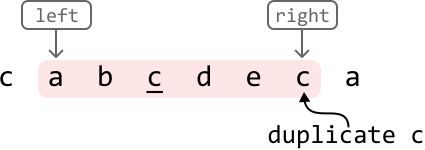

In the previous approach, we respond to encountering a duplicate by continuously advancing the left pointer to shrink the window until the window no longer contains a duplicate:

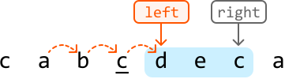

The crucial insight here is that we advanced the left pointer until it passed the **previous occurrence** of ‘c’ in the window. This indicates that if we know the index of the previous occurrence of ‘c’, we can move our left pointer immediately past that index to remove it from the window:

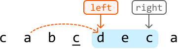

This gives us a new strategy for advancing the left pointer: if the right pointer encounters a character whose previous index (i.e., previous occurrence) is in the window, move the left pointer one index past that previous index.

We can use a hash map (`prev_indexes`) to store the previous index of each character in the string.

Now we just need to ensure the previous index of a character is in the window. To do this, we compare its index to the left pointer:

- If this index is after the left pointer, it’s inside the window.

- If it is before the left pointer, it’s outside the window

Below is a visual of how to check whether a character is inside the window:

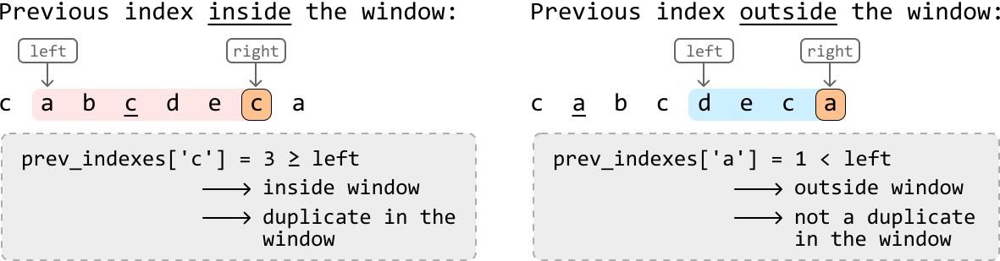

## Implementation - Optimized Approach

```python
def longest_substring_with_unique_chars_optimized(s: str) -> int:
    max_len = 0
    prev_indexes = {}
    left = right = 0
    while right < len(s):
        # If a previous index of the current character is present in the current
        # window, it's a duplicate character in the window.
        if s[right] in prev_indexes and prev_indexes[s[right]] >= left:
            # Shrink the window to exclude the previous occurrence of this character.
            left = prev_indexes[s[right]] + 1
        # Update 'max_len' if the current window is larger.
        max_len = max(max_len, right - left + 1)
        prev_indexes[s[right]] = right
        # Expand the window.
        right += 1
    return max_len

```

```javascript
export function longest_substring_with_unique_chars(s) {
  let maxLen = 0
  const prevIndexes = {}
  let left = 0
  let right = 0
  while (right < s.length) {
    // If a previous index of the current character is present in the current
    // window, it's a duplicate character in the window.
    if (s[right] in prevIndexes && prevIndexes[s[right]] >= left) {
      // Shrink the window to exclude the previous occurrence of this character.
      left = prevIndexes[s[right]] + 1
    }
    // Update 'maxLen' if the current window is larger.
    maxLen = Math.max(maxLen, right - left + 1)
    prevIndexes[s[right]] = right
    // Expand the window.
    right += 1
  }
  return maxLen
}

```

```java
import java.util.HashMap;

public class Main {
    public Integer longest_substring_with_unique_chars_optimized(String s) {
        int maxLen = 0;
        HashMap<Character, Integer> prevIndexes = new HashMap<>();
        int left = 0, right = 0;
        while (right < s.length()) {
            char currChar = s.charAt(right);
            // If a previous index of the current character is present in the current
            // window, it's a duplicate character in the window.
            if (prevIndexes.containsKey(currChar) && prevIndexes.get(currChar) >= left) {
                // Shrink the window to exclude the previous occurrence of this character.
                left = prevIndexes.get(currChar) + 1;
            }
            // Update 'maxLen' if the current window is larger.
            maxLen = Math.max(maxLen, right - left + 1);
            prevIndexes.put(currChar, right);
            // Expand the window.
            right++;
        }
        return maxLen;
    }
}

```

### Complexity Analysis

**Time complexity:** The time complexity of the optimized implementation is O(n) because we traverse the string linearly with two pointers.

**Space complexity:** The space complexity is O(m) because we use a hash map to store unique characters, where m represents the total number of unique characters within the string.