# Longest Uniform Substring After Replacements

A **uniform** substring is one in which all characters are identical. Given a string, determine the `length` of the longest uniform substring that can be formed by **replacing up to `k` characters**.

#### Example:


```python
Input: s = 'aabcdcca', k = 2
Output: 5

```

Explanation: if we can only replace 2 characters, the longest uniform substring we can achieve is "ccccc", obtained by replacing 'b' and 'd' with 'c'.

## Intuition

**Determining if a substring is uniform**

Before we try finding the longest uniform substring, let’s first determine the most efficient way to make a string uniform with the fewest character replacements. Consider the example below:


Which characters should we replace to ensure the minimum number of replacements are performed to make the string uniform? There are three main choices: make the string all ‘a’s, or all ‘b’s, or all ‘c’s. The most efficient choice, requiring the fewest replacements, is to make all characters ‘a’, which involves just three replacements:

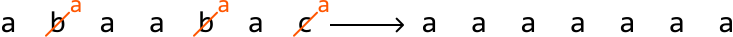

The key observation is that the minimum number of replacements needed to achieve uniformity is obtained by **replacing all characters except the most frequent one**.

This suggests that if we know the highest frequency of a character in a substring, we can determine if our value of k is sufficient to make that substring uniform. The number of characters that need to be replaced (num_chars_to_replace) can be found by subtracting this highest frequency from the total number of characters in the substring:

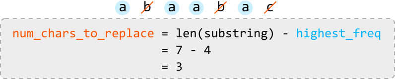

Once we’ve calculated num_chars_to_replace for a given substring, we can assess if the substring can be made uniform:

- If `num_chars_to_replace ≤ k`, the substring can be made uniform.

- If `num_chars_to_replace > k`, the substring cannot be made uniform.

To calculate num_chars_to_replace, we need to know the value of `highest_freq`. This requires tracking the frequency of each character, which can be efficiently managed using a **hash map** (`freqs`). This hash map allows us to update `highest_freq` whenever we encounter a character with a higher frequency. Below is an illustration of how `freqs` is updated:

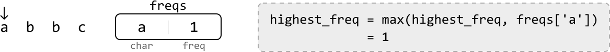

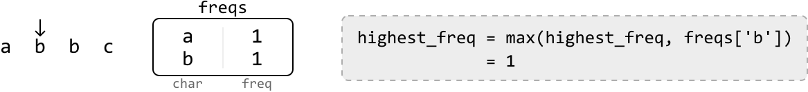

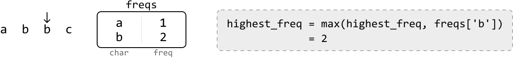

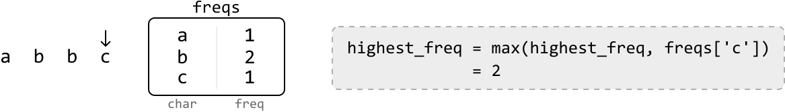

Now that we have the tools to determine if a substring can be made uniform, the next step is to figure out how to identify the longest uniform substring. Let’s explore a technique that lets us do this.

**Dynamic sliding window**

We know sliding windows can be useful for solving problems involving substrings. This problem requires that we find the longest substring that satisfies a specific condition:

> 
> 
> num_chars_to_replace <= k
> 
> 

So, a dynamic sliding window might be appropriate, as discussed in the chapter introduction.

We can use the above condition to determine how to expand or shrink the window:

- If the condition is met (i.e., the window is valid), we **expand** the window to find a longer window that still meets this condition.

- If the condition is violated (i.e., the window is invalid), we **shrink** the window until it meets the condition again.

Let’s see how this works over the example below:

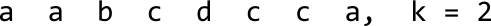

---

Start by defining the left and right boundaries of the window at index 0. Continue expanding the window for as long as it satisfies our condition (`nums_char_to_replace <= k`):

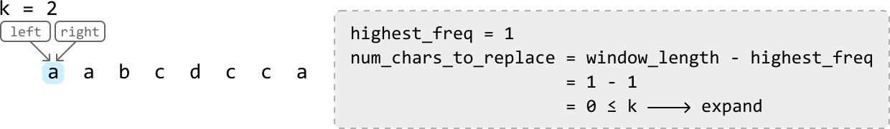

---

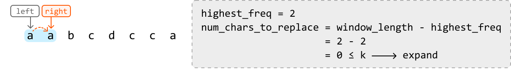

---

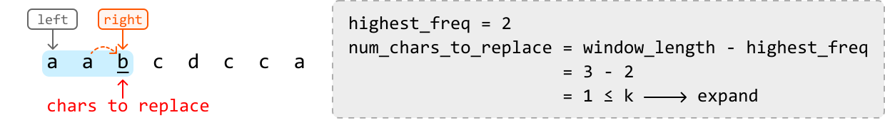

---

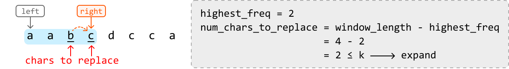

---

Once the window expands to the fifth character (‘d’), it will contain 3 characters that must be replaced to make the window uniform. Since we can only replace up to k = 2 characters, the window is invalid. So, we shrink the window:

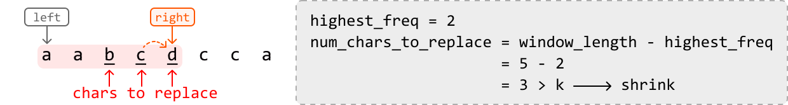

---

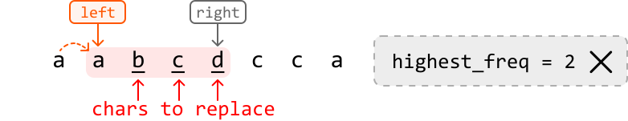

Notice that after shrinking the window, the value of `highest_freq` is still 2, which is no longer correct. Recall that our current method for updating `highest_freq` only increases it when encountering a character with a higher frequency, meaning `highest_freq` can only remain the same or increase, but it can never decrease.

One way to work around this is to develop a new method for updating `highest_freq` that accurately decreases it when the highest frequency in a window decreases. However, our goal is to find the longest substring that meets the condition, so shrinking the window might not even be necessary. The crucial point here is that **when we find a valid window of a certain length, no shorter window will provide a longer uniform substring**.

> 
> 
> This means we can just slide the window instead of shrinking it whenever we encounter an invalid window, effectively maintaining the length of the current window.
> 
> 

With this observation, we should correct our previous logic:

- If the window satisfies the condition: expand.

- **If the window doesn’t satisfy the condition: slide**.

Let’s correct the action taken in the first invalid window above by sliding instead of shrinking. Then, we can continue processing the rest of the string.

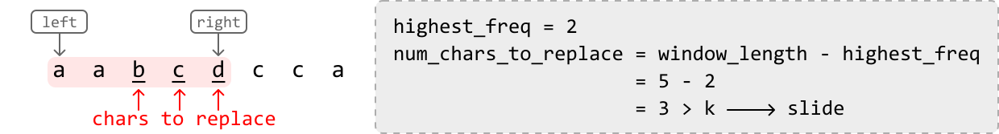

---

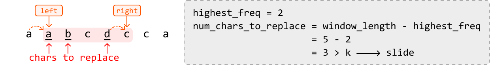

---

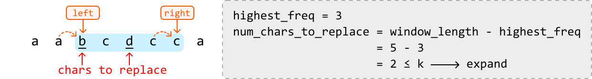

---

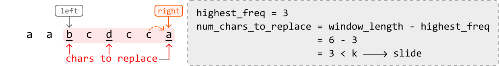

The above window is the final window because we cannot expand or slide it any further. The longest valid window encountered during this process is a window of length 5.

## Implementation

```python
def longest_uniform_substring_after_replacements(s: str, k: int) -> int:
    freqs = {}
    highest_freq = max_len = 0
    left = right = 0
    while right < len(s):
        # Update the frequency of the character at the right pointer and the highest
        # frequency for the current window.
        freqs[s[right]] = freqs.get(s[right], 0) + 1
        highest_freq = max(highest_freq, freqs[s[right]])
        # Calculate replacements needed for the current window.
        num_chars_to_replace = (right - left + 1) - highest_freq
        # Slide the window if the number of replacements needed exceeds 'k'.
        # The right pointer always gets advanced, so we just need to advance 'left'.
        if num_chars_to_replace > k:
            # Remove the character at the left pointer from the hash map before
            # advancing the left pointer.
            freqs[s[left]] -= 1
            left += 1
        # Since the length of the current window increases or stays the same, assign
        # the length of the current window to 'max_len'.
        max_len = right - left + 1
        # Expand the window.
        right += 1
    return max_len

```

```javascript
export function longest_uniform_substring_after_replacements(s, k) {
  const freqs = {}
  let highestFreq = 0
  let maxLen = 0
  let left = 0
  let right = 0
  while (right < s.length) {
    // Update the frequency of the character at the right pointer and the highest
    // frequency for the current window.
    const char = s[right]
    freqs[char] = (freqs[char] || 0) + 1
    highestFreq = Math.max(highestFreq, freqs[char])
    // Calculate replacements needed for the current window.
    const numCharsToReplace = right - left + 1 - highestFreq
    // Slide the window if the number of replacements needed exceeds 'k'.
    // The right pointer always gets advanced, so we just need to advance 'left'.
    if (numCharsToReplace > k) {
      freqs[s[left]] -= 1
      left += 1
    }
    // Since the length of the current window increases or stays the same, assign
    // the length of the current window to 'maxLen'.
    maxLen = right - left + 1
    // Expand the window.
    right += 1
  }
  return maxLen
}

```

```java
import java.util.HashMap;

public class Main {
    public int longest_uniform_substring_after_replacements(String s, int k) {
        HashMap<Character, Integer> freqs = new HashMap<>();
        int highestFreq = 0;
        int maxLen = 0;
        int left = 0, right = 0;
        while (right < s.length()) {
            // Update the frequency of the character at the right pointer and the highest
            // frequency for the current window.
            char ch = s.charAt(right);
            freqs.put(ch, freqs.getOrDefault(ch, 0) + 1);
            highestFreq = Math.max(highestFreq, freqs.get(ch));
            // Calculate replacements needed for the current window.
            int numCharsToReplace = (right - left + 1) - highestFreq;
            // Slide the window if the number of replacements needed exceeds 'k'.
            // The right pointer always gets advanced, so we just need to advance 'left'.
            if (numCharsToReplace > k) {
                char leftChar = s.charAt(left);
                freqs.put(leftChar, freqs.get(leftChar) - 1);
                left++;
            }
            // Since the length of the current window increases or stays the same, assign
            // the length of the current window to 'max_len'.
            maxLen = right - left + 1;
            // Expand the window.
            right++;
        }
        return maxLen;
    }
}

```

### Complexity Analysis

**Time complexity:** The time complexity of `longest_uniform_substring_after_replacements` is O(n), where n is the length of the input string. This is because we traverse the string linearly with two pointers.

**Space complexity:** The space complexity is O(m), where m is the number of unique characters in the string stored in the hash map `freqs`.