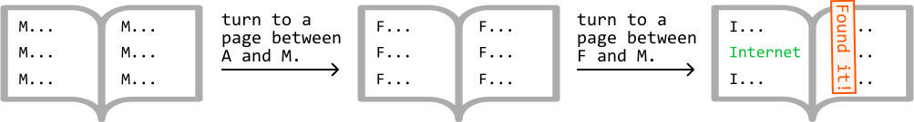
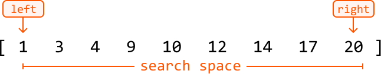
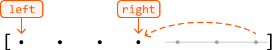
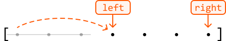
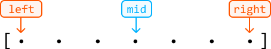
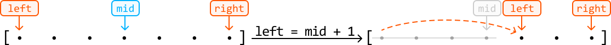
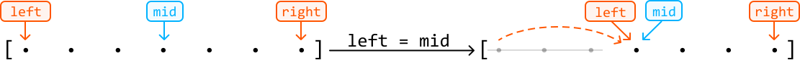
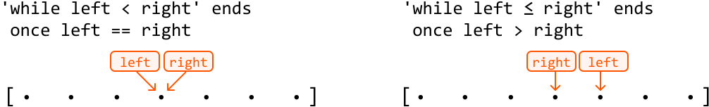
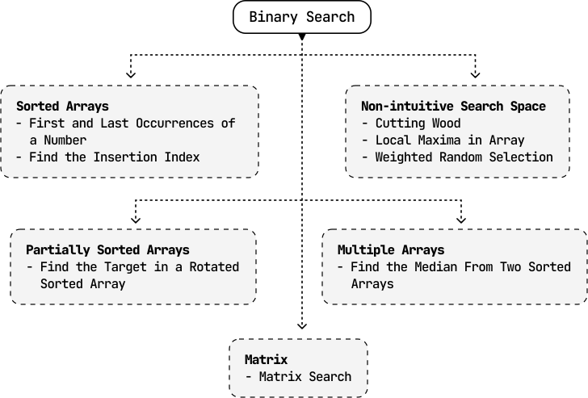

# Introduction to Binary Search

## Intuition

Let's say you have a standard, hard-copy English dictionary, and you want to find the definition of the word "inheritance." How could we do this?

One approach is to flick through it page by page, until reaching the page with "inheritance." But this is inefficient, and realistically, you're more likely to immediately open a page somewhere in the middle.

Let's say you do this and land on a page of words beginning with "M." Realizing that "inheritance" is somewhere to the left of "M" in the alphabet, you open a page somewhere between the letters "A" and "M." You continue this process of checking if "inheritance" is to the right or left of the current page, and narrowing the search down until you find the correct page. With this method, you've significantly reduced the number of pages to be searched, in contrast to linearly turning every page in order. This is the fundamental concept of binary search.

## Implementing Binary Search

Binary search is an algorithm that searches for a value in a **sorted data set**.

Even experienced developers can find it quite tricky to implement binary search correctly because "the devil's in the detail."

- How should the boundary variables `left` and right be initialized?

- Should we use `left < right` or `left ≤ right` as the exit condition in our while-loop?

- How should the boundary variables be updated? Should we choose `left = mid`, `left = mid + 1`, `right = mid`, or `right = mid - 1`?

This chapter offers clear, intuitive guidance on how to master these challenges, and confidently handle even the trickiest edge case.

To begin any binary search implementation, do the following:

- Define the search space.

- Define the behavior inside the loop for narrowing the search space.

- Choose an exit condition for the while-loop.

- Return the correct value.

Let's break down these steps.

**1. Defining the search space**

The search space encompasses all possible values that may include the value we're searching for. For instance, when searching for a target in a sorted array, the search space should cover the entire array, as the target could be anywhere within it. This is illustrated in the array below, where the left and right pointers define the search space:

**2. Narrowing the search space**

Narrowing the search space involves progressively moving the left or right pointer inward until the search space is reduced to one element or none.

At each point in the binary search, we need to decide how we narrow our search space. We can either:

- **Narrow the search space toward the left** (by moving the right pointer inward):

- **Narrow the search space toward the right** (by moving the left pointer inward):

Using the midpoint

We decide whether to move the left or right pointer based on the value in the middle of the search space, indicated by the midpoint variable (`mid`).

The main question to ask at each iteration of binary search is: **is the value being searched for to the left or the right of the midpoint?**

Here's the general idea: if the value we're looking for is to the right of the midpoint, narrow the search space toward the right. Otherwise, narrow the search space toward the left.

To narrow the search space towards the right, there are two options:

- `left = mid + 1`

We do this if the midpoint value is definitively not the value we're looking for
and should **excluded** from the search space.

- `left = mid`
  
  
  
  We do this if the midpoint value itself could potentially be the value we're looking
  for and should still be **included** in the search space.

The exclude/include logic applies when narrowing the search space towards the left, as well (i.e., between `right = mid - 1` and `right = mid`).

Calculating the midpoint

In most cases, the midpoint is calculated using **`mid = (left + right) // 2`** in Python.[1](#user-content-fn-1) To lower the risk of integer overflow, `mid = left + (right - left) // 2` is preferred in many other languages.

**3. Choosing an exit condition**

Choosing an exit condition for when the while-loop should terminate can be tricky. Our choices are primarily between `left < right` and `left ≤ right`. Both conditions are applicable in different situations.

- When the exit condition is `left < right`, the while-loop will break when `left` and `right` meet.[2](#user-content-fn-2)

- On the other hand, `left ≤ right` ends once `left` has surpassed right.

When the left and right pointers meet after exiting the `left < right` condition, both converge to a single value. This is the final value in the search space after the binary search process is complete. This will be the exit condition we use throughout this chapter.

**4. Returning the correct value**

As previously mentioned, the while-loop **terminates once** **we've narrowed the search space down to a final value** (assuming no value was returned during earlier iterations), pointed at by both `left` and `right`:

This final value is the answer we're looking for, assuming a valid answer exists.

## Time Complexity

The time complexity of the binary search is O(log(n)), where n is the number of values in the search space. The algorithm is logarithmic because, in each iteration of the algorithm, it divides the search space in half until a single value is located, or no value is found. This reduction by half in each step is characteristic of logarithmic behavior.

## Real-world Example

**Transaction search in financial systems:** In financial systems, a binary search can be used to quickly find a transaction or record by narrowing down the search range, as the data is typically stored in order. This makes it efficient to retrieve specific entries without searching through the entire database.

## Chapter Outline

Binary search has many applications, and we explore a range of problems covering various uses.

## Footnotes

- In rare cases, we calculate the midpoint differently, such as when doing an upper-bound binary search. The details are explained in the *First and Last Occurrences of a Number* problem. [↩](#user-content-fnref-1)

- There are some rare situations where `left` and `right` will cross, which is also explored in the *First and Last Occurrences of a Number* problem. [↩](#user-content-fnref-2)